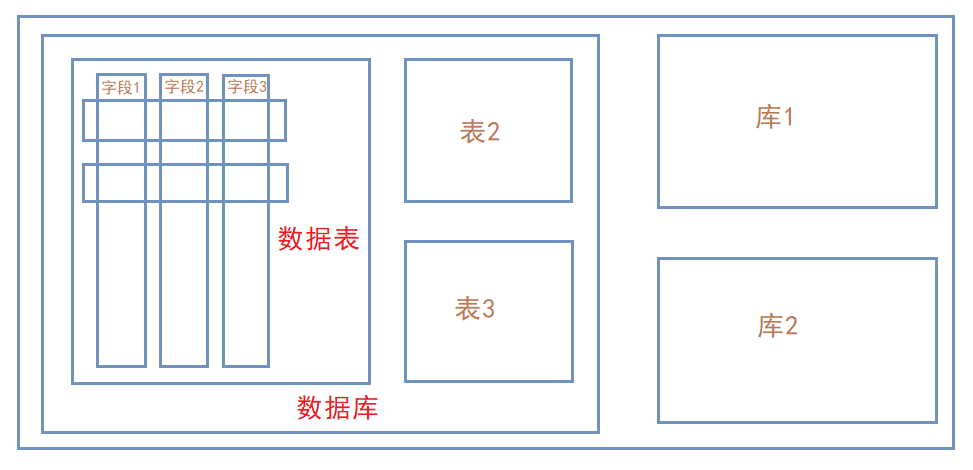

# Database Security Knowledge

Author: H3rmesk1t

# MySQL
## 简介
`MySQL`是一个关系型数据库管理系统, 由瑞典`MySQL AB`公司开发, 目前属于`Oracle`公司. `MySQL`是一种关联数据库管理系统, 关联数据库将数据保存在不同的表中, 而不是将所有数据放在一个大仓库内, 这样就增加了速度并提高了灵活性. 

一个完整的`MySQL`管理系统结构通常如下图所示, 在图中可以看到: `MySQL`可以管理多个数据库, 一个数据库又可以包含多个数据表, 而一个数据表中又含有多条字段, 一行数据是多个字段同一行的一串数据.

## 常见漏洞
随着`Web`安全的不断发展, 在`MySQL`中, 越来越多的漏洞利用方式被挖掘出来, 常见的漏洞利用方式有: `SQL`注入漏洞、身份认证漏洞、拒绝服务攻击、`PHPMyAdmain`万能密码登录、`MySQL`提权.

