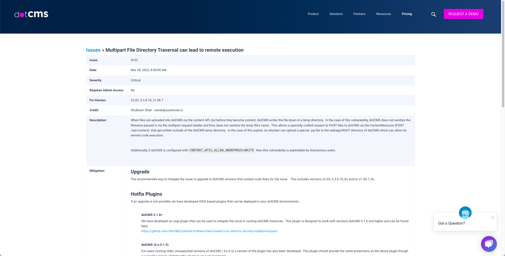

# Java安全学习—CVE-2022-26352漏洞分析

Author: H3rmesk1t

Data: 2022.06.09

# 漏洞描述
`DotCMS`是一款用`Java`编写的开源内容管理系统, 用于管理内容和内容驱动的站点和应用程序. 该系统支持`RSS`订阅、博客、论坛等模块, 并具有易于扩展和构建的特点. `DotCMS`由于`api/content`路径存在未授权文件上传漏洞, 攻击者可构造恶意请求上传`webshell`, 从而执行任意代码并控制服务器.

# 漏洞环境搭建
根据``