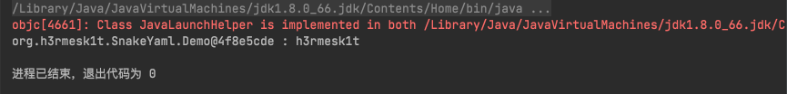

# Java安全学习—SnakeYaml反序列化漏洞

Author: H3rmesk1t

Data: 2022.03.01

# YAML 基本语法
[YAML](https://zh.wikipedia.org/wiki/YAML), `YAML`是"YAML Ain’t a Markup Language"(`YAML`不是一种标记语言)的递归缩写, 是一个可读性高、用来表达数据序列化的格式, 类似于`XML`但比`XML`更简洁.

`YAML`的语法和其他高级语言类似, 并且可以简单表达清单、散列表，标量等资料形态. 它使用空白符号缩进和大量依赖外观的特色, 特别适合用来表达或编辑数据结构、各种配置文件、倾印调试内容、文件大纲(例如: 许多电子邮件标题格式和`YAML`非常接近).

## 格式
 - [YAML 具体使用](https://www.yiibai.com/yaml), 首先`YAML`中允许表示三种格式, 分别是常量值、对象和数组. 例如:

```yaml
#即表示url属性值；
url: http://www.yiibai.com
#即表示server.host属性的值；
server:
    host: http://www.yiibai.com
#数组，即表示server为[a,b,c]
server:
    - 120.168.0.21
    - 120.168.0.22
    - 120.168.0.23
#常量
pi: 3.14   #定义一个数值3.14
hasChild: true  #定义一个boolean值
name: '你好YAML'   #定义一个字符串
```

## 注释
 - 和`properties`文件格式相同, `YAML`使用`#`作为注释开始且只有行注释.
 - `YAML`基本格式要求:
   - 大小敏感.
   - 利用缩进来表示层级关系.
   - 缩进不能使用`TAB`, 只能使用空格且对空格个数没有要求, 只需要相同层级左对齐即可(一般`2`个或`4`个空格).

## 对象
 - 对象使用冒号代表, 格式为`key: value`, 需要注意在冒号后加上一个空格.
 - 可以使用缩进来表示层级关系.

```yaml
key:
    demo1: val1
    demo2: val2
```
 - 较为复杂的对象格式, 可以使用问号加一个空格代表一个复杂的`key`, 配合一个冒号加一个空格代表一个值`value`.

```yaml
?  
    - complexkey1
    - complexkey2
:
    - complexvalue1
    - complexvalue2
```
 - 表示对象的属性是一个数组`[complexkey1,complexkey2]`, 对应的值也是一个数组`[complexvalue1,complexvalue2]`.

## 数组
 - 使用一个短横线加一个空格代表一个数组项.

```yaml
demo:
    - val1
    - val2

或者

-   
    - val1
    - val2 # [[val1, val2]]
```

 - 相对复杂的写法, 表示是`companies`属性是一个数组, 每一个数组元素又是由`id`, `name`, `price`三个属性构成; 数组也可以使用流式(flow)的方式表示.

```yaml
companies:
    -
        id: 1
        name: company1
        price: 200W
    -
        id: 2
        name: company2
        price: 500W
```

## 常量
 - `YAML`中提供了多种常量结构, 包括: 整数, 浮点数, 字符串, NULL, 日期, 布尔, 时间.

```yaml
boolean: 
    - TRUE  #true,True都可以
    - FALSE  #false，False都可以
float:
    - 3.14
    - 6.8523015e+5  #可以使用科学计数法
int:
    - 123
    - 0b1010_0111_0100_1010_1110    #二进制表示
null:
    nodeName: 'node'
    parent: ~  #使用~表示null
string:
    - 哈哈
    - 'Hello world'  #可以使用双引号或者单引号包裹特殊字符
    - newline
      newline2    #字符串可以拆成多行，每一行会被转化成一个空格
date:
    - 2018-07-17    #日期必须使用ISO 8601格式，即yyyy-MM-dd
datetime: 
    -  2018-07-17T19:02:31+08:00    #时间使用ISO 8601格式，时间和日期之间使用T连接，最后使用+代表时区
```

# SnakeYaml 简介
`SnakeYaml`是`Java`中一个用于解析`YAML`格式的库. `SnakeYaml`是一个完整的`YAML1.1`规范`Processor`, 支持`UTF-8`/`UTF-16`, 支持`Java`对象的序列化/反序列化, 支持所有`YAML`定义的类型. 并且在反序列化时, `YAML`会调用类中的包含属性的`setter`方法.

# SnakeYaml 使用
## 环境搭建
在`Maven`项目中的`pom.xml`文件添加如下内容:

```xml
<?xml version="1.0" encoding="UTF-8"?>
<project xmlns="http://maven.apache.org/POM/4.0.0"
         xmlns:xsi="http://www.w3.org/2001/XMLSchema-instance"
         xsi:schemaLocation="http://maven.apache.org/POM/4.0.0 http://maven.apache.org/xsd/maven-4.0.0.xsd">
    <modelVersion>4.0.0</modelVersion>

    <groupId>org.example</groupId>
    <artifactId>JavaSec-Learn</artifactId>
    <version>1.0-SNAPSHOT</version>

    <dependencies>
        <dependency>
            <groupId>org.yaml</groupId>
            <artifactId>snakeyaml</artifactId>
            <version>1.27</version>
        </dependency>
    </dependencies>

    <properties>
        <maven.compiler.source>8</maven.compiler.source>
        <maven.compiler.target>8</maven.compiler.target>
    </properties>

</project>
```

## 常用方法

```java
String	dump(Object data)
将Java对象序列化为YAML字符串.
void	dump(Object data, Writer output)
将Java对象序列化为YAML流.
String	dumpAll(Iterator<? extends Object> data)
将一系列Java对象序列化为YAML字符串.
void	dumpAll(Iterator<? extends Object> data, Writer output)
将一系列Java对象序列化为YAML流.
String	dumpAs(Object data, Tag rootTag, DumperOptions.FlowStyle flowStyle)
将Java对象序列化为YAML字符串.
String	dumpAsMap(Object data)
将Java对象序列化为YAML字符串.
<T> T	load(InputStream io)
解析流中唯一的YAML文档, 并生成相应的Java对象.
<T> T	load(Reader io)
解析流中唯一的YAML文档, 并生成相应的Java对象.
<T> T	load(String yaml)
解析字符串中唯一的YAML文档, 并生成相应的Java对象.
Iterable<Object>	loadAll(InputStream yaml)
解析流中的所有YAML文档, 并生成相应的Java对象.
Iterable<Object>	loadAll(Reader yaml)
解析字符串中的所有YAML文档, 并生成相应的Java对象.
Iterable<Object>	loadAll(String yaml)
解析字符串中的所有YAML文档, 并生成相应的Java对象.
```

## 序列化和反序列化
在上文中提到了`SnakeYmal`的基本用法, 这里用代码来演示一下:

 - Demo 类

```java
package org.h3rmesk1t.SnakeYaml;

/**
 * @Author: H3rmesk1t
 * @Data: 2022/3/1 1:04 上午
 */
public class Demo {

    String name;

    public String getName() {
        return name;
    }

    public void setName(java.lang.String name) {
        this.name = name;
    }
}
```

 - SerDemo 类

```java
package org.h3rmesk1t.SnakeYaml;

import org.yaml.snakeyaml.Yaml;

/**
 * @Author: H3rmesk1t
 * @Data: 2022/3/1 1:11 上午
 */
public class SerDemo {

    public static void main(String[] args) {

        Demo name = new Demo();
        name.setName("h3rmesk1t");
        Yaml yaml = new Yaml();
        String yamlString = yaml.dump(name);
        System.out.println(yamlString);
    }
}
```

 - 序列化输出结果:

```yaml
!!org.h3rmesk1t.SnakeYaml.Demo {name: h3rmesk1t}
```

<div align=center></div>

可以看到, 在输出的`yaml`格式的内容中有`!!`, 这里`!!`用于强制类型转化, `!!org.h3rmesk1t.SnakeYaml.Demo`是将该对象转为`org.h3rmesk1t.SnakeYaml.Demo`类, 如果没有`!`则就是个`key`为字符串的`Map`, 其实这个和`Fastjson`的`@type`有着异曲同工之妙, 用于指定反序列化的全类名.

 - UnserDemo 类

```java
package org.h3rmesk1t.SnakeYaml;

import org.yaml.snakeyaml.Yaml;

/**
 * @Author: H3rmesk1t
 * @Data: 2022/3/1 1:20 上午
 */
public class UnserDemo {

    public static void main(String[] agrs) {

        String yamlString = "!!org.h3rmesk1t.SnakeYaml.Demo {name: h3rmesk1t}";
        Yaml yaml = new Yaml();
        Demo name = yaml.load(yamlString);
        System.out.println(name + " : " + name.getName());
    }
}
```

 - 反序列化输出结果:

<div align=center></div>

# SnakeYaml 反序列化漏洞
## 漏洞版本
`SnakeYaml`全版本均可被反序列化漏洞利用

## 漏洞原理
由于`SnakeYaml`是用来支持反序列化`Java`对象的, 因此当`Yaml.load`函数的参数外部参数可控时, 攻击者即可传入一个恶意类的`yaml`格式序列化内容, 利用服务端对`yaml`数据进行反序列化操作来达到`SnakeYaml`反序列化漏洞的利用.

## 