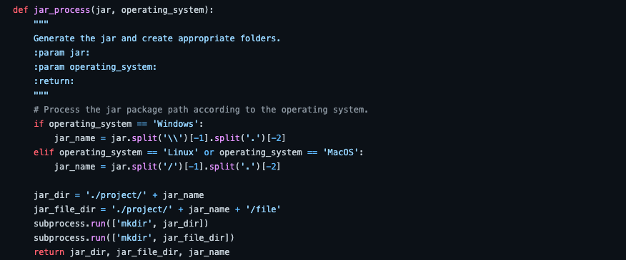
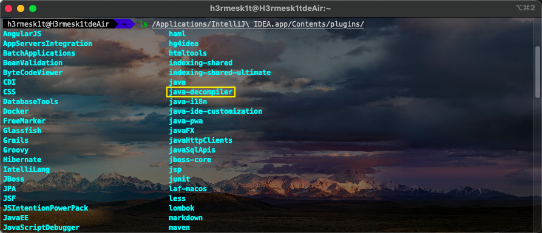
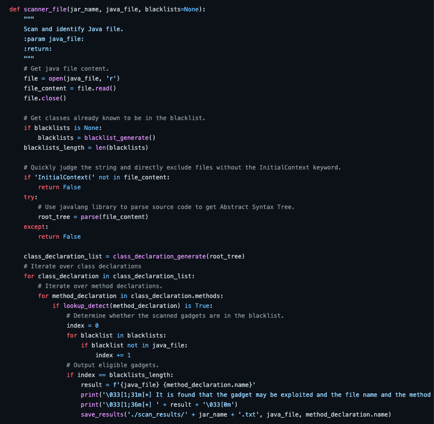

# Fastjson-Gadgets-Automatic-Scanner 简易分析

Author: H3rmesk1t

Data: 2022.03.08

# 前言
在`SUSCTF 2022`比赛后的`WP`中, 看到有师傅是直接利用题目后台提供的`lib`包中的`jar`文件对`Fastjson`的`Gadget`进行自动挖掘, 于是自己想尝试一下能不能实现一下挖掘`JNDI`注入的`Fastjson-Gadget`, 故有了这个简易的小工具, 相比于其他师傅写的可能做不到那么精确, 但基本能确定到一个较小的范围来进行人工检测.

# 项目地址
[Fastjson-Gadgets-Automatic-Scanner](https://github.com/H3rmesk1t/Fastjson-Gadgets-Automatic-Scanner)

# 项目模块
项目定义的函数结构如下:

<div align=center></div>

同时, 这里简单对项目中的主要函数谈谈实现的思路, 对于`Fastjson`的反序列化漏洞分析可以看我之前写的[Java安全学习—fastjson反序列化漏洞](https://github.com/H3rmesk1t/Learning_summary/blob/main/WebSec/Java%E5%AE%89%E5%85%A8%E5%AD%A6%E4%B9%A0%E2%80%94fastjson%E5%8F%8D%E5%BA%8F%E5%88%97%E5%8C%96%E6%BC%8F%E6%B4%9E/Java%E5%AE%89%E5%85%A8%E5%AD%A6%E4%B9%A0%E2%80%94fastjson%E5%8F%8D%E5%BA%8F%E5%88%97%E5%8C%96%E6%BC%8F%E6%B4%9E.md).

## command && jar_process
这两个函数主要是利用需要检测的`jar`包进行一个预处理的操作, 例如: 创建该`jar`包的项目文件夹. 这里需要输入的参数`operating_system`主要是考虑到在不同的操作系统上对输入文件路径的处理问题.

<div align=center></div>

<div align=center></div>

## jar_decompile
该函数主要是对需要检测的`jar`包进行一个反编译操作, 并生成相应的`java`源码文件. 这里利用的是`IntelliJ IDEA`插件中的`java-decompiler.jar`对`jar`包进行反编译操作, 接着利用`unzip`命令解压反编译后的`jar`包到之前创建好的项目文件夹内, 得到`java`源码文件.

<div align=center></div>

<div align=center></div>

## scanner_dir && javafile_generate
这两个函数主要是对前面解压缩的项目目录进行遍历来获取`java`源码文件, 并返回`java`源码文件路径.

<div align=center></div>

<div align=center></div>

## scanner_file
该函数主要是对`java`源码文件进行一个初步检测, 当文件中不存在`InitialContext()`相关内容时直接`pass`(目的是对`JNDI`注入相关利用进行挖掘, 因此当文件中并不存在`JNDI`注入中关键类`InitialContext`便不进行语法树判断). 使用`javalang`库解析源代码, 得到抽象语法树. 接着对类声明和方法声明进行遍历并在语法树上类层面的判断, 对于扫描出来的可能`Gadget`结果可以进行黑名单检测(实际使用时可以去掉黑名单检测这一操作, 项目中是对目前已知的黑名单类进行检测), 最后对符合条件的扫描结果进行打印并保存.

<div align=center></div>

## class_declaration_generate
由于`Fastjson`的`checkAutoType`方法在源码中对反序列化的类存在限制, 例如: 不能继承`Classloader`、不能实现 `DataSource`和`RowSet`接口以及必须有一个无参的构造函数等.

<div align=center></div>

函数`class_declaration_generate`针对`checkAutoType`限制特性, 通过判断`ClassDeclaration`对象相应的属性是否满足条件来进行筛选. 首先对非类声明都不进行分析, 并判断是否继承自`Classloader`; 接着判断其是否是被禁用的`DataSource`和`RowSet`等接口; 最后判断是否存在无参的构造函数. 通过上述处理得到一个大致的类声明列表, 返回给`scanner_file`进行进一步处理.

<div align=center></div>

## lookup_detect
函数`class_declaration_generate`将得到的类声明列表返回给函数`scanner_file`, 函数`scanner_file`拿到类声明列表之后会遍历得到类声明, 然后再对这个类声明遍历方法声明, 对于每个方法声明, 再使用函数`lookup_detect`进行最后确认. 这是因为得到类声明后, 还需要判断类方法中是否调用了`lookup`方法, 并且需要`lookup`方法的参数是变量.

对于是否调用`lookup`方法的判断, 只需要深度优先遍历整个`MethodDeclaration`对象的各个子节点, 判断节点的类型是不是`MethodInvaction`以及被调用的函数名是不是`lookup`即可. 而对于`lookup`的变量是否可控可以简化为, 认为类的属性和方法的入参都是可控变量, 从而来避免对数据流进行分析. 

<div align=center></div>

# 项目使用

```sh
usage: python main.py [-h] jar operating_system

positional arguments:
  jar               Enter the jar to be scanned
  operating_system  Enter the operating system Windows or Linux or MacOS

optional arguments:
  -h, --help        show this help message and exit
```

可以看到`SUSCTF`赛题利用的`Gadget`在扫描的结果中, 初步成效达成.

<div align=center></div>

<div align=center></div>

# 总结
本项目还有很多不足的地方, 例如对于其它的`jar`包的挖掘是否完全奏效等, 待进一步学习后希望能够对该项目有一个更好的改进. 也希望师傅们不吝赐教, 能够提供更好的思路和想法, 如果师傅们能够动手点一下`Star`就更好了(手动撒娇).