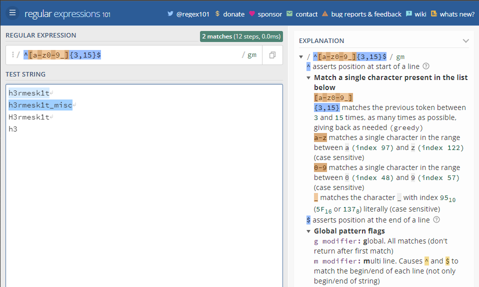

# 定义
```
正则表达式是一组由字母和符号组成的特殊文本, 它可以用来从文本中找出满足你想要的格式的句子
正则表达式是一种从左到右匹配主体字符串的模式, 可以从一个基础字符串中根据一定的匹配模式替换文本中的字符串、验证表单、提取字符串等等
```
> - 例如：`^[a-z0-9_]{3,15}$`, 该正则表达式可以接受小写字母、数字、下划线、且长度为3-15的字符串



# 元字符
> - 正则表达式主要依赖于元字符, 元字符不代表他们本身的字面意思, 他们都有特殊的含义, 一些元字符写在方括号中的时候有一些特殊的意思, 以下是一些元字符的介绍

|a|a|
|:----:|:----:|
|a|a|
